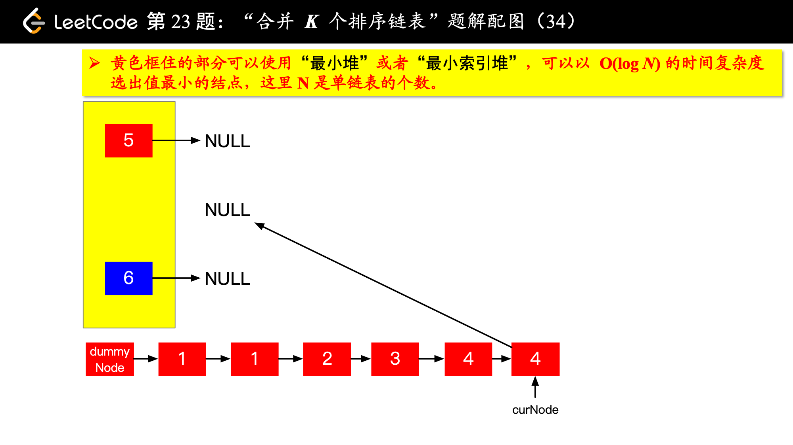

> 原文链接: https://leetcode-cn.com/problems/design-twitter


## 英文原文
<div><p>Design a simplified version of Twitter where users can post tweets, follow/unfollow another user, and is able to see the <code>10</code> most recent tweets in the user&#39;s news feed.</p>

<p>Implement the <code>Twitter</code> class:</p>

<ul>
	<li><code>Twitter()</code> Initializes your twitter object.</li>
	<li><code>void postTweet(int userId, int tweetId)</code> Composes a new tweet with ID <code>tweetId</code> by the user <code>userId</code>. Each call to this function will be made with a unique <code>tweetId</code>.</li>
	<li><code>List&lt;Integer&gt; getNewsFeed(int userId)</code> Retrieves the <code>10</code> most recent tweet IDs in the user&#39;s news feed. Each item in the news feed must be posted by users who the user followed or by the user themself. Tweets must be <strong>ordered from most recent to least recent</strong>.</li>
	<li><code>void follow(int followerId, int followeeId)</code> The user with ID <code>followerId</code> started following the user with ID <code>followeeId</code>.</li>
	<li><code>void unfollow(int followerId, int followeeId)</code> The user with ID <code>followerId</code> started unfollowing the user with ID <code>followeeId</code>.</li>
</ul>

<p>&nbsp;</p>
<p><strong>Example 1:</strong></p>

<pre>
<strong>Input</strong>
[&quot;Twitter&quot;, &quot;postTweet&quot;, &quot;getNewsFeed&quot;, &quot;follow&quot;, &quot;postTweet&quot;, &quot;getNewsFeed&quot;, &quot;unfollow&quot;, &quot;getNewsFeed&quot;]
[[], [1, 5], [1], [1, 2], [2, 6], [1], [1, 2], [1]]
<strong>Output</strong>
[null, null, [5], null, null, [6, 5], null, [5]]

<strong>Explanation</strong>
Twitter twitter = new Twitter();
twitter.postTweet(1, 5); // User 1 posts a new tweet (id = 5).
twitter.getNewsFeed(1);  // User 1&#39;s news feed should return a list with 1 tweet id -&gt; [5]. return [5]
twitter.follow(1, 2);    // User 1 follows user 2.
twitter.postTweet(2, 6); // User 2 posts a new tweet (id = 6).
twitter.getNewsFeed(1);  // User 1&#39;s news feed should return a list with 2 tweet ids -&gt; [6, 5]. Tweet id 6 should precede tweet id 5 because it is posted after tweet id 5.
twitter.unfollow(1, 2);  // User 1 unfollows user 2.
twitter.getNewsFeed(1);  // User 1&#39;s news feed should return a list with 1 tweet id -&gt; [5], since user 1 is no longer following user 2.
</pre>

<p>&nbsp;</p>
<p><strong>Constraints:</strong></p>

<ul>
	<li><code>1 &lt;= userId, followerId, followeeId &lt;= 500</code></li>
	<li><code>0 &lt;= tweetId &lt;= 10<sup>4</sup></code></li>
	<li>All the tweets have <strong>unique</strong> IDs.</li>
	<li>At most <code>3 * 10<sup>4</sup></code> calls will be made to <code>postTweet</code>, <code>getNewsFeed</code>, <code>follow</code>, and <code>unfollow</code>.</li>
</ul>
</div>

## 中文题目
<div><p>设计一个简化版的推特(Twitter)，可以让用户实现发送推文，关注/取消关注其他用户，能够看见关注人（包括自己）的最近 <code>10</code> 条推文。</p>

<p>实现 <code>Twitter</code> 类：</p>

<ul>
	<li><code>Twitter()</code> 初始化简易版推特对象</li>
	<li><code>void postTweet(int userId, int tweetId)</code> 根据给定的 <code>tweetId</code> 和 <code>userId</code> 创建一条新推文。每次调用次函数都会使用一个不同的 <code>tweetId</code> 。</li>
	<li><code>List&lt;Integer&gt; getNewsFeed(int userId)</code> 检索当前用户新闻推送中最近&nbsp; <code>10</code> 条推文的 ID 。新闻推送中的每一项都必须是由用户关注的人或者是用户自己发布的推文。推文必须 <strong>按照时间顺序由最近到最远排序</strong> 。</li>
	<li><code>void follow(int followerId, int followeeId)</code> ID 为 <code>followerId</code> 的用户开始关注 ID 为 <code>followeeId</code> 的用户。</li>
	<li><code>void unfollow(int followerId, int followeeId)</code> ID 为 <code>followerId</code> 的用户不再关注 ID 为 <code>followeeId</code> 的用户。</li>
</ul>

<p>&nbsp;</p>

<p><strong>示例：</strong></p>

<pre>
<strong>输入</strong>
["Twitter", "postTweet", "getNewsFeed", "follow", "postTweet", "getNewsFeed", "unfollow", "getNewsFeed"]
[[], [1, 5], [1], [1, 2], [2, 6], [1], [1, 2], [1]]
<strong>输出</strong>
[null, null, [5], null, null, [6, 5], null, [5]]

<strong>解释</strong>
Twitter twitter = new Twitter();
twitter.postTweet(1, 5); // 用户 1 发送了一条新推文 (用户 id = 1, 推文 id = 5)
twitter.getNewsFeed(1);  // 用户 1 的获取推文应当返回一个列表，其中包含一个 id 为 5 的推文
twitter.follow(1, 2);    // 用户 1 关注了用户 2
twitter.postTweet(2, 6); // 用户 2 发送了一个新推文 (推文 id = 6)
twitter.getNewsFeed(1);  // 用户 1 的获取推文应当返回一个列表，其中包含两个推文，id 分别为 -&gt; [6, 5] 。推文 id 6 应当在推文 id 5 之前，因为它是在 5 之后发送的
twitter.unfollow(1, 2);  // 用户 1 取消关注了用户 2
twitter.getNewsFeed(1);  // 用户 1 获取推文应当返回一个列表，其中包含一个 id 为 5 的推文。因为用户 1 已经不再关注用户 2</pre>

<p>&nbsp;</p>

<p><strong>提示：</strong></p>

<ul>
	<li><code>1 &lt;= userId, followerId, followeeId &lt;= 500</code></li>
	<li><code>0 &lt;= tweetId &lt;= 10<sup>4</sup></code></li>
	<li>所有推特的 ID 都互不相同</li>
	<li><code>postTweet</code>、<code>getNewsFeed</code>、<code>follow</code> 和 <code>unfollow</code> 方法最多调用 <code>3 * 10<sup>4</sup></code> 次</li>
</ul>
</div>

## 通过代码
<RecoDemo>
</RecoDemo>


## 高赞题解

这里「推特」，可以理解为中国的「微博」、「朋友圈」、「力扣」，真正的数据数需要存在数据库里的，并且还要加上一些非关系型的数据库（redis 等），不能是放在内存里的，这里只是简化了需求。

**分析**：

+ 这是一类系统设计问题（上周我们做过的 LFU 缓存也是属于这一类问题），通常简化了很多需求，只要题目意思理解清楚，一般情况下不难写出，难在编码的细节和调试；
+ 这里需求 3 和需求 4，只需要维护「我关注的人的 id 列表」 即可，不需要维护「谁关注了我」，由于不需要维护有序性，为了删除和添加方便， 「我关注的人的 id 列表」需要设计成哈希表（`HashSet`），而每一个人的和对应的他关注的列表存在一个哈希映射（`HashMap`）里；
+ 最复杂的是需求 2 `getNewsFeed(userId):`
  + 每一个人的推文和他的 id 的关系，依然是存放在一个哈希表里；
  + 对于每一个人的推文，只有顺序添加的需求，没有查找、修改、删除操作，因此可以使用线性数据结构，链表或者数组均可；
    + 使用数组就需要在尾部添加元素，还需要考虑扩容的问题（使用动态数组）；
    + 使用链表就得在头部添加元素，由于链表本身就是动态的，无需考虑扩容；
  + 检索最近的十条推文，需要先把这个用户关注的人的列表拿出来（实际上不是这么做的，请看具体代码，或者是「多路归并」的过程），然后再合并，排序以后选出 Top10，这其实是非常经典的「多路归并」的问题（「力扣」第 23 题：[合并K个排序链表](https://leetcode-cn.com/problems/merge-k-sorted-lists)），这里需要使用的数据结构是优先队列，所以在上一步**在存储推文列表的时候使用单链表是合理的**，并且应该存储一个时间戳字段，用于比较哪一队的队头元素先出列。

剩下的就是一些细节问题了，例如需要查询关注人（包括自己）的最近十条推文，所以要把自己的推文也放进优先队列里。在出队（优先队列）、入队的时候需要考虑是否为空。

编写对这一类问题，需要仔细调试，并且养成良好的编码习惯，是很不错的编程练习问题。


**总结**：

+ 如果需要维护数据的时间有序性，链表在特殊场景下可以胜任。因为时间属性通常来说是相对固定的，而不必去维护顺序性；
+ 如果需要**动态维护数据有序性**，「优先队列」（堆）是可以胜任的，「力扣」上搜索「堆」（heap）标签，可以查看类似的问题；
+ 设计类问题也是一类算法和数据结构的问题，并且做这一类问题有助于我们了解一些数据结构的大致思想和细节，「力扣」上搜索「设计」标签，可以查看类似的问题；
+ 做完这个问题，不妨仔细思考一下这里使用链表存储推文的原因。


下面是动画演示，可以帮助大家理解「优先队列」是如何在「合并 `k` 个有序链表」上工作的。只不过「设计推特」这道题不需要去真的合并，并且使用的是最大堆。

这是个「多路归并」的问题，不熟悉的朋友，一定要掌握，非常重要。

<,,,,,,,,,,,,,,,,,,,,,,,,,,,,,,,,,,,,,,,,>

多路归并问题（「力扣」第 23 题）题解：[贪心算法、优先队列 + 分治法（Python 代码、Java 代码）](https://leetcode-cn.com/problems/merge-k-sorted-lists/solution/tan-xin-suan-fa-you-xian-dui-lie-fen-zhi-fa-python/)。

**参考代码**：

```Java []
import java.util.ArrayList;
import java.util.HashMap;
import java.util.HashSet;
import java.util.List;
import java.util.Map;
import java.util.PriorityQueue;
import java.util.Set;

public class Twitter {

    /**
     * 用户 id 和推文（单链表）的对应关系
     */
    private Map<Integer, Tweet> twitter;

    /**
     * 用户 id 和他关注的用户列表的对应关系
     */
    private Map<Integer, Set<Integer>> followings;

    /**
     * 全局使用的时间戳字段，用户每发布一条推文之前 + 1
     */
    private static int timestamp = 0;

    /**
     * 合并 k 组推文使用的数据结构（可以在方法里创建使用），声明成全局变量非必需，视个人情况使用
     */
    private static PriorityQueue<Tweet> maxHeap;

    /**
     * Initialize your data structure here.
     */
    public Twitter() {
        followings = new HashMap<>();
        twitter = new HashMap<>();
        maxHeap = new PriorityQueue<>((o1, o2) -> -o1.timestamp + o2.timestamp);
    }

    /**
     * Compose a new tweet.
     */
    public void postTweet(int userId, int tweetId) {
        timestamp++;
        if (twitter.containsKey(userId)) {
            Tweet oldHead = twitter.get(userId);
            Tweet newHead = new Tweet(tweetId, timestamp);
            newHead.next = oldHead;
            twitter.put(userId, newHead);
        } else {
            twitter.put(userId, new Tweet(tweetId, timestamp));
        }
    }

    /**
     * Retrieve the 10 most recent tweet ids in the user's news feed. Each item in the news feed must be posted by users who the user followed or by the user herself. Tweets must be ordered from most recent to least recent.
     */
    public List<Integer> getNewsFeed(int userId) {
        // 由于是全局使用的，使用之前需要清空
        maxHeap.clear();

        // 如果自己发了推文也要算上
        if (twitter.containsKey(userId)) {
            maxHeap.offer(twitter.get(userId));
        }

        Set<Integer> followingList = followings.get(userId);
        if (followingList != null && followingList.size() > 0) {
            for (Integer followingId : followingList) {
                Tweet tweet = twitter.get(followingId);
                if (tweet != null) {
                    maxHeap.offer(tweet);
                }
            }
        }

        List<Integer> res = new ArrayList<>(10);
        int count = 0;
        while (!maxHeap.isEmpty() && count < 10) {
            Tweet head = maxHeap.poll();
            res.add(head.id);

            // 这里最好的操作应该是 replace，但是 Java 没有提供
            if (head.next != null) {
                maxHeap.offer(head.next);
            }
            count++;
        }
        return res;
    }


    /**
     * Follower follows a followee. If the operation is invalid, it should be a no-op.
     *
     * @param followerId 发起关注者 id
     * @param followeeId 被关注者 id
     */
    public void follow(int followerId, int followeeId) {
        // 被关注人不能是自己
        if (followeeId == followerId) {
            return;
        }

        // 获取我自己的关注列表
        Set<Integer> followingList = followings.get(followerId);
        if (followingList == null) {
            Set<Integer> init = new HashSet<>();
            init.add(followeeId);
            followings.put(followerId, init);
        } else {
            if (followingList.contains(followeeId)) {
                return;
            }
            followingList.add(followeeId);
        }
    }


    /**
     * Follower unfollows a followee. If the operation is invalid, it should be a no-op.
     *
     * @param followerId 发起取消关注的人的 id
     * @param followeeId 被取消关注的人的 id
     */
    public void unfollow(int followerId, int followeeId) {
        if (followeeId == followerId) {
            return;
        }

        // 获取我自己的关注列表
        Set<Integer> followingList = followings.get(followerId);

        if (followingList == null) {
            return;
        }
        // 这里删除之前无需做判断，因为查找是否存在以后，就可以删除，反正删除之前都要查找
        followingList.remove(followeeId);
    }

    /**
     * 推文类，是一个单链表（结点视角）
     */
    private class Tweet {
        /**
         * 推文 id
         */
        private int id;

        /**
         * 发推文的时间戳
         */
        private int timestamp;
        private Tweet next;

        public Tweet(int id, int timestamp) {
            this.id = id;
            this.timestamp = timestamp;
        }
    }

    public static void main(String[] args) {

        Twitter twitter = new Twitter();
        twitter.postTweet(1, 1);
        List<Integer> res1 = twitter.getNewsFeed(1);
        System.out.println(res1);

        twitter.follow(2, 1);

        List<Integer> res2 = twitter.getNewsFeed(2);
        System.out.println(res2);

        twitter.unfollow(2, 1);

        List<Integer> res3 = twitter.getNewsFeed(2);
        System.out.println(res3);
    }
}
```


## 统计信息
| 通过次数 | 提交次数 | AC比率 |
| :------: | :------: | :------: |
|    28463    |    69648    |   40.9%   |

## 提交历史
| 提交时间 | 提交结果 | 执行时间 |  内存消耗  | 语言 |
| :------: | :------: | :------: | :--------: | :--------: |
