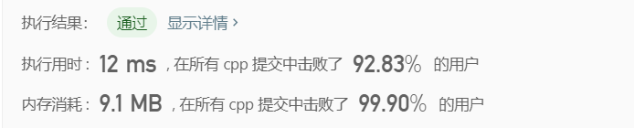
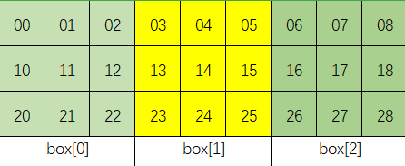

> 原文链接: https://leetcode-cn.com/problems/valid-sudoku


## 英文原文
<div><p>Determine if a&nbsp;<code>9 x 9</code> Sudoku board&nbsp;is valid.&nbsp;Only the filled cells need to be validated&nbsp;<strong>according to the following rules</strong>:</p>

<ol>
	<li>Each row&nbsp;must contain the&nbsp;digits&nbsp;<code>1-9</code> without repetition.</li>
	<li>Each column must contain the digits&nbsp;<code>1-9</code>&nbsp;without repetition.</li>
	<li>Each of the nine&nbsp;<code>3 x 3</code> sub-boxes of the grid must contain the digits&nbsp;<code>1-9</code>&nbsp;without repetition.</li>
</ol>

<p><strong>Note:</strong></p>

<ul>
	<li>A Sudoku board (partially filled) could be valid but is not necessarily solvable.</li>
	<li>Only the filled cells need to be validated according to the mentioned&nbsp;rules.</li>
</ul>

<p>&nbsp;</p>
<p><strong>Example 1:</strong></p>

<pre>
<strong>Input:</strong> board = 
[[&quot;5&quot;,&quot;3&quot;,&quot;.&quot;,&quot;.&quot;,&quot;7&quot;,&quot;.&quot;,&quot;.&quot;,&quot;.&quot;,&quot;.&quot;]
,[&quot;6&quot;,&quot;.&quot;,&quot;.&quot;,&quot;1&quot;,&quot;9&quot;,&quot;5&quot;,&quot;.&quot;,&quot;.&quot;,&quot;.&quot;]
,[&quot;.&quot;,&quot;9&quot;,&quot;8&quot;,&quot;.&quot;,&quot;.&quot;,&quot;.&quot;,&quot;.&quot;,&quot;6&quot;,&quot;.&quot;]
,[&quot;8&quot;,&quot;.&quot;,&quot;.&quot;,&quot;.&quot;,&quot;6&quot;,&quot;.&quot;,&quot;.&quot;,&quot;.&quot;,&quot;3&quot;]
,[&quot;4&quot;,&quot;.&quot;,&quot;.&quot;,&quot;8&quot;,&quot;.&quot;,&quot;3&quot;,&quot;.&quot;,&quot;.&quot;,&quot;1&quot;]
,[&quot;7&quot;,&quot;.&quot;,&quot;.&quot;,&quot;.&quot;,&quot;2&quot;,&quot;.&quot;,&quot;.&quot;,&quot;.&quot;,&quot;6&quot;]
,[&quot;.&quot;,&quot;6&quot;,&quot;.&quot;,&quot;.&quot;,&quot;.&quot;,&quot;.&quot;,&quot;2&quot;,&quot;8&quot;,&quot;.&quot;]
,[&quot;.&quot;,&quot;.&quot;,&quot;.&quot;,&quot;4&quot;,&quot;1&quot;,&quot;9&quot;,&quot;.&quot;,&quot;.&quot;,&quot;5&quot;]
,[&quot;.&quot;,&quot;.&quot;,&quot;.&quot;,&quot;.&quot;,&quot;8&quot;,&quot;.&quot;,&quot;.&quot;,&quot;7&quot;,&quot;9&quot;]]
<strong>Output:</strong> true
</pre>

<p><strong>Example 2:</strong></p>

<pre>
<strong>Input:</strong> board = 
[[&quot;8&quot;,&quot;3&quot;,&quot;.&quot;,&quot;.&quot;,&quot;7&quot;,&quot;.&quot;,&quot;.&quot;,&quot;.&quot;,&quot;.&quot;]
,[&quot;6&quot;,&quot;.&quot;,&quot;.&quot;,&quot;1&quot;,&quot;9&quot;,&quot;5&quot;,&quot;.&quot;,&quot;.&quot;,&quot;.&quot;]
,[&quot;.&quot;,&quot;9&quot;,&quot;8&quot;,&quot;.&quot;,&quot;.&quot;,&quot;.&quot;,&quot;.&quot;,&quot;6&quot;,&quot;.&quot;]
,[&quot;8&quot;,&quot;.&quot;,&quot;.&quot;,&quot;.&quot;,&quot;6&quot;,&quot;.&quot;,&quot;.&quot;,&quot;.&quot;,&quot;3&quot;]
,[&quot;4&quot;,&quot;.&quot;,&quot;.&quot;,&quot;8&quot;,&quot;.&quot;,&quot;3&quot;,&quot;.&quot;,&quot;.&quot;,&quot;1&quot;]
,[&quot;7&quot;,&quot;.&quot;,&quot;.&quot;,&quot;.&quot;,&quot;2&quot;,&quot;.&quot;,&quot;.&quot;,&quot;.&quot;,&quot;6&quot;]
,[&quot;.&quot;,&quot;6&quot;,&quot;.&quot;,&quot;.&quot;,&quot;.&quot;,&quot;.&quot;,&quot;2&quot;,&quot;8&quot;,&quot;.&quot;]
,[&quot;.&quot;,&quot;.&quot;,&quot;.&quot;,&quot;4&quot;,&quot;1&quot;,&quot;9&quot;,&quot;.&quot;,&quot;.&quot;,&quot;5&quot;]
,[&quot;.&quot;,&quot;.&quot;,&quot;.&quot;,&quot;.&quot;,&quot;8&quot;,&quot;.&quot;,&quot;.&quot;,&quot;7&quot;,&quot;9&quot;]]
<strong>Output:</strong> false
<strong>Explanation:</strong> Same as Example 1, except with the <strong>5</strong> in the top left corner being modified to <strong>8</strong>. Since there are two 8&#39;s in the top left 3x3 sub-box, it is invalid.
</pre>

<p>&nbsp;</p>
<p><strong>Constraints:</strong></p>

<ul>
	<li><code>board.length == 9</code></li>
	<li><code>board[i].length == 9</code></li>
	<li><code>board[i][j]</code> is a digit <code>1-9</code> or <code>&#39;.&#39;</code>.</li>
</ul>
</div>

## 中文题目
<div><p>请你判断一个&nbsp;<code>9 x 9</code> 的数独是否有效。只需要<strong> 根据以下规则</strong> ，验证已经填入的数字是否有效即可。</p>

<ol>
	<li>数字&nbsp;<code>1-9</code>&nbsp;在每一行只能出现一次。</li>
	<li>数字&nbsp;<code>1-9</code>&nbsp;在每一列只能出现一次。</li>
	<li>数字&nbsp;<code>1-9</code>&nbsp;在每一个以粗实线分隔的&nbsp;<code>3x3</code>&nbsp;宫内只能出现一次。（请参考示例图）</li>
</ol>

<p>&nbsp;</p>

<p><strong>注意：</strong></p>

<ul>
	<li>一个有效的数独（部分已被填充）不一定是可解的。</li>
	<li>只需要根据以上规则，验证已经填入的数字是否有效即可。</li>
	<li>空白格用&nbsp;<code>'.'</code>&nbsp;表示。</li>
</ul>

<p>&nbsp;</p>

<p><strong>示例 1：</strong></p>

<pre>
<strong>输入：</strong>board = 
[["5","3",".",".","7",".",".",".","."]
,["6",".",".","1","9","5",".",".","."]
,[".","9","8",".",".",".",".","6","."]
,["8",".",".",".","6",".",".",".","3"]
,["4",".",".","8",".","3",".",".","1"]
,["7",".",".",".","2",".",".",".","6"]
,[".","6",".",".",".",".","2","8","."]
,[".",".",".","4","1","9",".",".","5"]
,[".",".",".",".","8",".",".","7","9"]]
<strong>输出：</strong>true
</pre>

<p><strong>示例 2：</strong></p>

<pre>
<strong>输入：</strong>board = 
[["8","3",".",".","7",".",".",".","."]
,["6",".",".","1","9","5",".",".","."]
,[".","9","8",".",".",".",".","6","."]
,["8",".",".",".","6",".",".",".","3"]
,["4",".",".","8",".","3",".",".","1"]
,["7",".",".",".","2",".",".",".","6"]
,[".","6",".",".",".",".","2","8","."]
,[".",".",".","4","1","9",".",".","5"]
,[".",".",".",".","8",".",".","7","9"]]
<strong>输出：</strong>false
<strong>解释：</strong>除了第一行的第一个数字从<strong> 5</strong> 改为 <strong>8 </strong>以外，空格内其他数字均与 示例1 相同。 但由于位于左上角的 3x3 宫内有两个 8 存在, 因此这个数独是无效的。</pre>

<p>&nbsp;</p>

<p><strong>提示：</strong></p>

<ul>
	<li><code>board.length == 9</code></li>
	<li><code>board[i].length == 9</code></li>
	<li><code>board[i][j]</code> 是一位数字（<code>1-9</code>）或者 <code>'.'</code></li>
</ul>
</div>

## 通过代码
<RecoDemo>
</RecoDemo>


## 高赞题解


### 解题思路
1. 由于board中的整数限定在1到9的范围内，因此可以分别建立哈希表来存储任一个数在相应维度上是否出现过。维度有3个：所在的行，所在的列，所在的box，注意box的下标也是从左往右、从上往下的。
2. 遍历到每个数的时候，例如boar[i][j]，我们判断其是否满足三个条件：
    1. 在第 i 个行中是否出现过
    2. 在第 j 个列中是否出现过
    3. 在第   **j/3 + (i/3)*3**个box中是否出现过.为什么是j/3 + (i/3)*3呢？

3. **关于从数组下标到box序号的变换**
    &emsp;重述一遍问题：给定i和j，如何判定board[i][j]在第几个box呢？
    &emsp;显然属于第几个box由i和j的组合唯一确定，例如board[2][2]一定是第0个box，board[4][7]一定是第5个box，可以画出来看一下，但是规律在哪里呢？
    我们可以考虑一种简单的情况： 一个3x9的矩阵，被分成3个3x3的box，如图：


- 显然每个数属于哪个box就只取决于纵坐标，纵坐标为0/1/2的都属于box[0],纵坐标为3/4/5的都属于box[1],纵坐标为6/7/8的都属于box[2].也就是j/3.
- 而对于9x9的矩阵，我们光根据j/3得到0/1/2还是不够的，可能加上一个3的倍数，例如加0x3,表示本行的box，加1x3，表示在下一行的box，加2x3，表示在下两行的box， 这里的0/1/2怎么来的？和j/3差不多同理，也就是i/3。
- 讲得不是很清楚，大家没懂的话自己再画图呗。
- 注释也很详细，有收获求点赞！

### 代码

```cpp
class Solution {
public:
    bool isValidSudoku(vector<vector<char>>& board) {
        int row[9][10] = {0};// 哈希表存储每一行的每个数是否出现过，默认初始情况下，每一行每一个数都没有出现过
        // 整个board有9行，第二维的维数10是为了让下标有9，和数独中的数字9对应。
        int col[9][10] = {0};// 存储每一列的每个数是否出现过，默认初始情况下，每一列的每一个数都没有出现过
        int box[9][10] = {0};// 存储每一个box的每个数是否出现过，默认初始情况下，在每个box中，每个数都没有出现过。整个board有9个box。
        for(int i=0; i<9; i++){
            for(int j = 0; j<9; j++){
                // 遍历到第i行第j列的那个数,我们要判断这个数在其所在的行有没有出现过，
                // 同时判断这个数在其所在的列有没有出现过
                // 同时判断这个数在其所在的box中有没有出现过
                if(board[i][j] == '.') continue;
                int curNumber = board[i][j]-'0';
                if(row[i][curNumber]) return false; 
                if(col[j][curNumber]) return false;
                if(box[j/3 + (i/3)*3][curNumber]) return false;

                row[i][curNumber] = 1;// 之前都没出现过，现在出现了，就给它置为1，下次再遇见就能够直接返回false了。
                col[j][curNumber] = 1;
                box[j/3 + (i/3)*3][curNumber] = 1;
            }
        }
        return true;
    }
};
```

## 统计信息
| 通过次数 | 提交次数 | AC比率 |
| :------: | :------: | :------: |
|    222835    |    349148    |   63.8%   |

## 提交历史
| 提交时间 | 提交结果 | 执行时间 |  内存消耗  | 语言 |
| :------: | :------: | :------: | :--------: | :--------: |


## 相似题目
|                             题目                             | 难度 |
| :----------------------------------------------------------: | :---------: |
| [解数独](https://leetcode-cn.com/problems/sudoku-solver/) | 困难|
