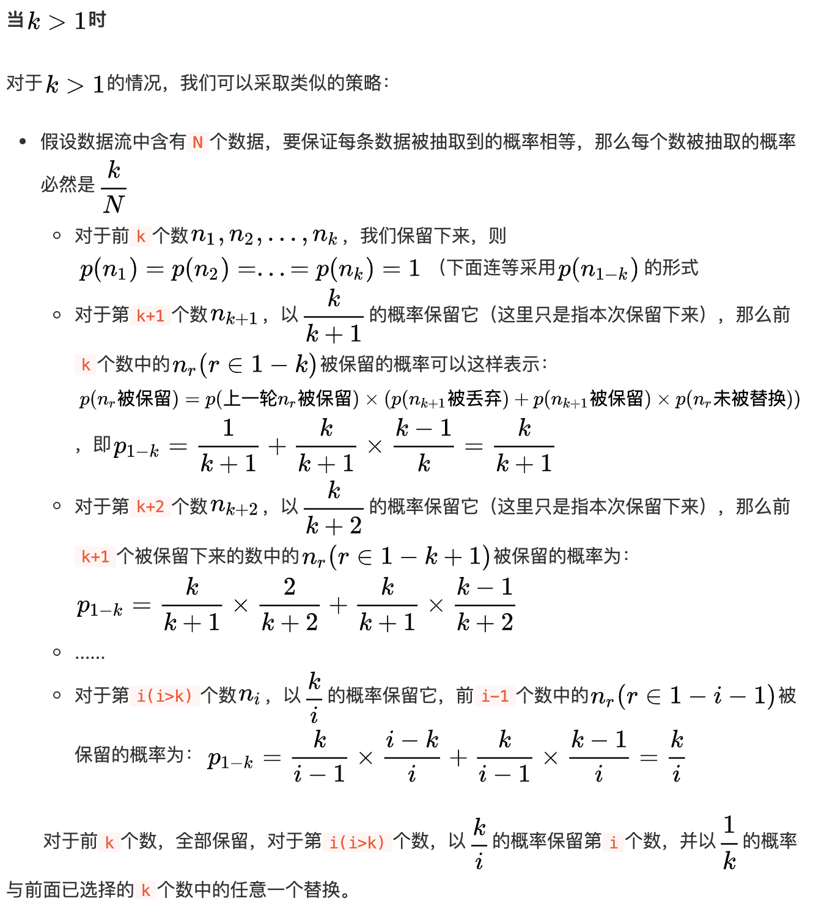

> 原文链接: https://leetcode-cn.com/problems/linked-list-random-node


## 英文原文
<div><p>Given a singly linked list, return a random node&#39;s value from the linked list. Each node must have the <strong>same probability</strong> of being chosen.</p>

<p>Implement the <code>Solution</code> class:</p>

<ul>
	<li><code>Solution(ListNode head)</code> Initializes the object with the integer array nums.</li>
	<li><code>int getRandom()</code> Chooses a node randomly from the list and returns its value. All the nodes of the list should be equally likely to be choosen.</li>
</ul>

<p>&nbsp;</p>
<p><strong>Example 1:</strong></p>

<pre>
<strong>Input</strong>
[&quot;Solution&quot;, &quot;getRandom&quot;, &quot;getRandom&quot;, &quot;getRandom&quot;, &quot;getRandom&quot;, &quot;getRandom&quot;]
[[[1, 2, 3]], [], [], [], [], []]
<strong>Output</strong>
[null, 1, 3, 2, 2, 3]

<strong>Explanation</strong>
Solution solution = new Solution([1, 2, 3]);
solution.getRandom(); // return 1
solution.getRandom(); // return 3
solution.getRandom(); // return 2
solution.getRandom(); // return 2
solution.getRandom(); // return 3
// getRandom() should return either 1, 2, or 3 randomly. Each element should have equal probability of returning.
</pre>

<p>&nbsp;</p>
<p><strong>Constraints:</strong></p>

<ul>
	<li>The number of nodes in the linked list will be in the range <code>[1, 10<sup>4</sup>]</code>.</li>
	<li><code>-10<sup>4</sup> &lt;= Node.val &lt;= 10<sup>4</sup></code></li>
	<li>At most <code>10<sup>4</sup></code> calls will be made to <code>getRandom</code>.</li>
</ul>

<p>&nbsp;</p>
<p><strong>Follow up:</strong></p>

<ul>
	<li>What if the linked list is extremely large and its length is unknown to you?</li>
	<li>Could you solve this efficiently without using extra space?</li>
</ul>
</div>

## 中文题目
<div><p>给定一个单链表，随机选择链表的一个节点，并返回相应的节点值。保证每个节点<strong>被选的概率一样</strong>。</p>

<p><strong>进阶:</strong><br />
如果链表十分大且长度未知，如何解决这个问题？你能否使用常数级空间复杂度实现？</p>

<p><strong>示例:</strong></p>

<pre>
// 初始化一个单链表 [1,2,3].
ListNode head = new ListNode(1);
head.next = new ListNode(2);
head.next.next = new ListNode(3);
Solution solution = new Solution(head);

// getRandom()方法应随机返回1,2,3中的一个，保证每个元素被返回的概率相等。
solution.getRandom();
</pre>
</div>

## 通过代码
<RecoDemo>
</RecoDemo>


## 高赞题解
## 前言

如果您觉得我的题解尚可，欢迎给我点赞
[另外一个随机算法--洗牌算法](https://leetcode-cn.com/problems/shuffle-an-array/solution/xi-pai-suan-fa-xiang-jie-by-jackwener/)

## 蓄水池抽样算法

最近经常能看到面经中出现在大数据流中的随机抽样问题

即：当内存无法加载全部数据时，如何从包含未知大小的数据流中随机选取k个数据，并且要保证每个数据被抽取到的概率相等。

### 当 k = 1 时，即此题的情况

也就是说，我们每次只能读一个数据。

假设数据流含有N个数，我们知道如果要保证所有的数被抽到的概率相等，那么每个数抽到的概率应该为 1/N 

那如何保证呢？

先说方案：

每次只保留一个数，当遇到第 i 个数时，以 1/i的概率保留它，(i-1)/i的概率保留原来的数。

举例说明： 1 - 10

- 遇到1，概率为1，保留第一个数。
- 遇到2，概率为1/2，这个时候，1和2各1/2的概率被保留
- 遇到3，3被保留的概率为1/3，(之前剩下的数假设1被保留)，2/3的概率 1 被保留，(此时1被保留的总概率为 2/3 * 1/2 = 1/3)
- 遇到4，4被保留的概率为1/4，(之前剩下的数假设1被保留)，3/4的概率 1 被保留，(此时1被保留的总概率为 3/4 * 2/3 * 1/2 = 1/4)

以此类推，每个数被保留的概率都是1/N。

证明使用数学归纳法即可

```python
import random
class Solution:

    def __init__(self, head: ListNode):
        self.head = head
        
    def getRandom(self) -> int:
        count = 0
        reserve = 0
        cur = self.head
        while cur:
            count += 1
            rand = random.randint(1,count)
            if rand == count:
                reserve = cur.val
            cur = cur.next
        return reserve
```

### 当 k = m 时

也就是说，我们每次能读m个数据。

和上面相同的道理，只不过概率在每次乘以了m而已




## 统计信息
| 通过次数 | 提交次数 | AC比率 |
| :------: | :------: | :------: |
|    17087    |    26877    |   63.6%   |

## 提交历史
| 提交时间 | 提交结果 | 执行时间 |  内存消耗  | 语言 |
| :------: | :------: | :------: | :--------: | :--------: |


## 相似题目
|                             题目                             | 难度 |
| :----------------------------------------------------------: | :---------: |
| [随机数索引](https://leetcode-cn.com/problems/random-pick-index/) | 中等|
