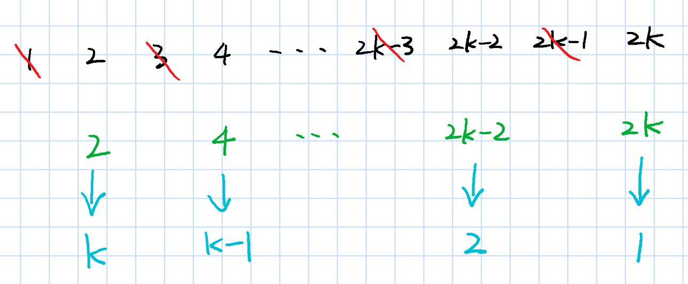
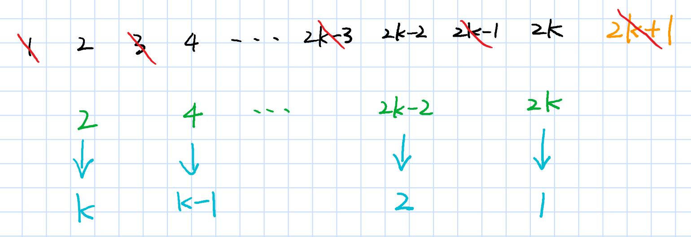

> 原文链接: https://leetcode-cn.com/problems/elimination-game


## 英文原文
<div><p>You have a list <code>arr</code> of all integers in the range <code>[1, n]</code> sorted in a strictly increasing order. Apply the following algorithm on <code>arr</code>:</p>

<ul>
	<li>Starting from left to right, remove the first number and every other number afterward until you reach the end of the list.</li>
	<li>Repeat the previous step again, but this time from right to left, remove the rightmost number and every other number from the remaining numbers.</li>
	<li>Keep repeating the steps again, alternating left to right and right to left, until a single number remains.</li>
</ul>

<p>Given the integer <code>n</code>, return <em>the last number that remains in</em> <code>arr</code>.</p>

<p>&nbsp;</p>
<p><strong>Example 1:</strong></p>

<pre>
<strong>Input:</strong> n = 9
<strong>Output:</strong> 6
<strong>Explanation:</strong>
arr = [<u>1</u>, 2, <u>3</u>, 4, <u>5</u>, 6, <u>7</u>, 8, <u>9</u>]
arr = [2, <u>4</u>, 6, <u>8</u>]
arr = [<u>2</u>, 6]
arr = [6]
</pre>

<p><strong>Example 2:</strong></p>

<pre>
<strong>Input:</strong> n = 1
<strong>Output:</strong> 1
</pre>

<p>&nbsp;</p>
<p><strong>Constraints:</strong></p>

<ul>
	<li><code>1 &lt;= n &lt;= 10<sup>9</sup></code></li>
</ul>
</div>

## 中文题目
<div><p>给定一个从1 到 n 排序的整数列表。<br />
首先，从左到右，从第一个数字开始，每隔一个数字进行删除，直到列表的末尾。<br />
第二步，在剩下的数字中，从右到左，从倒数第一个数字开始，每隔一个数字进行删除，直到列表开头。<br />
我们不断重复这两步，从左到右和从右到左交替进行，直到只剩下一个数字。<br />
返回长度为 n 的列表中，最后剩下的数字。</p>

<p><strong>示例：</strong></p>

<pre>
<strong>输入:</strong>
n = 9,
<u>1</u> 2 <u>3</u> 4 <u>5</u> 6 <u>7</u> 8 <u>9</u>
2 <u>4</u> 6 <u>8</u>
<u>2</u> 6
6

<strong>输出:</strong>
6</pre>
</div>

## 通过代码
<RecoDemo>
</RecoDemo>


## 高赞题解
> 关注公众号【算法码上来】，每日算法干货马上就来！



## 题解
还记得几天前讲过的约瑟夫环问题吗？不记得了就回顾一下吧：

[韦阳的博客：【每日算法Day 74】经典面试题：约瑟夫环，我敢打赌你一定不会最后一种方法！](https://godweiyang.com/2020/03/19/leetcode-interview-62/ "韦阳的博客：【每日算法Day 74】经典面试题：约瑟夫环，我敢打赌你一定不会最后一种方法！")

[知乎专栏：【每日算法Day 74】经典面试题：约瑟夫环，我敢打赌你一定不会最后一种方法！](https://zhuanlan.zhihu.com/p/114391147 "韦阳的博客：【每日算法Day 74】经典面试题：约瑟夫环，我敢打赌你一定不会最后一种方法！")

当时我们的方法是通过编号映射来递归寻找下一轮存活的人的，那么这题也可以尝试用同样的方法。

我们分奇偶两种情况来考虑。



如果 $n=2k$ ，那么如上图所示，第一轮消除完了之后，剩下的数字就是绿色的偶数部分。

接着就要从右往左递归地消除了，那我们从右往左给绿色数字重新编号为 $1$ 到 $k$ ，问题就转化为了 $k$ 个数字的情况下，最后剩余的数字是几了。

假设我们用 $f(2k)$ 表示初始时 $n=2k$ 个数字最后剩下的编号，那么绿色部分重新编号后最后剩下的数字就是 $f(k)$ 。但是怎么将 $f(k)$ 重新映射回绿色的数字编号呢？

通过观察我们可以发现，绿色数字整除 $2$ ，再加上蓝色的映射后的编号，结果一定等于 $k+1$ 。所以我们就得到了映射回去的公式：
$$
f(2k) = 2(k+1-f(k))
$$

比如说你求出来 $f(k) = 2$ ，也就是蓝色部分最后剩下的数字是 $2$ ，那么映射成绿色的编号就是 $2k-2$ ，这就是最初的编号了。




如果 $n=2k+1$ ，那么如上图所示，只需要在后面加个橙色的 $2k+1$ 就行了。

但是第一轮的时候它就被消除了，所以绿色的剩下的编号和之前偶数情况没有任何区别。所以最终的答案也是：
$$
f(2k+1) = 2(k+1-f(k))
$$

最后发现奇偶情况下，公式其实可以统一起来，用 $n$ 来替换 $k$ 就得到了：
$$
f(n) = 2\left(\left\lfloor\frac{n}{2}\right\rfloor-f\left(\left\lfloor\frac{n}{2}\right\rfloor\right)\right)
$$

## 代码
### c++
```cpp
class Solution {
public:
    int lastRemaining(int n) {
        return n==1 ? 1 : 2*(n/2+1-lastRemaining(n/2));
    }
};
```

### python
```python
class Solution:
    def lastRemaining(self, n: int) -> int:
        return 1 if n==1 else 2*(n//2+1-self.lastRemaining(n//2))
```

## 统计信息
| 通过次数 | 提交次数 | AC比率 |
| :------: | :------: | :------: |
|    7503    |    16054    |   46.7%   |

## 提交历史
| 提交时间 | 提交结果 | 执行时间 |  内存消耗  | 语言 |
| :------: | :------: | :------: | :--------: | :--------: |
