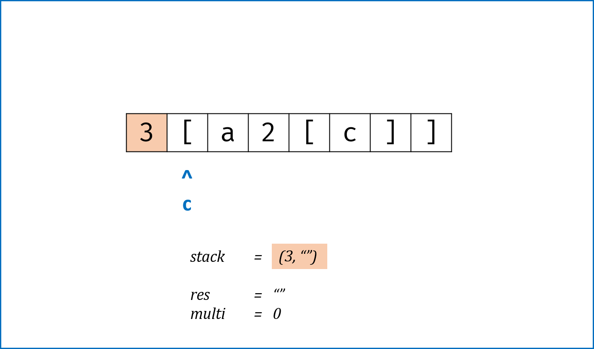
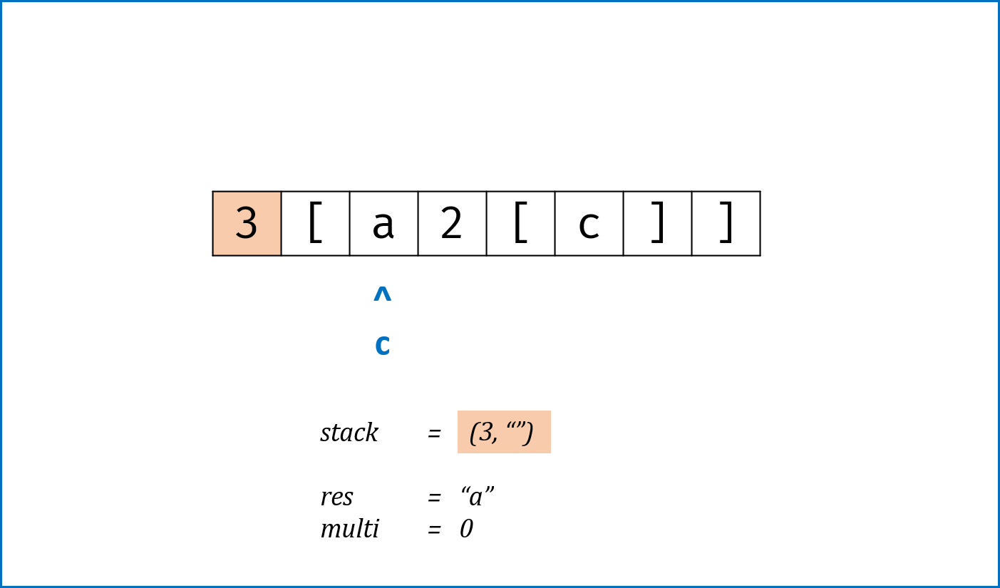
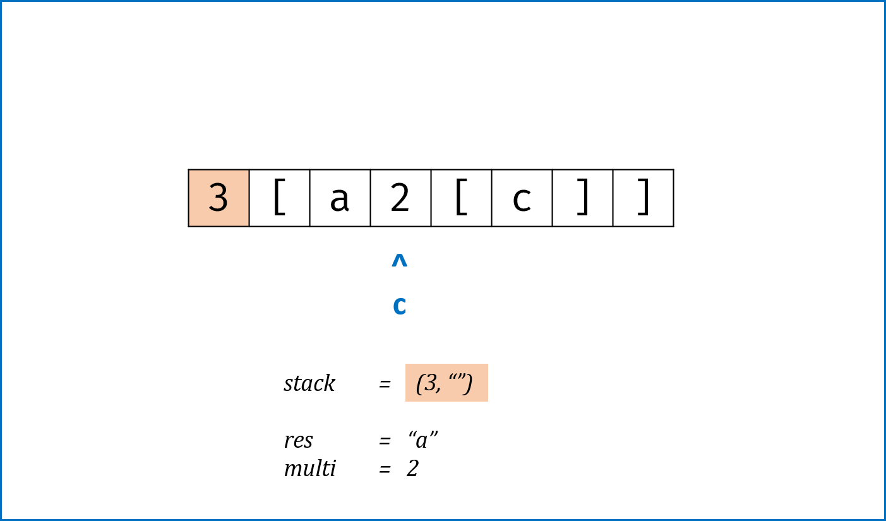
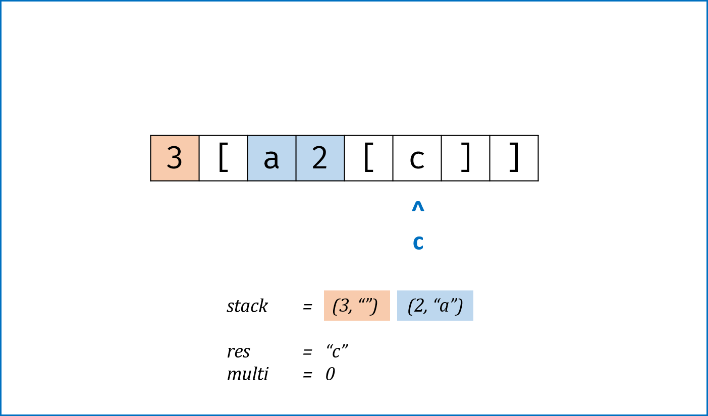
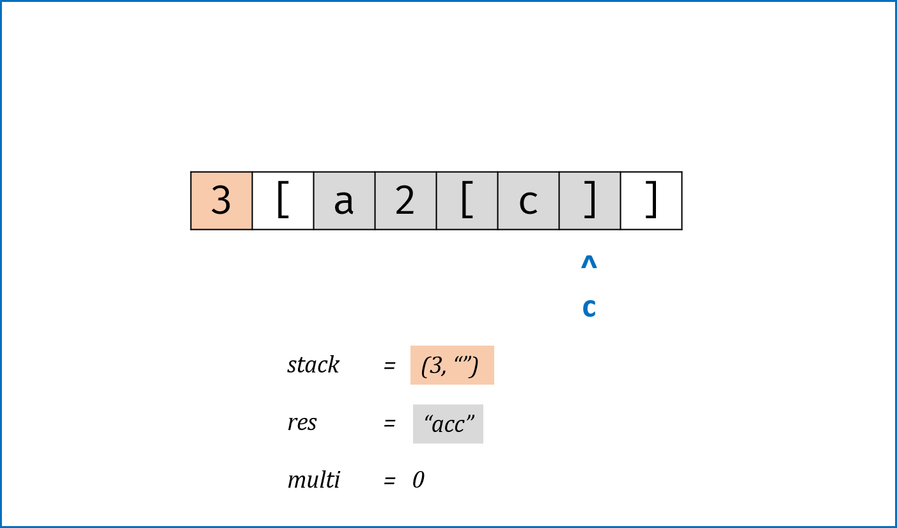
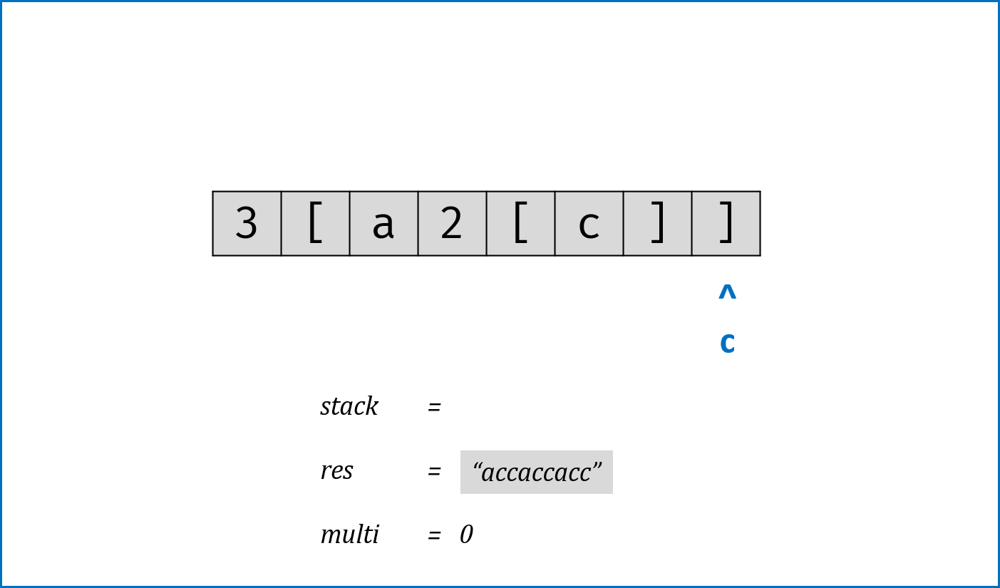

> 原文链接: https://leetcode-cn.com/problems/decode-string


## 英文原文
<div><p>Given an encoded string, return its decoded string.</p>

<p>The encoding rule is: <code>k[encoded_string]</code>, where the <code>encoded_string</code> inside the square brackets is being repeated exactly <code>k</code> times. Note that <code>k</code> is guaranteed to be a positive integer.</p>

<p>You may assume that the input string is always valid; No extra white spaces, square brackets are well-formed, etc.</p>

<p>Furthermore, you may assume that the original data does not contain any digits and that digits are only for those repeat numbers, <code>k</code>. For example, there won&#39;t be input like <code>3a</code> or <code>2[4]</code>.</p>

<p>&nbsp;</p>
<p><strong>Example 1:</strong></p>
<pre><strong>Input:</strong> s = "3[a]2[bc]"
<strong>Output:</strong> "aaabcbc"
</pre><p><strong>Example 2:</strong></p>
<pre><strong>Input:</strong> s = "3[a2[c]]"
<strong>Output:</strong> "accaccacc"
</pre><p><strong>Example 3:</strong></p>
<pre><strong>Input:</strong> s = "2[abc]3[cd]ef"
<strong>Output:</strong> "abcabccdcdcdef"
</pre><p><strong>Example 4:</strong></p>
<pre><strong>Input:</strong> s = "abc3[cd]xyz"
<strong>Output:</strong> "abccdcdcdxyz"
</pre>
<p>&nbsp;</p>
<p><strong>Constraints:</strong></p>

<ul>
	<li><code>1 &lt;= s.length &lt;= 30</code></li>
	<li><code>s</code> consists of lowercase English letters, digits, and square brackets <code>&#39;[]&#39;</code>.</li>
	<li><code>s</code> is guaranteed to be <strong>a valid</strong> input.</li>
	<li>All the integers in <code>s</code> are in the range <code>[1, 300]</code>.</li>
</ul>
</div>

## 中文题目
<div><p>给定一个经过编码的字符串，返回它解码后的字符串。</p>

<p>编码规则为: <code>k[encoded_string]</code>，表示其中方括号内部的 <em>encoded_string</em> 正好重复 <em>k</em> 次。注意 <em>k</em> 保证为正整数。</p>

<p>你可以认为输入字符串总是有效的；输入字符串中没有额外的空格，且输入的方括号总是符合格式要求的。</p>

<p>此外，你可以认为原始数据不包含数字，所有的数字只表示重复的次数 <em>k</em> ，例如不会出现像&nbsp;<code>3a</code>&nbsp;或&nbsp;<code>2[4]</code>&nbsp;的输入。</p>

<p>&nbsp;</p>

<p><strong>示例 1：</strong></p>

<pre><strong>输入：</strong>s = &quot;3[a]2[bc]&quot;
<strong>输出：</strong>&quot;aaabcbc&quot;
</pre>

<p><strong>示例 2：</strong></p>

<pre><strong>输入：</strong>s = &quot;3[a2[c]]&quot;
<strong>输出：</strong>&quot;accaccacc&quot;
</pre>

<p><strong>示例 3：</strong></p>

<pre><strong>输入：</strong>s = &quot;2[abc]3[cd]ef&quot;
<strong>输出：</strong>&quot;abcabccdcdcdef&quot;
</pre>

<p><strong>示例 4：</strong></p>

<pre><strong>输入：</strong>s = &quot;abc3[cd]xyz&quot;
<strong>输出：</strong>&quot;abccdcdcdxyz&quot;
</pre>
</div>

## 通过代码
<RecoDemo>
</RecoDemo>


## 高赞题解
#### 解法一：辅助栈法


- 本题难点在于括号内嵌套括号，需要**从内向外**生成与拼接字符串，这与栈的**先入后出**特性对应。

- **算法流程：**

    1. 构建辅助栈 `stack`， 遍历字符串 `s` 中每个字符 `c`；

        - 当 `c` 为数字时，将数字字符转化为数字 `multi`，用于后续倍数计算；

        - 当 `c` 为字母时，在 `res` 尾部添加 `c`；

        - 当 `c` 为 `[` 时，将当前 `multi` 和 `res` 入栈，并分别置空置 $0$：

            - 记录此 `[` 前的临时结果 `res` 至栈，用于发现对应 `]` 后的拼接操作；

            - 记录此 `[` 前的倍数 `multi` 至栈，用于发现对应 `]` 后，获取 `multi × [...]` 字符串。

            - 进入到新 `[` 后，`res` 和 `multi` 重新记录。

        - 当 `c` 为 `]` 时，`stack` 出栈，拼接字符串 `res = last_res + cur_multi * res`，其中:

            - `last_res`是上个 `[` 到当前 `[` 的字符串，例如 `"3[a2[c]]"` 中的 `a`；

            - `cur_multi`是当前 `[` 到 `]` 内字符串的重复倍数，例如 `"3[a2[c]]"` 中的 `2`。

    2. 返回字符串 `res`。


- **复杂度分析：**

    - 时间复杂度 $O(N)$，一次遍历 `s`；

    - 空间复杂度 $O(N)$，辅助栈在极端情况下需要线性空间，例如 `2[2[2[a]]]`。


<,,,,,,,>


```Python []

class Solution:

    def decodeString(self, s: str) -> str:

        stack, res, multi = [], "", 0

        for c in s:

            if c == '[':

                stack.append([multi, res])

                res, multi = "", 0

            elif c == ']':

                cur_multi, last_res = stack.pop()

                res = last_res + cur_multi * res

            elif '0' <= c <= '9':

                multi = multi * 10 + int(c)            

            else:

                res += c

        return res

```


```Java []

class Solution {

    public String decodeString(String s) {

        StringBuilder res = new StringBuilder();

        int multi = 0;

        LinkedList<Integer> stack_multi = new LinkedList<>();

        LinkedList<String> stack_res = new LinkedList<>();

        for(Character c : s.toCharArray()) {

            if(c == '[') {

                stack_multi.addLast(multi);

                stack_res.addLast(res.toString());

                multi = 0;

                res = new StringBuilder();

            }

            else if(c == ']') {

                StringBuilder tmp = new StringBuilder();

                int cur_multi = stack_multi.removeLast();

                for(int i = 0; i < cur_multi; i++) tmp.append(res);

                res = new StringBuilder(stack_res.removeLast() + tmp);

            }

            else if(c >= '0' && c <= '9') multi = multi * 10 + Integer.parseInt(c + "");

            else res.append(c);

        }

        return res.toString();

    }

}

```


---


#### 解法二：递归法


- 总体思路与辅助栈法一致，不同点在于将 `[` 和 `]` 分别作为递归的开启与终止条件：

    - 当 `s[i] == ']'` 时，返回当前括号内记录的 `res` 字符串与 `]` 的索引 `i` （更新上层递归指针位置）；

    - 当 `s[i] == '['` 时，开启新一层递归，记录此 `[...]` 内字符串 `tmp` 和递归后的最新索引 `i`，并执行 `res + multi * tmp` 拼接字符串。

    - 遍历完毕后返回 `res`。


- **复杂度分析：**

    - 时间复杂度 $O(N)$，递归会更新索引，因此实际上还是一次遍历 `s`；

    - 空间复杂度 $O(N)$，极端情况下递归深度将会达到线性级别。


```Python []

class Solution:

    def decodeString(self, s: str) -> str:

        def dfs(s, i):

            res, multi = "", 0

            while i < len(s):

                if '0' <= s[i] <= '9':

                    multi = multi * 10 + int(s[i])

                elif s[i] == '[':

                    i, tmp = dfs(s, i + 1)

                    res += multi * tmp

                    multi = 0

                elif s[i] == ']':

                    return i, res

                else:

                    res += s[i]

                i += 1

            return res

        return dfs(s,0)

```


```Java []

class Solution {

    public String decodeString(String s) {

        return dfs(s, 0)[0];

    }

    private String[] dfs(String s, int i) {

        StringBuilder res = new StringBuilder();

        int multi = 0;

        while(i < s.length()) {

            if(s.charAt(i) >= '0' && s.charAt(i) <= '9') 

                multi = multi * 10 + Integer.parseInt(String.valueOf(s.charAt(i))); 

            else if(s.charAt(i) == '[') {

                String[] tmp = dfs(s, i + 1);

                i = Integer.parseInt(tmp[0]);

                while(multi > 0) {

                    res.append(tmp[1]);

                    multi--;

                }

            }

            else if(s.charAt(i) == ']') 

                return new String[] { String.valueOf(i), res.toString() };

            else 

                res.append(String.valueOf(s.charAt(i)));

            i++;

        }

        return new String[] { res.toString() };

    } 

}

```

## 统计信息
| 通过次数 | 提交次数 | AC比率 |
| :------: | :------: | :------: |
|    129818    |    234549    |   55.3%   |

## 提交历史
| 提交时间 | 提交结果 | 执行时间 |  内存消耗  | 语言 |
| :------: | :------: | :------: | :--------: | :--------: |


## 相似题目
|                             题目                             | 难度 |
| :----------------------------------------------------------: | :---------: |
| [编码最短长度的字符串](https://leetcode-cn.com/problems/encode-string-with-shortest-length/) | 困难|
| [原子的数量](https://leetcode-cn.com/problems/number-of-atoms/) | 困难|
| [花括号展开](https://leetcode-cn.com/problems/brace-expansion/) | 中等|
