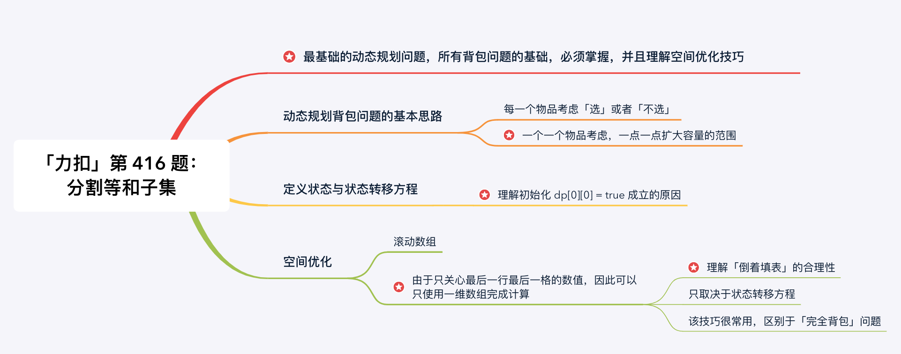

> 原文链接: https://leetcode-cn.com/problems/partition-equal-subset-sum


## 英文原文
<div><p>Given a <strong>non-empty</strong> array <code>nums</code> containing <strong>only positive integers</strong>, find if the array can be partitioned into two subsets such that the sum of elements in both subsets is equal.</p>

<p>&nbsp;</p>
<p><strong>Example 1:</strong></p>

<pre>
<strong>Input:</strong> nums = [1,5,11,5]
<strong>Output:</strong> true
<strong>Explanation:</strong> The array can be partitioned as [1, 5, 5] and [11].
</pre>

<p><strong>Example 2:</strong></p>

<pre>
<strong>Input:</strong> nums = [1,2,3,5]
<strong>Output:</strong> false
<strong>Explanation:</strong> The array cannot be partitioned into equal sum subsets.
</pre>

<p>&nbsp;</p>
<p><strong>Constraints:</strong></p>

<ul>
	<li><code>1 &lt;= nums.length &lt;= 200</code></li>
	<li><code>1 &lt;= nums[i] &lt;= 100</code></li>
</ul>
</div>

## 中文题目
<div><p>给你一个 <strong>只包含正整数 </strong>的 <strong>非空 </strong>数组 <code>nums</code> 。请你判断是否可以将这个数组分割成两个子集，使得两个子集的元素和相等。</p>

<p> </p>

<p><strong>示例 1：</strong></p>

<pre>
<strong>输入：</strong>nums = [1,5,11,5]
<strong>输出：</strong>true
<strong>解释：</strong>数组可以分割成 [1, 5, 5] 和 [11] 。</pre>

<p><strong>示例 2：</strong></p>

<pre>
<strong>输入：</strong>nums = [1,2,3,5]
<strong>输出：</strong>false
<strong>解释：</strong>数组不能分割成两个元素和相等的子集。
</pre>

<p> </p>

<p><strong>提示：</strong></p>

<ul>
	<li><code>1 <= nums.length <= 200</code></li>
	<li><code>1 <= nums[i] <= 100</code></li>
</ul>
</div>

## 通过代码
<RecoDemo>
</RecoDemo>


## 高赞题解
关于背包问题的介绍，大家可以在互联网上搜索「背包九讲」进行学习，其中「0-1」背包问题是这些问题的基础。「力扣」上涉及的背包问题有「0-1」背包问题、完全背包问题、多重背包问题。

本题解有些地方使用了「0-1」背包问题的描述，因此会不加解释的使用「背包」、「容量」这样的名词。

**说明**：这里感谢很多朋友在这篇题解下提出的建议，对我的启发很大。本题解的阅读建议是：先浏览代码，然后再看代码之前的分析，能更有效理解知识点和整个问题的思考路径。题解后也增加了「总结」，供大家参考。

---

## 转换为 「0 - 1」 背包问题

这道问题是我学习「背包」问题的入门问题，做这道题需要做一个等价转换：是否可以从输入数组中挑选出一些正整数，使得这些数的和 **等于** 整个数组元素的和的一半。很坦白地说，如果不是我的老师告诉我可以这样想，我很难想出来。容易知道：数组的和一定得是偶数。

本题与 0-1 背包问题有一个很大的不同，即：

+ 0-1 背包问题选取的物品的容积总量 **不能超过** 规定的总量；
+ 本题选取的数字之和需要 **恰好等于** 规定的和的一半。

这一点区别，决定了在初始化的时候，所有的值应该初始化为 `false`。 （《背包九讲》的作者在介绍 「0-1 背包」问题的时候，有强调过这点区别。）

## 「0 - 1」 背包问题的思路

作为「0-1 背包问题」，它的特点是：「每个数只能用一次」。解决的基本思路是：**物品一个一个选，容量也一点一点增加去考虑**，这一点是「动态规划」的思想，特别重要。
在实际生活中，我们也是这样做的，一个一个地尝试把候选物品放入「背包」，通过比较得出一个物品要不要拿走。

具体做法是：画一个 `len` 行，`target + 1` 列的表格。这里 `len` 是物品的个数，`target` 是背包的容量。`len` 行表示一个一个物品考虑，`target + 1`多出来的那 `1` 列，表示背包容量从 `0` 开始考虑。很多时候，我们需要考虑这个容量为 `0` 的数值。

## 状态与状态转移方程

+ 状态定义：`dp[i][j]`表示从数组的 `[0, i]` 这个子区间内挑选一些正整数，每个数只能用一次，使得这些数的和**恰好等于** `j`。
+ 状态转移方程：很多时候，状态转移方程思考的角度是「分类讨论」，对于「0-1 背包问题」而言就是「当前考虑到的数字选与不选」。
  + 不选择 `nums[i]`，如果在 `[0, i - 1]` 这个子区间内已经有一部分元素，使得它们的和为 `j` ，那么 `dp[i][j] = true`；
  + 选择 `nums[i]`，如果在 `[0, i - 1]` 这个子区间内就得找到一部分元素，使得它们的和为 `j - nums[i]`。

状态转移方程：

```java
dp[i][j] = dp[i - 1][j] or dp[i - 1][j - nums[i]]
```

一般写出状态转移方程以后，就需要考虑初始化条件。

+ `j - nums[i]` 作为数组的下标，一定得保证大于等于 `0` ，因此 `nums[i] <= j`；
+ 注意到一种非常特殊的情况：`j` 恰好等于 `nums[i]`，即单独 `nums[j]` 这个数恰好等于此时「背包的容积」 `j`，这也是符合题意的。

因此完整的状态转移方程是：

$$
\text{dp}[i][j]=
\begin{cases}
\text{dp}[i - 1][j], & 至少是这个答案，如果 \ \text{dp}[i - 1][j] \ 为真，直接计算下一个状态 \\
\text{true}, & \text{nums[i] = j} \\
\text{dp}[i - 1][j - nums[i]]. & \text{nums[i] < j}
\end{cases}
$$

说明：虽然写成花括号，但是它们的关系是 **或者** 。

+ 初始化：`dp[0][0] = false`，因为候选数 `nums[0]` 是正整数，凑不出和为 $0$；
+ 输出：`dp[len - 1][target]`，这里 `len` 表示数组的长度，`target` 是数组的元素之和（必须是偶数）的一半。

**说明**：
+ 事实上 `dp[0][0] = true` 也是可以的，相应地状态转移方程有所变化，请见下文；
+ 如果觉得这个初始化非常难理解，解释性差的朋友，我个人觉得可以不用具体解释它的意义，初始化的值保证状态转移能够正确完成即可。


**参考代码 1**：

```Java []
public class Solution {

    public boolean canPartition(int[] nums) {
        int len = nums.length;
        // 题目已经说非空数组，可以不做非空判断
        int sum = 0;
        for (int num : nums) {
            sum += num;
        }
        // 特判：如果是奇数，就不符合要求
        if ((sum & 1) == 1) {
            return false;
        }

        int target = sum / 2;
        // 创建二维状态数组，行：物品索引，列：容量（包括 0）
        boolean[][] dp = new boolean[len][target + 1];

        // 先填表格第 0 行，第 1 个数只能让容积为它自己的背包恰好装满
        if (nums[0] <= target) {
            dp[0][nums[0]] = true;
        }
        // 再填表格后面几行
        for (int i = 1; i < len; i++) {
            for (int j = 0; j <= target; j++) {
                // 直接从上一行先把结果抄下来，然后再修正
                dp[i][j] = dp[i - 1][j];

                if (nums[i] == j) {
                    dp[i][j] = true;
                    continue;
                }
                if (nums[i] < j) {
                    dp[i][j] = dp[i - 1][j] || dp[i - 1][j - nums[i]];
                }
            }
        }
        return dp[len - 1][target];
    }
}
```

**复杂度分析**：

+ 时间复杂度：$O(NC)$：这里 $N$ 是数组元素的个数，$C$ 是数组元素的和的一半。
+ 空间复杂度：$O(NC)$。

---

## 解释设置 `dp[0][0] = true` 的合理性（重点）

修改状态数组初始化的定义：`dp[0][0] =  true`。考虑容量为 $0$ 的时候，即 `dp[i][0]`。按照本意来说，应该设置为 `false` ，但是注意到状态转移方程（代码中）：

```java
dp[i][j] = dp[i - 1][j] || dp[i - 1][j - nums[i]];
```

当 `j - nums[i] == 0` 成立的时候，根据上面分析，就说明单独的 `nums[i]` 这个数就恰好能够在被分割为单独的一组，其余的数分割成为另外一组。因此，我们把初始化的 `dp[i][0]` 设置成为 `true` 是没有问题的。

**注意**：观察状态转移方程，`or` 的结果只要为真，表格 **这一列** 下面所有的值都为真。因此在填表的时候，只要表格的最后一列是 `true`，代码就可以结束，直接返回 `true`。

**参考代码 2**：

```Java []
public class Solution {

    public boolean canPartition(int[] nums) {
        int len = nums.length;
        int sum = 0;
        for (int num : nums) {
            sum += num;
        }
        if ((sum & 1) == 1) {
            return false;
        }

        int target = sum / 2;
        boolean[][] dp = new boolean[len][target + 1];
        
        // 初始化成为 true 虽然不符合状态定义，但是从状态转移来说是完全可以的
        dp[0][0] = true;

        if (nums[0] <= target) {
            dp[0][nums[0]] = true;
        }
        for (int i = 1; i < len; i++) {
            for (int j = 0; j <= target; j++) {
                dp[i][j] = dp[i - 1][j];
                if (nums[i] <= j) {
                    dp[i][j] = dp[i - 1][j] || dp[i - 1][j - nums[i]];
                }
            }

            // 由于状态转移方程的特殊性，提前结束，可以认为是剪枝操作
            if (dp[i][target]) {
                return true;
            }
        }
        return dp[len - 1][target];
    }
}
```

**复杂度分析**：(同上)

---

## 考虑空间优化（重要）

**说明**：这个技巧很常见、很基础，请一定要掌握。

「0-1 背包问题」常规优化：「状态数组」从二维降到一维，减少空间复杂度。

+ 在「填表格」的时候，当前行只参考了上一行的值，因此状态数组可以只设置 $2$ 行，使用「滚动数组」的技巧「填表格」即可；

+ 实际上，在「滚动数组」的基础上还可以优化，在「填表格」的时候，**当前行总是参考了它上面一行 「头顶上」 那个位置和「左上角」某个位置的值**。因此，我们可以只开一个一维数组，从后向前依次填表即可。

> 友情提示：这一点在刚开始学习的时候，可能会觉得很奇怪。理解的办法是：拿题目中的示例，画一个表格，自己模拟一遍程序是如何「填表」的行为，就很清楚为什么状态数组降到 1 行的时候，需要「从后前向」填表。

+ 「从后向前」 写的过程中，一旦 `nums[i] <= j` 不满足，可以马上退出当前循环，因为后面的 `j` 的值肯定越来越小，没有必要继续做判断，直接进入外层循环的下一层。相当于也是一个剪枝，这一点是「从前向后」填表所不具备的。

**说明**：如果对空间优化技巧还有疑惑的朋友，本题解下的精选评论也解释了如何理解这个空间优化的技巧，请大家前往观看。

**参考代码 3**：只展示了使用一维表格，并且「从后向前」填表格的代码。

```Java []
public class Solution {

    public boolean canPartition(int[] nums) {
        int len = nums.length;
        int sum = 0;
        for (int num : nums) {
            sum += num;
        }
        if ((sum & 1) == 1) {
            return false;
        }

        int target = sum / 2;
        boolean[] dp = new boolean[target + 1];
        dp[0] = true;

        if (nums[0] <= target) {
            dp[nums[0]] = true;
        }
        for (int i = 1; i < len; i++) {
            for (int j = target; nums[i] <= j; j--) {
                if (dp[target]) {
                    return true;
                }
                dp[j] = dp[j] || dp[j - nums[i]];
            }
        }
        return dp[target];
    }
}
```

**复杂度分析：**

+ 时间复杂度：$O(NC)$：这里 $N$ 是数组元素的个数，$C$ 是数组元素的和的一半；
+ 空间复杂度：$O(C)$：减少了物品那个维度，无论来多少个数，用一行表示状态就够了。

---

## 总结




「0-1 背包」问题是一类非常重要的动态规划问题，一开始学习的时候，可能会觉得比较陌生。建议动笔计算，手动模拟填表的过程，其实就是画表格。这个过程非常重要，自己动手填过表，更能加深体会程序是如何执行的，也能更好地理解「空间优化」技巧的思路和好处。


在编写代码完成以后，把数组 `dp` 打印出来，看看是不是与自己手算的一样。以加深体会动态规划的设计思想：「**不是直接面对问题求解**，而是从一个最小规模的问题开始，新问的最优解均是由比它规模还小的子问题的最优解转换得到，在求解的过程中记录每一步的结果，直至所要求的问题得到解」。

---

最后思考为什么题目说是正整数，有 $0$ 是否可以，有实数可以吗，有负数可以吗？

+ $0$ 的存在意义不大，放在哪个子集都是可以的；
+ 实数有可能是无理数，也可能是无限不循环小数，在计算整个数组元素的和的一半，要除法，然后在比较两个子集元素的和是否相等的时候，就会遇到精度的问题；
+ 再说负数，负数其实也是可以存在的，但要用到「回溯搜算法」解决。

---

## 相关问题

「力扣」上的 **0-1 背包问题**：

+ 「力扣」第 416 题：分割等和子集（中等）；
+ 「力扣」第 474 题：一和零（中等）；
+ 「力扣」第 494 题：目标和（中等）；
+ 「力扣」第 879 题：盈利计划（困难）；

「力扣」上的 **完全背包问题**：

+ 「力扣」第 322 题：零钱兑换（中等）；
+ 「力扣」第 518 题：零钱兑换 II（中等）；
+ 「力扣」第 1449 题：数位成本和为目标值的最大数字（困难）。

这里要注意鉴别：「力扣」第 377 题，不是「完全背包」问题。


## 参考资料

+ 背包问题资料下载，链接：[百度云下载](https://pan.baidu.com/s/1XZZGBK4P_zZ4rJvrIRG5VA  )，密码：sjop 。


## 统计信息
| 通过次数 | 提交次数 | AC比率 |
| :------: | :------: | :------: |
|    189068    |    371221    |   50.9%   |

## 提交历史
| 提交时间 | 提交结果 | 执行时间 |  内存消耗  | 语言 |
| :------: | :------: | :------: | :--------: | :--------: |


## 相似题目
|                             题目                             | 难度 |
| :----------------------------------------------------------: | :---------: |
| [划分为k个相等的子集](https://leetcode-cn.com/problems/partition-to-k-equal-sum-subsets/) | 中等|
