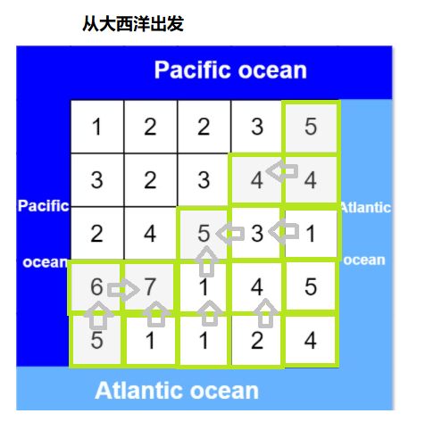
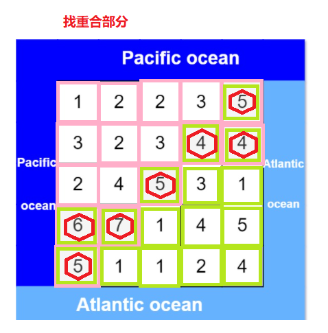

> 原文链接: https://leetcode-cn.com/problems/pacific-atlantic-water-flow


## 英文原文
<div><p>There is an <code>m x n</code> rectangular island that borders both the <strong>Pacific Ocean</strong> and <strong>Atlantic Ocean</strong>. The <strong>Pacific Ocean</strong> touches the island&#39;s left and top edges, and the <strong>Atlantic Ocean</strong> touches the island&#39;s right and bottom edges.</p>

<p>The island is partitioned into a grid of square cells. You are given an <code>m x n</code> integer matrix <code>heights</code> where <code>heights[r][c]</code> represents the <strong>height above sea level</strong> of the cell at coordinate <code>(r, c)</code>.</p>

<p>The island receives a lot of rain, and the rain water can flow to neighboring cells directly north, south, east, and west if the neighboring cell&#39;s height is <strong>less than or equal to</strong> the current cell&#39;s height. Water can flow from any cell adjacent to an ocean into the ocean.</p>

<p>Return <em>a <strong>2D list</strong> of grid coordinates </em><code>result</code><em> where </em><code>result[i] = [r<sub>i</sub>, c<sub>i</sub>]</code><em> denotes that rain water can flow from cell </em><code>(r<sub>i</sub>, c<sub>i</sub>)</code><em> to <strong>both</strong> the Pacific and Atlantic oceans</em>.</p>

<p>&nbsp;</p>
<p><strong>Example 1:</strong></p>

<pre>
<strong>Input:</strong> heights = [[1,2,2,3,5],[3,2,3,4,4],[2,4,5,3,1],[6,7,1,4,5],[5,1,1,2,4]]
<strong>Output:</strong> [[0,4],[1,3],[1,4],[2,2],[3,0],[3,1],[4,0]]
</pre>

<p><strong>Example 2:</strong></p>

<pre>
<strong>Input:</strong> heights = [[2,1],[1,2]]
<strong>Output:</strong> [[0,0],[0,1],[1,0],[1,1]]
</pre>

<p>&nbsp;</p>
<p><strong>Constraints:</strong></p>

<ul>
	<li><code>m == heights.length</code></li>
	<li><code>n == heights[r].length</code></li>
	<li><code>1 &lt;= m, n &lt;= 200</code></li>
	<li><code>0 &lt;= heights[r][c] &lt;= 10<sup>5</sup></code></li>
</ul>
</div>

## 中文题目
<div><p>给定一个 <code>m x n</code> 的非负整数矩阵来表示一片大陆上各个单元格的高度。&ldquo;太平洋&rdquo;处于大陆的左边界和上边界，而&ldquo;大西洋&rdquo;处于大陆的右边界和下边界。</p>

<p>规定水流只能按照上、下、左、右四个方向流动，且只能从高到低或者在同等高度上流动。</p>

<p>请找出那些水流既可以流动到&ldquo;太平洋&rdquo;，又能流动到&ldquo;大西洋&rdquo;的陆地单元的坐标。</p>

<p>&nbsp;</p>

<p><strong>提示：</strong></p>

<ol>
	<li>输出坐标的顺序不重要</li>
	<li><em>m</em> 和 <em>n</em> 都小于150</li>
</ol>

<p>&nbsp;</p>

<p><strong>示例：</strong></p>

<p>&nbsp;</p>

<pre>
给定下面的 5x5 矩阵:

  太平洋 ~   ~   ~   ~   ~ 
       ~  1   2   2   3  (5) *
       ~  3   2   3  (4) (4) *
       ~  2   4  (5)  3   1  *
       ~ (6) (7)  1   4   5  *
       ~ (5)  1   1   2   4  *
          *   *   *   *   * 大西洋

返回:

[[0, 4], [1, 3], [1, 4], [2, 2], [3, 0], [3, 1], [4, 0]] (上图中带括号的单元).
</pre>

<p>&nbsp;</p>
</div>

## 通过代码
<RecoDemo>
</RecoDemo>


## 高赞题解
### 解题思路
对于此题我们可以直观的取暴力搜索每一个点是否可以达到两边的大洋，当然这样子要处理的东西会很多，并且思路不够明显。有小伙伴会说，水怎么能往高处流动，现实生活中水当然是往低处流的。但是现在键盘在你手上，你让他往东流他能往西流？
咱这是能上天的黄河之水！
*******************
对于一个点它能流动两边的大洋，那么反过来，两边大洋的水反着流就能达到这个点。
尽然水开始倒流了，那么逻辑也需要反过来，因此只有将下一个点比当前的点大时或者等于当前点的高度时，水才能流过去。
*********************************
找出所有这样的点我们需要怎么做？
1. 找出所有从**太平洋**出发的水所能达到的点

*******************************
2. 找出所有从**大西洋**出发的水所能达到的点

*****************
3. 这些重合的点便是我们要找的点

************************
写良心的题解真的不易，点个关注点个👍吧各位！
***********************
### 代码
```cpp
class Solution {
public:
    vector<vector<int>> P, A, ans;
    int n, m;
    vector<vector<int>> pacificAtlantic(vector<vector<int>>& M) {
        n = M.size(), m = M[0].size();
        P = A = vector<vector<int>>(n, vector<int>(m, 0));
        //左右两边加上下两边出发深搜
        for(int i = 0; i < n; ++i) dfs(M, P, i, 0), dfs(M, A, i, m - 1);
        for(int j = 0; j < m; ++j) dfs(M, P, 0, j), dfs(M, A, n - 1, j);             
        return ans;
    }
    void dfs(vector<vector<int>>& M, vector<vector<int>>& visited, int i, int j){        
        if(visited[i][j]) return;
        visited[i][j] = 1;

        if(P[i][j] && A[i][j]) ans.push_back({i,j}); 

        //上下左右深搜
        if(i-1 >= 0 && M[i-1][j] >= M[i][j]) dfs(M, visited, i-1, j);
        if(i+1 < n && M[i+1][j] >= M[i][j]) dfs(M, visited, i+1, j); 
        if(j-1 >= 0 && M[i][j-1] >= M[i][j]) dfs(M, visited, i, j-1);
        if(j+1 < m && M[i][j+1] >= M[i][j]) dfs(M, visited, i, j+1); 
    }
};
```

## 统计信息
| 通过次数 | 提交次数 | AC比率 |
| :------: | :------: | :------: |
|    30002    |    61849    |   48.5%   |

## 提交历史
| 提交时间 | 提交结果 | 执行时间 |  内存消耗  | 语言 |
| :------: | :------: | :------: | :--------: | :--------: |
