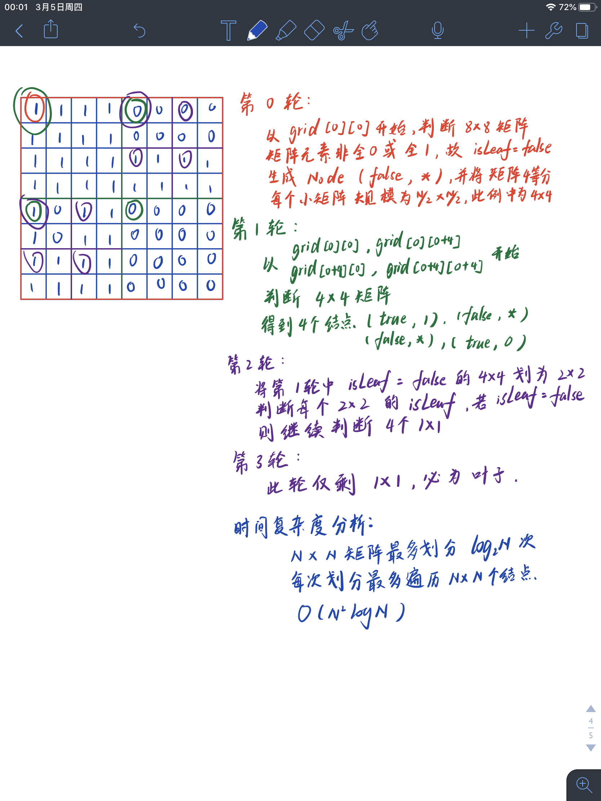

> 原文链接: https://leetcode-cn.com/problems/construct-quad-tree


## 英文原文
<div><p>Given a <code>n * n</code> matrix <code>grid</code> of <code>0&#39;s</code> and <code>1&#39;s</code> only. We want to represent the <code>grid</code> with a Quad-Tree.</p>

<p>Return <em>the root of the Quad-Tree</em> representing the <code>grid</code>.</p>

<p>Notice that you can assign the value of a node to <strong>True</strong> or <strong>False</strong> when <code>isLeaf</code> is <strong>False</strong>, and both are <strong>accepted</strong> in the answer.</p>

<p>A Quad-Tree is a tree data structure in which each internal node has exactly four children. Besides, each node has two attributes:</p>

<ul>
	<li><code>val</code>: True if the node represents a grid of 1&#39;s or False if the node represents a grid of 0&#39;s.&nbsp;</li>
	<li><code>isLeaf</code>: True if the node is leaf node on the tree or False if the node has the four children.</li>
</ul>

<pre>
class Node {
    public boolean val;
&nbsp; &nbsp; public boolean isLeaf;
&nbsp; &nbsp; public Node topLeft;
&nbsp; &nbsp; public Node topRight;
&nbsp; &nbsp; public Node bottomLeft;
&nbsp; &nbsp; public Node bottomRight;
}</pre>

<p>We can construct a Quad-Tree from a two-dimensional area using the following steps:</p>

<ol>
	<li>If the current grid has the same value (i.e all <code>1&#39;s</code> or all <code>0&#39;s</code>)&nbsp;set <code>isLeaf</code>&nbsp;True and set <code>val</code> to the value of the grid and set the four children to Null and stop.</li>
	<li>If the current grid has different values, set <code>isLeaf</code> to False and&nbsp;set <code>val</code> to any value and divide the current grid into four sub-grids as shown in the photo.</li>
	<li>Recurse for each of the children with the proper sub-grid.</li>
</ol>

<p>If you want to know more about the Quad-Tree, you can refer to the&nbsp;<a href="https://en.wikipedia.org/wiki/Quadtree">wiki</a>.</p>

<p><strong>Quad-Tree&nbsp;format:</strong></p>

<p>The output represents the serialized format of a Quad-Tree using level order traversal, where <code>null</code> signifies a path terminator where no node exists below.</p>

<p>It is very similar to the serialization of the binary tree. The only difference is that the node is represented as a list <code>[isLeaf, val]</code>.</p>

<p>If the value of <code>isLeaf</code> or <code>val</code> is True we represent it as <strong>1</strong> in the list&nbsp;<code>[isLeaf, val]</code> and if the value of <code>isLeaf</code> or <code>val</code> is False we represent it as <strong>0</strong>.</p>

<p>&nbsp;</p>
<p><strong>Example 1:</strong></p>

<pre>
<strong>Input:</strong> grid = [[0,1],[1,0]]
<strong>Output:</strong> [[0,1],[1,0],[1,1],[1,1],[1,0]]
<strong>Explanation:</strong> The explanation of this example is shown below:
Notice that 0 represnts False and 1 represents True in the photo representing the Quad-Tree.

</pre>

<p><strong>Example 2:</strong></p>

<p></p>

<pre>
<strong>Input:</strong> grid = [[1,1,1,1,0,0,0,0],[1,1,1,1,0,0,0,0],[1,1,1,1,1,1,1,1],[1,1,1,1,1,1,1,1],[1,1,1,1,0,0,0,0],[1,1,1,1,0,0,0,0],[1,1,1,1,0,0,0,0],[1,1,1,1,0,0,0,0]]
<strong>Output:</strong> [[0,1],[1,1],[0,1],[1,1],[1,0],null,null,null,null,[1,0],[1,0],[1,1],[1,1]]
<strong>Explanation:</strong> All values in the grid are not the same. We divide the grid into four sub-grids.
The topLeft, bottomLeft and bottomRight each has the same value.
The topRight have different values so we divide it into 4 sub-grids where each has the same value.
Explanation is shown in the photo below:

</pre>

<p><strong>Example 3:</strong></p>

<pre>
<strong>Input:</strong> grid = [[1,1],[1,1]]
<strong>Output:</strong> [[1,1]]
</pre>

<p><strong>Example 4:</strong></p>

<pre>
<strong>Input:</strong> grid = [[0]]
<strong>Output:</strong> [[1,0]]
</pre>

<p><strong>Example 5:</strong></p>

<pre>
<strong>Input:</strong> grid = [[1,1,0,0],[1,1,0,0],[0,0,1,1],[0,0,1,1]]
<strong>Output:</strong> [[0,1],[1,1],[1,0],[1,0],[1,1]]
</pre>

<p>&nbsp;</p>
<p><strong>Constraints:</strong></p>

<ul>
	<li><code>n == grid.length == grid[i].length</code></li>
	<li><code>n == 2^x</code> where <code>0 &lt;= x &lt;= 6</code></li>
</ul>
</div>

## 中文题目
<div><p>给你一个 <code>n * n</code> 矩阵 <code>grid</code> ，矩阵由若干 <code>0</code> 和 <code>1</code> 组成。请你用四叉树表示该矩阵 <code>grid</code> 。</p>

<p>你需要返回能表示矩阵的 四叉树 的根结点。</p>

<p>注意，当 <code>isLeaf</code> 为 <strong>False </strong>时，你可以把 <strong>True</strong> 或者 <strong>False</strong> 赋值给节点，两种值都会被判题机制 <strong>接受</strong> 。</p>

<p>四叉树数据结构中，每个内部节点只有四个子节点。此外，每个节点都有两个属性：</p>

<ul>
	<li><code>val</code>：储存叶子结点所代表的区域的值。1 对应 <strong>True</strong>，0 对应 <strong>False</strong>；</li>
	<li><code>isLeaf</code>: 当这个节点是一个叶子结点时为 <strong>True</strong>，如果它有 4 个子节点则为 <strong>False</strong> 。</li>
</ul>

<pre>class Node {
    public boolean val;
&nbsp; &nbsp; public boolean isLeaf;
&nbsp; &nbsp; public Node topLeft;
&nbsp; &nbsp; public Node topRight;
&nbsp; &nbsp; public Node bottomLeft;
&nbsp; &nbsp; public Node bottomRight;
}</pre>

<p>我们可以按以下步骤为二维区域构建四叉树：</p>

<ol>
	<li>如果当前网格的值相同（即，全为 <code>0</code> 或者全为 <code>1</code>），将 <code>isLeaf</code> 设为 True ，将 <code>val</code> 设为网格相应的值，并将四个子节点都设为 Null 然后停止。</li>
	<li>如果当前网格的值不同，将 <code>isLeaf</code> 设为 False， 将 <code>val</code> 设为任意值，然后如下图所示，将当前网格划分为四个子网格。</li>
	<li>使用适当的子网格递归每个子节点。</li>
</ol>

<p></p>

<p>如果你想了解更多关于四叉树的内容，可以参考 <a href="https://en.wikipedia.org/wiki/Quadtree">wiki</a> 。</p>

<p><strong>四叉树格式：</strong></p>

<p>输出为使用层序遍历后四叉树的序列化形式，其中 <code>null</code> 表示路径终止符，其下面不存在节点。</p>

<p>它与二叉树的序列化非常相似。唯一的区别是节点以列表形式表示 <code>[isLeaf, val]</code> 。</p>

<p>如果 <code>isLeaf</code> 或者 <code>val</code> 的值为 True ，则表示它在列表&nbsp;<code>[isLeaf, val]</code> 中的值为 <strong>1</strong> ；如果 <code>isLeaf</code> 或者 <code>val</code> 的值为 False ，则表示值为 <strong>0 </strong>。</p>

<p>&nbsp;</p>

<p><strong>示例 1：</strong></p>

<p></p>

<pre><strong>输入：</strong>grid = [[0,1],[1,0]]
<strong>输出：</strong>[[0,1],[1,0],[1,1],[1,1],[1,0]]
<strong>解释：</strong>此示例的解释如下：
请注意，在下面四叉树的图示中，0 表示 false，1 表示 True 。

</pre>

<p><strong>示例 2：</strong></p>

<p></p>

<pre><strong>输入：</strong>grid = [[1,1,1,1,0,0,0,0],[1,1,1,1,0,0,0,0],[1,1,1,1,1,1,1,1],[1,1,1,1,1,1,1,1],[1,1,1,1,0,0,0,0],[1,1,1,1,0,0,0,0],[1,1,1,1,0,0,0,0],[1,1,1,1,0,0,0,0]]
<strong>输出：</strong>[[0,1],[1,1],[0,1],[1,1],[1,0],null,null,null,null,[1,0],[1,0],[1,1],[1,1]]
<strong>解释：</strong>网格中的所有值都不相同。我们将网格划分为四个子网格。
topLeft，bottomLeft 和 bottomRight 均具有相同的值。
topRight 具有不同的值，因此我们将其再分为 4 个子网格，这样每个子网格都具有相同的值。
解释如下图所示：

</pre>

<p><strong>示例 3：</strong></p>

<pre><strong>输入：</strong>grid = [[1,1],[1,1]]
<strong>输出：</strong>[[1,1]]
</pre>

<p><strong>示例 4：</strong></p>

<pre><strong>输入：</strong>grid = [[0]]
<strong>输出：</strong>[[1,0]]
</pre>

<p><strong>示例 5：</strong></p>

<pre><strong>输入：</strong>grid = [[1,1,0,0],[1,1,0,0],[0,0,1,1],[0,0,1,1]]
<strong>输出：</strong>[[0,1],[1,1],[1,0],[1,0],[1,1]]
</pre>

<p>&nbsp;</p>

<p><strong>提示：</strong></p>

<ol>
	<li><code>n == grid.length == grid[i].length</code></li>
	<li><code>n == 2^x</code> 其中 <code>0 &lt;= x &lt;= 6</code></li>
</ol>
</div>

## 通过代码
<RecoDemo>
</RecoDemo>


## 高赞题解


```
class Solution {
public:
    /*
     核心思路：
     当前矩阵由三个参数确定：左上角元素的行号 row 列号 col，以及矩阵规模 N
     判断当前矩阵是否为叶子节点，方法为比较左上角元素和其他元素的关系，
     若出现不等则为非叶节点，需要继续划分，每个划分后的矩阵规模为 N/2 * N/2，
     这 4 个矩阵递归地生成当前节点的 4 个子节点。
     若元素全相等则返回一个叶子节点 (true, grid[row][col])。
     **/
    Node* helper(vector<vector<int>>& grid, int row, int col, int N) {
        int first = grid[row][col];
        Node *result = new Node();
        bool isLeaf = true;
        int m, n;
        m = row+N;
        n = col+N;
        
        // 遍历比较每个元素与左上角元素的值
        for (int i = row; i < m; ++i) {
            for (int j = col; j < n; ++j)
                if (grid[i][j] != first) {
                    isLeaf = false;
                    break;
                }
            if (!isLeaf) break;
        }
        
        if (isLeaf) {
            result->val = first;
            result->isLeaf = isLeaf;
        } else {
            // 存在不一样的元素，递归计算子节点，每个子矩阵的行列数减半
            N /= 2;
            result->isLeaf = isLeaf;
            result->topLeft = helper(grid, row, col, N);
            result->topRight = helper(grid, row, col+N, N);
            result->bottomLeft = helper(grid, row+N, col, N);
            result->bottomRight = helper(grid, row+N, col+N, N);
        }
        return result;
    }
    
    Node* construct(vector<vector<int>>& grid) {
        int N = (int)grid.size();
        if (N == 0) return NULL;
        return helper(grid, 0, 0, N);
    }
};
```


## 统计信息
| 通过次数 | 提交次数 | AC比率 |
| :------: | :------: | :------: |
|    4366    |    7074    |   61.7%   |

## 提交历史
| 提交时间 | 提交结果 | 执行时间 |  内存消耗  | 语言 |
| :------: | :------: | :------: | :--------: | :--------: |
