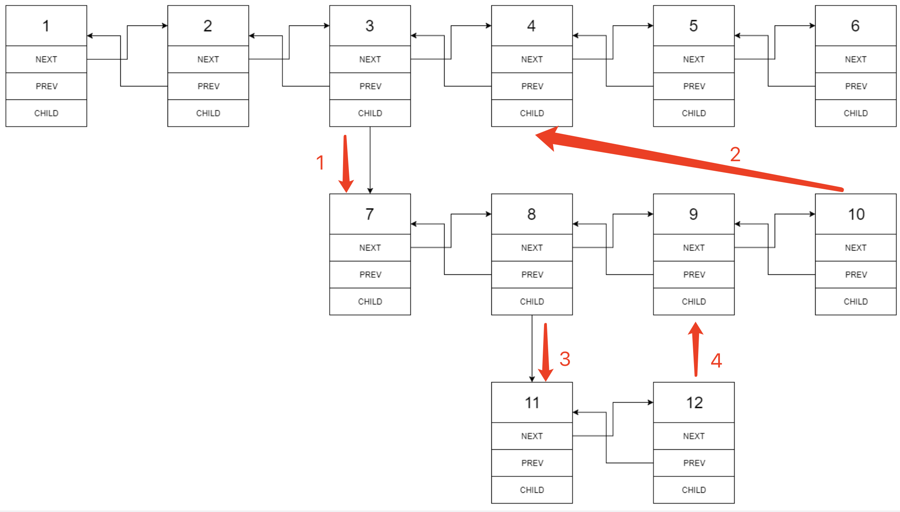

> 原文链接: https://leetcode-cn.com/problems/flatten-a-multilevel-doubly-linked-list


## 英文原文
<div><p>You are given a doubly linked list, which contains nodes that have a next pointer, a previous pointer, and an additional <strong>child pointer</strong>. This child pointer may or may not point to a separate doubly linked list, also containing these special nodes. These child lists may have one or more children of their own, and so on, to produce a <strong>multilevel data structure</strong> as shown in the example below.</p>

<p>Given the <code>head</code> of the first level of the list, <strong>flatten</strong> the list so that all the nodes appear in a single-level, doubly linked list. Let <code>curr</code> be a node with a child list. The nodes in the child list should appear <strong>after</strong> <code>curr</code> and <strong>before</strong> <code>curr.next</code> in the flattened list.</p>

<p>Return <em>the </em><code>head</code><em> of the flattened list. The nodes in the list must have <strong>all</strong> of their child pointers set to </em><code>null</code>.</p>

<p>&nbsp;</p>
<p><strong>Example 1:</strong></p>

<pre>
<strong>Input:</strong> head = [1,2,3,4,5,6,null,null,null,7,8,9,10,null,null,11,12]
<strong>Output:</strong> [1,2,3,7,8,11,12,9,10,4,5,6]
<strong>Explanation:</strong> The multilevel linked list in the input is shown.
After flattening the multilevel linked list it becomes:

</pre>

<p><strong>Example 2:</strong></p>

<pre>
<strong>Input:</strong> head = [1,2,null,3]
<strong>Output:</strong> [1,3,2]
<strong>Explanation:</strong> The multilevel linked list in the input is shown.
After flattening the multilevel linked list it becomes:

</pre>

<p><strong>Example 3:</strong></p>

<pre>
<strong>Input:</strong> head = []
<strong>Output:</strong> []
<strong>Explanation:</strong> There could be empty list in the input.
</pre>

<p>&nbsp;</p>
<p><strong>Constraints:</strong></p>

<ul>
	<li>The number of Nodes will not exceed <code>1000</code>.</li>
	<li><code>1 &lt;= Node.val &lt;= 10<sup>5</sup></code></li>
</ul>

<p>&nbsp;</p>
<p><strong>How the multilevel linked list is represented in test cases:</strong></p>

<p>We use the multilevel linked list from <strong>Example 1</strong> above:</p>

<pre>
 1---2---3---4---5---6--NULL
         |
         7---8---9---10--NULL
             |
             11--12--NULL</pre>

<p>The serialization of each level is as follows:</p>

<pre>
[1,2,3,4,5,6,null]
[7,8,9,10,null]
[11,12,null]
</pre>

<p>To serialize all levels together, we will add nulls in each level to signify no node connects to the upper node of the previous level. The serialization becomes:</p>

<pre>
[1,    2,    3, 4, 5, 6, null]
             |
[null, null, 7,    8, 9, 10, null]
                   |
[            null, 11, 12, null]
</pre>

<p>Merging the serialization of each level and removing trailing nulls we obtain:</p>

<pre>
[1,2,3,4,5,6,null,null,null,7,8,9,10,null,null,11,12]
</pre>
</div>

## 中文题目
<div><p>多级双向链表中，除了指向下一个节点和前一个节点指针之外，它还有一个子链表指针，可能指向单独的双向链表。这些子列表也可能会有一个或多个自己的子项，依此类推，生成多级数据结构，如下面的示例所示。</p>

<p>给你位于列表第一级的头节点，请你扁平化列表，使所有结点出现在单级双链表中。</p>

<p>&nbsp;</p>

<p><strong>示例 1：</strong></p>

<pre><strong>输入：</strong>head = [1,2,3,4,5,6,null,null,null,7,8,9,10,null,null,11,12]
<strong>输出：</strong>[1,2,3,7,8,11,12,9,10,4,5,6]
<strong>解释：
</strong>
输入的多级列表如下图所示：


扁平化后的链表如下图：


</pre>

<p><strong>示例 2：</strong></p>

<pre><strong>输入：</strong>head = [1,2,null,3]
<strong>输出：</strong>[1,3,2]
<strong>解释：

</strong>输入的多级列表如下图所示：

  1---2---NULL
  |
  3---NULL
</pre>

<p><strong>示例 3：</strong></p>

<pre><strong>输入：</strong>head = []
<strong>输出：</strong>[]
</pre>

<p>&nbsp;</p>

<p><strong>如何表示测试用例中的多级链表？</strong></p>

<p>以 <strong>示例 1</strong> 为例：</p>

<pre> 1---2---3---4---5---6--NULL
         |
         7---8---9---10--NULL
             |
             11--12--NULL</pre>

<p>序列化其中的每一级之后：</p>

<pre>[1,2,3,4,5,6,null]
[7,8,9,10,null]
[11,12,null]
</pre>

<p>为了将每一级都序列化到一起，我们需要每一级中添加值为 null 的元素，以表示没有节点连接到上一级的上级节点。</p>

<pre>[1,2,3,4,5,6,null]
[null,null,7,8,9,10,null]
[null,11,12,null]
</pre>

<p>合并所有序列化结果，并去除末尾的 null 。</p>

<pre>[1,2,3,4,5,6,null,null,null,7,8,9,10,null,null,11,12]</pre>

<p>&nbsp;</p>

<p><strong>提示：</strong></p>

<ul>
	<li>节点数目不超过 1000</li>
	<li><code>1 &lt;= Node.val &lt;= 10^5</code></li>
</ul>
</div>

## 通过代码
<RecoDemo>
</RecoDemo>


## 高赞题解
## 递归

一道常规链表模拟题。

利用 `flatten` 函数本身的含义（将链表头为 $head$ 的链表进行扁平化，并将扁平化后的头结点进行返回），我们可以很容易写出递归版本。

为防止空节点等边界问题，起始时建立一个哨兵节点 $dummy$ 指向 $head$，然后利用 $head$ 指针从前往后处理链表：

* 当前节点 $head$ 没有 $child$ 节点：直接让指针后即可，即 $head = head.next$；
* 当前节点 $head$ 有 $child$ 节点：将 $head.child$ 传入 `flatten` 函数递归处理，拿到普遍化后的头结点 $chead$，然后将 $head$ 和 $chead$ 建立“相邻”关系（注意要先存起来原本的 $tmp = head.next$ 以及将 $head.child$ 置空），然后继续往后处理，直到扁平化的 $chead$ 链表的尾部，将其与 $tmp$ 建立“相邻”关系。

重复上述过程，直到整条链表被处理完。


代码：
```Java []
class Solution {
    public Node flatten(Node head) {
        Node dummy = new Node(0);
        dummy.next = head;
        while (head != null) {
            if (head.child == null) {
                head = head.next;
            } else {
                Node tmp = head.next;
                Node chead = flatten(head.child);
                head.next = chead;
                chead.prev = head;
                head.child = null;
                while (head.next != null) head = head.next;
                head.next = tmp;
                if (tmp != null) tmp.prev = head;
                head = tmp;
            }
        }
        return dummy.next;
    }
}
```
* 时间复杂度：最坏情况下，每个节点会被访问 $h$ 次（$h$ 为递归深度，最坏情况下 $h = n$）。整体复杂度为 $O(n^2)$
* 空间复杂度：最坏情况下所有节点都分布在 `child` 中，此时递归深度为 $n$。复杂度为 $O(n)$


---

## 递归（优化）

在上述解法中，由于我们直接使用 `flatten` 作为递归函数，导致递归处理 $head.child$ 后不得不再进行遍历来找当前层的“尾结点”，这导致算法复杂度为 $O(n^2)$。

一个可行的优化是，额外设计一个递归函数 `dfs` 用于返回扁平化后的链表“尾结点”，从而确保我们找尾结点的动作不会在每层发生。


代码：
```Java []
class Solution {
    public Node flatten(Node head) {
        dfs(head);
        return head;
    }
    Node dfs(Node head) {
        Node last = head;
        while (head != null) {
            if (head.child == null) {
                last = head;
                head = head.next;
            } else {
                Node tmp = head.next;
                Node childLast = dfs(head.child);
                head.next = head.child;
                head.child.prev = head;
                head.child = null;
                if (childLast != null) childLast.next = tmp;
                if (tmp != null) tmp.prev = childLast;
                last = head;
                head = childLast;
            }
        }
        return last;
    }
}
```
* 时间复杂度：$O(n)$
* 空间复杂度：最坏情况下所有节点都分布在 `child` 中，此时递归深度为 $n$。复杂度为 $O(n)$

---

## 迭代

自然也能够使用迭代进行求解。

与「递归」不同的是，「迭代」是以“段”为单位进行扁平化，而「递归」是以深度（方向）进行扁平化，这就导致了两种方式对每个扁平节点的处理顺序不同。

已样例 $1$ 为 🌰。

递归的处理节点（新的 $next$ 指针的构建）顺序为：


迭代的处理节点（新的 $next$ 指针的构建）顺序为：



但由于链表本身不存在环，「迭代」的构建顺序发生调整，仍然可以确保每个节点被访问的次数为常数次。


代码：
```Java []
class Solution {
    public Node flatten(Node head) {
        Node dummy = new Node(0);
        dummy.next = head;
        for (; head != null; head = head.next) {
            if (head.child != null) {
                Node tmp = head.next;
                Node child = head.child;
                head.next = child;
                child.prev = head;
                head.child = null;
                Node last = head;
                while (last.next != null) last = last.next;
                last.next = tmp;
                if (tmp != null) tmp.prev = last;
            }
        }
        return dummy.next;
    }
}
```
* 时间复杂度：可以发现，迭代写法的扁平化过程并不与遍历方向保持一致（以段为单位进行扁平化，而非像递归那样总是往遍历方向进行扁平化），但每个节点被访问的次数仍为常数次。复杂度为 $O(n)$
* 空间复杂度：$O(1)$

---

## 其他「链表」类的内容

可尝试加练如下「链表」类内容 🍭🍭🍭 ：

| 题目                                                             | 题解                                                                                                                             | 难度 | 推荐指数 |
| ---------------------------------------------------------------- | -------------------------------------------------------------------------------------------------------------------------------- | ---- | -------- |
| [2. 两数相加](https://leetcode-cn.com/problems/add-two-numbers/) | [LeetCode 题解链接](https://leetcode-cn.com/problems/add-two-numbers/solution/po-su-jie-fa-shao-bing-ji-qiao-by-ac_oie-etln/) | 中等 | 🤩🤩🤩   |
| [19. 删除链表的倒数第 N 个结点](https://leetcode-cn.com/problems/remove-nth-node-from-end-of-list/) | [LeetCode 题解链接](https://leetcode-cn.com/problems/remove-nth-node-from-end-of-list/solution/shua-chuan-lc-lian-biao-kuai-man-zhi-zhe-1gs1/) | 中等 | 🤩🤩🤩🤩🤩 |
| [21. 合并两个有序链表](https://leetcode-cn.com/problems/merge-two-sorted-lists/) | [LeetCode 题解链接](https://leetcode-cn.com/problems/merge-two-sorted-lists/solution/shua-chuan-lc-shuang-zhi-zhen-jie-fa-sha-b22z/) | 简单 | 🤩🤩🤩🤩🤩 |
| [23. 合并K个升序链表](https://leetcode-cn.com/problems/merge-k-sorted-lists/) | [LeetCode 题解链接](https://leetcode-cn.com/problems/merge-k-sorted-lists/solution/shua-chuan-lc-you-xian-dui-lie-jie-fa-sh-3flb/) | 困难 | 🤩🤩🤩 |
| [24. 两两交换链表中的节点](https://leetcode-cn.com/problems/swap-nodes-in-pairs/) | [LeetCode 题解链接](https://leetcode-cn.com/problems/swap-nodes-in-pairs/solution/shua-chuan-lc-di-gui-die-dai-jie-fa-shao-70t3/) | 中等 | 🤩🤩🤩🤩 |
| [25. K 个一组翻转链表](https://leetcode-cn.com/problems/reverse-nodes-in-k-group/) | [LeetCode 题解链接](https://leetcode-cn.com/problems/reverse-nodes-in-k-group/solution/shua-chuan-lc-duo-tu-jiang-jie-di-gui-gu-6wr0/) | 困难 | 🤩🤩 |
| [61. 旋转链表](https://leetcode-cn.com/problems/rotate-list/) | [LeetCode 题解链接](https://leetcode-cn.com/problems/rotate-list/solution/kuai-man-zhi-zhen-ru-he-fen-bu-zou-jie-j-ns7u/) | 中等 | 🤩🤩🤩 |
| [83. 删除排序链表中的重复元素](https://leetcode-cn.com/problems/remove-duplicates-from-sorted-list/) | [LeetCode 题解链接](https://leetcode-cn.com/problems/remove-duplicates-from-sorted-list/solution/tong-yong-shan-chu-zhong-fu-jie-dian-lia-101c/) | 简单 | 🤩🤩🤩🤩🤩 |
| [82. 删除排序链表中的重复元素 II](https://leetcode-cn.com/problems/remove-duplicates-from-sorted-list-ii/) | [LeetCode 题解链接](https://leetcode-cn.com/problems/remove-duplicates-from-sorted-list-ii/solution/tong-yong-shan-chu-zhong-fu-jie-dian-lia-od9g/) | 简单 | 🤩🤩🤩🤩🤩 |
| [92. 反转链表 II](https://leetcode-cn.com/problems/reverse-linked-list-ii/) | [LeetCode 题解链接](https://leetcode-cn.com/problems/reverse-linked-list-ii/solution/yi-ge-neng-ying-yong-suo-you-lian-biao-t-vjx6/) | 中等 | 🤩🤩🤩 |
| [138. 复制带随机指针的链表](https://leetcode-cn.com/problems/copy-list-with-random-pointer/) | [LeetCode 题解链接](https://leetcode-cn.com/problems/copy-list-with-random-pointer/solution/gong-shui-san-xie-yi-ti-shuang-jie-ha-xi-pqek/) | 中等 | 🤩🤩🤩 |
| [160. 相交链表](https://leetcode-cn.com/problems/intersection-of-two-linked-lists/) | [LeetCode 题解链接](https://leetcode-cn.com/problems/intersection-of-two-linked-lists/solution/gong-shui-san-xie-zhao-liang-tiao-lian-b-h3bd/) | 简单 | 🤩🤩🤩🤩🤩 |
| [146. LRU 缓存机制](https://leetcode-cn.com/problems/lru-cache/) | [LeetCode 题解链接](https://leetcode-cn.com/problems/lru-cache/solution/gong-shui-san-xie-she-ji-shu-ju-jie-gou-68hv2/) | 中等 | 🤩🤩🤩🤩🤩 |
| [203. 移除链表元素](https://leetcode-cn.com/problems/remove-linked-list-elements/) | [LeetCode 题解链接](https://leetcode-cn.com/problems/remove-linked-list-elements/solution/gong-shui-san-xie-yi-chu-lian-biao-yuan-ca6fu/) | 简单 | 🤩🤩🤩 |
| [430. 扁平化多级双向链表](https://leetcode-cn.com/problems/flatten-a-multilevel-doubly-linked-list/) | [LeetCode 题解链接](https://leetcode-cn.com/problems/flatten-a-multilevel-doubly-linked-list/solution/gong-shui-san-xie-yi-ti-shuang-jie-di-gu-9wfz/) | 中等 | 🤩🤩🤩🤩🤩 |
| [460. LFU 缓存](https://leetcode-cn.com/problems/lfu-cache/) | [LeetCode 题解链接](https://leetcode-cn.com/problems/lfu-cache/solution/gong-shui-san-xie-yun-yong-tong-pai-xu-s-53m3/) | 困难 | 🤩🤩🤩🤩🤩 |
| [725. 分隔链表](https://leetcode-cn.com/problems/split-linked-list-in-parts/) | [LeetCode 题解链接](https://leetcode-cn.com/problems/split-linked-list-in-parts/solution/gong-shui-san-xie-jing-dian-lian-biao-ju-9yj4/) | 简单 | 🤩🤩🤩🤩🤩 |
| [1600. 皇位继承顺序](https://leetcode-cn.com/problems/throne-inheritance/) | [LeetCode 题解链接](https://leetcode-cn.com/problems/throne-inheritance/solution/gong-shui-san-xie-shi-yong-dan-xiang-lia-7t65/) | 中等 | 🤩🤩🤩 |
| [剑指 Offer 22. 链表中倒数第k个节点](https://leetcode-cn.com/problems/lian-biao-zhong-dao-shu-di-kge-jie-dian-lcof/) | [LeetCode 题解链接](https://leetcode-cn.com/problems/lian-biao-zhong-dao-shu-di-kge-jie-dian-lcof/solution/gong-shui-san-xie-yi-ti-san-jie-zhan-dui-w3rz/) | 简单 | 🤩🤩🤩🤩🤩 |
| [剑指 Offer 52. 两个链表的第一个公共节点](https://leetcode-cn.com/problems/liang-ge-lian-biao-de-di-yi-ge-gong-gong-jie-dian-lcof/) | [LeetCode 题解链接](https://leetcode-cn.com/problems/liang-ge-lian-biao-de-di-yi-ge-gong-gong-jie-dian-lcof/solution/gong-shui-san-xie-zhao-liang-tiao-lian-b-ifqw/) | 简单 | 🤩🤩🤩🤩🤩 |

**注：以上目录整理来自 [wiki](https://github.com/SharingSource/LogicStack-LeetCode/wiki/链表)，任何形式的转载引用请保留出处。**

---

## 最后

**如果有帮助到你，请给题解点个赞和收藏，让更多的人看到 ~ ("▔□▔)/**

也欢迎你 [关注我](https://oscimg.oschina.net/oscnet/up-19688dc1af05cf8bdea43b2a863038ab9e5.png)（公主号后台回复「送书」即可参与长期看题解学算法送实体书活动）或 加入[「组队打卡」](https://leetcode-cn.com/u/ac_oier/)小群 ，提供写「证明」&「思路」的高质量题解。

所有题解已经加入 [刷题指南](https://github.com/SharingSource/LogicStack-LeetCode/wiki)，欢迎 star 哦 ~ 

## 统计信息
| 通过次数 | 提交次数 | AC比率 |
| :------: | :------: | :------: |
|    45572    |    77477    |   58.8%   |

## 提交历史
| 提交时间 | 提交结果 | 执行时间 |  内存消耗  | 语言 |
| :------: | :------: | :------: | :--------: | :--------: |


## 相似题目
|                             题目                             | 难度 |
| :----------------------------------------------------------: | :---------: |
| [二叉树展开为链表](https://leetcode-cn.com/problems/flatten-binary-tree-to-linked-list/) | 中等|
