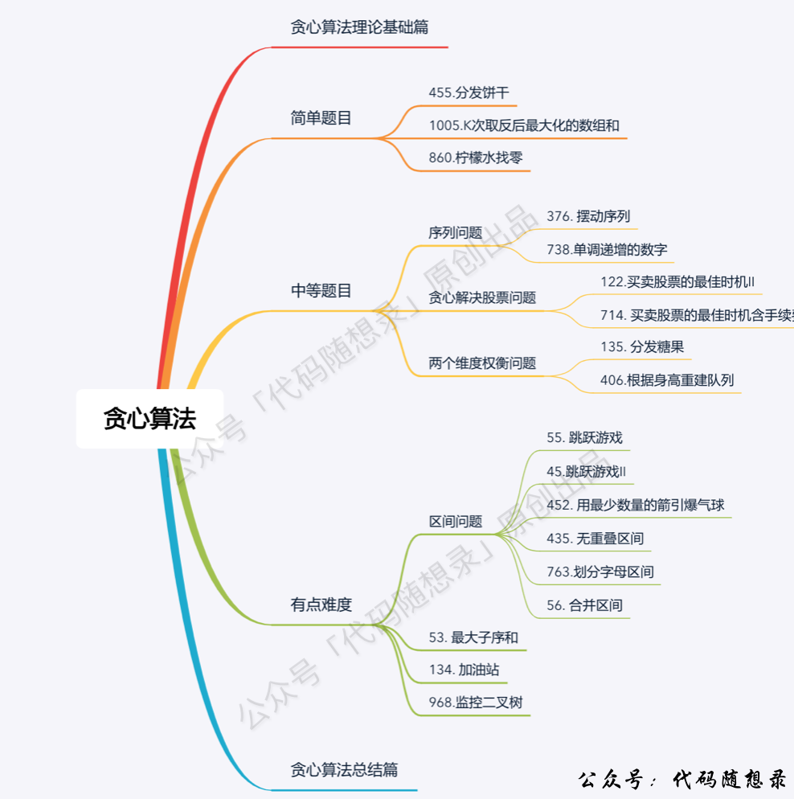

> 原文链接: https://leetcode-cn.com/problems/non-overlapping-intervals


## 英文原文
<div><p>Given an array of intervals <code>intervals</code> where <code>intervals[i] = [start<sub>i</sub>, end<sub>i</sub>]</code>, return <em>the minimum number of intervals you need to remove to make the rest of the intervals non-overlapping</em>.</p>

<p>&nbsp;</p>
<p><strong>Example 1:</strong></p>

<pre>
<strong>Input:</strong> intervals = [[1,2],[2,3],[3,4],[1,3]]
<strong>Output:</strong> 1
<strong>Explanation:</strong> [1,3] can be removed and the rest of the intervals are non-overlapping.
</pre>

<p><strong>Example 2:</strong></p>

<pre>
<strong>Input:</strong> intervals = [[1,2],[1,2],[1,2]]
<strong>Output:</strong> 2
<strong>Explanation:</strong> You need to remove two [1,2] to make the rest of the intervals non-overlapping.
</pre>

<p><strong>Example 3:</strong></p>

<pre>
<strong>Input:</strong> intervals = [[1,2],[2,3]]
<strong>Output:</strong> 0
<strong>Explanation:</strong> You don&#39;t need to remove any of the intervals since they&#39;re already non-overlapping.
</pre>

<p>&nbsp;</p>
<p><strong>Constraints:</strong></p>

<ul>
	<li><code>1 &lt;= intervals.length &lt;= 10<sup>5</sup></code></li>
	<li><code>intervals[i].length == 2</code></li>
	<li><code>-5 * 10<sup>4</sup> &lt;= start<sub>i</sub> &lt; end<sub>i</sub> &lt;= 5 * 10<sup>4</sup></code></li>
</ul>
</div>

## 中文题目
<div><p>给定一个区间的集合，找到需要移除区间的最小数量，使剩余区间互不重叠。</p>

<p><strong>注意:</strong></p>

<ol>
	<li>可以认为区间的终点总是大于它的起点。</li>
	<li>区间 [1,2] 和 [2,3] 的边界相互&ldquo;接触&rdquo;，但没有相互重叠。</li>
</ol>

<p><strong>示例 1:</strong></p>

<pre>
<strong>输入:</strong> [ [1,2], [2,3], [3,4], [1,3] ]

<strong>输出:</strong> 1

<strong>解释:</strong> 移除 [1,3] 后，剩下的区间没有重叠。
</pre>

<p><strong>示例 2:</strong></p>

<pre>
<strong>输入:</strong> [ [1,2], [1,2], [1,2] ]

<strong>输出:</strong> 2

<strong>解释:</strong> 你需要移除两个 [1,2] 来使剩下的区间没有重叠。
</pre>

<p><strong>示例 3:</strong></p>

<pre>
<strong>输入:</strong> [ [1,2], [2,3] ]

<strong>输出:</strong> 0

<strong>解释:</strong> 你不需要移除任何区间，因为它们已经是无重叠的了。
</pre>
</div>

## 通过代码
<RecoDemo>
</RecoDemo>


## 高赞题解
 

**不少同学对贪心算法还处于朦胧状态，我特意录了一期视频，讲一讲[贪心算法理论基础](https://www.bilibili.com/video/BV1WK4y1R71x)**，这里详细介绍了我们做贪心算法的时候常遇到的问题，相信结合本篇题解，会对你学习贪心有所帮助。

## 本题思路  

**相信很多同学看到这道题目都冥冥之中感觉要排序，但是究竟是按照右边界排序，还是按照左边界排序呢？**

这其实是一个难点！

按照右边界排序，就要从左向右遍历，因为右边界越小越好，只要右边界越小，留给下一个区间的空间就越大，所以从左向右遍历，优先选右边界小的。

按照左边界排序，就要从右向左遍历，因为左边界数值越大越好（越靠右），这样就给前一个区间的空间就越大，所以可以从右向左遍历。

如果按照左边界排序，还从左向右遍历的话，其实也可以，逻辑会有所不同。

一些同学做这道题目可能真的去模拟去重复区间的行为，这是比较麻烦的，还要去删除区间。

题目只是要求移除区间的个数，没有必要去真实的模拟删除区间！

**我来按照右边界排序，从左向右记录非交叉区间的个数。最后用区间总数减去非交叉区间的个数就是需要移除的区间个数了**。

此时问题就是要求非交叉区间的最大个数。

右边界排序之后，局部最优：优先选右边界小的区间，所以从左向右遍历，留给下一个区间的空间大一些，从而尽量避免交叉。全局最优：选取最多的非交叉区间。

局部最优推出全局最优，试试贪心！

这里记录非交叉区间的个数还是有技巧的，如图：


区间，1，2，3，4，5，6都按照右边界排好序。

每次取非交叉区间的时候，都是可右边界最小的来做分割点（这样留给下一个区间的空间就越大），所以第一条分割线就是区间1结束的位置。

接下来就是找大于区间1结束位置的区间，是从区间4开始。**那有同学问了为什么不从区间5开始？别忘已经是按照右边界排序的了**。

区间4结束之后，在找到区间6，所以一共记录非交叉区间的个数是三个。

总共区间个数为6，减去非交叉区间的个数3。移除区间的最小数量就是3。

C++代码如下：

```
class Solution {
public:
    // 按照区间右边界排序
    static bool cmp (const vector<int>& a, const vector<int>& b) {
        return a[1] < b[1];
    }
    int eraseOverlapIntervals(vector<vector<int>>& intervals) {
        if (intervals.size() == 0) return 0;
        sort(intervals.begin(), intervals.end(), cmp);
        int count = 1; // 记录非交叉区间的个数
        int end = intervals[0][1]; // 记录区间分割点
        for (int i = 1; i < intervals.size(); i++) {
            if (end <= intervals[i][0]) {
                end = intervals[i][1];
                count++;
            }
        }
        return intervals.size() - count;
    }
};
```
* 时间复杂度：O(nlogn) ，有一个快排
* 空间复杂度：O(1)

大家此时会发现如此复杂的一个问题，代码实现却这么简单！

## 总结

本题我认为难度级别可以算是hard级别的！

总结如下难点：

* 难点一：一看题就有感觉需要排序，但究竟怎么排序，按左边界排还是右边界排。
* 难点二：排完序之后如何遍历，如果没有分析好遍历顺序，那么排序就没有意义了。
* 难点三：直接求重复的区间是复杂的，转而求最大非重复区间个数。
* 难点四：求最大非重复区间个数时，需要一个分割点来做标记。

**这四个难点都不好想，但任何一个没想到位，这道题就解不了**。

一些录友可能看网上的题解代码很简单，照葫芦画瓢稀里糊涂的就过了，但是其题解可能并没有把问题难点讲清楚，然后自己再没有钻研的话，那么一道贪心经典区间问题就这么浪费掉了。

贪心就是这样，代码有时候很简单（不是指代码短，而是逻辑简单），但想法是真的难！

这和动态规划还不一样，动规的代码有个递推公式，可能就看不懂了，而贪心往往是直白的代码，但想法读不懂，哈哈。

**所以我把本题的难点也一一列出，帮大家不仅代码看的懂，想法也理解的透彻！**

## 补充

本题其实和[452.用最少数量的箭引爆气球](https://programmercarl.com/0452.用最少数量的箭引爆气球.html)非常像，弓箭的数量就相当于是非交叉区间的数量，只要把弓箭那道题目代码里射爆气球的判断条件加个等号（认为[0，1][1，2]不是相邻区间），然后用总区间数减去弓箭数量 就是要移除的区间数量了。

把[452.用最少数量的箭引爆气球](https://programmercarl.com/0452.用最少数量的箭引爆气球.html)代码稍做修改，就可以AC本题。

```CPP
class Solution {
public:
    // 按照区间右边界排序
    static bool cmp (const vector<int>& a, const vector<int>& b) {
        return a[1] < b[1];
    }
    int eraseOverlapIntervals(vector<vector<int>>& intervals) {
        if (intervals.size() == 0) return 0;
        sort(intervals.begin(), intervals.end(), cmp);

        int result = 1; // points 不为空至少需要一支箭
        for (int i = 1; i < intervals.size(); i++) {
            if (intervals[i][0] >= intervals[i - 1][1]) {
                result++; // 需要一支箭
            }
            else {  // 气球i和气球i-1挨着
                intervals[i][1] = min(intervals[i - 1][1], intervals[i][1]); // 更新重叠气球最小右边界
            }
        }
        return intervals.size() - result;
    }
};
```

这里按照 左区间遍历，或者按照右边界遍历，都可以AC，具体原因我还没有仔细看，后面有空再补充。
```CPP
class Solution {
public:
    // 按照区间左边界排序
    static bool cmp (const vector<int>& a, const vector<int>& b) {
        return a[0] < b[0];
    }
    int eraseOverlapIntervals(vector<vector<int>>& intervals) {
        if (intervals.size() == 0) return 0;
        sort(intervals.begin(), intervals.end(), cmp);

        int result = 1; // points 不为空至少需要一支箭
        for (int i = 1; i < intervals.size(); i++) {
            if (intervals[i][0] >= intervals[i - 1][1]) {
                result++; // 需要一支箭
            }
            else {  // 气球i和气球i-1挨着
                intervals[i][1] = min(intervals[i - 1][1], intervals[i][1]); // 更新重叠气球最小右边界
            }
        }
        return intervals.size() - result;
    }
};

```

## 其他语言版本


Java：
```java
class Solution {
    public int eraseOverlapIntervals(int[][] intervals) {
        if (intervals.length < 2) return 0;

        Arrays.sort(intervals, new Comparator<int[]>() {
            @Override
            public int compare(int[] o1, int[] o2) {
                if (o1[1] != o2[1]) {
                    return Integer.compare(o1[1],o2[1]);
                } else {
                    return Integer.compare(o1[0],o2[0]);
                }
            }
        });

        int count = 1;
        int edge = intervals[0][1];
        for (int i = 1; i < intervals.length; i++) {
            if (edge <= intervals[i][0]){
                count ++; //non overlap + 1
                edge = intervals[i][1];
            }
        }
        return intervals.length - count;
    }
}
```

Java:
按左边排序，不管右边顺序。相交的时候取最小的右边。
```java
class Solution {
    public int eraseOverlapIntervals(int[][] intervals) {

        Arrays.sort(intervals,(a,b)->{
            return Integer.compare(a[0],b[0]);
        });
        int remove = 0;
        int pre = intervals[0][1];
        for(int i=1;i<intervals.length;i++){
            if(pre>intervals[i][0]) {
                remove++;
                pre = Math.min(pre,intervals[i][1]);
            }
            else pre = intervals[i][1];
        }
        return remove;
    }
}
```

Python：
```python
class Solution:
    def eraseOverlapIntervals(self, intervals: List[List[int]]) -> int:
        if len(intervals) == 0: return 0
        intervals.sort(key=lambda x: x[1])
        count = 1 # 记录非交叉区间的个数
        end = intervals[0][1] # 记录区间分割点
        for i in range(1, len(intervals)):
            if end <= intervals[i][0]:
                count += 1
                end = intervals[i][1]
        return len(intervals) - count
```

Go：
```golang
func eraseOverlapIntervals(intervals [][]int) int {
    var flag int
    //先排序
    sort.Slice(intervals,func(i,j int)bool{
        return intervals[i][0]<intervals[j][0]
    })
    fmt.Println(intervals)
    for i:=1;i<len(intervals);i++{
        if intervals[i-1][1]>intervals[i][0]{
            flag++
            intervals[i][1]=min(intervals[i-1][1],intervals[i][1])//由于是先排序的，所以，第一位是递增顺序，故只需要将临近两个元素的第二个值最小值更新到该元素的第二个值即可作之后的判断
        }
    }
    return flag
}
func min(a,b int)int{
    if a>b{
        return b
    }
    return a
}
```
Javascript:
- 按右边界排序
```Javascript
var eraseOverlapIntervals = function(intervals) {
    intervals.sort((a, b) => {
        return a[1] - b[1]
    })

    let count = 1
    let end = intervals[0][1]

    for(let i = 1; i < intervals.length; i++) {
        let interval = intervals[i]
        if(interval[0] >= end) {
            end = interval[1]
            count += 1
        }
    }
    
    return intervals.length - count
};
```
- 按左边界排序
```js
var eraseOverlapIntervals = function(intervals) {
    // 按照左边界升序排列
    intervals.sort((a, b) => a[0] - b[0])
    let count = 1
    let end = intervals[intervals.length - 1][0]
    // 倒序遍历，对单个区间来说，左边界越大越好，因为给前面区间的空间越大
    for(let i = intervals.length - 2; i >= 0; i--) {
        if(intervals[i][1] <= end) {
            count++
            end = intervals[i][0]
        }
    }
    // count 记录的是最大非重复区间的个数
    return intervals.length - count
}
```


# 贪心算法力扣题目总结

按照如下顺序刷力扣上的题目，相信会帮你在学习贪心算法的路上少走很多弯路。以下每道题目在力扣题解区都有「代码随想录」的题解。

{:width="450px"}{:align="center"}


------------

**大家好，我是程序员Carl，点击[我的头像](https://programmercarl.com)**，查看力扣详细刷题攻略，你会发现相见恨晚！

**如果感觉题解对你有帮助，不要吝啬给一个👍吧！**


## 统计信息
| 通过次数 | 提交次数 | AC比率 |
| :------: | :------: | :------: |
|    106261    |    209741    |   50.7%   |

## 提交历史
| 提交时间 | 提交结果 | 执行时间 |  内存消耗  | 语言 |
| :------: | :------: | :------: | :--------: | :--------: |


## 相似题目
|                             题目                             | 难度 |
| :----------------------------------------------------------: | :---------: |
| [用最少数量的箭引爆气球](https://leetcode-cn.com/problems/minimum-number-of-arrows-to-burst-balloons/) | 中等|
