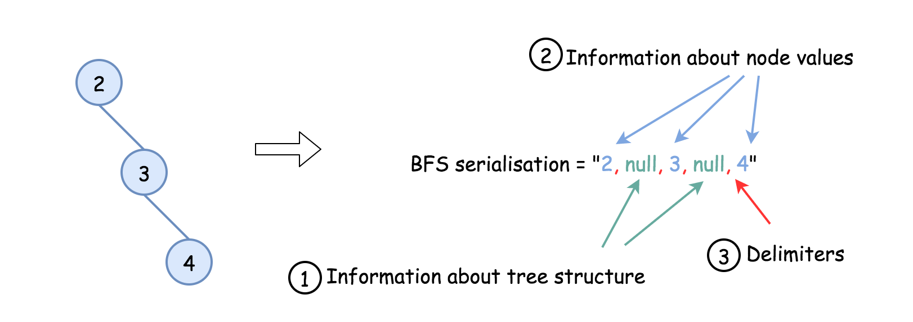
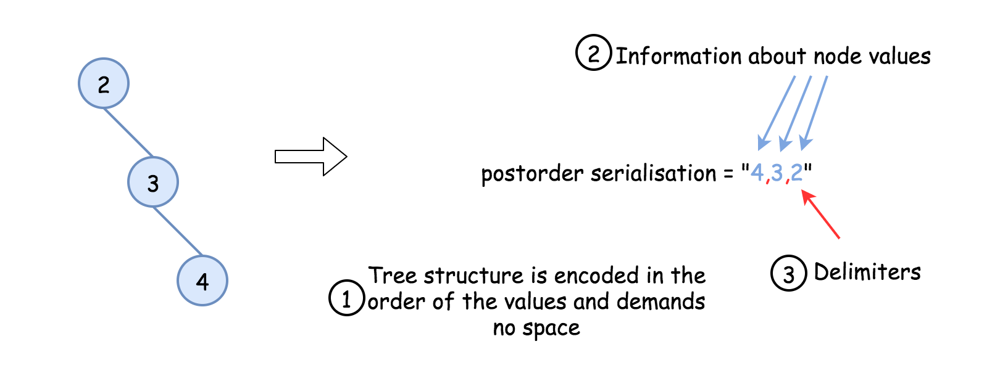
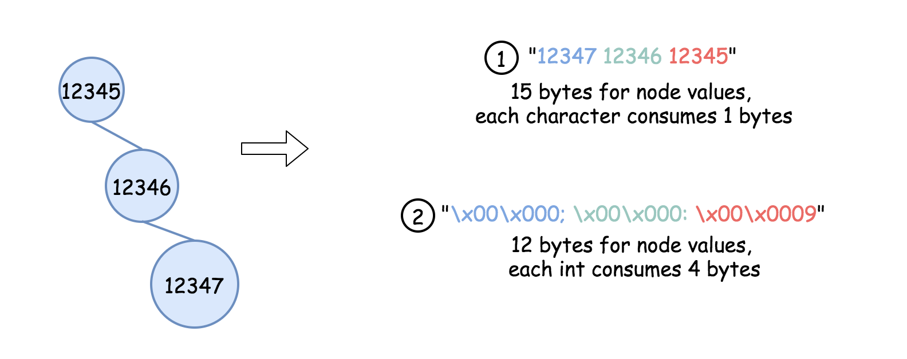
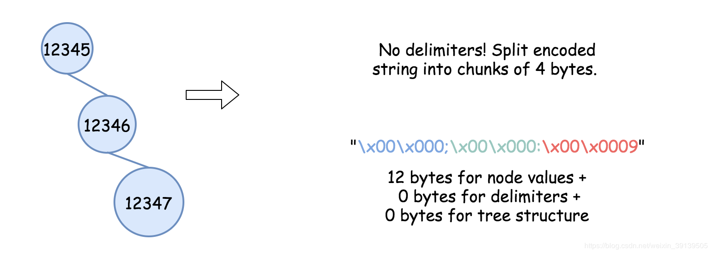

> 原文链接: https://leetcode-cn.com/problems/serialize-and-deserialize-bst


## 英文原文
<div><p>Serialization is converting a data structure or object into a sequence of bits so that it can be stored in a file or memory buffer, or transmitted across a network connection link to be reconstructed later in the same or another computer environment.</p>

<p>Design an algorithm to serialize and deserialize a <b>binary search tree</b>. There is no restriction on how your serialization/deserialization algorithm should work. You need to ensure that a binary search tree can be serialized to a string, and this string can be deserialized to the original tree structure.</p>

<p><b>The encoded string should be as compact as possible.</b></p>

<p>&nbsp;</p>
<p><strong>Example 1:</strong></p>
<pre><strong>Input:</strong> root = [2,1,3]
<strong>Output:</strong> [2,1,3]
</pre><p><strong>Example 2:</strong></p>
<pre><strong>Input:</strong> root = []
<strong>Output:</strong> []
</pre>
<p>&nbsp;</p>
<p><strong>Constraints:</strong></p>

<ul>
	<li>The number of nodes in the tree is in the range <code>[0, 10<sup>4</sup>]</code>.</li>
	<li><code>0 &lt;= Node.val &lt;= 10<sup>4</sup></code></li>
	<li>The input tree is <strong>guaranteed</strong> to be a binary search tree.</li>
</ul>
</div>

## 中文题目
<div><p>序列化是将数据结构或对象转换为一系列位的过程，以便它可以存储在文件或内存缓冲区中，或通过网络连接链路传输，以便稍后在同一个或另一个计算机环境中重建。</p>

<p>设计一个算法来序列化和反序列化<strong> 二叉搜索树</strong> 。 对序列化/反序列化算法的工作方式没有限制。 您只需确保二叉搜索树可以序列化为字符串，并且可以将该字符串反序列化为最初的二叉搜索树。</p>

<p><strong>编码的字符串应尽可能紧凑。</strong></p>

<p> </p>

<p><strong>示例 1：</strong></p>

<pre>
<strong>输入：</strong>root = [2,1,3]
<strong>输出：</strong>[2,1,3]
</pre>

<p><strong>示例 2：</strong></p>

<pre>
<strong>输入：</strong>root = []
<strong>输出：</strong>[]
</pre>

<p> </p>

<p><strong>提示：</strong></p>

<ul>
	<li>树中节点数范围是 <code>[0, 10<sup>4</sup>]</code></li>
	<li><code>0 <= Node.val <= 10<sup>4</sup></code></li>
	<li>题目数据 <strong>保证</strong> 输入的树是一棵二叉搜索树。</li>
</ul>

<p> </p>

<p><strong>注意</strong>：不要使用类成员/全局/静态变量来存储状态。 你的序列化和反序列化算法应该是无状态的。</p>
</div>

## 通过代码
<RecoDemo>
</RecoDemo>


## 官方题解
####  序列化一个二叉树表示：
- 对树的结构编码
- 对树节点的值编码
- 利用分隔符分隔字符串中的值

{:width=500}
{:align=center}


####  方法一：后序遍历优化树结构的空间
**算法：**

二叉搜索树能只够通过前序序列或后序序列构造，是因为以下两个因素：
- [二叉树可以通过前序序列或后序序列和中序序列构造](https://leetcode.com/articles/construct-binary-tree-from-postorder-and-inorder-t/)。
- [二叉搜索树的中序序列是递增排序的序列，`inorder = sorted(preorder)`](https://leetcode.com/articles/delete-node-in-a-bst/)。

说明我们只需要直到了前序序列或后序序列相当于我们也知道了中序序列，可以通过排序获得。

序列化可以很容易的实现，但是对于反序列化我们选择后续遍历会更好。
{:width=500}
{:align=center}

```python [solution1-Python]
class Codec:
    def serialize(self, root):
        """
        Encodes a tree to a single string.
        """
        def postorder(root):
            return postorder(root.left) + postorder(root.right) + [root.val] if root else []
        return ' '.join(map(str, postorder(root)))

    def deserialize(self, data):
        """
        Decodes your encoded data to tree.
        """
        def helper(lower = float('-inf'), upper = float('inf')):
            if not data or data[-1] < lower or data[-1] > upper:
                return None
            
            val = data.pop()
            root = TreeNode(val)
            root.right = helper(val, upper)
            root.left = helper(lower, val)
            return root
        
        data = [int(x) for x in data.split(' ') if x]
        return helper()
```

```java [solution1-Java]public class Codec {
    public StringBuilder postorder(TreeNode root, StringBuilder sb) {
        if (root == null)
            return sb;
        postorder(root.left, sb);
        postorder(root.right, sb);
        sb.append(root.val);
        sb.append(' ');
        return sb;
    }

    // Encodes a tree to a single string.
    public String serialize(TreeNode root) {
        StringBuilder sb = postorder(root, new StringBuilder());
        if (sb.length() > 0)
            sb.deleteCharAt(sb.length() - 1);
        return sb.toString();
    }

    public TreeNode helper(Integer lower, Integer upper, ArrayDeque<Integer> nums) {
        if (nums.isEmpty())
            return null;
        int val = nums.getLast();
        if (val < lower || val > upper)
            return null;

        nums.removeLast();
        TreeNode root = new TreeNode(val);
        root.right = helper(val, upper, nums);
        root.left = helper(lower, val, nums);
        return root;
    }

    // Decodes your encoded data to tree.
    public TreeNode deserialize(String data) {
        if (data.isEmpty())
            return null;
        ArrayDeque<Integer> nums = new ArrayDeque<Integer>();
        for (String s : data.split("\\s+"))
            nums.add(Integer.valueOf(s));
        return helper(Integer.MIN_VALUE, Integer.MAX_VALUE, nums);
    }
}
```

**复杂度分析**

* 时间复杂度：序列化和反序列都使用了 $\mathcal{O}(N)$ 的时间。
* 空间复杂度：$\mathcal{O}(N)$，我们存储了整个树。编码序列：需要 $(N - 1)$ 个分隔符和 $N$ 个节点的值。树的结构和顺序不占用空间。


####  方法二：将节点值转换为四个字节的字符串优化空间
**算法：**
- 方法一在若节点值较小时消耗的空间较小，若节点值较大则会消耗较大的空间。
- 举个例子，树 `[2,null,3,null,4]` 被编码为 `"4 3 2"`，使用了 `5` 个字节存放节点值和分隔符。节点值和分隔符各需要一个字节。这种情况下消耗的空间较小。
- 若树是 `[12345,null,12346,null,12347]`，则它被编码为 `"12347 12346 12345"`，消耗了 `17` 字节的空间存放 `3` 个整数和 `2` 个分隔符。仅仅存放节点的值就消耗了 `15` 字节。然而存放一个整数只需要 `4` 个字节就够了，所以 `12` 个字节就足够存放 `3` 个整数。所以我们可以优化节点值所使用的空间。
- 将节点值转换为四个字节字符串。
- 
{:width=500}
{:align=center}

```python [solution2-Python]
class Codec:
    def postorder(self, root):
        return self.postorder(root.left) + self.postorder(root.right) + [root.val] if root else []
        
    def int_to_str(self, x):
        """
        Encodes integer to bytes string.
        """
        bytes = [chr(x >> (i * 8) & 0xff) for i in range(4)]
        bytes.reverse()
        bytes_str = ''.join(bytes)
        return bytes_str
        
    def serialize(self, root):
        """
        Encodes a tree to a single string.
        """
        lst = self.postorder(root)
        lst = [self.int_to_str(x) for x in lst]
        return 'ç'.join(map(str, lst))
    
    def str_to_int(self, bytes_str):
        """
        Decodes bytes string to integer.
        """
        result = 0
        for ch in bytes_str:
            result = result * 256 + ord(ch)
        return result
        
    def deserialize(self, data):
        """
        Decodes your encoded data to tree.
        """
        def helper(lower = float('-inf'), upper = float('inf')):
            if not data or data[-1] < lower or data[-1] > upper:
                return None
            
            val = data.pop()
            root = TreeNode(val)
            root.right = helper(val, upper)
            root.left = helper(lower, val)
            return root
        
        data = [self.str_to_int(x) for x in data.split('ç') if x]
        return helper() 
```

**复杂度分析**

* 时间复杂度：序列化和反序列化都使用了 $\mathcal{O}(N)$ 的时间。
* 空间复杂度：$\mathcal{O}(N)$，我们存储了整个树。编码序列：分隔符需要 $2(N - 1)$ 字节和 节点值需要 $4 N$ 字节。树的结构和顺序不占用空间。

####  方法三：不使用分隔符
**算法：**
- 方法二可以在不使用分隔符的情况下完成工作。
- 因为所有节点的值为 `4` 个字节，因此我们可以把编码序列 `4` 个字节当作一个块，将每个块转换为整数，因此可以不使用分隔符。

{:width=500}
{:align=center}

```python [solution3-Python]
class Codec:
    def postorder(self, root):
        return self.postorder(root.left) + self.postorder(root.right) + [root.val] if root else []
        
    def int_to_str(self, x):
        """
        Encodes integer to bytes string
        """
        bytes = [chr(x >> (i * 8) & 0xff) for i in range(4)]
        bytes.reverse()
        bytes_str = ''.join(bytes)
        return bytes_str
        
    def serialize(self, root):
        """
        Encodes a tree to a single string.
        """
        lst = [self.int_to_str(x) for x in self.postorder(root)]
        return ''.join(map(str, lst))
    
    def str_to_int(self, bytes_str):
        """
        Decodes bytes string to integer.
        """
        result = 0
        for ch in bytes_str:
            result = result * 256 + ord(ch)
        return result
        
    def deserialize(self, data):
        """
        Decodes your encoded data to tree.
        """
        def helper(lower = float('-inf'), upper = float('inf')):
            if not data or data[-1] < lower or data[-1] > upper:
                return None
            
            val = data.pop()
            root = TreeNode(val)
            root.right = helper(val, upper)
            root.left = helper(lower, val)
            return root
        
        n = len(data)
        # split data string into chunks of 4 bytes
        # and convert each chunk to int
        data = [self.str_to_int(data[4 * i : 4 * i + 4]) for i in range(n // 4)]
        return helper() 
```

```java [solution3-Java]
public class Codec {
  // Encodes a tree to a list.
  public void postorder(TreeNode root, StringBuilder sb) {
    if (root == null) return;
    postorder(root.left, sb);
    postorder(root.right, sb);
    sb.append(intToString(root.val));
  }

  // Encodes integer to bytes string
  public String intToString(int x) {
    char[] bytes = new char[4];
    for(int i = 3; i > -1; --i) {
      bytes[3 - i] = (char) (x >> (i * 8) & 0xff);
    }
    return new String(bytes);
  }

  // Encodes a tree to a single string.
  public String serialize(TreeNode root) {
    StringBuilder sb = new StringBuilder();
    postorder(root, sb);
    return sb.toString();
  }

  // Decodes list to tree.
  public TreeNode helper(Integer lower, Integer upper, ArrayDeque<Integer> nums) {
    if (nums.isEmpty()) return null;
    int val = nums.getLast();
    if (val < lower || val > upper) return null;

    nums.removeLast();
    TreeNode root = new TreeNode(val);
    root.right = helper(val, upper, nums);
    root.left = helper(lower, val, nums);
    return root;
  }

  // Decodes bytes string to integer
  public int stringToInt(String bytesStr) {
    int result = 0;
    for(char b : bytesStr.toCharArray()) {
      result = (result << 8) + (int)b;
    }
    return result;
  }

  // Decodes your encoded data to tree.
  public TreeNode deserialize(String data) {
    ArrayDeque<Integer> nums = new ArrayDeque<Integer>();
    int n = data.length();
    for(int i = 0; i < (int)(n / 4); ++i) {
      nums.add(stringToInt(data.substring(4 * i, 4 * i + 4)));
    }

    return helper(Integer.MIN_VALUE, Integer.MAX_VALUE, nums);
  }
}
```

**复杂度分析**

* 时间复杂度：序列化和反序列化都使用了 $\mathcal{O}(N)$ 的时间。
* 空间复杂度：$\mathcal{O}(N)$，存储了整个树。编码序列：没有分隔符，没有使用额外的空间，仅仅使用了每 $4 N$ 字节存放节点值。

## 统计信息
| 通过次数 | 提交次数 | AC比率 |
| :------: | :------: | :------: |
|    16510    |    29444    |   56.1%   |

## 提交历史
| 提交时间 | 提交结果 | 执行时间 |  内存消耗  | 语言 |
| :------: | :------: | :------: | :--------: | :--------: |


## 相似题目
|                             题目                             | 难度 |
| :----------------------------------------------------------: | :---------: |
| [二叉树的序列化与反序列化](https://leetcode-cn.com/problems/serialize-and-deserialize-binary-tree/) | 困难|
| [寻找重复的子树](https://leetcode-cn.com/problems/find-duplicate-subtrees/) | 中等|
| [序列化和反序列化 N 叉树](https://leetcode-cn.com/problems/serialize-and-deserialize-n-ary-tree/) | 困难|
