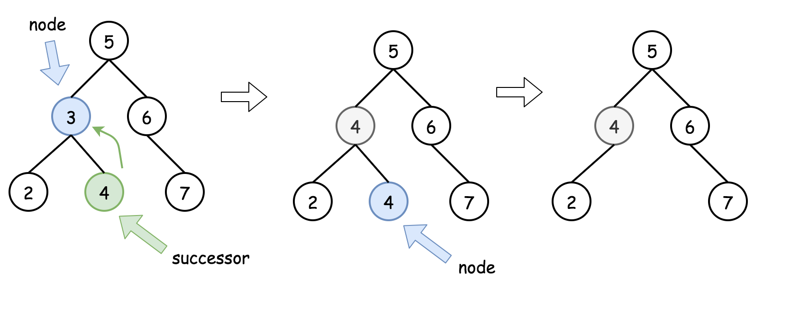

> 原文链接: https://leetcode-cn.com/problems/delete-node-in-a-bst


## 英文原文
<div><p>Given a root node reference of a BST and a key, delete the node with the given key in the BST. Return the root node reference (possibly updated) of the BST.</p>

<p>Basically, the deletion can be divided into two stages:</p>

<ol>
	<li>Search for a node to remove.</li>
	<li>If the node is found, delete the node.</li>
</ol>

<p>&nbsp;</p>
<p><strong>Example 1:</strong></p>

<pre>
<strong>Input:</strong> root = [5,3,6,2,4,null,7], key = 3
<strong>Output:</strong> [5,4,6,2,null,null,7]
<strong>Explanation:</strong> Given key to delete is 3. So we find the node with value 3 and delete it.
One valid answer is [5,4,6,2,null,null,7], shown in the above BST.
Please notice that another valid answer is [5,2,6,null,4,null,7] and it&#39;s also accepted.

</pre>

<p><strong>Example 2:</strong></p>

<pre>
<strong>Input:</strong> root = [5,3,6,2,4,null,7], key = 0
<strong>Output:</strong> [5,3,6,2,4,null,7]
<strong>Explanation:</strong> The tree does not contain a node with value = 0.
</pre>

<p><strong>Example 3:</strong></p>

<pre>
<strong>Input:</strong> root = [], key = 0
<strong>Output:</strong> []
</pre>

<p>&nbsp;</p>
<p><strong>Constraints:</strong></p>

<ul>
	<li>The number of nodes in the tree is in the range <code>[0, 10<sup>4</sup>]</code>.</li>
	<li><code>-10<sup>5</sup> &lt;= Node.val &lt;= 10<sup>5</sup></code></li>
	<li>Each node has a <strong>unique</strong> value.</li>
	<li><code>root</code> is a valid binary search tree.</li>
	<li><code>-10<sup>5</sup> &lt;= key &lt;= 10<sup>5</sup></code></li>
</ul>

<p>&nbsp;</p>
<p><strong>Follow up:</strong> Could you solve it with time complexity <code>O(height of tree)</code>?</p>
</div>

## 中文题目
<div><p>给定一个二叉搜索树的根节点 <strong>root </strong>和一个值 <strong>key</strong>，删除二叉搜索树中的&nbsp;<strong>key&nbsp;</strong>对应的节点，并保证二叉搜索树的性质不变。返回二叉搜索树（有可能被更新）的根节点的引用。</p>

<p>一般来说，删除节点可分为两个步骤：</p>

<ol>
	<li>首先找到需要删除的节点；</li>
	<li>如果找到了，删除它。</li>
</ol>

<p>&nbsp;</p>

<p><strong>示例 1:</strong></p>

<p></p>

<pre>
<strong>输入：</strong>root = [5,3,6,2,4,null,7], key = 3
<strong>输出：</strong>[5,4,6,2,null,null,7]
<strong>解释：</strong>给定需要删除的节点值是 3，所以我们首先找到 3 这个节点，然后删除它。
一个正确的答案是 [5,4,6,2,null,null,7], 如下图所示。
另一个正确答案是 [5,2,6,null,4,null,7]。


</pre>

<p><strong>示例 2:</strong></p>

<pre>
<strong>输入:</strong> root = [5,3,6,2,4,null,7], key = 0
<strong>输出:</strong> [5,3,6,2,4,null,7]
<strong>解释:</strong> 二叉树不包含值为 0 的节点
</pre>

<p><strong>示例 3:</strong></p>

<pre>
<strong>输入:</strong> root = [], key = 0
<strong>输出:</strong> []</pre>

<p>&nbsp;</p>

<p><strong>提示:</strong></p>

<ul>
	<li>节点数的范围&nbsp;<code>[0, 10<sup>4</sup>]</code>.</li>
	<li><code>-10<sup>5</sup>&nbsp;&lt;= Node.val &lt;= 10<sup>5</sup></code></li>
	<li>节点值唯一</li>
	<li><code>root</code>&nbsp;是合法的二叉搜索树</li>
	<li><code>-10<sup>5</sup>&nbsp;&lt;= key &lt;= 10<sup>5</sup></code></li>
</ul>

<p>&nbsp;</p>

<p><strong>进阶：</strong> 要求算法时间复杂度为&nbsp;O(h)，h 为树的高度。</p>
</div>

## 通过代码
<RecoDemo>
</RecoDemo>


## 官方题解
####  二叉搜索树的三个特性：
这些性质最好在面试之前了解清楚：
- 二叉搜索树的中序遍历的序列是递增排序的序列。中序遍历的遍历次序：`Left -> Node -> Right`。

```java [Inorder_traversal-Java]
public LinkedList<Integer> inorder(TreeNode root, LinkedList<Integer> arr) {
  if (root == null) return arr;
  inorder(root.left, arr);
  arr.add(root.val);
  inorder(root.right, arr);
  return arr;
} 
```

```python [Inorder_traversal-Python]
def inorder(root):
    return inorder(root.left) + [root.val] + inorder(root.right) if root else []
```
{:width=500}

- `Successor` 代表的是中序遍历序列的下一个节点。即比当前节点大的最小节点，简称后继节点。 先取当前节点的右节点，然后一直取该节点的左节点，直到左节点为空，则最后指向的节点为后继节点。

```java [Successor-Java]
public int successor(TreeNode root) {
  root = root.right;
  while (root.left != null) root = root.left;
  return root;
} 
```

```python [Successor-Python]
def successor(root):
    root = root.right
    while root.left:
        root = root.left
    return root
```
- `Predecessor` 代表的是中序遍历序列的前一个节点。即比当前节点小的最大节点，简称前驱节点。先取当前节点的左节点，然后取该节点的右节点，直到右节点为空，则最后指向的节点为前驱节点。

```java [Predecessor-Java]
public int predecessor(TreeNode root) {
  root = root.left;
  while (root.right != null) root = root.right;
  return root;
} 
```

```python [Predecessor-Python]
def predecessor(root):
    root = root.left
    while root.right:
        root = root.right
    return root
```
{:width=500}


####  方法：递归
这里有三种可能的情况：
- 要删除的节点为叶子节点，可以直接删除。

{:width=500}
- 要删除的节点不是叶子节点且拥有右节点，则该节点可以由该节点的后继节点进行替代，该后继节点位于右子树中较低的位置。然后可以从后继节点的位置递归向下操作以删除后继节点。

{:width=500}
- 要删除的节点不是叶子节点，且没有右节点但是有左节点。这意味着它的后继节点在它的上面，但是我们并不想返回。我们可以使用它的前驱节点进行替代，然后再递归的向下删除前驱节点。

{:width=500}


**算法：**
- 如果 `key > root.val`，说明要删除的节点在右子树，`root.right = deleteNode(root.right, key)`。
- 如果 `key < root.val`，说明要删除的节点在左子树，`root.left = deleteNode(root.left, key)`。
- 如果 `key == root.val`，则该节点就是我们要删除的节点，则：
	- 如果该节点是叶子节点，则直接删除它：`root = null`。
	- 如果该节点不是叶子节点且有右节点，则用它的后继节点的值替代 `root.val = successor.val`，然后删除后继节点。
	- 如果该节点不是叶子节点且只有左节点，则用它的前驱节点的值替代 `root.val = predecessor.val`，然后删除前驱节点。
- 返回 `root`。 

{:width=500}

```java [solution1-Java]
class Solution {
  /*
  One step right and then always left
  */
  public int successor(TreeNode root) {
    root = root.right;
    while (root.left != null) root = root.left;
    return root.val;
  }

  /*
  One step left and then always right
  */
  public int predecessor(TreeNode root) {
    root = root.left;
    while (root.right != null) root = root.right;
    return root.val;
  }

  public TreeNode deleteNode(TreeNode root, int key) {
    if (root == null) return null;

    // delete from the right subtree
    if (key > root.val) root.right = deleteNode(root.right, key);
    // delete from the left subtree
    else if (key < root.val) root.left = deleteNode(root.left, key);
    // delete the current node
    else {
      // the node is a leaf
      if (root.left == null && root.right == null) root = null;
      // the node is not a leaf and has a right child
      else if (root.right != null) {
        root.val = successor(root);
        root.right = deleteNode(root.right, root.val);
      }
      // the node is not a leaf, has no right child, and has a left child    
      else {
        root.val = predecessor(root);
        root.left = deleteNode(root.left, root.val);
      }
    }
    return root;
  }
}
```

```python [solution1-Python]
class Solution:
    def successor(self, root):
        """
        One step right and then always left
        """
        root = root.right
        while root.left:
            root = root.left
        return root.val
    
    def predecessor(self, root):
        """
        One step left and then always right
        """
        root = root.left
        while root.right:
            root = root.right
        return root.val
        
    def deleteNode(self, root: TreeNode, key: int) -> TreeNode:
        if not root:
            return None
        
        # delete from the right subtree
        if key > root.val:
            root.right = self.deleteNode(root.right, key)
        # delete from the left subtree
        elif key < root.val:
            root.left = self.deleteNode(root.left, key)
        # delete the current node
        else:
            # the node is a leaf
            if not (root.left or root.right):
                root = None
            # the node is not a leaf and has a right child
            elif root.right:
                root.val = self.successor(root)
                root.right = self.deleteNode(root.right, root.val)
            # the node is not a leaf, has no right child, and has a left child    
            else:
                root.val = self.predecessor(root)
                root.left = self.deleteNode(root.left, root.val)
                        
        return root

```

**复杂度分析**

* 时间复杂度：$\mathcal{O}(\log N)$。在算法的执行过程中，我们一直在树上向左或向右移动。首先先用 $\mathcal{O}(H_1)$ 的时间找到要删除的节点，$H_1$ 值得是从根节点到要删除节点的高度。然后删除节点需要 $\mathcal{O}(H_2)$ 的时间，$H_2$ 指的是从要删除节点到替换节点的高度。由于 $\mathcal{O}(H_1 + H_2) = \mathcal{O}(H)$，$H$ 值得是树的高度，若树是一个平衡树则 $H$ = $\log N$。
* 空间复杂度：$\mathcal{O}(H)$，递归时堆栈使用的空间，$H$ 是树的高度。

## 统计信息
| 通过次数 | 提交次数 | AC比率 |
| :------: | :------: | :------: |
|    69181    |    141185    |   49.0%   |

## 提交历史
| 提交时间 | 提交结果 | 执行时间 |  内存消耗  | 语言 |
| :------: | :------: | :------: | :--------: | :--------: |


## 相似题目
|                             题目                             | 难度 |
| :----------------------------------------------------------: | :---------: |
| [拆分二叉搜索树](https://leetcode-cn.com/problems/split-bst/) | 中等|
