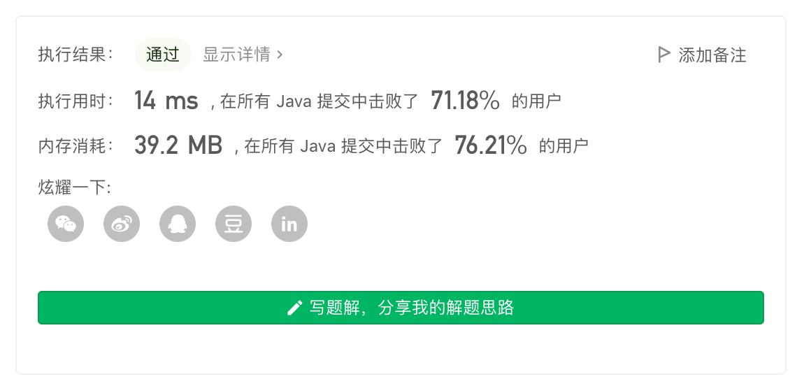
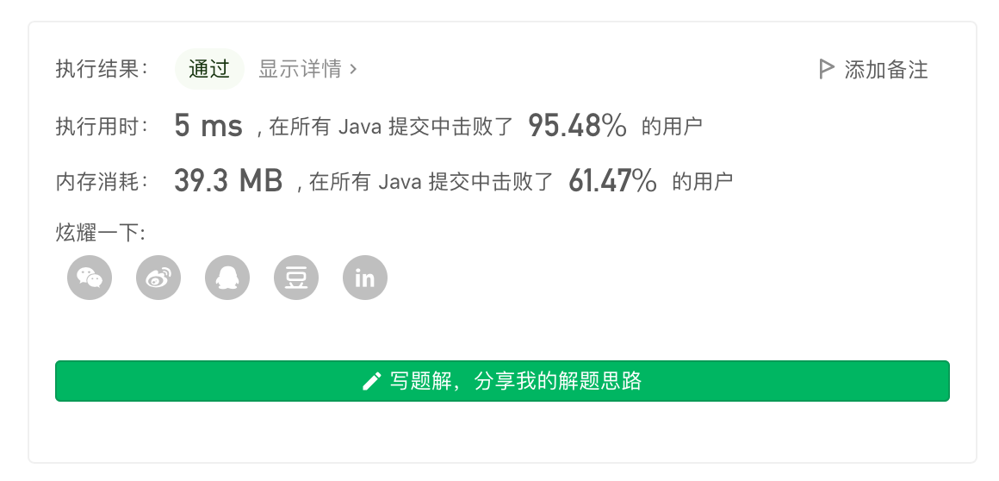

> 原文链接: https://leetcode-cn.com/problems/sort-characters-by-frequency


## 英文原文
<div><p>Given a string <code>s</code>, sort it in <strong>decreasing order</strong> based on the <strong>frequency</strong> of the characters. The <strong>frequency</strong> of a character is the number of times it appears in the string.</p>

<p>Return <em>the sorted string</em>. If there are multiple answers, return <em>any of them</em>.</p>

<p>&nbsp;</p>
<p><strong>Example 1:</strong></p>

<pre>
<strong>Input:</strong> s = &quot;tree&quot;
<strong>Output:</strong> &quot;eert&quot;
<strong>Explanation:</strong> &#39;e&#39; appears twice while &#39;r&#39; and &#39;t&#39; both appear once.
So &#39;e&#39; must appear before both &#39;r&#39; and &#39;t&#39;. Therefore &quot;eetr&quot; is also a valid answer.
</pre>

<p><strong>Example 2:</strong></p>

<pre>
<strong>Input:</strong> s = &quot;cccaaa&quot;
<strong>Output:</strong> &quot;aaaccc&quot;
<strong>Explanation:</strong> Both &#39;c&#39; and &#39;a&#39; appear three times, so both &quot;cccaaa&quot; and &quot;aaaccc&quot; are valid answers.
Note that &quot;cacaca&quot; is incorrect, as the same characters must be together.
</pre>

<p><strong>Example 3:</strong></p>

<pre>
<strong>Input:</strong> s = &quot;Aabb&quot;
<strong>Output:</strong> &quot;bbAa&quot;
<strong>Explanation:</strong> &quot;bbaA&quot; is also a valid answer, but &quot;Aabb&quot; is incorrect.
Note that &#39;A&#39; and &#39;a&#39; are treated as two different characters.
</pre>

<p>&nbsp;</p>
<p><strong>Constraints:</strong></p>

<ul>
	<li><code>1 &lt;= s.length &lt;= 5 * 10<sup>5</sup></code></li>
	<li><code>s</code> consists of uppercase and lowercase English letters and digits.</li>
</ul>
</div>

## 中文题目
<div><p>给定一个字符串，请将字符串里的字符按照出现的频率降序排列。</p>

<p><strong>示例 1:</strong></p>

<pre>
<strong>输入:</strong>
&quot;tree&quot;

<strong>输出:</strong>
&quot;eert&quot;

<strong>解释:
</strong>&#39;e&#39;出现两次，&#39;r&#39;和&#39;t&#39;都只出现一次。
因此&#39;e&#39;必须出现在&#39;r&#39;和&#39;t&#39;之前。此外，&quot;eetr&quot;也是一个有效的答案。
</pre>

<p><strong>示例 2:</strong></p>

<pre>
<strong>输入:</strong>
&quot;cccaaa&quot;

<strong>输出:</strong>
&quot;cccaaa&quot;

<strong>解释:
</strong>&#39;c&#39;和&#39;a&#39;都出现三次。此外，&quot;aaaccc&quot;也是有效的答案。
注意&quot;cacaca&quot;是不正确的，因为相同的字母必须放在一起。
</pre>

<p><strong>示例 3:</strong></p>

<pre>
<strong>输入:</strong>
&quot;Aabb&quot;

<strong>输出:</strong>
&quot;bbAa&quot;

<strong>解释:
</strong>此外，&quot;bbaA&quot;也是一个有效的答案，但&quot;Aabb&quot;是不正确的。
注意&#39;A&#39;和&#39;a&#39;被认为是两种不同的字符。
</pre>
</div>

## 通过代码
<RecoDemo>
</RecoDemo>


## 高赞题解
## 数据结构 + 模拟

这是一道考察数据结构运用的模拟题。

具体做法如下：

1. 先使用「哈希表」对词频进行统计；
2. 遍历统计好词频的哈希表，将每个键值对以 `{字符,词频}` 的形式存储到「优先队列（堆）」中。并规定「优先队列（堆）」排序逻辑为：
    * 如果 `词频` 不同，则按照 `词频` 倒序；
    * 如果 `词频` 相同，则根据 `字符字典序` 升序（由于本题采用 Special Judge 机制，这个排序策略随意调整也可以。但通常为了确保排序逻辑满足「全序关系」，这个地方可以写正写反，但理论上不能不写，否则不能确保每次排序结果相同）；
3. 从「优先队列（堆）」依次弹出，构造答案。



代码：
```Java []
class Solution {
    class Node {
        char c; 
        int v;
        Node(char _c, int _v) {
            c = _c; v = _v;
        }
    }
    public String frequencySort(String s) {
        char[] cs = s.toCharArray();
        Map<Character, Integer> map = new HashMap<>();
        for (char c : cs) {
            map.put(c, map.getOrDefault(c, 0) + 1);
        }
        PriorityQueue<Node> q = new PriorityQueue<>((a,b)->{
            if (b.v != a.v) return b.v - a.v;
            return a.c - b.c;
        });
        for (char c : map.keySet()) {
            q.add(new Node(c, map.get(c)));
        }
        StringBuilder sb = new StringBuilder();
        while (!q.isEmpty()) {
            Node poll = q.poll();
            int k = poll.v;
            while (k-- > 0) sb.append(poll.c);
        }
        return sb.toString();
    }
}
```
* 时间复杂度：令字符集的大小为 $C$。使用「哈希表」统计词频的复杂度为 $O(n)$；最坏情况下字符集中的所有字符都有出现，最多有 $C$ 个节点要添加到「优先队列（堆）」中，复杂度为 $O(C\log{C})$；构造答案需要从「优先队列（堆）」中取出元素并拼接，复杂度为 $O(n)$。整体复杂度为 $O(\max(n, C\log{C}))$
* 空间复杂度：$O(n)$

---

## 数组实现 + 模拟

基本思路不变，将上述过程所用到的数据结构使用数组替代。

具体的，利用 ASCII 字符集共 $128$ 位，预先建立一个大小为 $128$ 的数组，利用「桶排序」的思路替代「哈希表」和「优先队列（堆）」的作用。



代码：
```Java []
class Solution {   
    public String frequencySort(String s) {
        int[][] cnts = new int[128][2];
        char[] cs = s.toCharArray();
        for (int i = 0; i < 128; i++) cnts[i][0] = i;
        for (char c : cs) cnts[c][1]++;
        Arrays.sort(cnts, (a, b)->{
            if (a[1] != b[1]) return b[1] - a[1];
            return a[0] - b[0];
        });
        StringBuilder sb = new StringBuilder();
        for (int i = 0; i < 128; i++) {
            char c = (char)cnts[i][0];
            int k = cnts[i][1];
            while (k-- > 0) sb.append(c);
        }
        return sb.toString();
    }
}
```
* 时间复杂度：令字符集的大小为 $C$。复杂度为 $O(\max(n, C\log{C}))$
* 空间复杂度：$O(n + C + \log{C})$

## 统计信息
| 通过次数 | 提交次数 | AC比率 |
| :------: | :------: | :------: |
|    85911    |    120666    |   71.2%   |

## 提交历史
| 提交时间 | 提交结果 | 执行时间 |  内存消耗  | 语言 |
| :------: | :------: | :------: | :--------: | :--------: |


## 相似题目
|                             题目                             | 难度 |
| :----------------------------------------------------------: | :---------: |
| [前 K 个高频元素](https://leetcode-cn.com/problems/top-k-frequent-elements/) | 中等|
| [字符串中的第一个唯一字符](https://leetcode-cn.com/problems/first-unique-character-in-a-string/) | 简单|
