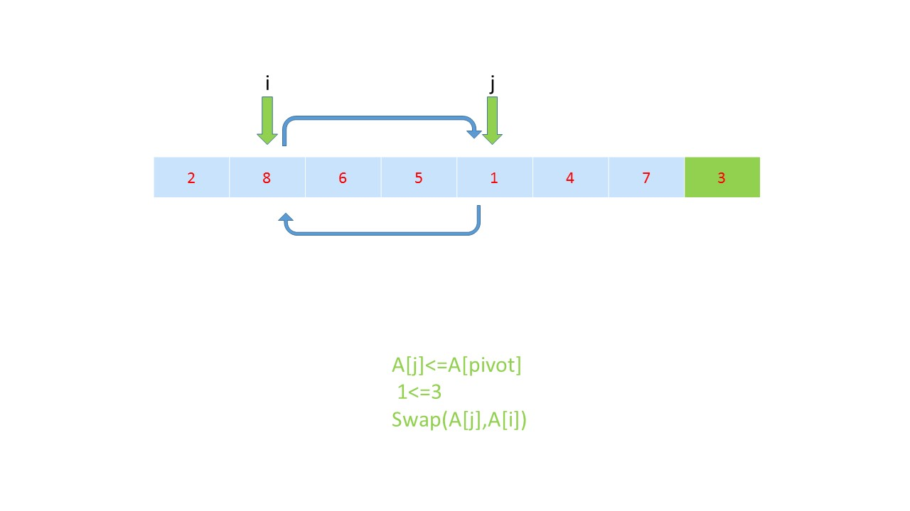

> 原文链接: https://leetcode-cn.com/problems/minimum-moves-to-equal-array-elements-ii


## 英文原文
<div><p>Given an integer array <code>nums</code> of size <code>n</code>, return <em>the minimum number of moves required to make all array elements equal</em>.</p>

<p>In one move, you can increment or decrement an element of the array by <code>1</code>.</p>

<p>Test cases are designed so that the answer will fit in a <strong>32-bit</strong> integer.</p>

<p>&nbsp;</p>
<p><strong>Example 1:</strong></p>

<pre>
<strong>Input:</strong> nums = [1,2,3]
<strong>Output:</strong> 2
<strong>Explanation:</strong>
Only two moves are needed (remember each move increments or decrements one element):
[<u>1</u>,2,3]  =&gt;  [2,2,<u>3</u>]  =&gt;  [2,2,2]
</pre>

<p><strong>Example 2:</strong></p>

<pre>
<strong>Input:</strong> nums = [1,10,2,9]
<strong>Output:</strong> 16
</pre>

<p>&nbsp;</p>
<p><strong>Constraints:</strong></p>

<ul>
	<li><code>n == nums.length</code></li>
	<li><code>1 &lt;= nums.length &lt;= 10<sup>5</sup></code></li>
	<li><code>-10<sup>9</sup> &lt;= nums[i] &lt;= 10<sup>9</sup></code></li>
</ul>
</div>

## 中文题目
<div><p>给定一个非空整数数组，找到使所有数组元素相等所需的最小移动数，其中每次移动可将选定的一个元素加1或减1。 您可以假设数组的长度最多为10000。</p>

<p><strong>例如:</strong></p>

<pre>
<strong>输入:</strong>
[1,2,3]

<strong>输出:</strong>
2

<strong>说明：
</strong>只有两个动作是必要的（记得每一步仅可使其中一个元素加1或减1）： 

[1,2,3]  =&gt;  [2,2,3]  =&gt;  [2,2,2]
</pre>
</div>

## 通过代码
<RecoDemo>
</RecoDemo>


## 官方题解
#### 方法一：使用排序寻找中位数

假设最终数组 `a` 中的每个数均为 `x`，那么需要移动的次数即为 `|a[0] - x| + |a[1] - x| + ... + |a[n-1] - x|`。如果我们把数组 `a` 中的每个数看成水平轴上的一个点，那么根据上面的移动次数公式，我们需要找到在水平轴上找到一个点 `x`，使得这 `N` 个点到 `x` 的距离之和最小。

这是一个经典的数学问题，当 `x` 为这个 `N` 个数的中位数时，可以使得距离最小。具体地，若 `N` 为奇数，则 `x` 必须为这 `N` 个数中的唯一中位数；若 `N` 为偶数，中间的两个数为 `p` 和 `q`，中位数为 `(p + q) / 2`，此时 `x` 只要是区间 `[p, q]` 中的任意一个数即可。

因此，我们只需要找到这个 `N` 个数的中位数，并计算距离之和。我们可以直接将数组进行排序，这样就直接得到了中位数。

<,,,,,,,>

```Java [sol1]
public class Solution {
    public int minMoves2(int[] nums) {
        Arrays.sort(nums);
        int sum = 0;
        for (int num : nums) {
            sum += Math.abs(nums[nums.length / 2] - num);
        }
        return sum;
    }
}
```

**复杂度分析**

* 时间复杂度：$O(N \log N)$，其中 $N$ 是数组的长度。

* 空间复杂度：$O(\log N)$，为排序需要使用的空间。

#### 方法二：使用快速选择寻找中位数

我们也可以使用快速选择（Quick-Select）算法找到数组中的中位数。

快速选择算法借鉴了快速排序的思想，在一轮快速排序中，基准元素（pivot）的左侧有 `p` 个元素，右侧有 `q` 个元素，我们需要找第 `k` 小的元素。如果 `k = p + 1`，那么基准元素即为第 `k` 小的元素；如果 `k <= p`，那么第 `k` 小的元素出现在左侧的 `p` 个元素中，因此我们并不需要对右侧的元素进行排序；如果 `k > p + 1`，那么第 `k` 小的元素出现在右侧的 `q` 个元素中，因此我们并不需要对左侧的元素进行排序。

因此，快速选择算法相当于每次只对一侧的元素进行排序，而舍弃了另一侧的元素。这样我们就可以在平均 $O(N)$ 的时间复杂度找到数组中第 `k` 小的元素。在本题中，我们只需要知道中位数对应的 `k`，再使用快速选择算法找到底 `k` 小的元素即可。

关于快速选择算法，可以参考题目 (215. 数组中的第K个最大元素)[https://leetcode-cn.com/problems/kth-largest-element-in-an-array/]。
 
<,,,,,,,,,,,,,,,>

```Java [sol2]
public class Solution {
    public void swap(int[] list, int i, int pivot_index) {
        int temp = list[i];
        list[i] = list[pivot_index];
        list[pivot_index] = temp;
    }
    public int partition(int[] list, int left, int right) {
        int pivotValue = list[right];
        int i = left;
        for (int j = left; j <= right; j++) {
            if (list[j] < pivotValue) {
                swap(list, i, j);
                i++;
            }
        }
        swap(list, right, i);
        return i;
    }
    int select(int[] list, int left, int right, int k) {
        if (left == right) {
            return list[left];
        }
        int pivotIndex = partition(list, left, right);
        if (k == pivotIndex) {
            return list[k];
        } else if (k < pivotIndex) {
            return select(list, left, pivotIndex - 1, k);
        } else {
            return select(list, pivotIndex + 1, right, k);
        }
    }
    public int minMoves2(int[] nums) {
        int sum = 0;
        int median = select(nums, 0, nums.length - 1, nums.length / 2);

        for (int num : nums) {
            sum += Math.abs(median - num);
        }
        return sum;
    }
}
```

**复杂度分析**

* 时间复杂度：平均为 $O(N)$，但在最坏情况下会达到 $O(N^2)$，这是快速排序本身的性质导致的。

* 空间复杂度：$O(\log N)$，为快速选择需要使用的空间。

## 统计信息
| 通过次数 | 提交次数 | AC比率 |
| :------: | :------: | :------: |
|    15207    |    24991    |   60.8%   |

## 提交历史
| 提交时间 | 提交结果 | 执行时间 |  内存消耗  | 语言 |
| :------: | :------: | :------: | :--------: | :--------: |


## 相似题目
|                             题目                             | 难度 |
| :----------------------------------------------------------: | :---------: |
| [最佳的碰头地点](https://leetcode-cn.com/problems/best-meeting-point/) | 困难|
| [最小操作次数使数组元素相等](https://leetcode-cn.com/problems/minimum-moves-to-equal-array-elements/) | 简单|
