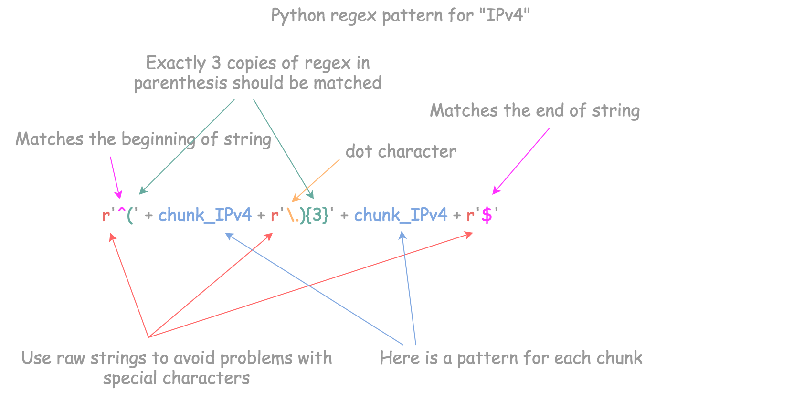
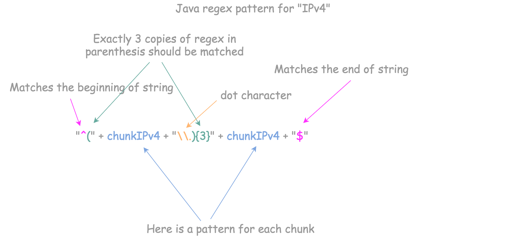
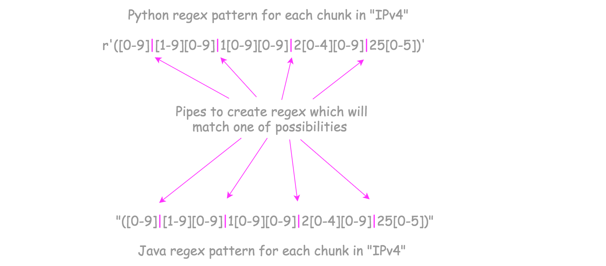
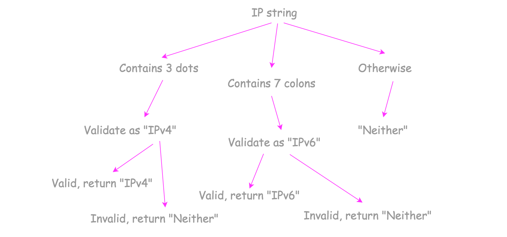

> 原文链接: https://leetcode-cn.com/problems/validate-ip-address


## 英文原文
<div><p>Given a string <code>queryIP</code>, return <code>&quot;IPv4&quot;</code> if IP is a valid IPv4 address, <code>&quot;IPv6&quot;</code> if IP is a valid IPv6 address or <code>&quot;Neither&quot;</code> if IP is not a correct IP of any type.</p>

<p><strong>A valid IPv4</strong> address is an IP in the form <code>&quot;x<sub>1</sub>.x<sub>2</sub>.x<sub>3</sub>.x<sub>4</sub>&quot;</code> where <code>0 &lt;= x<sub>i</sub> &lt;= 255</code> and <code>x<sub>i</sub></code> <strong>cannot contain</strong> leading zeros. For example, <code>&quot;192.168.1.1&quot;</code> and <code>&quot;192.168.1.0&quot;</code> are valid IPv4 addresses but <code>&quot;192.168.01.1&quot;</code>, while <code>&quot;192.168.1.00&quot;</code> and <code>&quot;192.168@1.1&quot;</code> are invalid IPv4 addresses.</p>

<p><strong>A valid IPv6</strong> address is an IP in the form <code>&quot;x<sub>1</sub>:x<sub>2</sub>:x<sub>3</sub>:x<sub>4</sub>:x<sub>5</sub>:x<sub>6</sub>:x<sub>7</sub>:x<sub>8</sub>&quot;</code> where:</p>

<ul>
	<li><code>1 &lt;= x<sub>i</sub>.length &lt;= 4</code></li>
	<li><code>x<sub>i</sub></code> is a <strong>hexadecimal string</strong> which may contain digits, lower-case English letter (<code>&#39;a&#39;</code> to <code>&#39;f&#39;</code>) and upper-case English letters (<code>&#39;A&#39;</code> to <code>&#39;F&#39;</code>).</li>
	<li>Leading zeros are allowed in <code>x<sub>i</sub></code>.</li>
</ul>

<p>For example, &quot;<code>2001:0db8:85a3:0000:0000:8a2e:0370:7334&quot;</code> and &quot;<code>2001:db8:85a3:0:0:8A2E:0370:7334&quot;</code> are valid IPv6 addresses, while &quot;<code>2001:0db8:85a3::8A2E:037j:7334&quot;</code> and &quot;<code>02001:0db8:85a3:0000:0000:8a2e:0370:7334&quot;</code> are invalid IPv6 addresses.</p>

<p>&nbsp;</p>
<p><strong>Example 1:</strong></p>

<pre>
<strong>Input:</strong> queryIP = &quot;172.16.254.1&quot;
<strong>Output:</strong> &quot;IPv4&quot;
<strong>Explanation:</strong> This is a valid IPv4 address, return &quot;IPv4&quot;.
</pre>

<p><strong>Example 2:</strong></p>

<pre>
<strong>Input:</strong> queryIP = &quot;2001:0db8:85a3:0:0:8A2E:0370:7334&quot;
<strong>Output:</strong> &quot;IPv6&quot;
<strong>Explanation:</strong> This is a valid IPv6 address, return &quot;IPv6&quot;.
</pre>

<p><strong>Example 3:</strong></p>

<pre>
<strong>Input:</strong> queryIP = &quot;256.256.256.256&quot;
<strong>Output:</strong> &quot;Neither&quot;
<strong>Explanation:</strong> This is neither a IPv4 address nor a IPv6 address.
</pre>

<p><strong>Example 4:</strong></p>

<pre>
<strong>Input:</strong> queryIP = &quot;2001:0db8:85a3:0:0:8A2E:0370:7334:&quot;
<strong>Output:</strong> &quot;Neither&quot;
</pre>

<p><strong>Example 5:</strong></p>

<pre>
<strong>Input:</strong> queryIP = &quot;1e1.4.5.6&quot;
<strong>Output:</strong> &quot;Neither&quot;
</pre>

<p>&nbsp;</p>
<p><strong>Constraints:</strong></p>

<ul>
	<li><code>queryIP</code> consists only of English letters, digits and the characters <code>&#39;.&#39;</code> and <code>&#39;:&#39;</code>.</li>
</ul>
</div>

## 中文题目
<div><p>编写一个函数来验证输入的字符串是否是有效的 IPv4 或&nbsp;IPv6 地址。</p>

<ul>
	<li>如果是有效的 IPv4 地址，返回 <code>&quot;IPv4&quot;</code> ；</li>
	<li>如果是有效的 IPv6 地址，返回 <code>&quot;IPv6&quot;</code> ；</li>
	<li>如果不是上述类型的 IP 地址，返回 <code>&quot;Neither&quot;</code> 。</li>
</ul>

<p><strong>IPv4</strong>&nbsp;地址由十进制数和点来表示，每个地址包含 4 个十进制数，其范围为&nbsp;0 -&nbsp;255，&nbsp;用(&quot;.&quot;)分割。比如，<code>172.16.254.1</code>；</p>

<p>同时，IPv4 地址内的数不会以 0 开头。比如，地址&nbsp;<code>172.16.254.01</code> 是不合法的。</p>

<p><strong>IPv6</strong>&nbsp;地址由 8 组 16 进制的数字来表示，每组表示&nbsp;16 比特。这些组数字通过 (&quot;:&quot;)分割。比如,&nbsp;&nbsp;<code>2001:0db8:85a3:0000:0000:8a2e:0370:7334</code> 是一个有效的地址。而且，我们可以加入一些以 0 开头的数字，字母可以使用大写，也可以是小写。所以，&nbsp;<code>2001:db8:85a3:0:0:8A2E:0370:7334</code> 也是一个有效的 IPv6 address地址 (即，忽略 0 开头，忽略大小写)。</p>

<p>然而，我们不能因为某个组的值为 0，而使用一个空的组，以至于出现 (::) 的情况。&nbsp;比如，&nbsp;<code>2001:0db8:85a3::8A2E:0370:7334</code> 是无效的 IPv6 地址。</p>

<p>同时，在 IPv6 地址中，多余的 0 也是不被允许的。比如，&nbsp;<code>02001:0db8:85a3:0000:0000:8a2e:0370:7334</code> 是无效的。</p>

<p>&nbsp;</p>

<p><strong>示例 1：</strong></p>

<pre><strong>输入：</strong>IP = &quot;172.16.254.1&quot;
<strong>输出：</strong>&quot;IPv4&quot;
<strong>解释：</strong>有效的 IPv4 地址，返回 &quot;IPv4&quot;
</pre>

<p><strong>示例 2：</strong></p>

<pre><strong>输入：</strong>IP = &quot;2001:0db8:85a3:0:0:8A2E:0370:7334&quot;
<strong>输出：</strong>&quot;IPv6&quot;
<strong>解释：</strong>有效的 IPv6 地址，返回 &quot;IPv6&quot;
</pre>

<p><strong>示例 3：</strong></p>

<pre><strong>输入：</strong>IP = &quot;256.256.256.256&quot;
<strong>输出：</strong>&quot;Neither&quot;
<strong>解释：</strong>既不是 IPv4 地址，又不是 IPv6 地址
</pre>

<p><strong>示例 4：</strong></p>

<pre><strong>输入：</strong>IP = &quot;2001:0db8:85a3:0:0:8A2E:0370:7334:&quot;
<strong>输出：</strong>&quot;Neither&quot;
</pre>

<p><strong>示例 5：</strong></p>

<pre><strong>输入：</strong>IP = &quot;1e1.4.5.6&quot;
<strong>输出：</strong>&quot;Neither&quot;
</pre>

<p>&nbsp;</p>

<p><strong>提示：</strong></p>

<ul>
	<li><code>IP</code> 仅由英文字母，数字，字符 <code>&#39;.&#39;</code> 和 <code>&#39;:&#39;</code> 组成。</li>
</ul>
</div>

## 通过代码
<RecoDemo>
</RecoDemo>


## 官方题解
#### 概述

最直接的方法是使用内置函数和 try/catch 结构检查 IP 地址的正确性：在 Python 中使用 [ipaddress](https://docs.python.org/3/library/ipaddress.html) ，在 Java 中使用 [InetAddress](https://docs.oracle.com/javase/7/docs/api/java/net/InetAddress.html) 。

```python [solution1-Python]
from ipaddress import ip_address, IPv6Address
class Solution:
    def validIPAddress(self, IP: str) -> str:
        try:
            return "IPv6" if type(ip_address(IP)) is IPv6Address else "IPv4"
        except ValueError:
            return "Neither"
```

```java [solution1-Java]
import java.net.*;
class Solution {
  public String validIPAddress(String IP) {
    try {
      return (InetAddress.getByName(IP) instanceof Inet6Address) ? "IPv6": "IPv4";
    } catch(Exception e) {}
    return "Neither";
  }
}
```

注意：这两个类都是引用 [POSIX -兼容的](https://linux.die.net/man/3/inet_addr) `inet-addr()` 解析地址。如果地址带有前导零块，可能会发生错误。

> 地址的组成可以使十进制，八进制（以 0 开始），或十六进制（以 0X 开始）。

例如 `01.01.01.012` 是有效的八进制 IP 地址。检查该地址是否有效可以在控制台运行命令 `ping 01.01.01.012`，八进制地址 `01.01.01.012` 会被转换为对应的十进制地址 `1.1.1.10`，因此执行 ping 命令不会出错。

该题目指出如果 *IPv4 地址包含前置 0，则地址是无效的* ，但其实这不符合真实情况，不过我们仍然需要解决它。

该题目要三种主要解法：

- 正则表达式，该方法性能不太好。

- 分治法，效率最高的方法之一。

- 使用分治法和内置的 try/catch，将字符串转换成整数处理。使用 try/catch 不是一种好的方式，因为 try 块中的代码不会被编译器优化，所以最好不要在面试中使用。


#### 方法一：正则表达式

构造适用该题目的 “IPv4” 地址的正则表达式。注意前面讨论的前置零问题，它不属于 IPv4 地址。

在 Python 中使用原始字符串 `r''` 构造正则表达式：



在 Java 中使用标准字符串构造正则表达式：



现在问题被简化为检查每个块是否正确，每个块的范围为 `(0, 255)`，且不允许有前置零出现。一共有五种情况：

1. 块只包含一位数字，范围是 0 到 9。

2. 块包含两位数字，第一位的范围是 1 到 9，第二位是 0 到 9。

3. 块包含三位数字，且第一位为 1。第二、三位可以是 0 到 9。

4. 块包含三位数字，且第一位为 2，第二位为 0 到 4。那么第三位可以是 0 到 9。

5. 块包含三位数字，且第一位为 2，第二位为 5，那么第三位可以是 0 到 5。

创建包含这 5 种情况的正则表达式。

 

使用相同逻辑构造匹配 IPv6 地址的正则表达式。

```python [solution1-Python]
import re
class Solution:
    chunk_IPv4 = r'([0-9]|[1-9][0-9]|1[0-9][0-9]|2[0-4][0-9]|25[0-5])'
    patten_IPv4 = re.compile(r'^(' + chunk_IPv4 + r'\.){3}' + chunk_IPv4 + r'$')
    
    chunk_IPv6 = r'([0-9a-fA-F]{1,4})'
    patten_IPv6 = re.compile(r'^(' + chunk_IPv6 + r'\:){7}' + chunk_IPv6 + r'$')

    def validIPAddress(self, IP: str) -> str:        
        if '.' in IP:
            return "IPv4" if self.patten_IPv4.match(IP) else "Neither" 
        if ':' in IP:
            return "IPv6" if self.patten_IPv6.match(IP) else "Neither" 
        return "Neither"
```

```java [solution1-Java]
import java.util.regex.Pattern;
class Solution {
  String chunkIPv4 = "([0-9]|[1-9][0-9]|1[0-9][0-9]|2[0-4][0-9]|25[0-5])";
  Pattern pattenIPv4 =
          Pattern.compile("^(" + chunkIPv4 + "\\.){3}" + chunkIPv4 + "$");

  String chunkIPv6 = "([0-9a-fA-F]{1,4})";
  Pattern pattenIPv6 =
          Pattern.compile("^(" + chunkIPv6 + "\\:){7}" + chunkIPv6 + "$");

  public String validIPAddress(String IP) {
    if (IP.contains(".")) {
      return (pattenIPv4.matcher(IP).matches()) ? "IPv4" : "Neither";
    }
    else if (IP.contains(":")) {
      return (pattenIPv6.matcher(IP).matches()) ? "IPv6" : "Neither";
    }
    return "Neither";
  }
}
```

**复杂度分析**

* 时间复杂度：$\mathcal{O}(1)$。
    
* 空间复杂度：$\mathcal{O}(1)$。


#### 方法二：分治法

**思想**

IPv4 和 IPv6 地址均是由特定的分界符隔开的字符串组成，并且每个子字符串具有相同格式。



因此，可以将地址分为多个块，然后逐块进行验证。

仅当每个块都有效时，该地址才有效。这种方法称为 *分治法*。

**算法**

- 对于 IPv4 地址，通过界定符 `.` 将地址分为四块；对于 IPv6 地址，通过界定符 `:` 将地址分为八块。

- 对于 IPv4 地址的每一块，检查它们是否在 `0 - 255` 内，且没有前置零。

- 对于 IPv6 地址的每一块，检查其长度是否为 `1 - 4` 位的十六进制数。

```python [solution2-Python]
class Solution:
    def validate_IPv4(self, IP: str) -> str:
        nums = IP.split('.')
        for x in nums:
            # Validate integer in range (0, 255):
            # 1. length of chunk is between 1 and 3
            if len(x) == 0 or len(x) > 3:
                return "Neither"
            # 2. no extra leading zeros
            # 3. only digits are allowed
            # 4. less than 255
            if x[0] == '0' and len(x) != 1 or not x.isdigit() or int(x) > 255:
                return "Neither"
        return "IPv4"
    
    def validate_IPv6(self, IP: str) -> str:
        nums = IP.split(':')
        hexdigits = '0123456789abcdefABCDEF'
        for x in nums:
            # Validate hexadecimal in range (0, 2**16):
            # 1. at least one and not more than 4 hexdigits in one chunk
            # 2. only hexdigits are allowed: 0-9, a-f, A-F
            if len(x) == 0 or len(x) > 4 or not all(c in hexdigits for c in x):
                return "Neither"
        return "IPv6"
        
    def validIPAddress(self, IP: str) -> str:
        if IP.count('.') == 3:
            return self.validate_IPv4(IP)
        elif IP.count(':') == 7:
            return self.validate_IPv6(IP)
        else:
            return "Neither"
```

```java [solution2-Java]
class Solution {
  public String validateIPv4(String IP) {
    String[] nums = IP.split("\\.", -1);
    for (String x : nums) {
      // Validate integer in range (0, 255):
      // 1. length of chunk is between 1 and 3
      if (x.length() == 0 || x.length() > 3) return "Neither";
      // 2. no extra leading zeros
      if (x.charAt(0) == '0' && x.length() != 1) return "Neither";
      // 3. only digits are allowed
      for (char ch : x.toCharArray()) {
        if (! Character.isDigit(ch)) return "Neither";
      }
      // 4. less than 255
      if (Integer.parseInt(x) > 255) return "Neither";
    }
    return "IPv4";
  }

  public String validateIPv6(String IP) {
    String[] nums = IP.split(":", -1);
    String hexdigits = "0123456789abcdefABCDEF";
    for (String x : nums) {
      // Validate hexadecimal in range (0, 2**16):
      // 1. at least one and not more than 4 hexdigits in one chunk
      if (x.length() == 0 || x.length() > 4) return "Neither";
      // 2. only hexdigits are allowed: 0-9, a-f, A-F
      for (Character ch : x.toCharArray()) {
        if (hexdigits.indexOf(ch) == -1) return "Neither";
      }
    }
    return "IPv6";
  }

  public String validIPAddress(String IP) {
    if (IP.chars().filter(ch -> ch == '.').count() == 3) {
      return validateIPv4(IP);
    }
    else if (IP.chars().filter(ch -> ch == ':').count() == 7) {
      return validateIPv6(IP);
    }
    else return "Neither";
  }
}
```

**复杂度分析**

* 时间复杂度：$\mathcal{O}(1)$。
    
* 空间复杂度：$\mathcal{O}(1)$。

## 统计信息
| 通过次数 | 提交次数 | AC比率 |
| :------: | :------: | :------: |
|    26668    |    105614    |   25.3%   |

## 提交历史
| 提交时间 | 提交结果 | 执行时间 |  内存消耗  | 语言 |
| :------: | :------: | :------: | :--------: | :--------: |


## 相似题目
|                             题目                             | 难度 |
| :----------------------------------------------------------: | :---------: |
| [IP 到 CIDR](https://leetcode-cn.com/problems/ip-to-cidr/) | 中等|
