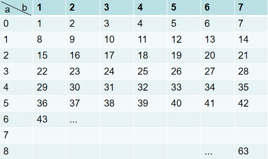

> 原文链接: https://leetcode-cn.com/problems/implement-rand10-using-rand7


## 英文原文
<div><p>Given the <strong>API</strong> <code>rand7()</code> that generates a uniform random integer in the range <code>[1, 7]</code>, write a function <code>rand10()</code> that generates a uniform random integer in the range <code>[1, 10]</code>. You can only call the API <code>rand7()</code>, and you shouldn&#39;t call any other API. Please <strong>do not</strong> use a language&#39;s built-in random API.</p>

<p>Each test case will have one <strong>internal</strong> argument <code>n</code>, the number of times that your implemented function <code>rand10()</code> will be called while testing. Note that this is <strong>not an argument</strong> passed to <code>rand10()</code>.</p>

<p>&nbsp;</p>
<p><strong>Example 1:</strong></p>
<pre><strong>Input:</strong> n = 1
<strong>Output:</strong> [2]
</pre><p><strong>Example 2:</strong></p>
<pre><strong>Input:</strong> n = 2
<strong>Output:</strong> [2,8]
</pre><p><strong>Example 3:</strong></p>
<pre><strong>Input:</strong> n = 3
<strong>Output:</strong> [3,8,10]
</pre>
<p>&nbsp;</p>
<p><strong>Constraints:</strong></p>

<ul>
	<li><code>1 &lt;= n &lt;= 10<sup>5</sup></code></li>
</ul>

<p>&nbsp;</p>
<p><strong>Follow up:</strong></p>

<ul>
	<li>What is the <a href="https://en.wikipedia.org/wiki/Expected_value" target="_blank">expected value</a> for the number of calls to <code>rand7()</code> function?</li>
	<li>Could you minimize the number of calls to <code>rand7()</code>?</li>
</ul>
</div>

## 中文题目
<div><p>已有方法&nbsp;<code>rand7</code>&nbsp;可生成 1 到 7 范围内的均匀随机整数，试写一个方法&nbsp;<code>rand10</code>&nbsp;生成 1 到 10 范围内的均匀随机整数。</p>

<p>不要使用系统的&nbsp;<code>Math.random()</code>&nbsp;方法。</p>

<ol>
</ol>

<p>&nbsp;</p>

<p><strong>示例 1:</strong></p>

<pre>
<strong>输入: </strong>1
<strong>输出: </strong>[7]
</pre>

<p><strong>示例 2:</strong></p>

<pre>
<strong>输入: </strong>2
<strong>输出: </strong>[8,4]
</pre>

<p><strong>示例 3:</strong></p>

<pre>
<strong>输入: </strong>3
<strong>输出: </strong>[8,1,10]
</pre>

<p>&nbsp;</p>

<p><strong>提示:</strong></p>

<ol>
	<li><code>rand7</code>&nbsp;已定义。</li>
	<li>传入参数:&nbsp;<code>n</code>&nbsp;表示&nbsp;<code>rand10</code>&nbsp;的调用次数。</li>
</ol>

<p>&nbsp;</p>

<p><strong>进阶:</strong></p>

<ol>
	<li><code>rand7()</code>调用次数的&nbsp;<a href="https://en.wikipedia.org/wiki/Expected_value" target="_blank">期望值</a>&nbsp;是多少&nbsp;?</li>
	<li>你能否尽量少调用 <code>rand7()</code> ?</li>
</ol>
</div>

## 通过代码
<RecoDemo>
</RecoDemo>


## 高赞题解
因为是第一次接触到这样的题目，毫无思绪，对官方题解也是“不知道为什么要这么做”。看过一些题解之后才逐渐明白，现在让我自己来写题解，我打算先从简单的开始讲起。

### Part 1
假设已知`rand2()`可以**均匀**的生成[1,2]的随机数，现在想均匀的生成[1,4]的随机数，该如何考虑？

我想如果你也像我一样第一次接触这个问题，那么很可能会这么考虑——令两个`rand2()`相加，再做一些必要的边角处理。如下：
```
rand2() + rand2() = ? ==> [2,4]
   1    +   1     = 2
   1    +   2     = 3
   2    +   1     = 3
   2    +   2     = 4

// 为了把生成随机数的范围规约成[1,n]，于是在上一步的结果后减1
(rand2()-1) + rand2() = ? ==> [1,3]
   0       +   1     = 1
   0       +   2     = 2
   1       +   1     = 2
   1       +   2     = 3
```
可以看到，使用这种方法处理的结果，最致命的点在于——其**生成的结果不是等概率的**。在这个简单的例子中，产生2的概率是50%，而产生1和3的概率则分别是25%。原因当然也很好理解，由于某些值会有多种组合，因此仅靠简单的相加处理会导致结果不是等概率的。

因此，我们需要考虑其他的方法了。

仔细观察上面的例子，我们尝试对 `(rand2()-1)` 这部分乘以 2，改动后如下：
```
(rand2()-1) × 2 + rand2() = ? ==> [1,3]
   0            +   1     = 1
   0            +   2     = 2
   2            +   1     = 3
   2            +   2     = 4
```
神奇的事情发生了，奇怪的知识增加了。通过这样的处理，得到的结果恰是[1,4]的范围，并且每个数都是等概率取到的。因此，使用这种方法，可以通过`rand2()`实现`rand4()`。

也许这么处理只是我运气好，而不具有普适性？那就多来尝试几个例子。比如：
```
(rand9()-1) × 7 + rand7() = result
     a               b
```
为了表示方便，现将`rand9()-1`表示为a，将`rand7()`表示为b。计算过程表示成二维矩阵，如下：



可以看到，这个例子可以等概率的生成[1,63]范围的随机数。再提炼一下，可以得到这样一个规律：
```
已知 rand_N() 可以等概率的生成[1, N]范围的随机数
那么：
(rand_X() - 1) × Y + rand_Y() ==> 可以等概率的生成[1, X * Y]范围的随机数
即实现了 rand_XY()
```

### Part 2

那么想到通过`rand4()`来实现`rand2()`呢？这个就很简单了，已知`rand4()`会均匀产生[1,4]的随机数，通过取余，再加1就可以了。如下所示，结果也是等概率的。
```
rand4() % 2 + 1 = ?
   1 % 2    + 1 = 2
   2 % 2    + 1 = 1
   3 % 2    + 1 = 2
   4 % 2    + 1 = 1
```
事实上，只要`rand_N()`中N是2的倍数，就都可以用来实现`rand2()`，反之，若N不是2的倍数，则产生的结果不是等概率的。比如：
```
rand6() % 2 + 1 = ?
   1 % 2    + 1 = 2
   2 % 2    + 1 = 1
   3 % 2    + 1 = 2
   4 % 2    + 1 = 1
   5 % 2    + 1 = 2
   6 % 2    + 1 = 1

rand5() % 2 + 1 = ?
   1 % 2    + 1 = 2
   2 % 2    + 1 = 1
   3 % 2    + 1 = 2
   4 % 2    + 1 = 1
   5 % 2    + 1 = 2
```

### Part 3

ok，现在回到本题中。已知`rand7()`，要求通过`rand7()`来实现`rand10()`。

有了前面的分析，**要实现`rand10()`，就需要先实现`rand_N()`，并且保证N大于10且是10的倍数。这样再通过`rand_N() % 10 + 1` 就可以得到[1,10]范围的随机数了**。

而实现`rand_N()`，我们可以通过part 1中所讲的方法对`rand7()`进行改造，如下：
```
(rand7()-1) × 7 + rand7()  ==> rand49()
```
但是这样实现的N不是10的倍数啊！这该怎么处理？这里就涉及到了“**拒绝采样**”的知识了，也就是说，如果某个采样结果不在要求的范围内，则丢弃它。基于上面的这些分析，再回头看下面的代码，想必是不难理解了。
```
class Solution extends SolBase {
    public int rand10() {
        while(true) {
            int num = (rand7() - 1) * 7 + rand7(); // 等概率生成[1,49]范围的随机数
            if(num <= 40) return num % 10 + 1; // 拒绝采样，并返回[1,10]范围的随机数
        }
    }
}
```

### Part 4: 优化
这部分具体的代码是参考官方题解的，不过是我自己在理解了part 1和part 2之后才看懂的，一开始看真不知道为什么（/(ㄒoㄒ)/~~...

根据part 1的分析，我们已经知道`(rand7() - 1) * 7 + rand7()` 等概率生成[1,49]范围的随机数。而由于我们需要的是10的倍数，因此，不得不舍弃掉[41, 49]这9个数。优化的点就始于——我们能否利用这些范围外的数字，以减少丢弃的值，提高命中率总而提高随机数生成效率。

```
class Solution extends SolBase {
    public int rand10() {
        while(true) {
            int a = rand7();
            int b = rand7();
            int num = (a-1)*7 + b; // rand 49
            if(num <= 40) return num % 10 + 1; // 拒绝采样
            
            a = num - 40; // rand 9
            b = rand7();
            num = (a-1)*7 + b; // rand 63
            if(num <= 60) return num % 10 + 1;
            
            a = num - 60; // rand 3
            b = rand7();
            num = (a-1)*7 + b; // rand 21
            if(num <= 20) return num % 10 + 1;
        }
    }
}
```

## 统计信息
| 通过次数 | 提交次数 | AC比率 |
| :------: | :------: | :------: |
|    67223    |    122804    |   54.7%   |

## 提交历史
| 提交时间 | 提交结果 | 执行时间 |  内存消耗  | 语言 |
| :------: | :------: | :------: | :--------: | :--------: |
