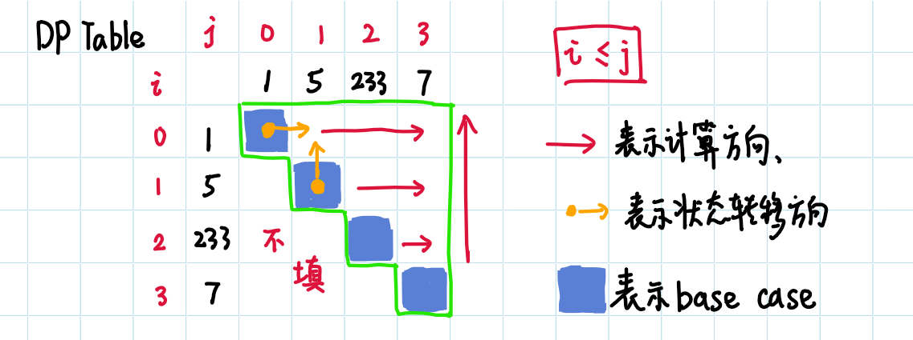

> 原文链接: https://leetcode-cn.com/problems/predict-the-winner


## 英文原文
<div><p>You are given an integer array <code>nums</code>. Two players are playing a game with this array: player 1 and player 2.</p>

<p>Player 1 and player 2 take turns, with player 1 starting first. Both players start the game with a score of <code>0</code>. At each turn, the player takes one of the numbers from either end of the array (i.e., <code>nums[0]</code> or <code>nums[nums.length - 1]</code>) which reduces the size of the array by <code>1</code>. The player adds the chosen number to their score. The game ends when there are no more elements in the array.</p>

<p>Return <code>true</code> if Player 1 can win the game. If the scores of both players are equal, then player 1 is still the winner, and you should also return <code>true</code>. You may assume that both players are playing optimally.</p>

<p>&nbsp;</p>
<p><strong>Example 1:</strong></p>

<pre>
<strong>Input:</strong> nums = [1,5,2]
<strong>Output:</strong> false
<strong>Explanation:</strong> Initially, player 1 can choose between 1 and 2. 
If he chooses 2 (or 1), then player 2 can choose from 1 (or 2) and 5. If player 2 chooses 5, then player 1 will be left with 1 (or 2). 
So, final score of player 1 is 1 + 2 = 3, and player 2 is 5. 
Hence, player 1 will never be the winner and you need to return false.
</pre>

<p><strong>Example 2:</strong></p>

<pre>
<strong>Input:</strong> nums = [1,5,233,7]
<strong>Output:</strong> true
<strong>Explanation:</strong> Player 1 first chooses 1. Then player 2 has to choose between 5 and 7. No matter which number player 2 choose, player 1 can choose 233.
Finally, player 1 has more score (234) than player 2 (12), so you need to return True representing player1 can win.
</pre>

<p>&nbsp;</p>
<p><strong>Constraints:</strong></p>

<ul>
	<li><code>1 &lt;= nums.length &lt;= 20</code></li>
	<li><code>0 &lt;= nums[i] &lt;= 10<sup>7</sup></code></li>
</ul>
</div>

## 中文题目
<div><p>给你一个整数数组 <code>nums</code> 。玩家 1 和玩家 2 基于这个数组设计了一个游戏。</p>

<p>玩家 1 和玩家 2 轮流进行自己的回合，玩家 1 先手。开始时，两个玩家的初始分值都是 <code>0</code> 。每一回合，玩家从数组的任意一端取一个数字（即，<code>nums[0]</code> 或 <code>nums[nums.length - 1]</code>），取到的数字将会从数组中移除（数组长度减 <code>1</code> ）。玩家选中的数字将会加到他的得分上。当数组中没有剩余数字可取时，游戏结束。</p>

<p>如果玩家 1 能成为赢家，返回 <code>true</code> 。如果两个玩家得分相等，同样认为玩家 1 是游戏的赢家，也返回 <code>true</code> 。你可以假设每个玩家的玩法都会使他的分数最大化。</p>

<p>&nbsp;</p>

<p><strong>示例 1：</strong></p>

<pre>
<strong>输入：</strong>nums = [1,5,2]
<strong>输出：</strong>false
<strong>解释：</strong>一开始，玩家 1 可以从 1 和 2 中进行选择。
如果他选择 2（或者 1 ），那么玩家 2 可以从 1（或者 2 ）和 5 中进行选择。如果玩家 2 选择了 5 ，那么玩家 1 则只剩下 1（或者 2 ）可选。 
所以，玩家 1 的最终分数为 1 + 2 = 3，而玩家 2 为 5 。
因此，玩家 1 永远不会成为赢家，返回 false 。</pre>

<p><strong>示例 2：</strong></p>

<pre>
<strong>输入：</strong>nums = [1,5,233,7]
<strong>输出：</strong>true
<strong>解释：</strong>玩家 1 一开始选择 1 。然后玩家 2 必须从 5 和 7 中进行选择。无论玩家 2 选择了哪个，玩家 1 都可以选择 233 。
最终，玩家 1（234 分）比玩家 2（12 分）获得更多的分数，所以返回 true，表示玩家 1 可以成为赢家。</pre>

<p>&nbsp;</p>

<p><strong>提示：</strong></p>

<ul>
	<li><code>1 &lt;= nums.length &lt;= 20</code></li>
	<li><code>0 &lt;= nums[i] &lt;= 10<sup>7</sup></code></li>
</ul>
</div>

## 通过代码
<RecoDemo>
</RecoDemo>


## 高赞题解
不知不觉已入秋，生起凉意，突然想到周杰伦的《一路向北》。

#### 思路的形成

以 `[1, 5, 233, 7]` 为例，玩家 1 先手。

- 如果他选左端的 1，则玩家 2 在剩下的`[5, 233, 7]`的两端中选。

- 如果他选右端的 7，则玩家 2 在剩下的`[1, 5, 233]`的两端中选。


想到递归了吗？画个图看看，我用数组索引来描述一个子问题：


每个节点都是其中一个玩家在选择，下一个节点变成对手在选择，交替在**选**。


开始时你选了 x，得 x 分，他没选，得 0 分，你领先他 x 分，接下来他选，你选，你们交替地选…请勿绕入递归的细节。


起初你有 x 分，对手 0 分，**在后面的游戏中**，对手拢共赢你 y 分，如果 x >= y，那你赢了。


屏蔽掉递归的细节，那是丢给子调用去做的。关注当前的 $x$ 分，子调用应该返回什么去和它比较，才能判断获胜。就不难想到：在剩余轮次中对手净胜分，它大于0，相当于对手**在剩余轮次中获胜**，比起整个游戏，只是**游戏规模小了一点**。


于是递归函数：返回当前做选择的玩家，基于当前区间`[i,j]`，赢过对手的分数。


怎么计算呢？


**当前选择的分数**，**减去**，**往后对手赢过自己的分数**（**对剩余数组递归**）。因为有两端可选择，所以差值有两个，取较大的判断是否 >= 0。


可以仔细感受一下这个思路的生成。

####  代码

```javascript []

const PredictTheWinner = (nums) => {

  // helper：基于从i到j的数组，当前选择的玩家所能赢对方的分数

  const helper = (i, j) => { // i，j是两端的索引

    if (i == j) {   // 此时只有一种选择，选的人赢对方nums[i]，且没有剩余可选，结束递归

      return nums[i];

    }

    const pickI = nums[i] - helper(i + 1, j); // 选择左端，获得nums[i]，之后输掉helper(i+1,j)分

    const pickJ = nums[j] - helper(i, j - 1); // 选择右端，获得nums[j]，之后输掉helper(i,j-1)分

    return Math.max(pickI, pickJ);            // 返回较大者，即在[i,j]数组游戏中胜过对方的分数

  };


  return helper(0, nums.length - 1) >= 0; // 基于整个数组玩这个游戏，玩家1先手，>=0就获胜

};

```

```golang []

func PredictTheWinner(nums []int) bool {

    return helper(0, len(nums) - 1, nums) >= 0

}


func helper(i, j int, nums []int) int {

    if i == j {

        return nums[i]

    }

    pickI := nums[i] - helper(i+1, j, nums)

    pickJ := nums[j] - helper(i, j-1, nums)

    if pickI > pickJ {

        return pickI

    }

    return pickJ

}

```


#### 记忆化递归

> First make it work, then make it fast.


我们做了哪些重复的计算？

比如，你先选 1，我再选 7，和你先选 7，我再选 1，都是剩下`[5, 233]`，都来到了相同的状态，没必要对它进行重复的计算。

我们去存储计算过的子问题的解，当遇到重复的子问题，直接返回命中的存储值。


####  代码

```javascript []

const PredictTheWinner = (nums) => {

  const len = nums.length;

  const memo = new Array(len);

  for (let i = 0; i < memo.length; i++) {

    memo[i] = new Array(len);

  }


  const helper = (i, j) => {

    if (i == j) {                   // base case

      return nums[i];

    }

    if (memo[i][j] !== undefined) { // 如果memo中有缓存值，就直接返回它

      return memo[i][j]; 

    }

    const pickI = nums[i] - helper(i + 1, j);

    const pickJ = nums[j] - helper(i, j - 1);

    memo[i][j] = Math.max(pickI, pickJ); // 计算结果存入memo

    return memo[i][j];

  };


  return helper(0, len - 1) >= 0;

};

```

```golang []

func PredictTheWinner(nums []int) bool {

    L := len(nums)

    memo := make([][]int, L)

    for i := 0; i < L; i++ {

        memo[i] = make([]int, L)

        for j := 0; j < L; j++ {

            memo[i][j] = -1<<63

        }

    }

    return helper(0, L-1, nums, memo) >= 0

}


func helper(i, j int, nums []int, memo [][]int) int {

    if i == j {

        return nums[i]

    }

    if memo[i][j] != -1<<63 { // 如果memo中有缓存值，就直接返回它

      return memo[i][j]

    }

    pickI := nums[i] - helper(i+1, j, nums, memo)

    pickJ := nums[j] - helper(i, j-1, nums, memo)

    memo[i][j] = max(pickI, pickJ)

    return memo[i][j]

}


func max(a, b int) int {

	if a > b { return a }

	return b

}

```


#### 动态规划 

递归思路中，我们看到大问题的拆解，看到子问题自底而上地解决，计算结果存入 memo。


我们现在用 for 循环取代递归，按顺序求解子问题，去填二维数组，而不是依靠递归去做这件事。


动态规划可以理解为不带重复计算的递归，它把中间子问题的解存储在一维或多维数组中。


我们不应该把思考的重心放在怎么填表，最好先想出正确的递归。只要我们记忆化了正确的递归，就容易看出适不适合用动态规划，DP代码也就水到渠成。如果递归没想对，就写不出正确的DP。


下图是一位教授的留言。


#### 动态规划 解法

在记忆化递归的基础上，稍作修改即可。


比照递归函数的定义，`dp[i][j]`: 当前玩家在数组`[i:j]`中先手，所赢过对方的分数。


比照递归的终止条件，有 base case：当`i == j`时，`dp[i][j] = nums[i]`。


比照递归函数的返回值：`max(nums[i] - helper(i+1, j), nums[j] - helper(i, j-1))`，有状态转移方程：`dp[i][j] = max(nums[i] - dp[i+1][j], nums[j] - dp[i][j-1])`


注意，要满足`i <= j`，所以只用填半张表。


我们看看状态转移的方向，它指导我们填表时采取什么计算方向，才不会出现：求当前的状态时，它所依赖的状态还没求出来。





#### DP 代码


```js []

const PredictTheWinner = (nums) => {

  const len = nums.length;

  const dp = new Array(len);  // initialize dp array

  for (let i = 0; i < len; i++) {

    dp[i] = new Array(len);

  }

  for (let i = 0; i < len; i++) {  // base case 

    dp[i][i] = nums[i];

  }

  // iteration

  for (let i = len - 2; i >= 0; i--) { 

    for (let j = i + 1; j < len; j++) {

      const pickI = nums[i] - dp[i + 1][j];

      const pickJ = nums[j] - dp[i][j - 1];

      dp[i][j] = Math.max(pickI, pickJ);

    }

  }

  return dp[0][len - 1] >= 0;

};

```

```golang []

func PredictTheWinner(nums []int) bool {

    L := len(nums)

    dp := make([][]int, L)

    for i := 0; i < L; i++ {

        dp[i] = make([]int, L)

       

    }

    for i := 0; i < L; i++ {

        dp[i][i] = nums[i]

    }

    for i := L - 2; i >= 0; i-- { 

        for j := i + 1; j < L; j++ {

            pickI := nums[i] - dp[i + 1][j]

            pickJ := nums[j] - dp[i][j - 1]

            dp[i][j] = max(pickI, pickJ)

        }

     }

    return dp[0][L-1] >= 0

}


func max(a, b int) int {

	if a > b { return a }

	return b

}

```


#### 复盘总结

这三板斧的思路是一气呵成的。动态规划最难的部分大概是：准确定义出子问题。


我们可以从递归出发，画画递归树，想想递归函数应该怎么定义？怎么拆解子问题？再过渡到DP。


《预测赢家》的每一步做的事是一样的，每一轮选择后，来到什么状态，递归的思路是明显的。


我们抓住**当前**，不纠结递归细节，把问题拆成当前与之后，所谓之后就是一个规模较小的子问题。


#### DP 思路的生成

我们证明了子问题的解可以从规模较小的子问题的解获得，就有了递推公式。


接着确定出求解子问题的顺序，作为辅助，我们可以画出一个子问题依赖关系的关系图，一个节点就是一个子问题，边代表依赖关系。


看看这个图是否为有向无环图，如果存在环形依赖，则用不了动态规划，因为后者是顺序计算所有子问题。


然后我们基于该图，采用合适的计算顺序，自底而上地计算。


如果我们只想求出最优解的值，则任务完成。如果要找出所有的最优解，那么 DP 是无能为力的，必须用回溯算法去构建答案。


动态规划有它的局限性。不要轻视递归，它可以发散出很多东西，甚至**帮你想出DP解法**。


#### 文字经过反复打磨，保证了易读性，相信你也感受到了这份真诚。如果有疑问或有更好的建议，欢迎提问和友善地反馈。


最后修改于：2021-10-27

## 统计信息
| 通过次数 | 提交次数 | AC比率 |
| :------: | :------: | :------: |
|    47870    |    81581    |   58.7%   |

## 提交历史
| 提交时间 | 提交结果 | 执行时间 |  内存消耗  | 语言 |
| :------: | :------: | :------: | :--------: | :--------: |


## 相似题目
|                             题目                             | 难度 |
| :----------------------------------------------------------: | :---------: |
| [我能赢吗](https://leetcode-cn.com/problems/can-i-win/) | 中等|
