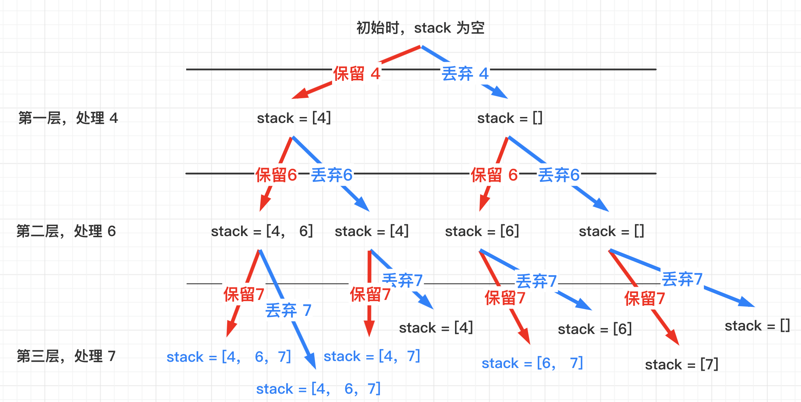
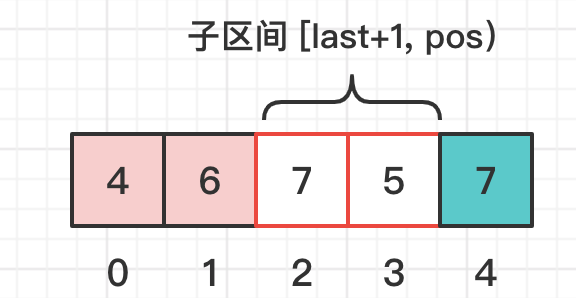
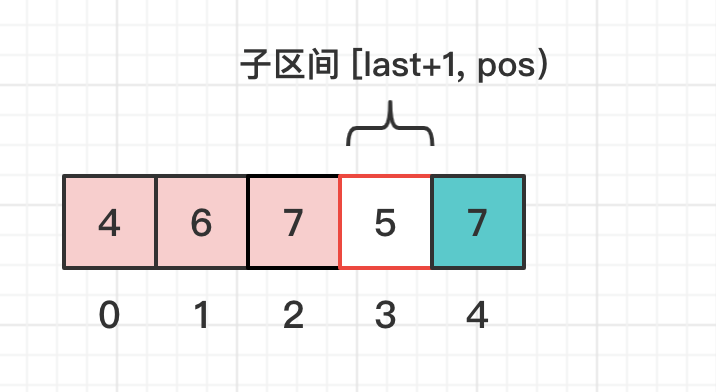
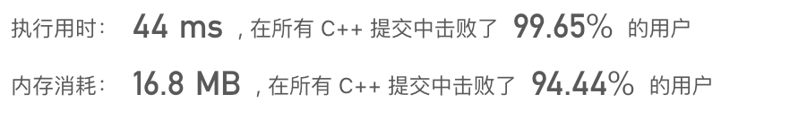

> 原文链接: https://leetcode-cn.com/problems/increasing-subsequences


## 英文原文
<div><p>Given an integer array <code>nums</code>, return all the different possible increasing subsequences of the given array with <strong>at least two elements</strong>. You may return the answer in <strong>any order</strong>.</p>

<p>The given array may contain duplicates, and two equal integers should also be considered a special case of increasing sequence.</p>

<p>&nbsp;</p>
<p><strong>Example 1:</strong></p>

<pre>
<strong>Input:</strong> nums = [4,6,7,7]
<strong>Output:</strong> [[4,6],[4,6,7],[4,6,7,7],[4,7],[4,7,7],[6,7],[6,7,7],[7,7]]
</pre>

<p><strong>Example 2:</strong></p>

<pre>
<strong>Input:</strong> nums = [4,4,3,2,1]
<strong>Output:</strong> [[4,4]]
</pre>

<p>&nbsp;</p>
<p><strong>Constraints:</strong></p>

<ul>
	<li><code>1 &lt;= nums.length &lt;= 15</code></li>
	<li><code>-100 &lt;= nums[i] &lt;= 100</code></li>
</ul>
</div>

## 中文题目
<div><p>给你一个整数数组 <code>nums</code> ，找出并返回所有该数组中不同的递增子序列，递增子序列中 <strong>至少有两个元素</strong> 。你可以按 <strong>任意顺序</strong> 返回答案。</p>

<p>数组中可能含有重复元素，如出现两个整数相等，也可以视作递增序列的一种特殊情况。</p>

<p>&nbsp;</p>

<p><strong>示例 1：</strong></p>

<pre>
<strong>输入：</strong>nums = [4,6,7,7]
<strong>输出：</strong>[[4,6],[4,6,7],[4,6,7,7],[4,7],[4,7,7],[6,7],[6,7,7],[7,7]]
</pre>

<p><strong>示例 2：</strong></p>

<pre>
<strong>输入：</strong>nums = [4,4,3,2,1]
<strong>输出：</strong>[[4,4]]
</pre>

<p>&nbsp;</p>

<p><strong>提示：</strong></p>

<ul>
	<li><code>1 &lt;= nums.length &lt;= 15</code></li>
	<li><code>-100 &lt;= nums[i] &lt;= 100</code></li>
</ul>
</div>

## 通过代码
<RecoDemo>
</RecoDemo>


## 高赞题解
#### 如何递归
首先，在不考虑重复的情况下，$O(2^n)$ 的递归代码还是很好想的。

* 使用一个 `vector<int> stack` 保存递增子序列。
  使用一个 `vector<vector<int>> anw` 保存答案。

* 递进阶段，都产生两个子调用：
    * 如何符合要求，将当前值放入 `stack` 中。将放入新值后的 `stack`，放入 `anw`。继续递归处理下一个数字。
    * 将当前值丢弃(无论能不能放入 `stack` 中，都选择不放入)。继续递归处理下一个数字。
* 回归阶段，将 `stack` 的最后一个元素弹出。

以 `【4,  6, 7 】` 为例， 递进阶段过程中， `stack` 的变化如下：


不清楚，递进阶段，回归阶段的老铁，可以点这里 [知识的大门](https://mp.weixin.qq.com/s?__biz=MzI1MzU4MzM0MA==&mid=2247484447&idx=1&sn=6cab9f0af3e54d2dae9d22292d97546c&chksm=e9d30e9cdea4878a8ad6431fb5f21fb51033ae4cd05047ac4653c1d2618823f7ae68933048c3&token=889065882&lang=zh_CN#rd)

#### 总结一下
递进阶段，产生的两次子调用，枚举了所有可能组合情况。并在递进过程中，将合法的组合情况保留在了 `anw` 中。
****

#### 如何去重
考虑一下去重问题，我使用了 $O(n)$ 的判重方法：
* 设 `stack` 中最后一个值的位置为 `last`。如果 `stack` 为空，则 `last = -1`。 
* 设当前正在处理的位置为 pos。
* 如果在 `nums` 的子区间 `[last+1, pos)` 中，存在和 `nums[pos]` 相同的值，则当前 `nums[pos]` 必须丢弃，不然会产生重复的子序列。




设现在 `stack = [4, 6], pos = `4。
如果只检查是否递增的话，`nums[4] = 7` 是可以放入的，放入后 `stack = [4, 6, 7]`。
**但是**，当 `stack = [4, 6]` 时，`last = 1`，在 `nums[last+1, 4）` 中，还存在一个 `nums[2] = 7`。
这说明，在之前的递归中，**已经构造出了** `stack = [4, 6, 7]` 这种情况。
所以，在 `stack = [4, 6]` 时，`nums[4] = 7` 应该丢弃。

当 `stack = [4, 6, 7]`, `pos = 4` 时。



此时，`last = 2`，`pos = 4`，此时 `nums[last+1, pos)` 中，并没有其他的 7 了。
且放入后，`stack` 还是递增子序列，所以构造出了 `stack = [4,6,7,7]`

****


```C++ []
class Solution {
public:
    // 判重代码；
    bool is_first(const vector<int> &num, int last, int pos) {
        for(int i = last+1; i < pos; i++) {
            if(num[i] == num[pos]) {
                return false;
            }
        }
        return true;
    }
    void dfs(const vector<int> &nums, int last, int pos, vector<int> &stack, vector<vector<int>> &anw) {
        if(nums.size() == pos) { return; } //到达末尾，直接返回吧
        // 检查 nums[pos] 是否符合要求
        if((stack.empty() || nums[pos] >= stack.back()) && is_first(nums, last, pos)) {
            stack.push_back(nums[pos]);
            if(stack.size() >= 2) { //大于 2 了，那就放进去吧
                anw.push_back(stack);
            } 
            dfs(nums, pos, pos+1, stack, anw); // 继续处理下一个。
            stack.pop_back(); // 将当前放入这个吐出来。
        }
        dfs(nums, last, pos+1, stack, anw);
    }
    vector<vector<int>> findSubsequences(vector<int>& nums) {
        vector<vector<int>> anw;
        vector<int> stack;
        dfs(nums, -1, 0, stack, anw);
        return anw;
    }
};
```

****
#### 进一步优化
上述去重逻辑中，执行一次 is_first 的时间复杂度为 $O(n)$。
现在通过预处理的方法，把它降到 $O(1)$。

对于 `nums[i]`，我们记录一下在 `nums[0, i-1]` 中，与 `nums[i]` 相等元素的下标，如果有多个，只记最大的。如果没有，记为 `-1`。
也就是说，寻找 `nums[i]` 上一次出现的位置，即为 `pre[i]`。
这样，`is_first` 的逻辑就变成了判断 `pre[pos]` 是否在 `[last+1, pos）`中。

```C++ []
class Solution {
public:
    int pre[15];
    // 判重代码；
    bool is_first(const vector<int> &num, int last, int pos) {
        return !(last < pre[pos] && pre[pos] < pos);
    }
    void dfs(const vector<int> &nums, int last, int pos, vector<int> &stack, vector<vector<int>> &anw) {
        if(nums.size() == pos) { return; } //到达末尾，直接范围吧
        // 检查 nums[pos] 是否符合要求
        if((stack.empty() || nums[pos] >= stack.back()) && is_first(nums, last, pos)) {
            stack.push_back(nums[pos]);
            if(stack.size() >= 2) { //大于 2 了，那就放进去吧
                anw.push_back(stack);
            } 
            dfs(nums, pos, pos+1, stack, anw); // 继续处理下一个。
            stack.pop_back(); // 将当前放入这个吐出来。
        }
        dfs(nums, last, pos+1, stack, anw);
    }
    vector<vector<int>> findSubsequences(vector<int>& nums) {
        for(int i = 0; i < nums.size(); i++) {
            pre[i] = -1;
            for(int j = i-1; j >= 0; j--) {
                if(nums[j] == nums[i]) { pre[i] = j; break; }
            }
        }
        vector<vector<int>> anw;
        vector<int> stack;
        dfs(nums, -1, 0, stack, anw);
        return anw;
    }
};
```


## 统计信息
| 通过次数 | 提交次数 | AC比率 |
| :------: | :------: | :------: |
|    51388    |    94758    |   54.2%   |

## 提交历史
| 提交时间 | 提交结果 | 执行时间 |  内存消耗  | 语言 |
| :------: | :------: | :------: | :--------: | :--------: |


## 相似题目
|                             题目                             | 难度 |
| :----------------------------------------------------------: | :---------: |
| [最长数对链](https://leetcode-cn.com/problems/maximum-length-of-pair-chain/) | 中等|
