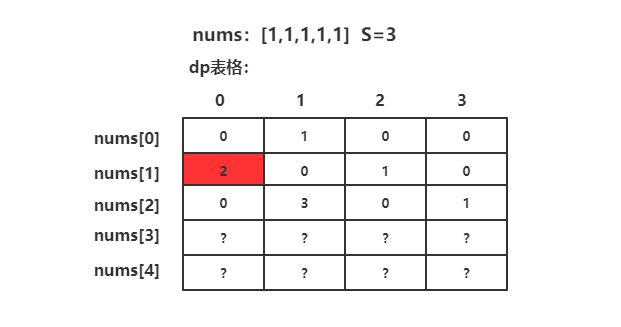
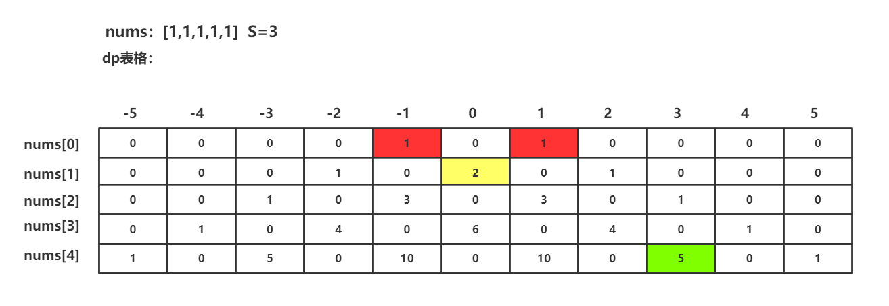

> 原文链接: https://leetcode-cn.com/problems/target-sum


## 英文原文
<div><p>You are given an integer array <code>nums</code> and an integer <code>target</code>.</p>

<p>You want to build an <strong>expression</strong> out of nums by adding one of the symbols <code>&#39;+&#39;</code> and <code>&#39;-&#39;</code> before each integer in nums and then concatenate all the integers.</p>

<ul>
	<li>For example, if <code>nums = [2, 1]</code>, you can add a <code>&#39;+&#39;</code> before <code>2</code> and a <code>&#39;-&#39;</code> before <code>1</code> and concatenate them to build the expression <code>&quot;+2-1&quot;</code>.</li>
</ul>

<p>Return the number of different <strong>expressions</strong> that you can build, which evaluates to <code>target</code>.</p>

<p>&nbsp;</p>
<p><strong>Example 1:</strong></p>

<pre>
<strong>Input:</strong> nums = [1,1,1,1,1], target = 3
<strong>Output:</strong> 5
<strong>Explanation:</strong> There are 5 ways to assign symbols to make the sum of nums be target 3.
-1 + 1 + 1 + 1 + 1 = 3
+1 - 1 + 1 + 1 + 1 = 3
+1 + 1 - 1 + 1 + 1 = 3
+1 + 1 + 1 - 1 + 1 = 3
+1 + 1 + 1 + 1 - 1 = 3
</pre>

<p><strong>Example 2:</strong></p>

<pre>
<strong>Input:</strong> nums = [1], target = 1
<strong>Output:</strong> 1
</pre>

<p>&nbsp;</p>
<p><strong>Constraints:</strong></p>

<ul>
	<li><code>1 &lt;= nums.length &lt;= 20</code></li>
	<li><code>0 &lt;= nums[i] &lt;= 1000</code></li>
	<li><code>0 &lt;= sum(nums[i]) &lt;= 1000</code></li>
	<li><code>-1000 &lt;= target &lt;= 1000</code></li>
</ul>
</div>

## 中文题目
<div><p>给你一个整数数组 <code>nums</code> 和一个整数 <code>target</code> 。</p>

<p>向数组中的每个整数前添加 <code>'+'</code> 或 <code>'-'</code> ，然后串联起所有整数，可以构造一个 <strong>表达式</strong> ：</p>

<ul>
	<li>例如，<code>nums = [2, 1]</code> ，可以在 <code>2</code> 之前添加 <code>'+'</code> ，在 <code>1</code> 之前添加 <code>'-'</code> ，然后串联起来得到表达式 <code>"+2-1"</code> 。</li>
</ul>

<p>返回可以通过上述方法构造的、运算结果等于 <code>target</code> 的不同 <strong>表达式</strong> 的数目。</p>

<p> </p>

<p><strong>示例 1：</strong></p>

<pre>
<strong>输入：</strong>nums = [1,1,1,1,1], target = 3
<strong>输出：</strong>5
<strong>解释：</strong>一共有 5 种方法让最终目标和为 3 。
-1 + 1 + 1 + 1 + 1 = 3
+1 - 1 + 1 + 1 + 1 = 3
+1 + 1 - 1 + 1 + 1 = 3
+1 + 1 + 1 - 1 + 1 = 3
+1 + 1 + 1 + 1 - 1 = 3
</pre>

<p><strong>示例 2：</strong></p>

<pre>
<strong>输入：</strong>nums = [1], target = 1
<strong>输出：</strong>1
</pre>

<p> </p>

<p><strong>提示：</strong></p>

<ul>
	<li><code>1 <= nums.length <= 20</code></li>
	<li><code>0 <= nums[i] <= 1000</code></li>
	<li><code>0 <= sum(nums[i]) <= 1000</code></li>
	<li><code>-1000 <= target <= 1000</code></li>
</ul>
</div>

## 通过代码
<RecoDemo>
</RecoDemo>


## 高赞题解
### 弄懂题意

第一步需要根据题意考虑输出的结构，在【416.分割等和子集】这道题中，要求的输出结果就是boolean值，因此我们定义的dp数组只需要记录T/F即可，但是这道题要求返回结果是方法数，那么我们dp数组需要记录的数据就是具体的方法数。


---

### 定义状态

搞清楚需要输出的结果后，就可以来想办法画一个表格，也就是定义dp数组的含义。根据背包问题的经验，可以将dp[ i ][ j ]定义为从数组nums中 0 - i 的元素进行加减可以得到 j 的方法数量。


---

### 状态转移方程

搞清楚状态以后，我们就可以根据状态去考虑如何根据子问题的转移从而得到整体的解。这道题的关键不是nums[i]的选与不选，而是nums[i]是加还是减，那么我们就可以将方程定义为：

+ **dp[ i ][ j ] = dp[ i - 1 ][ j - nums[ i ] ] + dp[ i - 1 ][ j + nums[ i ] ]**


可以理解为nums[i]这个元素我可以执行加，还可以执行减，那么我dp[i][j]的结果值就是加/减之后对应位置的和。


---

### dp数组的定义

一般背包问题的定义都是dp[len][t+1]。而我一开始基于这个出发就进入了一个误区。下图是我刚开始在本子上画的表格，在计算到第二行的时候就发现不对了，在取值 i=1也就是第二行的时候，很明显[1,1]会有两种得到0的方法，但是我根据上面的方程来算的话，这个dp[1][0]应该等于1才对，百思不得其解，后来我去官方题解确认了下我状态转移方程的正确性，发现并没有问题，我只能接着画图，思考这个多出来的1应该在哪儿？




---

### 打表格

后来前前后后又读了几遍题目，发现我上面那个表格只画了每个元素执行加法的部分，而忽略了执行减法的部分，整个表格区域应该是分为三部分：-/0/+。那么对应的表格的每一行的长度t就可以表示为：t=(sum*2)+1，其中一个sum表示nums中执行全部执行加/减能达到的数，而加的1显然是中间的0.具体表格如下图所示：




那么上面红色部分为什么得2也说的通了，因为忽略了负数部分的那个1，加上负数部分以后就可以得到正确的结果了。而绿色部分的表格值就是我们本题的解。dp表示为：dp[len - 1][sum + s]。


---

### 初始化

这道题有个坑的地方，就是nums[0]可能等于0，这样初始化dp数组第一行的时候很可能踩坑，因为如果nums[0]==0那么dp[0][sum]需要初始化为2，因为加减0都得0。具体代码如下：

```java

    public static int findTargetSumWays(int[] nums, int s) {

        int sum = 0;

        for (int i = 0; i < nums.length; i++) {

            sum += nums[i];

        }

        // 绝对值范围超过了sum的绝对值范围则无法得到

        if (Math.abs(s) > Math.abs(sum)) return 0;


        int len = nums.length;

        // - 0 +

        int t = sum * 2 + 1;

        int[][] dp = new int[len][t];

        // 初始化

        if (nums[0] == 0) {

            dp[0][sum] = 2;

        } else {

            dp[0][sum + nums[0]] = 1;

            dp[0][sum - nums[0]] = 1;

        }


        for (int i = 1; i < len; i++) {

            for (int j = 0; j < t; j++) {

                // 边界

                int l = (j - nums[i]) >= 0 ? j - nums[i] : 0;

                int r = (j + nums[i]) < t ? j + nums[i] : 0;

                dp[i][j] = dp[i - 1][l] + dp[i - 1][r];

            }

        }

        return dp[len - 1][sum + s];

    }


```

以上代码都是按照题解的思路一步一步写的，无论是空间还是时间都有很大的优化空间，不过我这里只打算提供一个思路，具体的优化就不写啦~感谢各位能看到这里，如果发现哪里有误多多包涵，欢迎指正。


---

感谢各位的细心~发现了图片中数据的错误。给大家带来的错误的图示，抱歉！T_T


## 统计信息
| 通过次数 | 提交次数 | AC比率 |
| :------: | :------: | :------: |
|    162945    |    331099    |   49.2%   |

## 提交历史
| 提交时间 | 提交结果 | 执行时间 |  内存消耗  | 语言 |
| :------: | :------: | :------: | :--------: | :--------: |


## 相似题目
|                             题目                             | 难度 |
| :----------------------------------------------------------: | :---------: |
| [给表达式添加运算符](https://leetcode-cn.com/problems/expression-add-operators/) | 困难|
