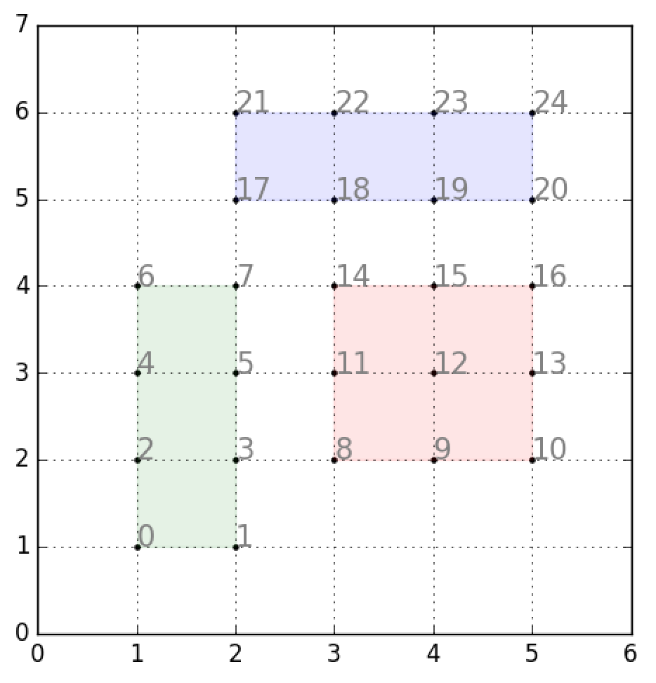

> 原文链接: https://leetcode-cn.com/problems/random-point-in-non-overlapping-rectangles


## 英文原文
<div><p>You are given an array of non-overlapping axis-aligned rectangles <code>rects</code> where <code>rects[i] = [a<sub>i</sub>, b<sub>i</sub>, x<sub>i</sub>, y<sub>i</sub>]</code> indicates that <code>(a<sub>i</sub>, b<sub>i</sub>)</code> is the bottom-left corner point of the <code>i<sup>th</sup></code> rectangle and <code>(x<sub>i</sub>, y<sub>i</sub>)</code> is the top-right corner point of the <code>i<sup>th</sup></code> rectangle. Design an algorithm to pick a random integer point inside the space covered by one of the given rectangles. A point on the perimeter of a rectangle is included in the space covered by the rectangle.</p>

<p>Any integer point inside the space covered by one of the given rectangles should be equally likely to be returned.</p>

<p><strong>Note</strong> that an integer point is a point that has integer coordinates.</p>

<p>Implement the <code>Solution</code> class:</p>

<ul>
	<li><code>Solution(int[][] rects)</code> Initializes the object with the given rectangles <code>rects</code>.</li>
	<li><code>int[] pick()</code> Returns a random integer point <code>[u, v]</code> inside the space covered by one of the given rectangles.</li>
</ul>

<p>&nbsp;</p>
<p><strong>Example 1:</strong></p>

<pre>
<strong>Input</strong>
[&quot;Solution&quot;, &quot;pick&quot;, &quot;pick&quot;, &quot;pick&quot;, &quot;pick&quot;, &quot;pick&quot;]
[[[[-2, -2, 1, 1], [2, 2, 4, 6]]], [], [], [], [], []]
<strong>Output</strong>
[null, [1, -2], [1, -1], [-1, -2], [-2, -2], [0, 0]]

<strong>Explanation</strong>
Solution solution = new Solution([[-2, -2, 1, 1], [2, 2, 4, 6]]);
solution.pick(); // return [1, -2]
solution.pick(); // return [1, -1]
solution.pick(); // return [-1, -2]
solution.pick(); // return [-2, -2]
solution.pick(); // return [0, 0]
</pre>

<p>&nbsp;</p>
<p><strong>Constraints:</strong></p>

<ul>
	<li><code>1 &lt;= rects.length &lt;= 100</code></li>
	<li><code>rects[i].length == 4</code></li>
	<li><code>-10<sup>9</sup> &lt;= a<sub>i</sub> &lt; x<sub>i</sub> &lt;= 10<sup>9</sup></code></li>
	<li><code>-10<sup>9</sup> &lt;= b<sub>i</sub> &lt; y<sub>i</sub> &lt;= 10<sup>9</sup></code></li>
	<li><code>x<sub>i</sub> - a<sub>i</sub> &lt;= 2000</code></li>
	<li><code>y<sub>i</sub> - b<sub>i</sub> &lt;= 2000</code></li>
	<li>All the rectangles do not overlap.</li>
	<li>At most <code>10<sup>4</sup></code> calls will be made to <code>pick</code>.</li>
</ul>
</div>

## 中文题目
<div><p>给定一个非重叠轴对齐矩形的列表 <code>rects</code>，写一个函数 <code>pick</code> 随机均匀地选取矩形覆盖的空间中的整数点。</p>

<p>提示：</p>

<ol>
	<li><strong>整数点</strong>是具有整数坐标的点。</li>
	<li>矩形周边上的点包含在矩形覆盖的空间中。</li>
	<li>第 <code>i</code> 个矩形 <code>rects [i] = [x1，y1，x2，y2]</code>，其中&nbsp;<code>[x1，y1]</code> 是左下角的整数坐标，<code>[x2，y2]</code> 是右上角的整数坐标。</li>
	<li>每个矩形的长度和宽度不超过 2000。</li>
	<li><code>1 &lt;= rects.length&nbsp;&lt;= 100</code></li>
	<li><code>pick</code> 以整数坐标数组&nbsp;<code>[p_x, p_y]</code>&nbsp;的形式返回一个点。</li>
	<li><code>pick</code> 最多被调用10000次。</li>
</ol>

<p>&nbsp;</p>

<p><strong>示例 1：</strong></p>

<pre>
<strong>输入: 
</strong>[&quot;Solution&quot;,&quot;pick&quot;,&quot;pick&quot;,&quot;pick&quot;]
[[[[1,1,5,5]]],[],[],[]]
<strong>输出: 
</strong>[null,[4,1],[4,1],[3,3]]
</pre>

<p><strong>示例 2：</strong></p>

<pre>
<strong>输入: 
</strong>[&quot;Solution&quot;,&quot;pick&quot;,&quot;pick&quot;,&quot;pick&quot;,&quot;pick&quot;,&quot;pick&quot;]
[[[[-2,-2,-1,-1],[1,0,3,0]]],[],[],[],[],[]]
<strong>输出: 
</strong>[null,[-1,-2],[2,0],[-2,-1],[3,0],[-2,-2]]</pre>

<p>&nbsp;</p>

<p><strong>输入语法的说明：</strong></p>

<p>输入是两个列表：调用的子例程及其参数。<code>Solution</code> 的构造函数有一个参数，即矩形数组 <code>rects</code>。<code>pick</code> 没有参数。参数总是用列表包装的，即使没有也是如此。</p>

<p>&nbsp;</p>
</div>

## 通过代码
<RecoDemo>
</RecoDemo>


## 官方题解
#### 方法一：二分查找

我们用 `w[i]` 表示第 `i` 个矩形 `rect[i]` 中整数点的数目，那么我们的随机算法需要使得每个矩形被选到的概率与 `w[i]` 成正比（这样也就保证了空间中的每个整数点被选到的概率都是相等的）。具体地，`rect[i]` 被选到的概率应当为 `w[i] / sum(w[i])`，其中 `sum(w[i])` 表示空间中的整数点数目之和。

令 `tot = sum(w[i])`，我们可以在 `[0, tot)` 区间内生成随机整数。假设生成的数为 `x`，那么我们需要找到满足 `prefix(w[i - 1]) <= x < prefix(w[i])` 的 `i`，其中 `prefix(w[i])` 表示前 `i` 个矩形中整数点的数目之和，此时我们选中了第 `i` 个矩形。我们可以使用二分查找，找出对应的 `i`。

在选中了第 `i` 个矩形后，我们也可以在 `[0, w[i])` 中再次生成随机数，来在这个矩形中随机选择一个点。更好的做法是我们仍然使用之前生成的数 `x`，令 `y = x - prefix(w[i - 1])`，我们只需要选择第 `i` 个矩形中的第 `y` 个点即可，对应的坐标为：

```
x_coord = x_start + y % (x_end - x_start + 1)
y_coord = y_start + y / (x_end - x_start + 1)
```

这相当于把第 `i` 个矩形中的坐标按照 `y` 轴优先的顺序依次排列，每一个点都可以通过上述的方式恢复到矩形中的坐标。

{:width=260px}

```C++ [sol1]
class Solution {
public:

    vector<vector<int>> rects;
    vector<int> psum;
    int tot = 0;
    //c++11 random integer generation
    mt19937 rng{random_device{}()};
    uniform_int_distribution<int> uni;

    Solution(vector<vector<int>> rects) {
        this->rects = rects;
        for (auto& x : rects) {
            tot += (x[2] - x[0] + 1) * (x[3] - x[1] + 1);
            psum.push_back(tot);
        }
        uni = uniform_int_distribution<int>{0, tot - 1};
    }

    vector<int> pick() {
        int targ = uni(rng);

        int lo = 0;
        int hi = rects.size() - 1;
        while (lo != hi) {
            int mid = (lo + hi) / 2;
            if (targ >= psum[mid]) lo = mid + 1;
            else hi = mid;
        }

        auto& x = rects[lo];
        int width = x[2] - x[0] + 1;
        int height = x[3] - x[1] + 1;
        int base = psum[lo] - width * height;
        return {x[0] + (targ - base) % width, x[1] + (targ - base) / width};
    }
};
```

```Java [sol1]
class Solution {

    int[][] rects;
    List<Integer> psum = new ArrayList<>();
    int tot = 0;
    Random rand = new Random();

    public Solution(int[][] rects) {
        this.rects = rects;
        for (int[] x : rects){
            tot += (x[2] - x[0] + 1) * (x[3] - x[1] + 1);
            psum.add(tot);
        }
    }

    public int[] pick() {
        int targ = rand.nextInt(tot);

        int lo = 0;
        int hi = rects.length - 1;
        while (lo != hi) {
            int mid = (lo + hi) / 2;
            if (targ >= psum.get(mid)) lo = mid + 1;
            else hi = mid;
        }

        int[] x = rects[lo];
        int width = x[2] - x[0] + 1;
        int height = x[3] - x[1] + 1;
        int base = psum.get(lo) - width * height;
        return new int[]{x[0] + (targ - base) % width, x[1] + (targ - base) / width};
    }
}
```

**复杂度分析**

* 时间复杂度：预处理的时间复杂度为 $O(N)$，随机选取的单次时间复杂度为 $O(\log N)$。

* 空间复杂度：$O(N)$。

## 统计信息
| 通过次数 | 提交次数 | AC比率 |
| :------: | :------: | :------: |
|    3228    |    7989    |   40.4%   |

## 提交历史
| 提交时间 | 提交结果 | 执行时间 |  内存消耗  | 语言 |
| :------: | :------: | :------: | :--------: | :--------: |


## 相似题目
|                             题目                             | 难度 |
| :----------------------------------------------------------: | :---------: |
| [按权重随机选择](https://leetcode-cn.com/problems/random-pick-with-weight/) | 中等|
| [在圆内随机生成点](https://leetcode-cn.com/problems/generate-random-point-in-a-circle/) | 中等|
