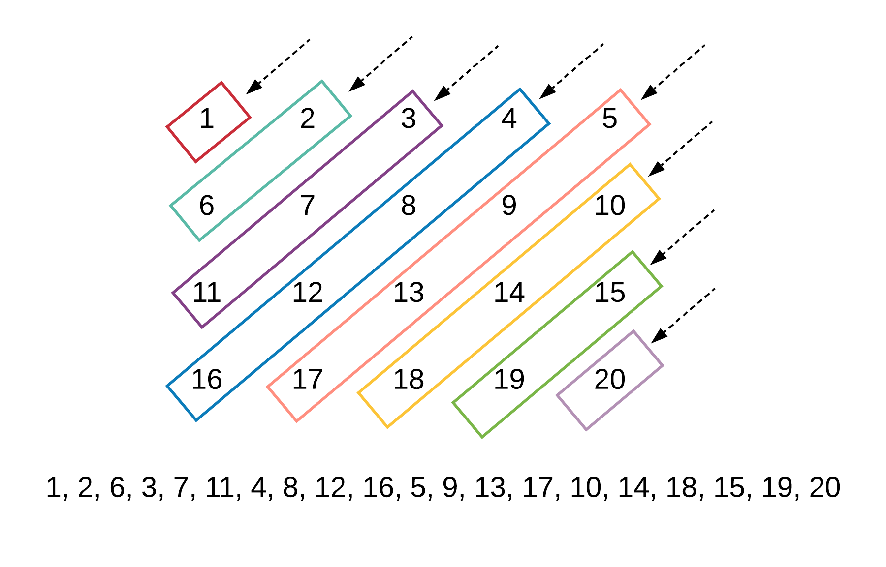
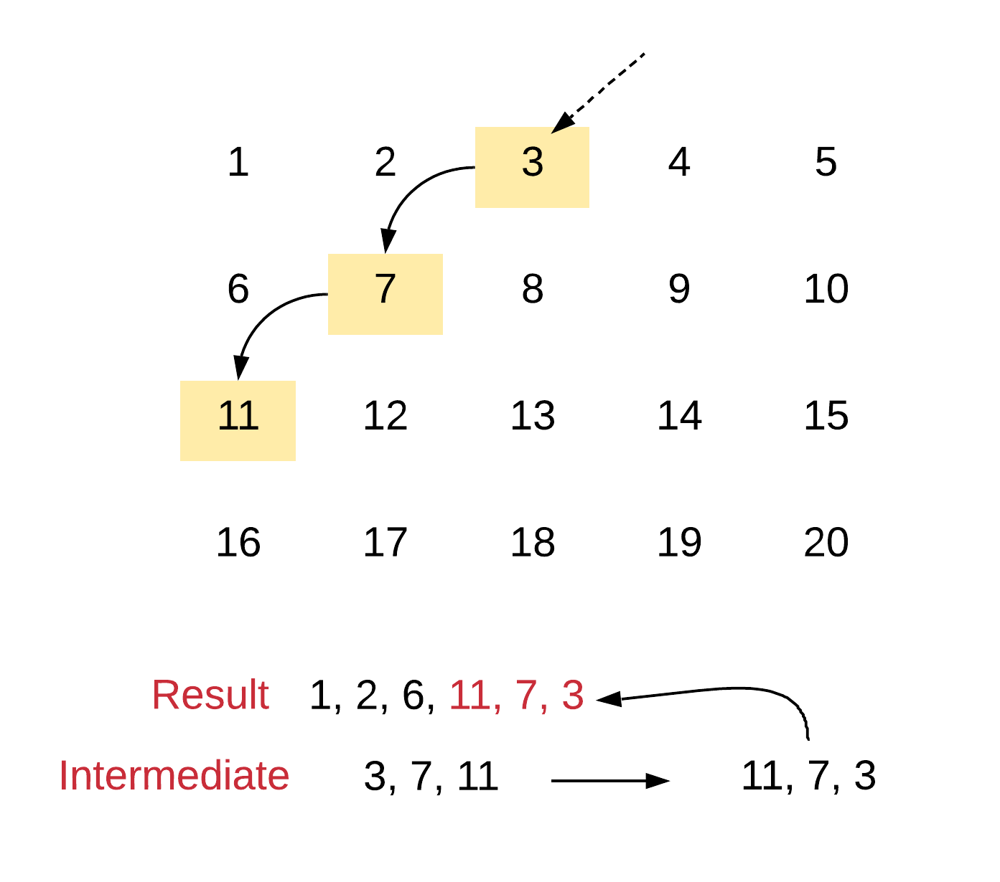
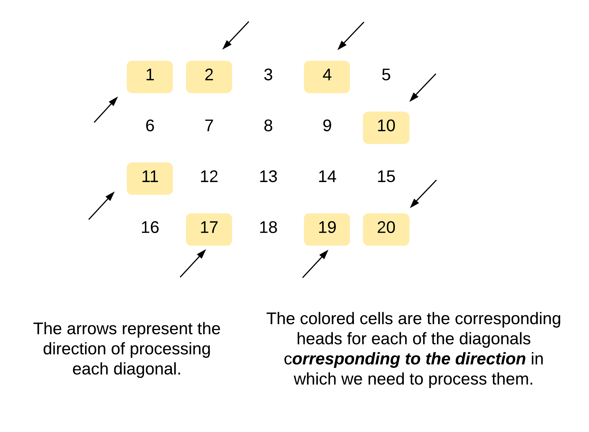

> 原文链接: https://leetcode-cn.com/problems/diagonal-traverse


## 英文原文
<div><p>Given an <code>m x n</code> matrix <code>mat</code>, return <em>an array of all the elements of the array in a diagonal order</em>.</p>

<p>&nbsp;</p>
<p><strong>Example 1:</strong></p>

<pre>
<strong>Input:</strong> mat = [[1,2,3],[4,5,6],[7,8,9]]
<strong>Output:</strong> [1,2,4,7,5,3,6,8,9]
</pre>

<p><strong>Example 2:</strong></p>

<pre>
<strong>Input:</strong> mat = [[1,2],[3,4]]
<strong>Output:</strong> [1,2,3,4]
</pre>

<p>&nbsp;</p>
<p><strong>Constraints:</strong></p>

<ul>
	<li><code>m == mat.length</code></li>
	<li><code>n == mat[i].length</code></li>
	<li><code>1 &lt;= m, n &lt;= 10<sup>4</sup></code></li>
	<li><code>1 &lt;= m * n &lt;= 10<sup>4</sup></code></li>
	<li><code>-10<sup>5</sup> &lt;= mat[i][j] &lt;= 10<sup>5</sup></code></li>
</ul>
</div>

## 中文题目
<div><p>给你一个大小为 <code>m x n</code> 的矩阵 <code>mat</code> ，请以对角线遍历的顺序，用一个数组返回这个矩阵中的所有元素。</p>

<p>&nbsp;</p>

<p><strong>示例 1：</strong></p>

<pre>
<strong>输入：</strong>mat = [[1,2,3],[4,5,6],[7,8,9]]
<strong>输出：</strong>[1,2,4,7,5,3,6,8,9]
</pre>

<p><strong>示例 2：</strong></p>

<pre>
<strong>输入：</strong>mat = [[1,2],[3,4]]
<strong>输出：</strong>[1,2,3,4]
</pre>

<p>&nbsp;</p>

<p><strong>提示：</strong></p>

<ul>
	<li><code>m == mat.length</code></li>
	<li><code>n == mat[i].length</code></li>
	<li><code>1 &lt;= m, n &lt;= 10<sup>4</sup></code></li>
	<li><code>1 &lt;= m * n &lt;= 10<sup>4</sup></code></li>
	<li><code>-10<sup>5</sup> &lt;= mat[i][j] &lt;= 10<sup>5</sup></code></li>
</ul>
</div>

## 通过代码
<RecoDemo>
</RecoDemo>


## 官方题解
#### 方法一：对角线迭代和翻转

**思路**

解决许多复杂问题的常见策略是首先解决该问题的简化问题，然后考虑从简化问题到原始问题需要做哪些修改，方法一就是这种思路。首先考虑按照逐条对角线打印元素，而不考虑翻转的情况。



在第一行最后一列的元素作为起点的对角线上，对于给定元素 $[i, j]$，可以向右移动一行向上移动一列沿对角线向上移动 $[i - 1, j + 1]$，也可以向左移动一行向下移动一列沿对角线向下移动 $[i + 1, j - 1]$。*注意：这种移动方式仅适用于从右往左的对角线。*

该问题比原始问题简单，没有考虑对角线打印顺序的情况。因此，这就是简化问题需要修改的地方。

> 将元素添加到最终结果数组之前，只需要翻转奇数对角线上的元素顺序即可。例如：从左边开始的第三条对角线 [3, 7, 11]，将这些元素添加到最后结果之前先翻转为 [11, 7, 3] 再添加即可。

**算法**

1. 初始化数组 `result`，用于存储最后结果。

2. 使用一个外层循环遍历所有的对角线。第一行和最后一列的元素都是对角线的起点。

3. 使用一个内层 while 循环遍历对角线上的所有元素。可以计算指定对角线上的元素数量，也可以简单迭代直到索引超出范围。

4. 因为不知道每条对角线上的元素数量，需要为每条对角线分配一个列表或动态数组。但是同样也可以通过计算得到当前对角线上的元素数量。

5. 对于奇数编号的对角线，只需要将迭代结果翻转再加入结果数组即可。



```java [solution1-Java]
class Solution {
    public int[] findDiagonalOrder(int[][] matrix) {
        
        // Check for empty matrices
        if (matrix == null || matrix.length == 0) {
            return new int[0];
        }
        
        // Variables to track the size of the matrix
        int N = matrix.length;
        int M = matrix[0].length;
        
        // The two arrays as explained in the algorithm
        int[] result = new int[N*M];
        int k = 0;
        ArrayList<Integer> intermediate = new ArrayList<Integer>();
        
        // We have to go over all the elements in the first
        // row and the last column to cover all possible diagonals
        for (int d = 0; d < N + M - 1; d++) {
            
            // Clear the intermediate array every time we start
            // to process another diagonal
            intermediate.clear();
            
            // We need to figure out the "head" of this diagonal
            // The elements in the first row and the last column
            // are the respective heads.
            int r = d < M ? 0 : d - M + 1;
            int c = d < M ? d : M - 1;
            
            // Iterate until one of the indices goes out of scope
            // Take note of the index math to go down the diagonal
            while (r < N && c > -1) {
                
                intermediate.add(matrix[r][c]);
                ++r;
                --c;
            }
                
            // Reverse even numbered diagonals. The
            // article says we have to reverse odd 
            // numbered articles but here, the numbering
            // is starting from 0 :P
            if (d % 2 == 0) {
                Collections.reverse(intermediate);
            }
            
            for (int i = 0; i < intermediate.size(); i++) {
                result[k++] = intermediate.get(i);
            }
        }
        return result;
    }
}
```

```python [solution1-Python]
class Solution:
    
    def findDiagonalOrder(self, matrix: List[List[int]]) -> List[int]:
        
        # Check for empty matrices
        if not matrix or not matrix[0]:
            return []
        
        # Variables to track the size of the matrix
        N, M = len(matrix), len(matrix[0])
        
        # The two arrays as explained in the algorithm
        result, intermediate = [], []
        
        # We have to go over all the elements in the first
        # row and the last column to cover all possible diagonals
        for d in range(N + M - 1):
            
            # Clear the intermediate array everytime we start
            # to process another diagonal
            intermediate.clear()
            
            # We need to figure out the "head" of this diagonal
            # The elements in the first row and the last column
            # are the respective heads.
            r, c = 0 if d < M else d - M + 1, d if d < M else M - 1
            
            # Iterate until one of the indices goes out of scope
            # Take note of the index math to go down the diagonal
            while r < N and c > -1:
                intermediate.append(matrix[r][c])
                r += 1
                c -= 1
            
            # Reverse even numbered diagonals. The
            # article says we have to reverse odd 
            # numbered articles but here, the numbering
            # is starting from 0 :P
            if d % 2 == 0:
                result.extend(intermediate[::-1])
            else:
                result.extend(intermediate)
        return result        
```

**复杂度分析**

* 时间复杂度：$O(N \cdot M)$，数组有 $N$ 行 $M$ 列。对于所有奇数对角线上的元素，需要两次处理，迭代和翻转。为了节省空间，需要遍历新对角线之前清除中间使用的空间，该操作需要 $O(K)$ 的复杂度度，其中 $K$ 是数组长度。因此至少处理两次数组中的元素，渐进复杂度为 $O(N \cdot M)$。

* 空间复杂度：$O(min(N, M))$，额外空间用于存储每条对角线的中间数组，该数组长度为 $N$ 和 $M$ 的最小值。注意：对角线延伸到索引超出范围结束。


#### 方法二：模拟

**思路**

按照题目要求，模拟在数组中的行走路线，得到想要的遍历顺序。为了实现此模拟，必须清楚数组内部的行走策略。对每条对角线需要明确两件事情：

1. 知道该对角线的行走方向。

2. 确定对角线的起点元素，这取决于对角线的行走方向。

下图中标注了每条对角线的这两个信息。



确定对角线的方向很简单。只需要设置一个布尔型变量，保持交替来确定对角线方向即可。棘手的是如何确定对角线的起始位置。

好消息是我们已经知道上一个对角线的尾部，可以以此来确定下一条对角线的首部。

**向上行走时的下一条对角线首部**

位于向下行走对角线尾端时，找出下一个向上行走对角线头部有两种情况。


找出向上行走对角线头部需要遵循两个规则：

> 如果当前尾部不在矩阵最后一行，则下一个对角线的头部是当前尾部的正下方元素；否则，下一条对角线首部是当前尾部的右边元素。

**向下行走时的下一条对角线尾部** 

位于向上行走对角线尾部时，找出下一个向下行走对角线首部有两种情况。


找出向下行走对角线头部需要遵循两个规则：

> 如果当前尾部不在矩阵最后一行，下一条对角线的首部是当前尾部正下方元素；否则，下一条对角线首部是当前尾部的右边元素。

**算法**

1. 初始化一个布尔变量 `direction` 表示当前对角线的方向。根据当前方向和尾部位置确定下一条对角线首部。最初 `direction` 为 1，方向向上。每条对角线遍历完成后更新 `direction`。

2. 假设当前对角线首部为 $matrix[i][j]$，根据方向遍历该对角线。

    - 向上的对角线，下一个元素是 $matrix[i - 1][j + 1]$。

    - 向下的对角线，下一个元素是 $matrix[i + 1][j - 1]$。

3. 遍历当前对角线元素直到到达矩阵边界结束。

4. 假设现在到达当前对角线的最后一个元素，寻找下一条对角线首部。注意：下面伪代码中方向是当前对角线方向。如果当前对角线方向是向上的，则下一条对角线是向下的；否则是下一条对角线是向上的。

   ```python [snippet1-Python]
   tail = [i, j]
   if direction == up, then {
      if [i, j + 1] is within bounds, then {
          next_head = [i, j + 1]
      } else { 
          next_head = [i + 1, j]
      }
   } else {
      if [i + 1, j] is within bounds, then {
          next_head = [i + 1, j]
      } else { 
          next_head = [i, j + 1]
      }
   }
    ```

5. 继续处理对角线元素，当前对角线遍历结束时，使用当前方向和尾部位置找出下一条对角线首部。然后翻转方向，处理下一条对角线。

```java [solution1-Java]
class Solution {
    public int[] findDiagonalOrder(int[][] matrix) {
        
        // Check for empty matrices
        if (matrix == null || matrix.length == 0) {
            return new int[0];
        }
        
        // Variables to track the size of the matrix
        int N = matrix.length;
        int M = matrix[0].length;
        
        // Incides that will help us progress through 
        // the matrix, one element at a time.
        int row = 0, column = 0;
        
        // As explained in the article, this is the variable
        // that helps us keep track of what direction we are
        // processing the current diaonal
        int direction = 1;
        
         // The final result array
        int[] result = new int[N*M];
        int r = 0;
        
        // The uber while loop which will help us iterate over all
        // the elements in the array.
        while (row < N && column < M) {
            
            // First and foremost, add the current element to 
            // the result matrix. 
            result[r++] = matrix[row][column];
            
            // Move along in the current diagonal depending upon
            // the current direction.[i, j] -> [i - 1, j + 1] if 
            // going up and [i, j] -> [i + 1][j - 1] if going down.
            int new_row = row + (direction == 1 ? -1 : 1);
            int new_column = column + (direction == 1 ? 1 : -1);
            
            // Checking if the next element in the diagonal is within the
            // bounds of the matrix or not. If it's not within the bounds,
            // we have to find the next head. 
            if (new_row < 0 || new_row == N || new_column < 0 || new_column == M) {
                
                // If the current diagonal was going in the upwards
                // direction.
                if (direction == 1) {
                    
                    // For an upwards going diagonal having [i, j] as its tail
                    // If [i, j + 1] is within bounds, then it becomes
                    // the next head. Otherwise, the element directly below
                    // i.e. the element [i + 1, j] becomes the next head
                    row += (column == M - 1 ? 1 : 0) ;
                    column += (column < M - 1 ? 1 : 0);
                        
                } else {
                    
                    // For a downwards going diagonal having [i, j] as its tail
                    // if [i + 1, j] is within bounds, then it becomes
                    // the next head. Otherwise, the element directly below
                    // i.e. the element [i, j + 1] becomes the next head
                    column += (row == N - 1 ? 1 : 0);
                    row += (row < N - 1 ? 1 : 0);
                }
                    
                // Flip the direction
                direction = 1 - direction;        
                        
            } else {
                
                row = new_row;
                column = new_column;
            }
        }
        return result;      
    }
}
```

```python [solution1-Python]
class Solution:
    
    def findDiagonalOrder(self, matrix: List[List[int]]) -> List[int]:
        
        # Check for an empty matrix
        if not matrix or not matrix[0]:
            return []
        
        # The dimensions of the matrix
        N, M = len(matrix), len(matrix[0])
        
        # Incides that will help us progress through 
        # the matrix, one element at a time.
        row, column = 0, 0
        
        # As explained in the article, this is the variable
        # that helps us keep track of what direction we are
        # processing the current diaonal
        direction = 1
        
        # Final result array that will contain all the elements
        # of the matrix
        result = []
        
        # The uber while loop which will help us iterate over all
        # the elements in the array.
        while row < N and column < M:
            
            # First and foremost, add the current element to 
            # the result matrix. 
            result.append(matrix[row][column])
            
            # Move along in the current diagonal depending upon
            # the current direction.[i, j] -> [i - 1, j + 1] if 
            # going up and [i, j] -> [i + 1][j - 1] if going down.
            new_row = row + (-1 if direction == 1 else 1)
            new_column = column + (1 if direction == 1 else -1)
            
            # Checking if the next element in the diagonal is within the
            # bounds of the matrix or not. If it's not within the bounds,
            # we have to find the next head. 
            if new_row < 0 or new_row == N or new_column < 0 or new_column == M:
                
                # If the current diagonal was going in the upwards
                # direction.
                if direction:
                    
                    # For an upwards going diagonal having [i, j] as its tail
                    # If [i, j + 1] is within bounds, then it becomes
                    # the next head. Otherwise, the element directly below
                    # i.e. the element [i + 1, j] becomes the next head
                    row += (column == M - 1)
                    column += (column < M - 1)
                else:
                    
                    # For a downwards going diagonal having [i, j] as its tail
                    # if [i + 1, j] is within bounds, then it becomes
                    # the next head. Otherwise, the element directly below
                    # i.e. the element [i, j + 1] becomes the next head
                    column += (row == N - 1)
                    row += (row < N - 1)
                    
                # Flip the direction
                direction = 1 - direction        
            else:
                row = new_row
                column = new_column
                        
        return result                 
```

**复杂度分析**

* 时间复杂度：$O(N \cdot M)$，每个元素只处理一次。

* 空间复杂度：$O(1)$，不使用额外空间。注意：输出数组空间不计入空间复杂度，因为这是题目要求的空间。空间复杂度应该指除了最终数组以外的空间。上一个方法中是中间数组，该方法中只有几个变量。

## 统计信息
| 通过次数 | 提交次数 | AC比率 |
| :------: | :------: | :------: |
|    46971    |    98687    |   47.6%   |

## 提交历史
| 提交时间 | 提交结果 | 执行时间 |  内存消耗  | 语言 |
| :------: | :------: | :------: | :--------: | :--------: |
