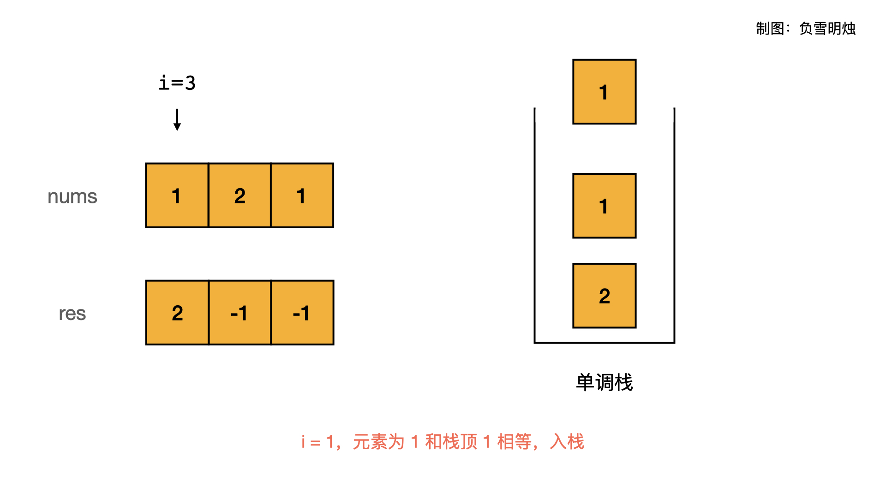

> 原文链接: https://leetcode-cn.com/problems/next-greater-element-ii


## 英文原文
<div><p>Given a circular integer array <code>nums</code> (i.e., the next element of <code>nums[nums.length - 1]</code> is <code>nums[0]</code>), return <em>the <strong>next greater number</strong> for every element in</em> <code>nums</code>.</p>

<p>The <strong>next greater number</strong> of a number <code>x</code> is the first greater number to its traversing-order next in the array, which means you could search circularly to find its next greater number. If it doesn&#39;t exist, return <code>-1</code> for this number.</p>

<p>&nbsp;</p>
<p><strong>Example 1:</strong></p>

<pre>
<strong>Input:</strong> nums = [1,2,1]
<strong>Output:</strong> [2,-1,2]
Explanation: The first 1&#39;s next greater number is 2; 
The number 2 can&#39;t find next greater number. 
The second 1&#39;s next greater number needs to search circularly, which is also 2.
</pre>

<p><strong>Example 2:</strong></p>

<pre>
<strong>Input:</strong> nums = [1,2,3,4,3]
<strong>Output:</strong> [2,3,4,-1,4]
</pre>

<p>&nbsp;</p>
<p><strong>Constraints:</strong></p>

<ul>
	<li><code>1 &lt;= nums.length &lt;= 10<sup>4</sup></code></li>
	<li><code>-10<sup>9</sup> &lt;= nums[i] &lt;= 10<sup>9</sup></code></li>
</ul>
</div>

## 中文题目
<div><p>给定一个循环数组（最后一个元素的下一个元素是数组的第一个元素），输出每个元素的下一个更大元素。数字 x 的下一个更大的元素是按数组遍历顺序，这个数字之后的第一个比它更大的数，这意味着你应该循环地搜索它的下一个更大的数。如果不存在，则输出 -1。</p>

<p><strong>示例 1:</strong></p>

<pre>
<strong>输入:</strong> [1,2,1]
<strong>输出:</strong> [2,-1,2]
<strong>解释:</strong> 第一个 1 的下一个更大的数是 2；
数字 2 找不到下一个更大的数； 
第二个 1 的下一个最大的数需要循环搜索，结果也是 2。
</pre>

<p><strong>注意:</strong> 输入数组的长度不会超过 10000。</p>
</div>

## 通过代码
<RecoDemo>
</RecoDemo>


## 高赞题解
各位题友大家好！ 今天是 **[@负雪明烛](/u/fuxuemingzhu/)** 坚持日更的第 **41** 天。今天力扣上的每日一题是「[503. 下一个更大元素 II](https://leetcode-cn.com/problems/next-greater-element-ii/)」。

# 解题思路

今天题目的两个重点：


- 如何求下一个更大的元素
- 如何实现循环数组


## 1. 如何求下一个更大的元素

本题如果暴力求解，对于每个元素都向后去寻找比它更大的元素，那么时间复杂度 $O(N^2)$ 会超时。必须想办法优化。


我们注意到，暴力解法中，如果数组的前半部分是单调不增的，那么会有很大的计算资源的浪费。比如说 `[6,5,4,3,8]`，对于前面的 `[6,5,4,3]` 等数字都需要向后遍历，当寻找到元素 8 时才找到了比自己大的元素；而如果已知元素 6 向后找到元素 8 才找到了比自己的大的数字，那么对于元素 `[5,4,3]` 来说，它们都比元素 6 更小，所以比它们更大的元素一定是元素 8，不需要单独遍历对 `[5,4,3]` 向后遍历一次！


根据上面的分析可知，**可以遍历一次数组，如果元素是单调递减的（则他们的「下一个更大元素」相同），我们就把这些元素保存，直到找到一个较大的元素；把该较大元素逐一跟保存了的元素比较，如果该元素更大，那么它就是前面元素的「下一个更大元素」**。

在实现上，我们可以使用「**单调栈**」来实现，**单调栈**是说栈里面的元素从栈底到栈顶是**单调递增**或者**单调递减**的（类似于汉诺塔）。


本题应该用个「单调递减栈」来实现。


建立「单调递减栈」，并对原数组遍历一次：

- 如果栈为空，则把当前元素放入栈内；
- 如果栈不为空，则需要判断当前元素和栈顶元素的大小：
  - 如果当前元素比栈顶元素大：说明当前元素是前面一些元素的「下一个更大元素」，则逐个弹出栈顶元素，直到当前元素比栈顶元素小为止。
  - 如果当前元素比栈顶元素小：说明当前元素的「下一个更大元素」与栈顶元素相同，则把当前元素入栈。


可以用下面的动图来帮助理解：


也可以用下面 PPT 逐步观看：

<,,,,,,,,,,,>


## 2. 如何实现循环数组

题目说给出的数组是循环数组，何为循环数组？就是说数组的最后一个元素下一个元素是数组的第一个元素，形状类似于「环」。


- 一种实现方式是，把数组复制一份到数组末尾，这样虽然不是严格的循环数组，但是对于本题已经足够了，因为本题对数组最多遍历两次。
- 另一个常见的实现方式是，使用取模运算 $%$ 可以把下标 $i$ 映射到数组 $nums$ 长度的 $0 - N$ 内。

# 代码


栈里面需要保存元素在数组中的下标，而不是具体的数字。因为需要根据下标修改结果数组 `res`。


```python
class Solution(object):
    def nextGreaterElements(self, nums):
        """
        :type nums: List[int]
        :rtype: List[int]
        """
        N = len(nums)
        res = [-1] * N
        stack = []
        for i in range(N * 2):
            while stack and nums[stack[-1]] < nums[i % N]:
                res[stack.pop()] = nums[i % N]
            stack.append(i % N)
        return res
```


- 时间复杂度：$O(N)$，遍历了两次数组；
- 空间复杂度：$O(N)$，使用了额外空间「单调栈」，最坏情况下，栈内会保存数组的所有元素。


# 刷题心得


单调栈是神器之一，虽然考察的不多，但是需要学会。

-----


OK，以上就是 [@负雪明烛](https://leetcode-cn.com/u/fuxuemingzhu/) 写的今天题解的全部内容了，如果你觉得有帮助的话，**求赞、求关注、求收藏**。如果有疑问的话，请在下面评论，我会及时解答。


**关注我**，你将不会错过我的精彩动画题解、面试题分享、组队刷题活动，进入主页 [@负雪明烛](https://leetcode-cn.com/u/fuxuemingzhu/) 右侧有刷题组织，从此刷题不再孤单。


祝大家牛年大吉！AC 多多，Offer 多多！我们明天再见！

## 统计信息
| 通过次数 | 提交次数 | AC比率 |
| :------: | :------: | :------: |
|    110866    |    173535    |   63.9%   |

## 提交历史
| 提交时间 | 提交结果 | 执行时间 |  内存消耗  | 语言 |
| :------: | :------: | :------: | :--------: | :--------: |


## 相似题目
|                             题目                             | 难度 |
| :----------------------------------------------------------: | :---------: |
| [下一个更大元素 I](https://leetcode-cn.com/problems/next-greater-element-i/) | 简单|
| [下一个更大元素 III](https://leetcode-cn.com/problems/next-greater-element-iii/) | 中等|
