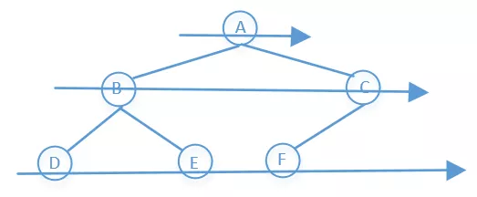
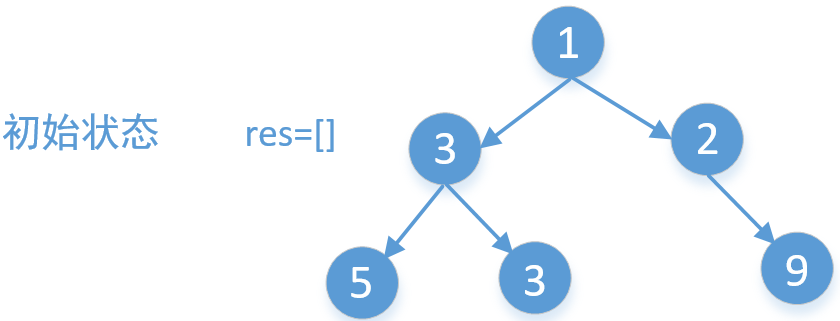
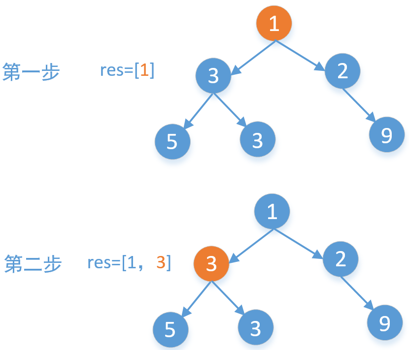
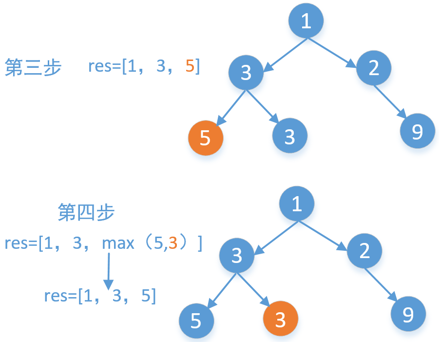
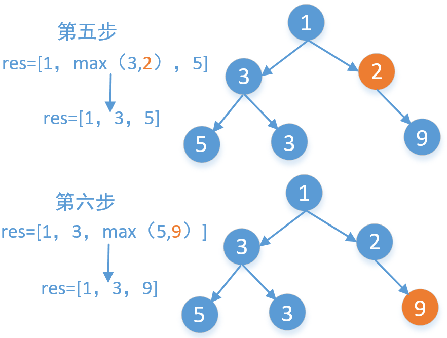

> 原文链接: https://leetcode-cn.com/problems/find-largest-value-in-each-tree-row


## 英文原文
<div><p>Given the <code>root</code> of a binary tree, return <em>an array of the largest value in each row</em> of the tree <strong>(0-indexed)</strong>.</p>

<p>&nbsp;</p>

<p>&nbsp;</p>
<p><strong>Example 1:</strong></p>

<pre>
<strong>Input:</strong> root = [1,3,2,5,3,null,9]
<strong>Output:</strong> [1,3,9]
</pre>

<p><strong>Example 2:</strong></p>

<pre>
<strong>Input:</strong> root = [1,2,3]
<strong>Output:</strong> [1,3]
</pre>

<p><strong>Example 3:</strong></p>

<pre>
<strong>Input:</strong> root = [1]
<strong>Output:</strong> [1]
</pre>

<p><strong>Example 4:</strong></p>

<pre>
<strong>Input:</strong> root = [1,null,2]
<strong>Output:</strong> [1,2]
</pre>

<p><strong>Example 5:</strong></p>

<pre>
<strong>Input:</strong> root = []
<strong>Output:</strong> []
</pre>

<p>&nbsp;</p>
<p><strong>Constraints:</strong></p>

<ul>
	<li>The number of nodes in the tree will be in the range <code>[0, 10<sup>4</sup>]</code>.</li>
	<li><code>-2<sup>31</sup> &lt;= Node.val &lt;= 2<sup>31</sup> - 1</code></li>
</ul>
</div>

## 中文题目
<div><p>给定一棵二叉树的根节点 <code>root</code> ，请找出该二叉树中每一层的最大值。</p>

<p> </p>

<p><strong>示例1：</strong></p>

<pre>
<strong>输入: </strong>root = [1,3,2,5,3,null,9]
<strong>输出: </strong>[1,3,9]
<strong>解释:</strong>
          1
         / \
        3   2
       / \   \  
      5   3   9 
</pre>

<p><strong>示例2：</strong></p>

<pre>
<strong>输入: </strong>root = [1,2,3]
<strong>输出: </strong>[1,3]
<strong>解释:</strong>
          1
         / \
        2   3
</pre>

<p><strong>示例3：</strong></p>

<pre>
<strong>输入: </strong>root = [1]
<strong>输出: </strong>[1]
</pre>

<p><strong>示例4：</strong></p>

<pre>
<strong>输入: </strong>root = [1,null,2]
<strong>输出: </strong>[1,2]
<strong>解释:</strong>      
           1 
            \
             2     
</pre>

<p><strong>示例5：</strong></p>

<pre>
<strong>输入: </strong>root = []
<strong>输出: </strong>[]
</pre>

<p> </p>

<p><strong>提示：</strong></p>

<ul>
	<li>二叉树的节点个数的范围是 <code>[0,10<sup>4</sup>]</code></li>
	<li><meta charset="UTF-8" /><code>-2<sup>31</sup> <= Node.val <= 2<sup>31</sup> - 1</code></li>
</ul>
</div>

## 通过代码
<RecoDemo>
</RecoDemo>


## 高赞题解
一，首先是BFS，这个比较简单，就是一行一行的遍历，像下面图中这样，在每一行中找到最大值即可

```
    public List<Integer> largestValues(TreeNode root) {
        //LinkedList实现队列
        Queue<TreeNode> queue = new LinkedList<>();
        List<Integer> values = new ArrayList<>();
        if (root != null)
            queue.add(root);//入队
        while (!queue.isEmpty()) {
            int max = Integer.MIN_VALUE;
            int levelSize = queue.size();//每一层的数量
            for (int i = 0; i < levelSize; i++) {
                TreeNode node = queue.poll();//出队
                max = Math.max(max, node.val);//记录每层的最大值
                if (node.left != null)
                    queue.add(node.left);
                if (node.right != null)
                    queue.add(node.right);
            }
            values.add(max);
        }
        return values;
    }
```
二，DFS解决
除了一层一层遍历以外，我们还可以使用DFS（深度优先搜索算法）来求解。我们就以上面的举例来画个图分析一下





```
    public List<Integer> largestValues(TreeNode root) {
        List<Integer> res = new ArrayList<>();
        helper(root, res, 1);
        return res;
    }

    //level表示的是第几层，集合res中的第一个数据表示的是
    // 第一层的最大值，第二个数据表示的是第二层的最大值……
    private void helper(TreeNode root, List<Integer> res, int level) {
        if (root == null)
            return;
        //如果走到下一层了直接加入到集合中
        if (level == res.size() + 1) {
            res.add(root.val);
        } else {
            //注意：我们的level是从1开始的，也就是说root
            // 是第一层，而集合list的下标是从0开始的，
            // 所以这里level要减1。
            // Math.max(res.get(level - 1), root.val)表示的
            // 是遍历到的第level层的root.val值和集合中的第level
            // 个元素的值哪个大，就要哪个。
            res.set(level - 1, Math.max(res.get(level - 1), root.val));
        }
        //下面两行是DFS的核心代码
        helper(root.left, res, level + 1);
        helper(root.right, res, level + 1);
    }
```



查看更多答案，可关注我微信公众号“**[数据结构和算法](https://img-blog.csdnimg.cn/20190515124616751.jpg)**”，也可以扫描上方二维码关注

## 统计信息
| 通过次数 | 提交次数 | AC比率 |
| :------: | :------: | :------: |
|    43050    |    66565    |   64.7%   |

## 提交历史
| 提交时间 | 提交结果 | 执行时间 |  内存消耗  | 语言 |
| :------: | :------: | :------: | :--------: | :--------: |
