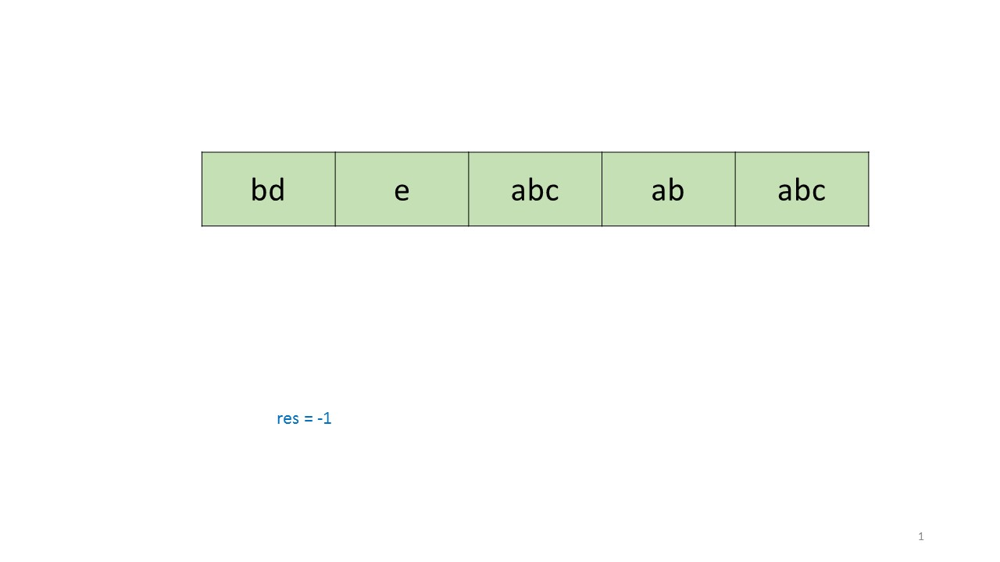
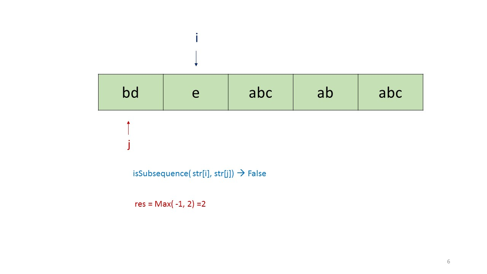
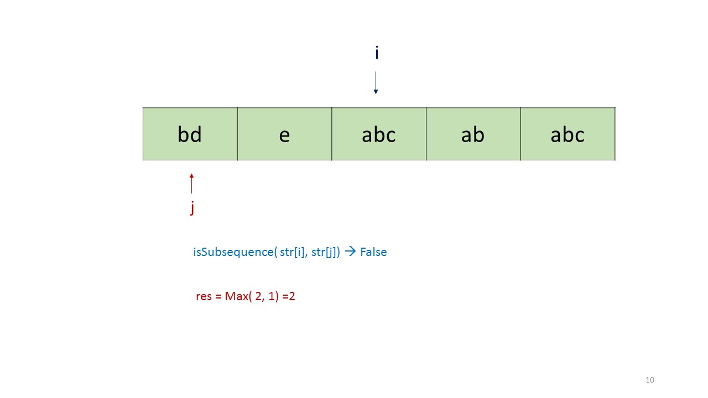
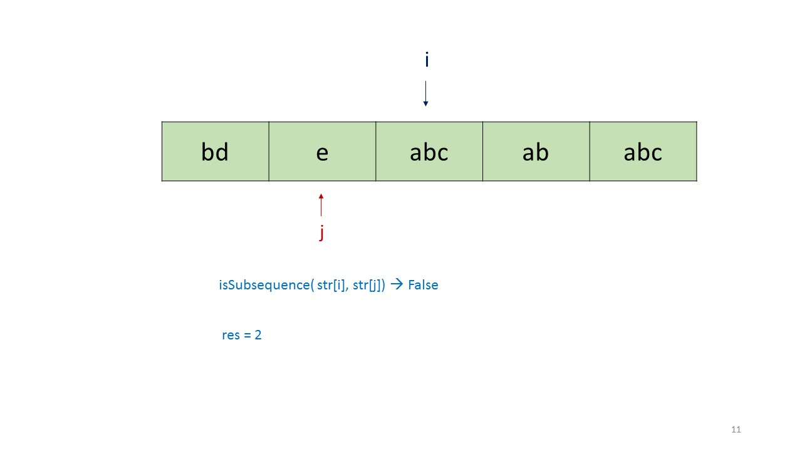
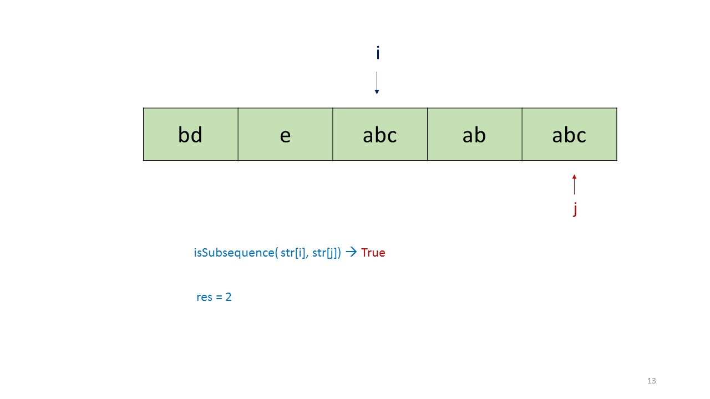
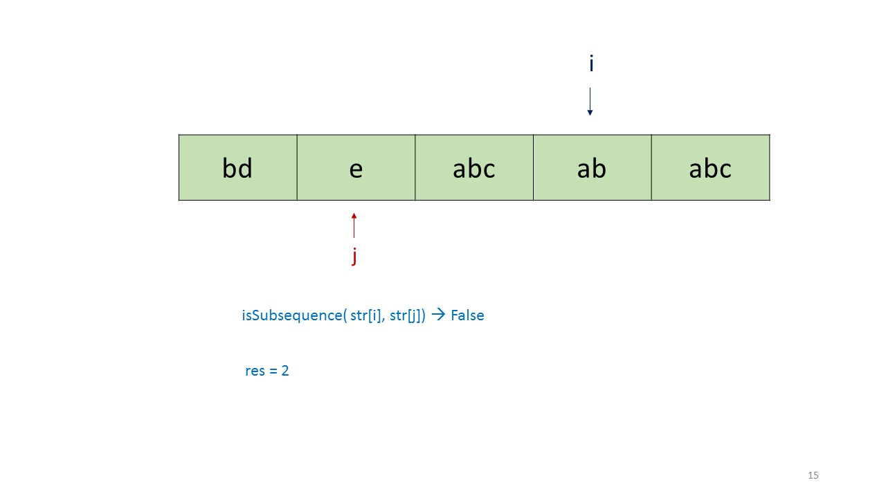
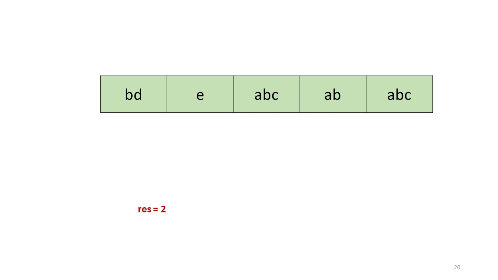

> 原文链接: https://leetcode-cn.com/problems/longest-uncommon-subsequence-ii


## 英文原文
<div><p>Given an array of strings <code>strs</code>, return <em>the length of the <strong>longest uncommon subsequence</strong> between them</em>. If the longest uncommon subsequence does not exist, return <code>-1</code>.</p>

<p>An <strong>uncommon subsequence</strong> between an array of strings is a string that is a <strong>subsequence of one string but not the others</strong>.</p>

<p>A <strong>subsequence</strong> of a string <code>s</code> is a string that can be obtained after deleting any number of characters from <code>s</code>.</p>

<ul>
	<li>For example, <code>&quot;abc&quot;</code> is a subsequence of <code>&quot;aebdc&quot;</code> because you can delete the underlined characters in <code>&quot;a<u>e</u>b<u>d</u>c&quot;</code> to get <code>&quot;abc&quot;</code>. Other subsequences of <code>&quot;aebdc&quot;</code> include <code>&quot;aebdc&quot;</code>, <code>&quot;aeb&quot;</code>, and <code>&quot;&quot;</code> (empty string).</li>
</ul>

<p>&nbsp;</p>
<p><strong>Example 1:</strong></p>
<pre><strong>Input:</strong> strs = ["aba","cdc","eae"]
<strong>Output:</strong> 3
</pre><p><strong>Example 2:</strong></p>
<pre><strong>Input:</strong> strs = ["aaa","aaa","aa"]
<strong>Output:</strong> -1
</pre>
<p>&nbsp;</p>
<p><strong>Constraints:</strong></p>

<ul>
	<li><code>2 &lt;= strs.length &lt;= 50</code></li>
	<li><code>1 &lt;= strs[i].length &lt;= 10</code></li>
	<li><code>strs[i]</code> consists of lowercase English letters.</li>
</ul>
</div>

## 中文题目
<div><p>给定字符串列表，你需要从它们中找出最长的特殊序列。最长特殊序列定义如下：该序列为某字符串独有的最长子序列（即不能是其他字符串的子序列）。</p>

<p><strong>子序列</strong>可以通过删去字符串中的某些字符实现，但不能改变剩余字符的相对顺序。空序列为所有字符串的子序列，任何字符串为其自身的子序列。</p>

<p>输入将是一个字符串列表，输出是最长特殊序列的长度。如果最长特殊序列不存在，返回 -1 。</p>

<p>&nbsp;</p>

<p><strong>示例：</strong></p>

<pre><strong>输入:</strong> &quot;aba&quot;, &quot;cdc&quot;, &quot;eae&quot;
<strong>输出:</strong> 3
</pre>

<p>&nbsp;</p>

<p><strong>提示：</strong></p>

<ol>
	<li>所有给定的字符串长度不会超过 10 。</li>
	<li>给定字符串列表的长度将在 [2, 50 ] 之间。</li>
</ol>

<p>&nbsp;</p>
</div>

## 通过代码
<RecoDemo>
</RecoDemo>


## 官方题解
#### 方法一：暴力解法 【通过】

生成所有字符串的所有子序列共 $2^n$ 个，将其存储在 hashmap 中，并记录每个子序列出现的次数。然后找出出现次数为 $1$ 的最长子序列。如果不存在这样的子序列，返回 $-1$。 

```java [solution1-Java]
public class Solution {
    public int findLUSlength(String[] strs) {
        HashMap < String, Integer > map = new HashMap < > ();
        for (String s: strs) {
            for (int i = 0; i < (1 << s.length()); i++) {
                String t = "";
                for (int j = 0; j < s.length(); j++) {
                    if (((i >> j) & 1) != 0)
                        t += s.charAt(j);
                }
                if (map.containsKey(t))
                    map.put(t, map.get(t) + 1);
                else
                    map.put(t, 1);
            }
        }
        int res = -1;
        for (String s: map.keySet()) {
            if (map.get(s) == 1)
                res = Math.max(res, s.length());
        }
        return res;
    }
}
```

**复杂度分析**

* 时间复杂度：$O(n*2^x)$，其中 $x$ 是所有字符串的平均长度，$n$ 是字符串的数量。

* 空间复杂度：$O(n*2^x)$，大小为 $n*2^x$ 的 HashMap。


#### 方法二：检查每个字符串 【通过】

**算法**

如果存在这样的特殊序列，那么它一定是某个给定的字符串。

检查每个字符串是否是其他字符串的子序列。如果不是，则它是一个特殊序列。最后返回长度最大的特殊序列。如果不存在特殊序列，返回 -1。

通过下面的例子，演示此方法的过程：

<,,,,,,,,,,,,,,,,,,,>

```java [solution2-Java]
public class Solution {
    public boolean isSubsequence(String x, String y) {
        int j = 0;
        for (int i = 0; i < y.length() && j < x.length(); i++)
            if (x.charAt(j) == y.charAt(i))
                j++;
        return j == x.length();
    }
    public int findLUSlength(String[] strs) {
        int res = -1;
        for (int i = 0, j; i < strs.length; i++) {
            for (j = 0; j < strs.length; j++) {
                if (j == i)
                    continue;
                if (isSubsequence(strs[i], strs[j]))
                    break;
            }
            if (j == strs.length)
                res = Math.max(res, strs[i].length());
        }
        return res;
    }
}
```

**复杂度分析**

* 时间复杂度：$O(x*n^2)$，其中 $n$ 是字符串的数量，$x$ 是每个字符串的平均长度。

* 空间复杂度：$O(1)$，恒定的额外空间。


#### 方法三：排序+检查每个字符串

**算法**

*方法二* 中需要判断每个字符串是否为特殊序列。如果最开始可以先将所有字符串排序，则可以节省一部分计算。

本方法中，首先按照长度降序排序所有字符串。然后，依次使用序列中的每个字符串与其他字符串比较，如果不存在字符串是当前字符串的子序列，则返回当前字符串的长度。否则返回 -1。

```java [solution3-Java]
public class Solution {
    public boolean isSubsequence(String x, String y) {
        int j = 0;
        for (int i = 0; i < y.length() && j < x.length(); i++)
            if (x.charAt(j) == y.charAt(i))
                j++;
        return j == x.length();
    }
    public int findLUSlength(String[] strs) {
        Arrays.sort(strs, new Comparator < String > () {
            public int compare(String s1, String s2) {
                return s2.length() - s1.length();
            }
        });
        for (int i = 0, j; i < strs.length; i++) {
            boolean flag = true;
            for (j = 0; j < strs.length; j++) {
                if (i == j)
                    continue;
                if (isSubsequence(strs[i], strs[j])) {
                    flag = false;
                    break;
                }
            }
            if (flag)
                return strs[i].length();
        }
        return -1;
    }
}
```

**复杂度分析**

* 时间复杂度：$O(x*n^2)$，其中 $n$ 是字符串的数量，$x$ 是每个字符串的平均长度。

* 空间复杂度：$O(1)$，恒定的额外空间。

## 统计信息
| 通过次数 | 提交次数 | AC比率 |
| :------: | :------: | :------: |
|    7155    |    19799    |   36.1%   |

## 提交历史
| 提交时间 | 提交结果 | 执行时间 |  内存消耗  | 语言 |
| :------: | :------: | :------: | :--------: | :--------: |


## 相似题目
|                             题目                             | 难度 |
| :----------------------------------------------------------: | :---------: |
| [最长特殊序列 Ⅰ](https://leetcode-cn.com/problems/longest-uncommon-subsequence-i/) | 简单|
