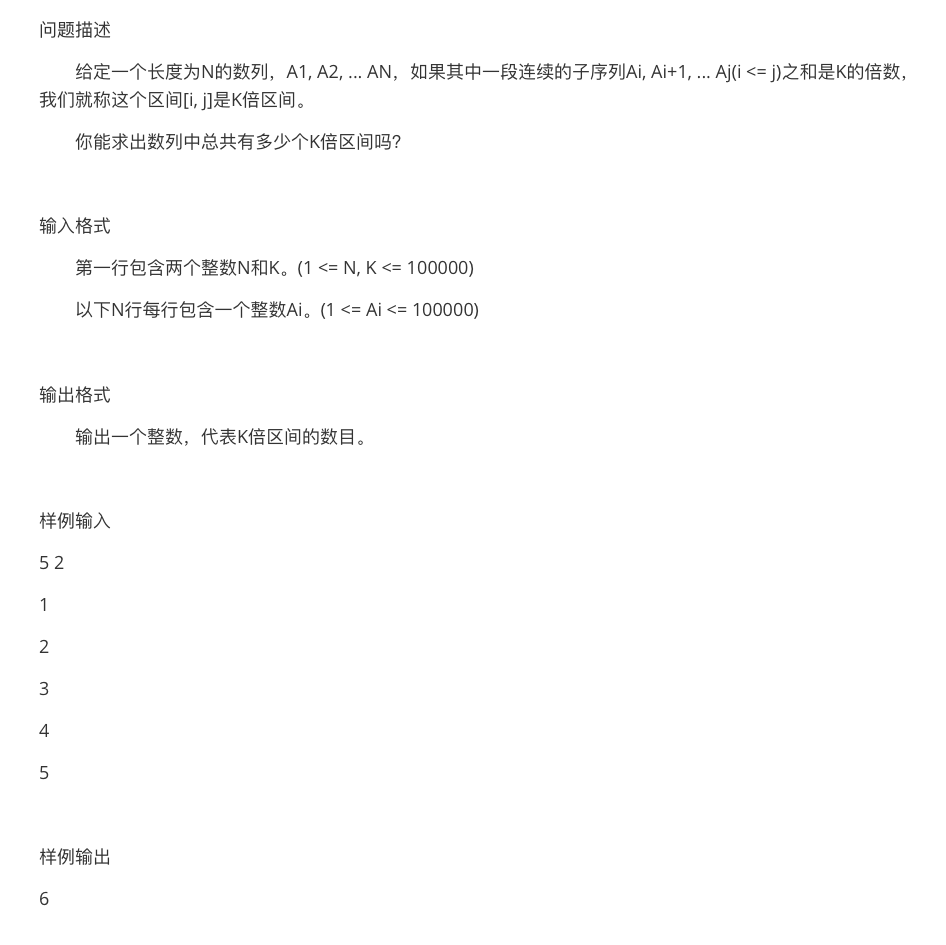

> 原文链接: https://leetcode-cn.com/problems/continuous-subarray-sum


## 英文原文
<div><p>Given an integer array <code>nums</code> and an integer <code>k</code>, return <code>true</code> <em>if </em><code>nums</code><em> has a continuous subarray of size <strong>at least two</strong> whose elements sum up to a multiple of</em> <code>k</code><em>, or </em><code>false</code><em> otherwise</em>.</p>

<p>An integer <code>x</code> is a multiple of <code>k</code> if there exists an integer <code>n</code> such that <code>x = n * k</code>. <code>0</code> is <strong>always</strong> a multiple of <code>k</code>.</p>

<p>&nbsp;</p>
<p><strong>Example 1:</strong></p>

<pre>
<strong>Input:</strong> nums = [23,<u>2,4</u>,6,7], k = 6
<strong>Output:</strong> true
<strong>Explanation:</strong> [2, 4] is a continuous subarray of size 2 whose elements sum up to 6.
</pre>

<p><strong>Example 2:</strong></p>

<pre>
<strong>Input:</strong> nums = [<u>23,2,6,4,7</u>], k = 6
<strong>Output:</strong> true
<strong>Explanation:</strong> [23, 2, 6, 4, 7] is an continuous subarray of size 5 whose elements sum up to 42.
42 is a multiple of 6 because 42 = 7 * 6 and 7 is an integer.
</pre>

<p><strong>Example 3:</strong></p>

<pre>
<strong>Input:</strong> nums = [23,2,6,4,7], k = 13
<strong>Output:</strong> false
</pre>

<p>&nbsp;</p>
<p><strong>Constraints:</strong></p>

<ul>
	<li><code>1 &lt;= nums.length &lt;= 10<sup>5</sup></code></li>
	<li><code>0 &lt;= nums[i] &lt;= 10<sup>9</sup></code></li>
	<li><code>0 &lt;= sum(nums[i]) &lt;= 2<sup>31</sup> - 1</code></li>
	<li><code>1 &lt;= k &lt;= 2<sup>31</sup> - 1</code></li>
</ul>
</div>

## 中文题目
<div><p>给你一个整数数组 <code>nums</code> 和一个整数 <code>k</code> ，编写一个函数来判断该数组是否含有同时满足下述条件的连续子数组：</p>

<ul>
	<li>子数组大小 <strong>至少为 2</strong> ，且</li>
	<li>子数组元素总和为 <code>k</code> 的倍数。</li>
</ul>

<p>如果存在，返回 <code>true</code> ；否则，返回 <code>false</code> 。</p>

<p>如果存在一个整数 <code>n</code> ，令整数 <code>x</code> 符合 <code>x = n * k</code> ，则称 <code>x</code> 是 <code>k</code> 的一个倍数。<code>0</code> 始终视为 <code>k</code> 的一个倍数。</p>

<p> </p>

<p><strong>示例 1：</strong></p>

<pre>
<strong>输入：</strong>nums = [23<u>,2,4</u>,6,7], k = 6
<strong>输出：</strong>true
<strong>解释：</strong>[2,4] 是一个大小为 2 的子数组，并且和为 6 。</pre>

<p><strong>示例 2：</strong></p>

<pre>
<strong>输入：</strong>nums = [<u>23,2,6,4,7</u>], k = 6
<strong>输出：</strong>true
<strong>解释：</strong>[23, 2, 6, 4, 7] 是大小为 5 的子数组，并且和为 42 。 
42 是 6 的倍数，因为 42 = 7 * 6 且 7 是一个整数。
</pre>

<p><strong>示例 3：</strong></p>

<pre>
<strong>输入：</strong>nums = [23,2,6,4,7], k = 13
<strong>输出：</strong>false
</pre>

<p> </p>

<p><strong>提示：</strong></p>

<ul>
	<li><code>1 <= nums.length <= 10<sup>5</sup></code></li>
	<li><code>0 <= nums[i] <= 10<sup>9</sup></code></li>
	<li><code>0 <= sum(nums[i]) <= 2<sup>31</sup> - 1</code></li>
	<li><code>1 <= k <= 2<sup>31</sup> - 1</code></li>
</ul>
</div>

## 通过代码
<RecoDemo>
</RecoDemo>


## 高赞题解
## 基本分析

这是一道很经典的前缀和题目，类似的原题也在蓝桥杯出现过，坐标在 [K 倍区间](http://lx.lanqiao.cn/problem.page?gpid=T444)。

本题与那道题不同在于：

* [K 倍区间] 需要求得所有符合条件的区间数量；本题需要判断是否存在。
* [K 倍区间] 序列全是正整数，不需要考虑 $0$ 值问题；本题需要考虑 $0$ 值问题。
* [K 倍区间] 序列允许子数组长度为 $1$；本题固定子数组长度至少为 $2$。

数据范围为 $10^4$，因此无论是纯朴素的做法 ($O(n^3)$)还是简单使用前缀和优化的做法 ($O(n^2)$) 都不能满足要求。

我们需要从 $k$ 的倍数作为切入点来做。

预处理前缀和数组 $sum$，方便快速求得某一段区间的和。然后假定 $[i, j]$ 是我们的目标区间，那么有：

$$
sum[j] - sum[i - 1] = n * k
$$

经过简单的变形可得：

$$
\frac{sum[j]}{k} - \frac{sum[i - 1]}{k} = n
$$

**要使得两者除 $k$ 相减为整数，需要满足 $sum[j]$ 和 $sum[i - 1]$ 对 $k$ 取余相同。**

也就是说，我们只需要枚举右端点 $j$，然后在枚举右端点 $j$ 的时候检查之前是否出现过左端点 $i$，使得 $sum[j]$ 和 $sum[i - 1]$ 对 $k$ 取余相同。

---

## 前缀和 + HashSet

具体的，使用 `HashSet` 来保存出现过的值。

让循环从 $2$ 开始枚举右端点（根据题目要求，子数组长度至少为 $2$），每次将符合长度要求的位置的取余结果存入 `HashSet`。

如果枚举某个右端点 $j$ 时发现存在某个左端点 $i$ 符合要求，则返回 `True`。

代码：
```Java []
class Solution {
    public boolean checkSubarraySum(int[] nums, int k) {
        int n = nums.length;
        int[] sum = new int[n + 1];
        for (int i = 1; i <= n; i++) sum[i] = sum[i - 1] + nums[i - 1];
        Set<Integer> set = new HashSet<>();
        for (int i = 2; i <= n; i++) {
            set.add(sum[i - 2] % k);
            if (set.contains(sum[i] % k)) return true;
        }
        return false;
    }
}
```
* 时间复杂度：$O(n)$
* 空间复杂度：$O(n)$

---

## 拓展（求方案数）

蓝桥杯官网登录经常性罢工，我登录十几次都没登录上去，这里直接截图了 [K 倍区间] 的题目给大家。



写了代码，但很可惜没 OJ 可以测试 🤣 

比较简单，应该没啥问题，可以直接参考 🤣


代码：
```Java []
import java.util.*;
class Main {
    public static void main(String[] args) {
        Scanner sc = new Scanner(System.in);
        int n = sc.nextInt(), k = sc.nextInt();
        long[] s  = new long[n + 1];
        for (int i = 1; i <= n; i++) s[i] = s[i - 1] + sc.nextLong();
        long ans = 0;
        Map<Long, Integer> map = new HashMap<>();
        map.put(0L, 1);
        for (int i = 1 ; i <= n; i++) {
            long u = s[i] % k;
            if (map.containsKey(u)) ans += map.get(u);
            map.put(u, map.getOrDefault(u, 0) + 1);
        }
        System.out.println(ans);
    }
}
```
* 时间复杂度：$O(n)$
* 空间复杂度：$O(n)$

---

## 答疑

看了评论区，还是有不少同学对「同余性质」有疑问，这里集中答疑一下。

其实评论区的 [@Meteordream](/u/meteordream/) 小姐姐也已经给出了很棒的解答了。

* 为什么想要 $b - a$ 为 $k$ 的倍数，只需要确保 $b$ 和 $a$ 模 $k$ 相同即可？

我们令 $b = x * k + r1$，$a = y * k + r2$，那么 $r1$ 和 $r2$ 分别为 $b$ 和 $a$ 模 $k$ 的值。

即有： $b - a = (x * k + r1) - (y * k + r2) =(x - y) * k + (r1 - r2)$。

由 $b - a$ 为 $k$ 的倍数，可以推导出 $r1 = r2$，即 $b$ 和 $a$ 模 $k$ 相同。

反过来由「$b$ 和 $a$ 模 $k$ 相同」可推导出「$b - a$ 为 $k$ 的倍数」。

## 统计信息
| 通过次数 | 提交次数 | AC比率 |
| :------: | :------: | :------: |
|    71405    |    259153    |   27.6%   |

## 提交历史
| 提交时间 | 提交结果 | 执行时间 |  内存消耗  | 语言 |
| :------: | :------: | :------: | :--------: | :--------: |


## 相似题目
|                             题目                             | 难度 |
| :----------------------------------------------------------: | :---------: |
| [和为 K 的子数组](https://leetcode-cn.com/problems/subarray-sum-equals-k/) | 中等|
