> 原文链接: https://leetcode-cn.com/problems/contiguous-array


## 英文原文
<div><p>Given a binary array <code>nums</code>, return <em>the maximum length of a contiguous subarray with an equal number of </em><code>0</code><em> and </em><code>1</code>.</p>

<p>&nbsp;</p>
<p><strong>Example 1:</strong></p>

<pre>
<strong>Input:</strong> nums = [0,1]
<strong>Output:</strong> 2
<strong>Explanation:</strong> [0, 1] is the longest contiguous subarray with an equal number of 0 and 1.
</pre>

<p><strong>Example 2:</strong></p>

<pre>
<strong>Input:</strong> nums = [0,1,0]
<strong>Output:</strong> 2
<strong>Explanation:</strong> [0, 1] (or [1, 0]) is a longest contiguous subarray with equal number of 0 and 1.
</pre>

<p>&nbsp;</p>
<p><strong>Constraints:</strong></p>

<ul>
	<li><code>1 &lt;= nums.length &lt;= 10<sup>5</sup></code></li>
	<li><code>nums[i]</code> is either <code>0</code> or <code>1</code>.</li>
</ul>
</div>

## 中文题目
<div><p>给定一个二进制数组 <code>nums</code> , 找到含有相同数量的 <code>0</code> 和 <code>1</code> 的最长连续子数组，并返回该子数组的长度。</p>

<p> </p>

<p><strong>示例 1:</strong></p>

<pre>
<strong>输入:</strong> nums = [0,1]
<strong>输出:</strong> 2
<strong>说明:</strong> [0, 1] 是具有相同数量 0 和 1 的最长连续子数组。</pre>

<p><strong>示例 2:</strong></p>

<pre>
<strong>输入:</strong> nums = [0,1,0]
<strong>输出:</strong> 2
<strong>说明:</strong> [0, 1] (或 [1, 0]) 是具有相同数量0和1的最长连续子数组。</pre>

<p> </p>

<p><strong>提示：</strong></p>

<ul>
	<li><code>1 <= nums.length <= 10<sup>5</sup></code></li>
	<li><code>nums[i]</code> 不是 <code>0</code> 就是 <code>1</code></li>
</ul>
</div>

## 通过代码
<RecoDemo>
</RecoDemo>


## 高赞题解
### 步骤

这题跟昨天的题如出一辙，大体思路一致。首先我们还是先说一下算法的步骤。

**算法步骤：**

1. 创建一个哈希表，用 $key$ 来储存 $cur$ 值, $value$ 来储存当前 $index$。

2. 假设我们碰到`0`就将 $cur$ $decrement$ (减一), 碰到`1`则$increment$ (加一)。

3. 如果我们能在哈希表中找到当前的 $cur$ 值, 则取出对应的 $pos$, 在看当前的 `index - pos` 是否比 `ans` 大, 取其中的最优解。


**核心：由于以上碰`1`加一，碰`0`减一的操作，当`0`与`1`数量一致时(连续数组), 其连续数组的和为零。因此我们知道数组前面的 $cur$ 值是什么，在到达该连续数组尾部时就不会变。因此我们只需要检查哈希表中是否存在其相同的 $cur$ 值即可！**(多读几遍)

*********************

### 你问我答

1. 为什么在哈希表中找到了相同的 $cur$ 值则算找到了一串连续数组？

>“如果这是一串连续子数组，那么cur的值，在到达该子数组尾部时(紫色箭头处)，与在该子数组前一位时(绿色箭头处)，是相等的” 出自评论区[@bingo-70](/u/bingo-70/)


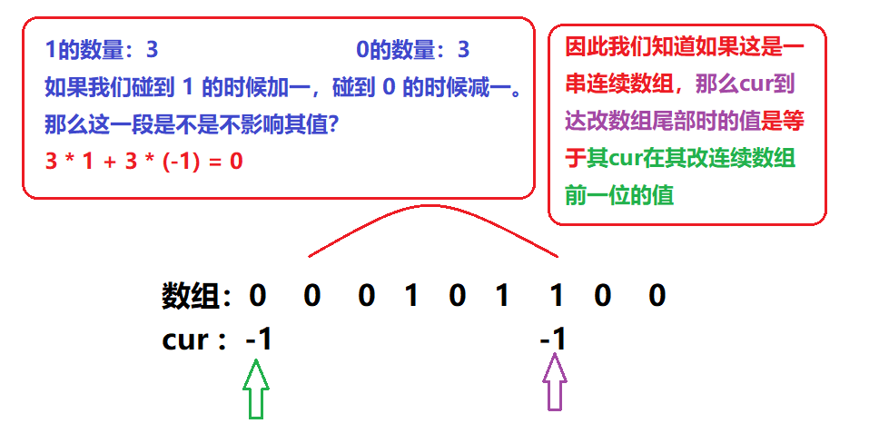


2. 为什么要在哈希表中插入`{0, -1}`?

这是为了辅助讨论该连续数组的起始点在 `index == 0` 的位置的情况，如果最长连续数组在数组的最前方，不插入`{0,-1}`会得到错误的答案，因此我们一定要插入该辅助键值！具体可以看看动图中的前几位数字看看`{0,-1}`是如何辅助我们得到答案的！

***************

### 动图演示

<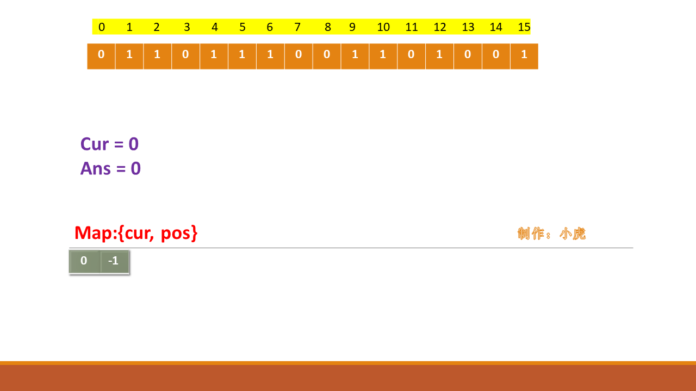,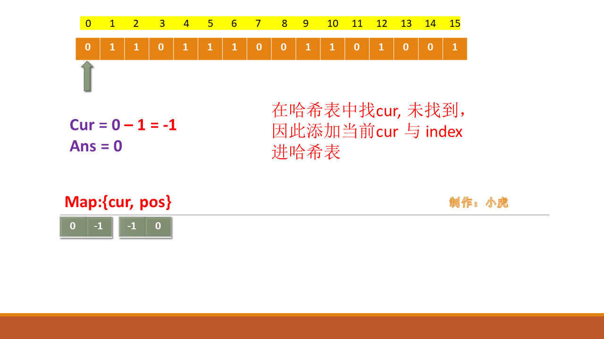,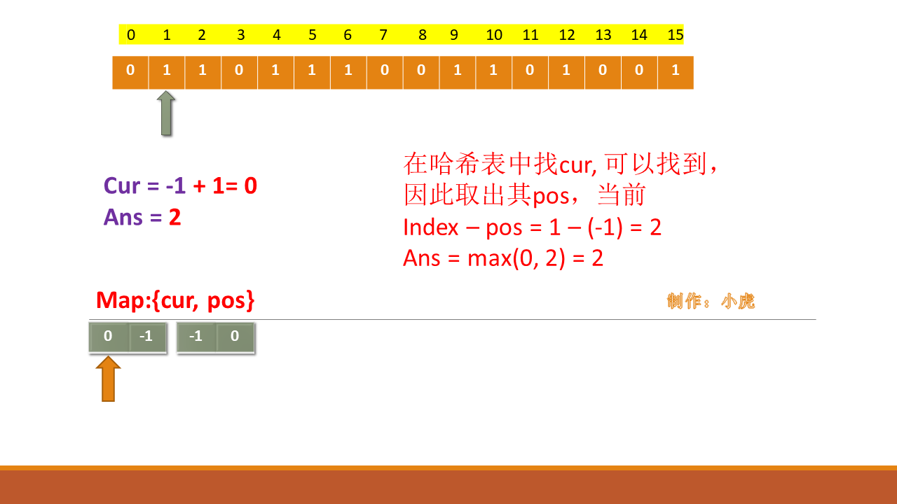,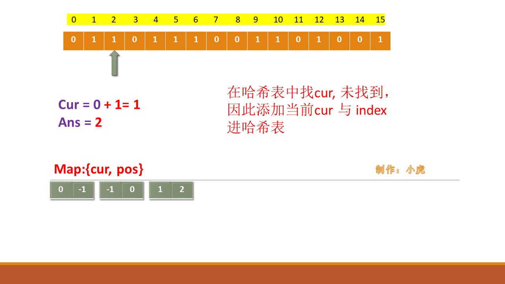,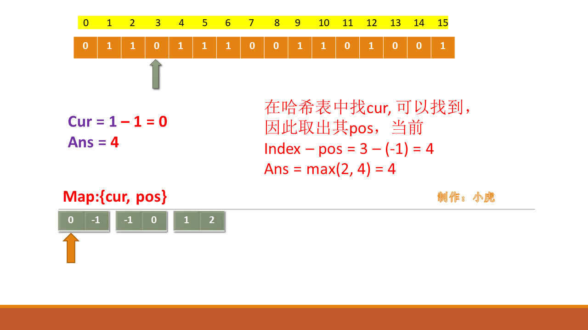,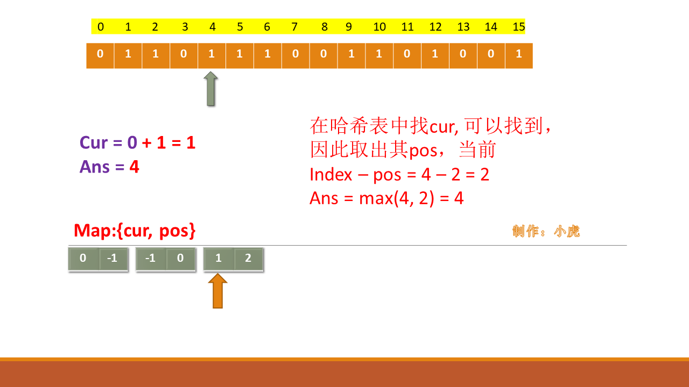,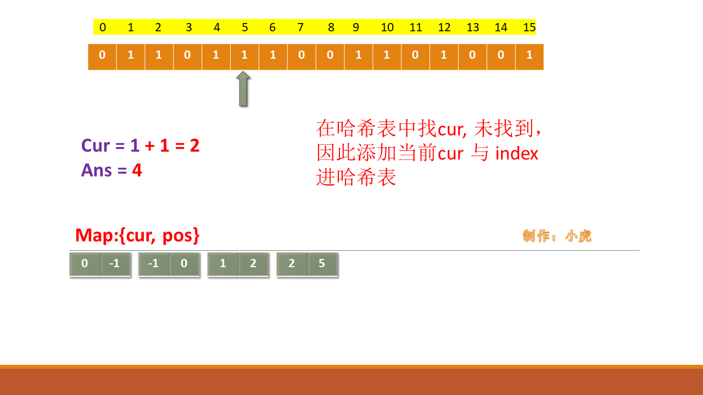,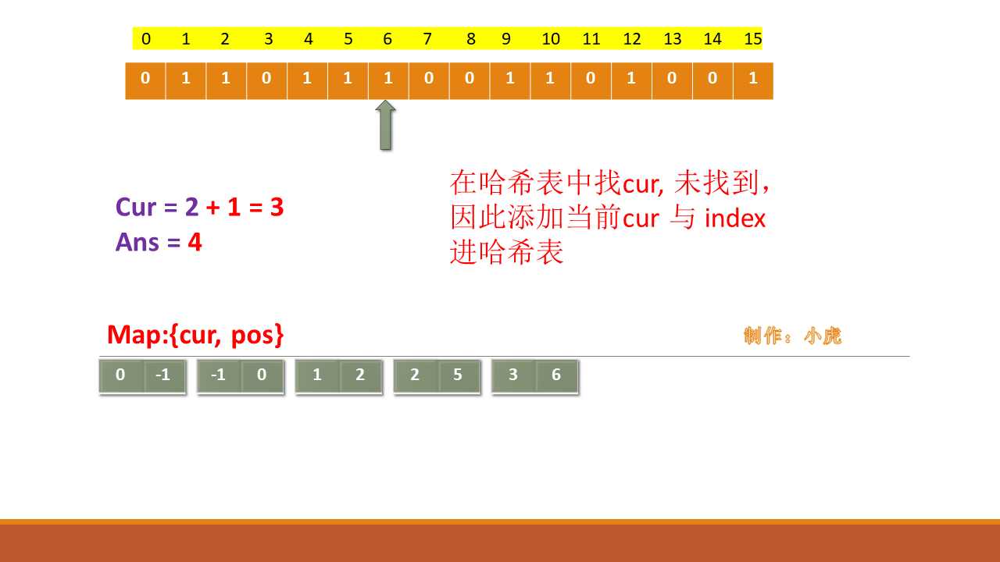,,,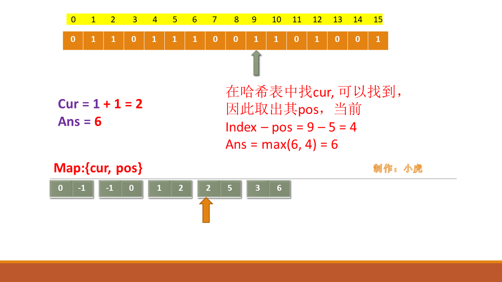,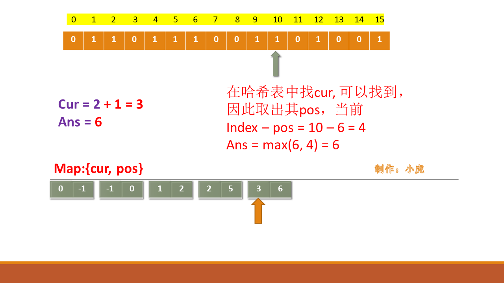,,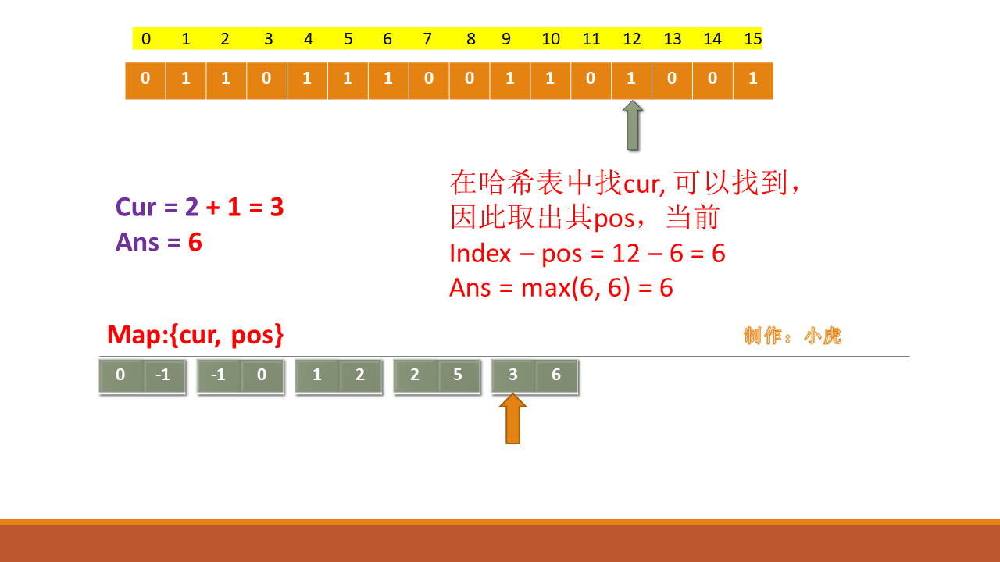,,,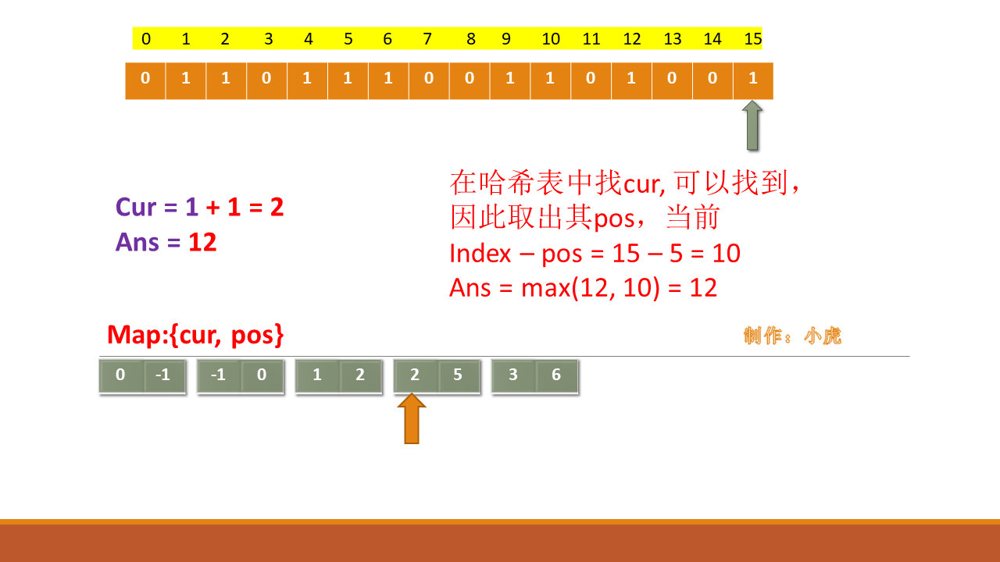,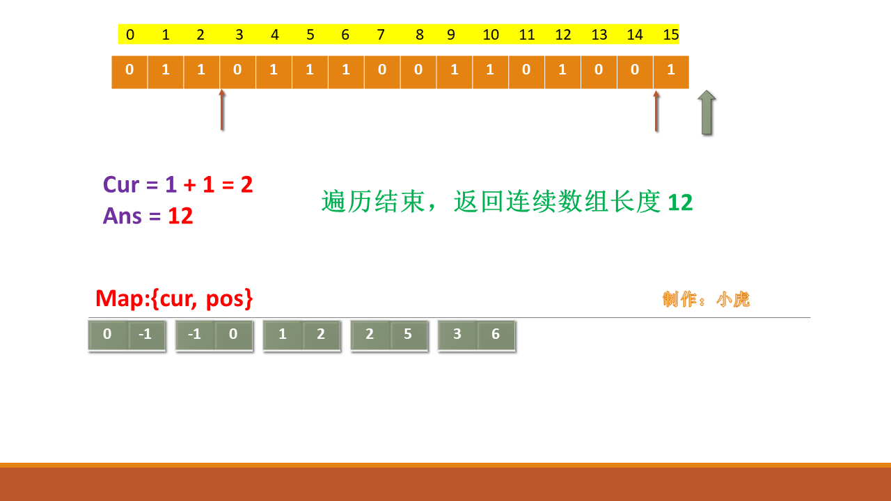>

**************

### 代码

```cpp

class Solution {

public:

    int findMaxLength(vector<int>& nums) {

        unordered_map<int, int> m = {{0,-1}};

        int cur = 0, ans = 0;

        for(int i = 0; i < nums.size(); ++i)

        {

            nums[i] == 0? --cur : ++cur;

            if(m.count(cur))

                ans = max(ans, i - m[cur]);

            else

                m[cur] = i;

        }

        return ans;

    }

};

```

**********************

时间复杂度：$O(n)$，需要遍历整个数组

空间复杂度：$O(n)$，空间复杂度取决与哈希表中键值的数量

**********************

有收获请给我点个👍趴，蟹蟹你们了！


## 统计信息
| 通过次数 | 提交次数 | AC比率 |
| :------: | :------: | :------: |
|    47343    |    88250    |   53.6%   |

## 提交历史
| 提交时间 | 提交结果 | 执行时间 |  内存消耗  | 语言 |
| :------: | :------: | :------: | :--------: | :--------: |


## 相似题目
|                             题目                             | 难度 |
| :----------------------------------------------------------: | :---------: |
| [和等于 k 的最长子数组长度](https://leetcode-cn.com/problems/maximum-size-subarray-sum-equals-k/) | 中等|
