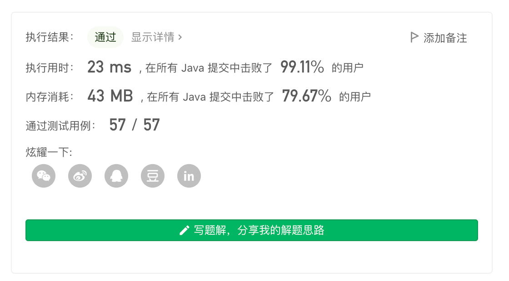
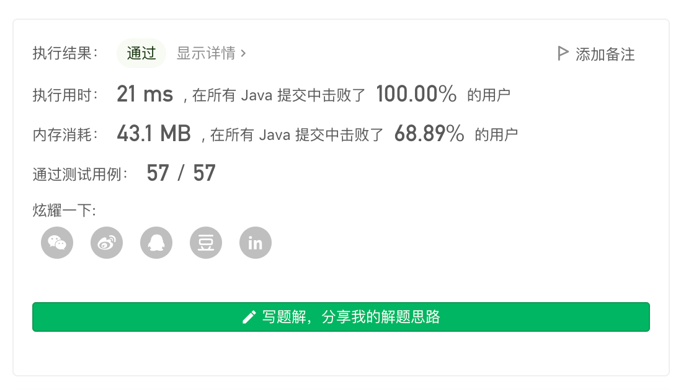

> 原文链接: https://leetcode-cn.com/problems/random-pick-with-weight


## 英文原文
<div><p>You are given a <strong>0-indexed</strong> array of positive integers <code>w</code> where <code>w[i]</code> describes the <strong>weight</strong> of the <code>i<sup>th</sup></code> index.</p>

<p>You need to implement the function <code>pickIndex()</code>, which <strong>randomly</strong> picks an index in the range <code>[0, w.length - 1]</code> (<strong>inclusive</strong>) and returns it. The <strong>probability</strong> of picking an index <code>i</code> is <code>w[i] / sum(w)</code>.</p>

<ul>
	<li>For example, if <code>w = [1, 3]</code>, the probability of picking index <code>0</code> is <code>1 / (1 + 3) = 0.25</code> (i.e., <code>25%</code>), and the probability of picking index <code>1</code> is <code>3 / (1 + 3) = 0.75</code> (i.e., <code>75%</code>).</li>
</ul>

<p>&nbsp;</p>
<p><strong>Example 1:</strong></p>

<pre>
<strong>Input</strong>
[&quot;Solution&quot;,&quot;pickIndex&quot;]
[[[1]],[]]
<strong>Output</strong>
[null,0]

<strong>Explanation</strong>
Solution solution = new Solution([1]);
solution.pickIndex(); // return 0. The only option is to return 0 since there is only one element in w.
</pre>

<p><strong>Example 2:</strong></p>

<pre>
<strong>Input</strong>
[&quot;Solution&quot;,&quot;pickIndex&quot;,&quot;pickIndex&quot;,&quot;pickIndex&quot;,&quot;pickIndex&quot;,&quot;pickIndex&quot;]
[[[1,3]],[],[],[],[],[]]
<strong>Output</strong>
[null,1,1,1,1,0]

<strong>Explanation</strong>
Solution solution = new Solution([1, 3]);
solution.pickIndex(); // return 1. It is returning the second element (index = 1) that has a probability of 3/4.
solution.pickIndex(); // return 1
solution.pickIndex(); // return 1
solution.pickIndex(); // return 1
solution.pickIndex(); // return 0. It is returning the first element (index = 0) that has a probability of 1/4.

Since this is a randomization problem, multiple answers are allowed.
All of the following outputs can be considered correct:
[null,1,1,1,1,0]
[null,1,1,1,1,1]
[null,1,1,1,0,0]
[null,1,1,1,0,1]
[null,1,0,1,0,0]
......
and so on.
</pre>

<p>&nbsp;</p>
<p><strong>Constraints:</strong></p>

<ul>
	<li><code>1 &lt;= w.length &lt;= 10<sup>4</sup></code></li>
	<li><code>1 &lt;= w[i] &lt;= 10<sup>5</sup></code></li>
	<li><code>pickIndex</code> will be called at most <code>10<sup>4</sup></code> times.</li>
</ul>
</div>

## 中文题目
<div><p>给你一个 <strong>下标从 0 开始</strong> 的正整数数组&nbsp;<code>w</code> ，其中&nbsp;<code>w[i]</code> 代表第 <code>i</code> 个下标的权重。</p>

<p>请你实现一个函数&nbsp;<code>pickIndex</code>&nbsp;，它可以 <strong>随机地</strong> 从范围 <code>[0, w.length - 1]</code> 内（含 <code>0</code> 和 <code>w.length - 1</code>）选出并返回一个下标。选取下标 <code>i</code>&nbsp;的 <strong>概率</strong> 为 <code>w[i] / sum(w)</code> 。</p>

<ol>
</ol>

<ul>
	<li>例如，对于 <code>w = [1, 3]</code>，挑选下标 <code>0</code> 的概率为 <code>1 / (1 + 3)&nbsp;= 0.25</code> （即，25%），而选取下标 <code>1</code> 的概率为 <code>3 / (1 + 3)&nbsp;= 0.75</code>（即，<code>75%</code>）。</li>
</ul>

<p>&nbsp;</p>

<p><strong>示例 1：</strong></p>

<pre>
<strong>输入：</strong>
["Solution","pickIndex"]
[[[1]],[]]
<strong>输出：</strong>
[null,0]
<strong>解释：</strong>
Solution solution = new Solution([1]);
solution.pickIndex(); // 返回 0，因为数组中只有一个元素，所以唯一的选择是返回下标 0。</pre>

<p><strong>示例 2：</strong></p>

<pre>
<strong>输入：</strong>
["Solution","pickIndex","pickIndex","pickIndex","pickIndex","pickIndex"]
[[[1,3]],[],[],[],[],[]]
<strong>输出：</strong>
[null,1,1,1,1,0]
<strong>解释：</strong>
Solution solution = new Solution([1, 3]);
solution.pickIndex(); // 返回 1，返回下标 1，返回该下标概率为 3/4 。
solution.pickIndex(); // 返回 1
solution.pickIndex(); // 返回 1
solution.pickIndex(); // 返回 1
solution.pickIndex(); // 返回 0，返回下标 0，返回该下标概率为 1/4 。

由于这是一个随机问题，允许多个答案，因此下列输出都可以被认为是正确的:
[null,1,1,1,1,0]
[null,1,1,1,1,1]
[null,1,1,1,0,0]
[null,1,1,1,0,1]
[null,1,0,1,0,0]
......
诸若此类。
</pre>

<p>&nbsp;</p>

<p><strong>提示：</strong></p>

<ul>
	<li><code>1 &lt;= w.length &lt;= 10<sup>4</sup></code></li>
	<li><code>1 &lt;= w[i] &lt;= 10<sup>5</sup></code></li>
	<li><code>pickIndex</code>&nbsp;将被调用不超过 <code>10<sup>4</sup></code>&nbsp;次</li>
</ul>
</div>

## 通过代码
<RecoDemo>
</RecoDemo>


## 高赞题解
## 前缀和 + 二分

根据题意，权重值 $w[i]$ 可以作为 `pickIndex` 调用总次数为 $\sum_{i = 0}^{w.length - 1} w[i]$ 时，下标 $i$ 的返回次数。

随机数的产生可以直接使用语言自带的 API，剩下的我们需要构造一个分布符合权重的序列。

由于 $1 <= w[i] <= 10^5$，且 $w$ 长度为 $10^4$，因此直接使用构造一个有 $w[i]$ 个的 $i$ 的数字会 MLE。

**我们可以使用「前缀和」数组来作为权重分布序列，权重序列的基本单位为 $1$。**

一个长度为 $n$ 的构造好的「前缀和」数组可以看是一个基本单位为 $1$ 的 $[1, sum[n - 1]]$ 数轴。

使用随机函数参数产生 $[1, sum[n - 1]]$ 范围内的随机数，通过「二分」前缀和数组即可找到分布位置对应的原始下标值。



> 评论区有小伙伴问到，二分是不是只能写成 $P1$ 的形式。
当然不是，写二分要从「二段性」进行分析，不要硬记一些大于小于号，`l` 还是 `r`，对理解「二分」没有帮助。想清楚自己要二分二段性的哪个端点/边界就可以动手写了。
我猜不少同学想写的是 $P2$ 版本，可供参考。


代码：
```Java []
class Solution {
    int[] sum;
    public Solution(int[] w) {
        int n = w.length;
        sum = new int[n + 1];
        for (int i = 1; i <= n; i++) sum[i] = sum[i - 1] + w[i - 1];
    }
    
    public int pickIndex() {
        int n = sum.length;
        int t = (int) (Math.random() * sum[n - 1]) + 1;
        int l = 1, r = n - 1;
        while (l < r) {
            int mid = l + r >> 1;
            if (sum[mid] >= t) r = mid;
            else l = mid + 1;
        }
        return r - 1;
    }
}
```
```Java []
class Solution {
    int[] sum;
    public Solution(int[] w) {
        int n = w.length;
        sum = new int[n + 1];
        for (int i = 1; i <= n; i++) sum[i] = sum[i - 1] + w[i - 1];
    }
    
    public int pickIndex() {
        int n = sum.length;
        int t = (int) (Math.random() * sum[n - 1]) + 1;
        int l = 1, r = n - 1;
        while (l < r) {
            int mid = l + r + 1 >> 1;
            if (sum[mid] < t) l = mid;
            else r = mid - 1;
        }
        return sum[r] < t ? r : r - 1;
    }
}
```
* 时间复杂度：`Solution` 类的构造方法整体复杂度为 $O(n)$；`pickIndex` 的复杂度为 $O(\log{n})$
* 空间复杂度：$O(n)$

---

## 模拟（桶轮询）

利用 OJ 不太聪明（对权重分布做近似检查），我们可以构造一个最小轮询序列（权重精度保留到小数点一位），并使用 $(i, cnt)$ 的形式进行存储，代表下标 $i$ 在最小轮询序列中出现次数为 $cnt$。

然后使用两个编号 $bid$ 和 $iid$ 来对桶进行轮询返回（循环重置 & 跳到下一个桶）。

**该解法的最大好处是不需要使用 random 函数，同时返回的连续序列满足每一段（长度不短于最小段）都符合近似权重分布。**



代码：
```Java []
class Solution {
    // 桶编号 / 桶内编号 / 总数
    int bid, iid, tot;
    List<int[]> list = new ArrayList<>();
    public Solution(int[] w) {
        int n = w.length;
        double sum = 0, min = 1e9;
        for (int i : w) {
            sum += i;
            min = Math.min(min, i);
        }
        double minv = min / sum;
        int k = 1;
        while (minv * k < 1) k *= 10;
        for (int i = 0; i < n; i++) {
            int cnt = (int)(w[i] / sum * k);
            list.add(new int[]{i, cnt});
            tot += cnt;
        }
    }
    
    public int pickIndex() {
        if (bid >= list.size()) {
            bid = 0; iid = 0;
        }
        int[] info = list.get(bid);
        int id = info[0], cnt = info[1];
        if (iid >= cnt) {
            bid++; iid = 0;
            return pickIndex();
        }
        iid++;
        return id;
    }
}
```
* 时间复杂度：计算 $k$ 的操作只会发生一次，可以看作是一个均摊到每个下标的常数计算，`Solution` 类的构造方法的整体复杂度可看作 $O(n)$；`pickIndex` 的复杂度为 $O(1)$
* 空间复杂度：$O(n)$

---

## 最后

**如果有帮助到你，请给题解点个赞和收藏，让更多的人看到 ~ ("▔□▔)/**

也欢迎你 [关注我](https://oscimg.oschina.net/oscnet/up-19688dc1af05cf8bdea43b2a863038ab9e5.png)（公主号后台回复「送书」即可参与长期看题解学算法送实体书活动）或 加入[「组队打卡」](https://leetcode-cn.com/u/ac_oier/)小群 ，提供写「证明」&「思路」的高质量题解。

所有题解已经加入 [刷题指南](https://github.com/SharingSource/LogicStack-LeetCode/wiki)，欢迎 star 哦 ~ 

## 统计信息
| 通过次数 | 提交次数 | AC比率 |
| :------: | :------: | :------: |
|    32962    |    68881    |   47.9%   |

## 提交历史
| 提交时间 | 提交结果 | 执行时间 |  内存消耗  | 语言 |
| :------: | :------: | :------: | :--------: | :--------: |


## 相似题目
|                             题目                             | 难度 |
| :----------------------------------------------------------: | :---------: |
| [随机数索引](https://leetcode-cn.com/problems/random-pick-index/) | 中等|
| [黑名单中的随机数](https://leetcode-cn.com/problems/random-pick-with-blacklist/) | 困难|
| [非重叠矩形中的随机点](https://leetcode-cn.com/problems/random-point-in-non-overlapping-rectangles/) | 中等|
