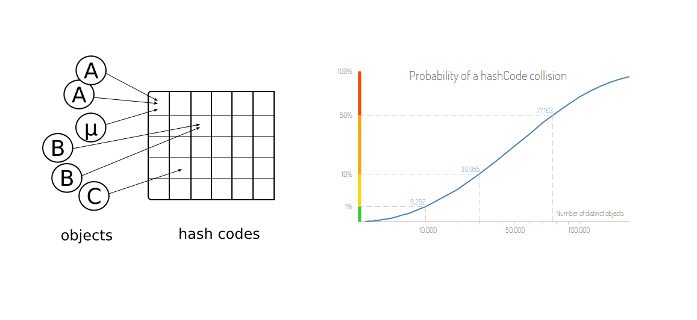

> 原文链接: https://leetcode-cn.com/problems/encode-and-decode-tinyurl


## 英文原文
<div><blockquote>Note: This is a companion problem to the <a href="https://leetcode.com/discuss/interview-question/system-design/" target="_blank">System Design</a> problem: <a href="https://leetcode.com/discuss/interview-question/124658/Design-a-URL-Shortener-(-TinyURL-)-System/" target="_blank">Design TinyURL</a>.</blockquote>

<p>TinyURL is a URL shortening service where you enter a URL such as <code>https://leetcode.com/problems/design-tinyurl</code> and it returns a short URL such as <code>http://tinyurl.com/4e9iAk</code>. Design a class to encode a URL and decode a tiny URL.</p>

<p>There is no restriction on how your encode/decode algorithm should work. You just need to ensure that a URL can be encoded to a tiny URL and the tiny URL can be decoded to the original URL.</p>

<p>Implement the <code>Solution</code> class:</p>

<ul>
	<li><code>Solution()</code> Initializes the object of the system.</li>
	<li><code>String encode(String longUrl)</code> Returns a tiny URL for the given <code>longUrl</code>.</li>
	<li><code>String decode(String shortUrl)</code> Returns the original long URL for the given <code>shortUrl</code>. It is guaranteed that the given <code>shortUrl</code> was encoded by the same object.</li>
</ul>

<p>&nbsp;</p>
<p><strong>Example 1:</strong></p>

<pre>
<strong>Input:</strong> url = &quot;https://leetcode.com/problems/design-tinyurl&quot;
<strong>Output:</strong> &quot;https://leetcode.com/problems/design-tinyurl&quot;

<strong>Explanation:</strong>
Solution obj = new Solution();
string tiny = obj.encode(url); // returns the encoded tiny url.
string ans = obj.decode(tiny); // returns the original url after deconding it.
</pre>

<p>&nbsp;</p>
<p><strong>Constraints:</strong></p>

<ul>
	<li><code>1 &lt;= url.length &lt;= 10<sup>4</sup></code></li>
	<li><code>url</code> is guranteed to be a valid URL.</li>
</ul>
</div>

## 中文题目
<div><p>TinyURL是一种URL简化服务， 比如：当你输入一个URL&nbsp;<code>https://leetcode.com/problems/design-tinyurl</code>&nbsp;时，它将返回一个简化的URL&nbsp;<code>http://tinyurl.com/4e9iAk</code>.</p>

<p>要求：设计一个 TinyURL 的加密&nbsp;<code>encode</code>&nbsp;和解密&nbsp;<code>decode</code>&nbsp;的方法。你的加密和解密算法如何设计和运作是没有限制的，你只需要保证一个URL可以被加密成一个TinyURL，并且这个TinyURL可以用解密方法恢复成原本的URL。</p>
</div>

## 通过代码
<RecoDemo>
</RecoDemo>


## 官方题解
#### 方法 1：使用简单的计数 [Accepted]

为了加密 URL，我们使用计数器 ($i$) ，每遇到一个新的 URL 都加一。我们将 URL 与它的次数 $i$ 放在哈希表 HashMap 中，这样我们在稍后的解密中可以轻易地获得原本的 URL。

```Java []
public class Codec {
    Map<Integer, String> map = new HashMap<>();
    int i = 0;

    public String encode(String longUrl) {
        map.put(i, longUrl);
        return "http://tinyurl.com/" + i++;
    }

    public String decode(String shortUrl) {
        return map.get(Integer.parseInt(shortUrl.replace("http://tinyurl.com/", "")));
    }
}
```

**表现分析**

* 可以加密解密的 URL 数目受限于 $\text{int}$ 所能表示的范围。

* 如果超过 $\text{int}$ 个 URL 需要被加密，那么超过范围的整数会覆盖之前存储的 URL，导致算法失效。

* URL 的长度不一定比输入的 $\text{longURL}$ 短。它只与加密的 URL 被加密的顺序有关。

* 这个方法的问题是预测下一个会产生的加密 URL 非常容易，因为产生几个 URL 后很容易推测出生成的模式。

#### 方法 2：使用出现次序加密 [Accepted]

**算法**

这种方法中，我们将当前 URL 第几个出现作为关键字进行加密，将这个出现次序看做 62 进制，并将每一位映射到一个长度为 62 位的表中对应的字母作为哈希值。此方法中，我们使用一系列整数和字母表来加密，而不是仅仅使用数字进行加密。

```Java []
public class Codec {

    String chars = "0123456789abcdefghijklmnopqrstuvwxyzABCDEFGHIJKLMNOPQRSTUVWXYZ";
    HashMap<String, String> map = new HashMap<>();
    int count = 1;

    public String getString() {
        int c = count;
        StringBuilder sb = new StringBuilder();
        while (c > 0) {
            c--;
            sb.append(chars.charAt(c % 62));
            c /= 62;
        }
        return sb.toString();
    }

    public String encode(String longUrl) {
        String key = getString();
        map.put(key, longUrl);
        return "http://tinyurl.com/" + key;
        count++;
    }

    public String decode(String shortUrl) {
        return map.get(shortUrl.replace("http://tinyurl.com/", ""));
    }
}
```

**表现分析**

* 可加密的 URL 数目还是依赖于 $\text{int}$ 的范围。因为相同的 $count$ 在出现次序溢出整数范围后仍然会出现。

* 加密后 URL 的长度不一定更短，但某种程度上与 $\text{longURL}$ 的出现次序相对独立。比方说产生的 URL 长度按顺序会是 1（62次），2（62次）。

* 这个算法的表现比较好，因为相同的加密结果只有在溢出整数后才会发生，这个范围非常大。

* 如果出现重复，下一次产生的加密结果还是能通过某种计算被预测出来。

#### 方法 3：使用hashcode [Accepted]

**算法**

这种方法中，我们使用一种内建函数 $\text{hashCode()}$ 来为每一个 URL 产生加密结果。同样的，映射结果保存在 HashMap 中以供解码。

一个 String 对象的 hash code 计算方法如下：

$$s[0]*31^{(n - 1)} + s[1]*31^{(n - 2)} + ... + s[n - 1]$$

其中， $s[i]$ 是字符串的第 $i$ 个字符，$n$ 是字符串的长度。

```Java []

public class Codec {
    Map<Integer, String> map = new HashMap<>();

    public String encode(String longUrl) {
        map.put(longUrl.hashCode(), longUrl);
        return "http://tinyurl.com/" + longUrl.hashCode();
    }

    public String decode(String shortUrl) {
        return map.get(Integer.parseInt(shortUrl.replace("http://tinyurl.com/", "")));
    }
}
```

**表现分析**

* 可加密 URL 的数目由 $\text{int}$ 决定，因为 $\text{hashCode}$ 使用整数运算。

* 加密后 URL 的平均长度与 $\text{longURL}$ 的长度没有直接关联。

* $\text{hashCode()}$ 对于不同的字符串不一定产生独一无二的加密后 URL。像这样对于不同输入产生相同输出的过程叫做冲突。因此，如果加密字符串的数目增加，冲突的概率也会增加，最终导致算法失效。

* 下图展示了不同对象映射到相同的 hashcode，以及对象越多冲突概率越大。

{:width=500}
{:align=center}

* 因此，可能几个字符串加密后冲突就会发生，会远比 $\text{int}$ 要小。这与生日悖论类似，也就是如果有23个人，存在 2 个人同一天生日的概率达到 50%，如果有 70 个人，这一概率会高达 99.9%。

* 这种方法中，很难根据前面产生的 URL 结果预测后面加密 URL 的答案。

#### 方法 4：使用随机数 [Accepted]

**算法**

这个方法中，我们使用随机整数来加密。为了防止产生的结果与之前某个 $\text{longURL}$ 产生的结果相同，我们生成一个新的随机数作为加密结果。这个数据存在哈希表 HashMap 中，以便解码。

```Java []
public class Codec {
    Map<Integer, String> map = new HashMap<>();
    Random r = new Random();
    int key = r.nextInt(Integer.MAX_VALUE);

    public String encode(String longUrl) {
        while (map.containsKey(key)) {
            key = r.nextInt(Integer.MAX_VALUE);
        }
        map.put(key, longUrl);
        return "http://tinyurl.com/" + key;
    }

    public String decode(String shortUrl) {
        return map.get(Integer.parseInt(shortUrl.replace("http://tinyurl.com/", "")));
    }
}
```

**表现分析**

* 能被加密的 URL 数目受限于 $\text{int}$。

* 加密 URL 的平均长度与 $\text{longURL}$ 的长度无关，因为使用了随机整数。

* URL 的长度不一定比输入的 $\text{longURL}$ 短。只与 URL 加密的相对顺序有关。

* 由于加密过程中使用了随机数，就像前面的算法所述，当输入字符串的数目增加时，冲突的次数也会增加，导致算法失效。

* 由于使用了随机数，想根据产生的 URL 推测出加密算法是不可能的。

#### 方法 5：随机固定长度加密 [Accepted]

**算法**

在这种方法中，我们像方法 2 一样再次使用数字和字母表集合来为 URL 生成加密结果。这种方法中，加密后的长度固定是 6 位。如果产生出来的加密结果与之前产生的结果一样，就换一个新的加密结果。

```Java []
public class Codec {
    String alphabet = "0123456789abcdefghijklmnopqrstuvwxyzABCDEFGHIJKLMNOPQRSTUVWXYZ";
    HashMap<String, String> map = new HashMap<>();
    Random rand = new Random();
    String key = getRand();

    public String getRand() {
        StringBuilder sb = new StringBuilder();
        for (int i = 0; i < 6; i++) {
            sb.append(alphabet.charAt(rand.nextInt(62)));
        }
        return sb.toString();
    }

    public String encode(String longUrl) {
        while (map.containsKey(key)) {
            key = getRand();
        }
        map.put(key, longUrl);
        return "http://tinyurl.com/" + key;
    }

    public String decode(String shortUrl) {
        return map.get(shortUrl.replace("http://tinyurl.com/", ""));
    }
}
```

**表现分析**

* 可加密的 URL 数目非常大，几乎是 $(10 + 26*2)^6$ 级别。

* 加密 URL 的长度固定是 6，这相比于能加密的字符串数目是极大的缩减优化。

* 这个方法的表现非常好，因为几乎不可能产生相同加密结果。

* 我们也可以通过增加加密字符串的长度来增加加密结果的数目。因此，在加密字符串的长度和可加密的字符串数目之间我们需要做一个权衡。

* 根据加密 URL 预测加密结果几乎是不可能的，因为使用了随机数。


## 统计信息
| 通过次数 | 提交次数 | AC比率 |
| :------: | :------: | :------: |
|    16444    |    19490    |   84.4%   |

## 提交历史
| 提交时间 | 提交结果 | 执行时间 |  内存消耗  | 语言 |
| :------: | :------: | :------: | :--------: | :--------: |
