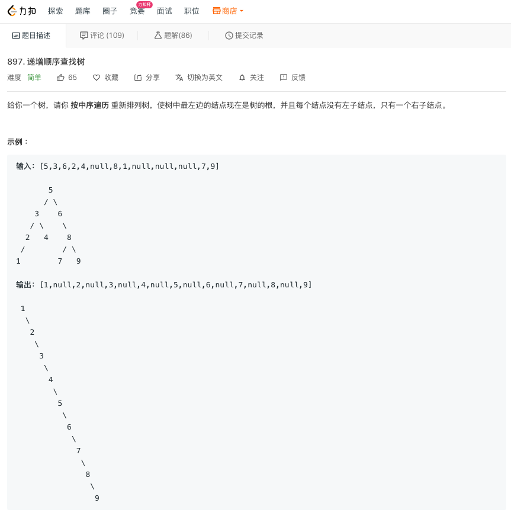

> 原文链接: https://leetcode-cn.com/problems/convert-bst-to-greater-tree


## 英文原文
<div><p>Given the <code>root</code> of a Binary Search Tree (BST), convert it to a Greater Tree such that every key of the original BST is changed to the original key plus the sum of all keys greater than the original key in BST.</p>

<p>As a reminder, a <em>binary search tree</em> is a tree that satisfies these constraints:</p>

<ul>
	<li>The left subtree of a node contains only nodes with keys <strong>less than</strong> the node&#39;s key.</li>
	<li>The right subtree of a node contains only nodes with keys <strong>greater than</strong> the node&#39;s key.</li>
	<li>Both the left and right subtrees must also be binary search trees.</li>
</ul>

<p>&nbsp;</p>
<p><strong>Example 1:</strong></p>

<pre>
<strong>Input:</strong> root = [4,1,6,0,2,5,7,null,null,null,3,null,null,null,8]
<strong>Output:</strong> [30,36,21,36,35,26,15,null,null,null,33,null,null,null,8]
</pre>

<p><strong>Example 2:</strong></p>

<pre>
<strong>Input:</strong> root = [0,null,1]
<strong>Output:</strong> [1,null,1]
</pre>

<p><strong>Example 3:</strong></p>

<pre>
<strong>Input:</strong> root = [1,0,2]
<strong>Output:</strong> [3,3,2]
</pre>

<p><strong>Example 4:</strong></p>

<pre>
<strong>Input:</strong> root = [3,2,4,1]
<strong>Output:</strong> [7,9,4,10]
</pre>

<p>&nbsp;</p>
<p><strong>Constraints:</strong></p>

<ul>
	<li>The number of nodes in the tree is in the range <code>[0, 10<sup>4</sup>]</code>.</li>
	<li><code>-10<sup>4</sup> &lt;= Node.val &lt;= 10<sup>4</sup></code></li>
	<li>All the values in the tree are <strong>unique</strong>.</li>
	<li><code>root</code> is guaranteed to be a valid binary search tree.</li>
</ul>

<p>&nbsp;</p>
<p><strong>Note:</strong> This question is the same as 1038: <a href="https://leetcode.com/problems/binary-search-tree-to-greater-sum-tree/" target="_blank">https://leetcode.com/problems/binary-search-tree-to-greater-sum-tree/</a></p>
</div>

## 中文题目
<div><p>给出二叉<strong> 搜索 </strong>树的根节点，该树的节点值各不相同，请你将其转换为累加树（Greater Sum Tree），使每个节点 <code>node</code>&nbsp;的新值等于原树中大于或等于&nbsp;<code>node.val</code>&nbsp;的值之和。</p>

<p>提醒一下，二叉搜索树满足下列约束条件：</p>

<ul>
	<li>节点的左子树仅包含键<strong> 小于 </strong>节点键的节点。</li>
	<li>节点的右子树仅包含键<strong> 大于</strong> 节点键的节点。</li>
	<li>左右子树也必须是二叉搜索树。</li>
</ul>

<p><strong>注意：</strong>本题和 1038:&nbsp;<a href="https://leetcode-cn.com/problems/binary-search-tree-to-greater-sum-tree/">https://leetcode-cn.com/problems/binary-search-tree-to-greater-sum-tree/</a> 相同</p>

<p>&nbsp;</p>

<p><strong>示例 1：</strong></p>

<p><strong></strong></p>

<pre><strong>输入：</strong>[4,1,6,0,2,5,7,null,null,null,3,null,null,null,8]
<strong>输出：</strong>[30,36,21,36,35,26,15,null,null,null,33,null,null,null,8]
</pre>

<p><strong>示例 2：</strong></p>

<pre><strong>输入：</strong>root = [0,null,1]
<strong>输出：</strong>[1,null,1]
</pre>

<p><strong>示例 3：</strong></p>

<pre><strong>输入：</strong>root = [1,0,2]
<strong>输出：</strong>[3,3,2]
</pre>

<p><strong>示例 4：</strong></p>

<pre><strong>输入：</strong>root = [3,2,4,1]
<strong>输出：</strong>[7,9,4,10]
</pre>

<p>&nbsp;</p>

<p><strong>提示：</strong></p>

<ul>
	<li>树中的节点数介于 <code>0</code>&nbsp;和 <code>10<sup>4</sup></code><sup>&nbsp;</sup>之间。</li>
	<li>每个节点的值介于 <code>-10<sup>4</sup></code>&nbsp;和&nbsp;<code>10<sup>4</sup></code>&nbsp;之间。</li>
	<li>树中的所有值 <strong>互不相同</strong> 。</li>
	<li>给定的树为二叉搜索树。</li>
</ul>
</div>

## 通过代码
<RecoDemo>
</RecoDemo>


## 高赞题解

> 本文将带你用树的一种遍历算法解决N个`leetcode`相关算法题(算法小渣渣致敬叶师傅)


> 我不害怕曾經練過一萬種踢法的人，但我害怕一種踢法練過一萬次的人(by 叶师傅的徒弟Bruce Lee)


# 树的遍历(Traversal)
如下图, 三种遍历方式, 可用同一种递归思想实现


## 先序遍历(PreOrder, 按照先访问根节点的顺序)

```JavaScript
var preorderTraversal = function(root) {
  const res = []
  function traversal (root) {
    if (root !== null) {
      res.push(root.val) // 访问根节点的值
      traversal(root.left) // 递归遍历左子树
      traversal(root.right) // 递归遍历右子树
    }
  }
  traversal(root)
  return res
}
```

## 94 中序遍历(InOrder, 按照根节点在中间访问的顺序)


```JavaScript
var inorderTraversal = function(root) {
  const res = []
  function traversal (root) {
    if (root !== null) {
      traversal(root.left)
      res.push(root.val)
      traversal(root.right)
    }
  }
  traversal(root)
  return res
}
```

## 145 后续遍历(PosterOrder, 按照根节点在后面访问的顺序)


```JavaScript
var postorderTraversal = function(root) {
  const res = []
  function traversal (root) {
    if (root !== null) {
      traversal(root.left)
      traversal(root.right)
      res.push(root.val)
    }
  }
  traversal(root)
  return res
}
```

## 100 相同的树


可以利用这种递归思想并发同时爬两棵树

```JavaScript
var isSameTree = function(p, q) {
  function traversal (root1, root2) {
    if (root1 === null && root2 !== null) {
      return false
    } else if (root1 !== null && root2 === null) {
      return false
    } else if (root1 === null && root2 === null) {
      return true
    } else {
      return  root1.val === root2.val && traversal(root1.left, root2.left) && traversal(root1.right, root2.right)
    }
  }
  return traversal(p, q)
}
```

## 226 翻转二叉树


这种算法可以帮助`Homebrew`作者`Max Howell`解开`Google`的算法面试题


```JavaScript
var invertTree = function(root) {
  function traversal (root) {
    if (root === null) {
      return null
    } else {
      [root.left, root.right] = [traversal(root.right), traversal(root.left)]
      return root
    }
  }
  return  traversal(root)
}
```

## 590 N叉树的后序遍历


我们还可以用此种算法解决N叉树的问题
```JavaScript
var postorder = function(root) {
  const res = []
  function traversal (root) {
    if (root !== null) {
      root.children.forEach(child => {
        traversal(child)
      })
      res.push(root.val)
    }
  }
  traversal(root)
  return res
}
```
如果你已对这种写法审美疲劳, 可以换个写法, 使用匿名函数
```JavaScript
var postorder = function(root) {
  const res = []
  ;(function (root) {
    if (root !== null) {
      root.children.forEach(child => {
        arguments.callee(child)
      })
      res.push(root.val)
    }
  })(root)
  return res
}
```
还可以利用栈来迭代
```JavaScript
var postorder = function(root) {
  if (root === null) {
    return []
  }
  const res = []
  const arr = [root]
  while (arr.length) {
    const cur = arr.pop()
    res.push(cur.val)
    for (let i = cur.children.length - 1; i >= 0; i--) {
      arr.push(cur.children[i])
    }
  }
  return res.reverse()
}
```

## 103 二叉树的锯齿形层次遍历


大白话, 蛇皮走位爬树

```JavaScript
var zigzagLevelOrder = function(root) {
  if (root === null) {
    return []
  } else {
    let res = []
    function traversal (root, depth) {
      if (root !== null) {
        if (res[depth] === undefined) {
          res[depth] = []
        }
        res[depth].push(root.val)
        traversal(root.left, depth + 1)
        traversal(root.right, depth + 1)
      }
    }
    traversal(root, 0)
    res.forEach((item, index) => {
      if (index & 1) {
        res[index] = item.reverse()
      }
    })
    return res
  }
}
```
优化
```JavaScript
var zigzagLevelOrder = function(root) {
  if (root === null) {
    return []
  } else {
    let res = []
    function traversal (root, depth) {
      if (root !== null) {
        if (res[depth] === undefined) {
          res[depth] = []
        }
        if (depth & 1) {
          res[depth].unshift(root.val)
        } else {
          res[depth].push(root.val)
        }
        traversal(root.left, depth + 1)
        traversal(root.right, depth + 1)
      }
    }
    traversal(root, 0)
    return res
  }
}
```

## 230 二叉搜索树中第K小的元素


```JavaScript
var kthSmallest = function (root, k) {
  let arr = []
  function traversal (node) {
    if (node !== null) {
      traversal(node.left)
      arr.push(node.val)
      traversal(node.right)
    }
  }
  traversal(root)
  return arr[k - 1]
}
```

优化, 减少遍历次数
```JavaScript
var kthSmallest = function (root, k) {
  let arr = []
  function traversal(node) {
    if (node !== null && arr.length < k) {
      traversal(node.left)
      arr.push(node.val)
      traversal(node.right)
    }
  }
  traversal(root)
  return arr[k - 1]
}
```

进一步优化, 使用O(1)的额外空间
```JavaScript
var kthSmallest = function (root, k) {
  let res
  let count = 0
  function traversal(node) {
    if (node !== null) {
      if (count < k) {
        traversal(node.left)
      }
      if (++count === k) {
        res = node.val
      }
      if (count < k) {
        traversal(node.right)
      }
    }
  }
  traversal(root)
  return res
}
```

## 102 二叉树的层序遍历   


```JavaScript
var levelOrder = function(root) {
  const res = []
  function traversal (root, depth) {
    if (root !== null) {
      if (!res[depth]) {
        res[depth] = []
      }
      traversal(root.left, depth + 1)
      res[depth].push(root.val)
      traversal(root.right, depth + 1)
    }
  }
  traversal(root, 0)
  return res
}
```

## 199 二叉树的右视图


基本思路: 先序遍历, 记录每一层深度下的节点的值, 并先记录左节点再记录右节点, 则最后记录的值即为该层深度的右视图看到的值

```JavaScript
var rightSideView = function(root) {
  const arr = []
  function traversal (root, depth) {
    if (root) {
      if (arr[depth] === undefined) {
        arr[depth] = []
      }
      arr[depth].push(root.val)
      traversal(root.left, depth + 1)
      traversal(root.right, depth + 1)
    }
  }
  traversal(root, 0)
  const res = []
  for (let i = 0; i < arr.length; ++i) {
    res.push(arr[i][arr[i].length - 1])
  }
  return res
};
```

## 104 二叉树的最大深度


```JavaScript
var maxDepth = function (root) {
  let res = 0
  function traversal (root, depth) {
    if (root !== null) {
      if (depth > res) {
        res = depth
      }
      if (root.left) {
        traversal(root.left, depth + 1)
      }
      if (root.right) {
        traversal(root.right, depth + 1)
      }
    }
  }
  traversal(root, 1)
  return res
}
```

## 107 二叉树的层次遍历 II   


```JavaScript
var levelOrderBottom = function(root) {
  if (root === null) {
    return []
  }
  let res = []
  function traversal (root, depth) {
    if (root !== null) {
      if (!res[depth]) {
        res[depth] = []
      }
      traversal(root.left, depth + 1)
      res[depth].push(root.val)
      traversal(root.right, depth + 1)
    }
  }
  traversal(root, 0)
  return res.reverse()
}
```

## 671 二叉树中第二小的节点  


```JavaScript
var findSecondMinimumValue = function(root) {
  let arr = []
  ;(function traversal (root) {
    if (root !== null) {
      traversal(root.left)
      arr.push(root.val)
      traversal(root.right)
    }
  })(root)
  let _arr = [...new Set(arr)].sort()
  return _arr[1] ? _arr[1] : -1
}
```


## 1038 从二叉搜索树到更大和树  


```JavaScript
var bstToGst = function(root) {
  let sum = 0
  function traversal (root) {
    if (root !== null) {
      traversal(root.right)
      root.val += sum
      sum = root.val
      traversal(root.left)
    }
  }
  traversal(root)
  return root
}
```

## 538 把二叉搜索树转换为累加树   


```JavaScript
var convertBST = function(root) {
  let sum = 0
  function traversal (root) {
    if (root !== null) {
      traversal(root.right)
      sum += root.val
      root.val = sum
      traversal(root.left)
    }
  }
  traversal(root)
  return root
}
```

## 700 二叉搜索树中的搜索


```JavaScript
var searchBST = function(root, val) {
  function traversal (root) {
    if (root !== null) {
      if (root.val === val) {
        return root
      } else if (root.val < val) {
        return traversal(root.right)
      } else {
        return traversal(root.left)
      }
    } else {
      return root
    }
  }
  return traversal(root)
}
```

## 559 N叉树的最大深度   


```JavaScript
var maxDepth = function(root) {
  if (root === null) {
    return 0
  } else {
    let depth = 1
    function traversal (root, curDepth) {
      if (root !== null) {
        if (curDepth > depth) {
          depth = curDepth
        }
        root.children.forEach(child => traversal(child, curDepth + 1))
      }
    }
    traversal(root, 1)
    return depth
  }
}
```

## 589 N叉树的前序遍历   


```JavaScript
var preorder = function(root) {
  const res = []
  function traversal (root) {
    if (root !== null) {
      res.push(root.val)
      root.children.forEach(child => traversal(child))
    }
  }
  traversal(root)
  return res
}
```

## 897 递增顺序查找树



```JavaScript
var increasingBST = function(root) {
  const arr = []
  function traversal (root) {
    if (root !== null) {
      traversal(root.left)
      arr.push(root.val)
      traversal(root.right)
    }
  }
  traversal(root)
  const res = new TreeNode(arr[0])
  let currentNode = res
  for (let i = 0; i < arr.length - 1; i++) {
    currentNode.left = null
    currentNode.right = new TreeNode(arr[i + 1])
    currentNode = currentNode.right
  }
  return res
}
```

原文在掘金: [https://juejin.im/post/5e1c4e46f265da3e140fa54d](https://juejin.im/post/5e1c4e46f265da3e140fa54d)

欢迎点赞👍、关注和来撩三连😎


## 统计信息
| 通过次数 | 提交次数 | AC比率 |
| :------: | :------: | :------: |
|    117140    |    165442    |   70.8%   |

## 提交历史
| 提交时间 | 提交结果 | 执行时间 |  内存消耗  | 语言 |
| :------: | :------: | :------: | :--------: | :--------: |
