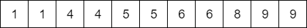
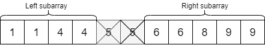
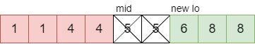
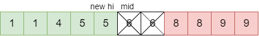
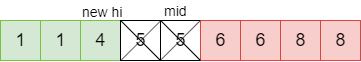
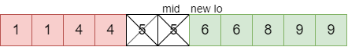

> 原文链接: https://leetcode-cn.com/problems/single-element-in-a-sorted-array


## 英文原文
<div><p>You are given a sorted array consisting of only integers where every element appears exactly twice, except for one element which appears exactly once.</p>

<p>Return <em>the single element that appears only once</em>.</p>

<p>Your solution must run in <code>O(log n)</code> time and <code>O(1)</code> space.</p>

<p>&nbsp;</p>
<p><strong>Example 1:</strong></p>
<pre><strong>Input:</strong> nums = [1,1,2,3,3,4,4,8,8]
<strong>Output:</strong> 2
</pre><p><strong>Example 2:</strong></p>
<pre><strong>Input:</strong> nums = [3,3,7,7,10,11,11]
<strong>Output:</strong> 10
</pre>
<p>&nbsp;</p>
<p><strong>Constraints:</strong></p>

<ul>
	<li><code>1 &lt;= nums.length &lt;= 10<sup>5</sup></code></li>
	<li><code>0 &lt;= nums[i] &lt;= 10<sup>5</sup></code></li>
</ul>
</div>

## 中文题目
<div><p>给你一个仅由整数组成的有序数组，其中每个元素都会出现两次，唯有一个数只会出现一次。</p>

<p>请你找出并返回只出现一次的那个数。</p>

<p>你设计的解决方案必须满足 <code>O(log n)</code> 时间复杂度和 <code>O(1)</code> 空间复杂度。</p>

<p>&nbsp;</p>

<p><strong>示例 1:</strong></p>

<pre>
<strong>输入:</strong> nums = [1,1,2,3,3,4,4,8,8]
<strong>输出:</strong> 2
</pre>

<p><strong>示例 2:</strong></p>

<pre>
<strong>输入:</strong> nums =  [3,3,7,7,10,11,11]
<strong>输出:</strong> 10
</pre>

<p>&nbsp;</p>

<p><meta charset="UTF-8" /></p>

<p><strong>提示:</strong></p>

<ul>
	<li><code>1 &lt;= nums.length &lt;= 10<sup>5</sup></code></li>
	<li><code>0 &lt;= nums[i]&nbsp;&lt;= 10<sup>5</sup></code></li>
</ul>
</div>

## 通过代码
<RecoDemo>
</RecoDemo>


## 官方题解
####  方法一：暴力法
我们可以使用线性搜索来检查数组中的每个元素，直到找到单个元素。

**算法：**
- 从第一个元素开始，我们检查每个第二个元素是否与当前元素相同。 如果不同，说明该元素是单个元素。
- 如果我们到达最后一个元素，则它为单一元素。

```java [solution1-Java]
class Solution {
    public int singleNonDuplicate(int[] nums) {
        for (int i = 0; i < nums.length - 1; i+=2) {
            if (nums[i] != nums[i + 1]) {
                return nums[i];
            }
        }
        return nums[nums.length - 1];
    }
}
```

```python [solution1-Python]
def singleNonDuplicate(self, nums: List[int]) -> int:
    for i in range(0, len(nums) - 2, 2):
        if nums[i] != nums[i + 1]:
            return nums[i]
    return nums[-1]
```

```c++ [solution1-C++]
class Solution {
public:
    int singleNonDuplicate(vector<int>& nums) {
        for (int i = 0; i < nums.size() - 1; i += 2) {
            if (nums[i] != nums[i + 1]) {
                return nums[i];
            }
        }
        return nums.back();
    }
};
```

**复杂度分析**

* 时间复杂度：$O(n)$。我们的线性搜索只查看每个元素一次。
* 空间复杂度：$O(1)$，只使用了常数的额外空间。

尽管这个解决方案可行，但是问题中要求我们使用时间复杂度在 $O(\log n)$ 的解决方案。因此，该解决方案还不够好。


####  方法二：二分搜索
我们将线性搜索转换为二分搜索是有意义的，它能加快我们的效率。为了使用二分搜索，我们需要查看中间的元素来判断我们的答案在中间，左边还是右边。我们的数组个数始终是奇数，因为有一个元素出现一次，其余元素出现两次。



下面是当我们从中心移除一对元素时发生的情况。将剩下左子数组和右子数组。



与原数组一样，包含单个元素的子数组元素个数必为奇数，不包含单个元素的子数组必为偶数。 因此，当原数组移除一对元素后，然后计算出哪一侧的子数组元素个数是奇数，这样我们就能够知道下一步应该在哪一侧进行搜索。

**算法：**
- 我们首先将 `lo` 和 `hi` 指向数组首尾两个元素。然后进行二分搜索将数组搜索空间减半，直到找到单一元素或者仅剩一个元素为止。当搜索空间只剩一个元素，则该元素就是单个元素。
- 在每个循环迭代中，我们确定 `mid`，变量 `halvesAreEven = (hi - mid) % 2 == 0`。 通过查看中间元素同一元素为哪一个（左侧子数组中的最后一个元素或右侧子数组中的第一个元素），我们可以通过变量 `halvesAreEven` 确定现在哪一侧元素个数为奇数，并更新 `lo` 和 `hi`。
- 最难的部分是根据 `mid` 和 `halvesAreEven` 的值正确更新 `lo` 和 `hi`。我们通过下图来帮助我们理解。

例子 1：中间元素的同一元素在右边，且被 `mid` 分成两半的数组为偶数。

我们将右子数组的第一个元素移除后，则右子数组元素个数变成奇数，我们应将 `lo` 设置为 `mid + 2`。



例子 2：中间元素的同一元素在右边，且被 `mid` 分成两半的数组为奇数。

我们将右子数组的第一个元素移除后，则右子数组的元素个数变为偶数，我们应将 `hi` 设置为 `mid - 1`。



例子 3：中间元素的同一元素在左边，且被 `mid` 分成两半的数组为偶数。

我们将左子数组的最后一个元素移除后，则左子数组的元素个数变为奇数，我们应将 `hi` 设置为 `mid - 2`。



例子 4：中间元素的同一元素在左边，且被 `mid` 分成两半的数组为奇数。

我们将左子数组的最后一个元素移除后，则左子数组的元素个数变为偶数，我们应将 `lo` 设置为 `mid + 1`。



```java [solution2-Java]
class Solution {
    public int singleNonDuplicate(int[] nums) {
        int lo = 0;
        int hi = nums.length - 1;
        while (lo < hi) {
            int mid = lo + (hi - lo) / 2;
            boolean halvesAreEven = (hi - mid) % 2 == 0;
            if (nums[mid + 1] == nums[mid]) {
                if (halvesAreEven) {
                    lo = mid + 2;
                } else {
                    hi = mid - 1;
                }
            } else if (nums[mid - 1] == nums[mid]) {
                if (halvesAreEven) {
                    hi = mid - 2;
                } else {
                    lo = mid + 1;
                }
            } else {
                return nums[mid];
            }
        }
        return nums[lo];
    }
}
```

```python [solution2-Python]
def singleNonDuplicate(self, nums: List[int]) -> int:
    lo = 0
    hi = len(nums) - 1   
    while lo < hi:
        mid = lo + (hi - lo) // 2
        halves_are_even = (hi - mid) % 2 == 0
        if nums[mid + 1] == nums[mid]:
            if halves_are_even:
                lo = mid + 2
            else:
                hi = mid - 1
        elif nums[mid - 1] == nums[mid]:
            if halves_are_even:
                hi = mid - 2
            else:
                lo = mid + 1
        else:
            return nums[mid]
    return nums[lo]
```

```c++ [solution2-C++]
class Solution {
public:
    int singleNonDuplicate(vector<int>& nums) {
        int lo = 0;
        int hi = nums.size() - 1;
        while (lo < hi) {
            int mid = lo + (hi - lo) / 2;
            bool halvesAreEven = (hi - mid) % 2 == 0;
            if (nums[mid + 1] == nums[mid]) {
                if (halvesAreEven) {
                    lo = mid + 2;
                } else {
                    hi = mid - 1;
                }
            } else if (nums[mid - 1] == nums[mid]) {
                if (halvesAreEven) {
                    hi = mid - 2;
                } else {
                    lo = mid + 1;
                }
            } else {
                return nums[mid];
            }
        }
        return nums[lo];
    }
};
```
另外，你会发现即使数组没有经过排序，只要将同一元素放在一起，该算法仍然起作用（例：`[10, 10, 4, 4, 7, 11, 11, 12, 12, 2, 2]`）。他们的顺序无关紧要，重要的是含有单个元素的子数组元素个数为奇数。

**复杂度分析**

* 时间复杂度：$O(\log n)$。在每次循环迭代中，我们将搜索空间减少了一半。
* 空间复杂度：$O(1)$，仅使用了常数空间。


####  方法三：仅对偶数索引进行二分搜索
- 事实证明我们只需要对偶数索引进行二分搜索。这种方法与方法二都是不错的方法，但是该方法比方法二更加优雅。
- 在该算法中，我们对所有偶数索引进行搜索，直到遇到第一个其后元素不相同的索引。
- 我们可以使用二分搜索替代线性搜索。
- 在单个元素的后面，则成对的元素变为奇数索引后跟他们的同一元素。说明我们在检索单个元素后面的偶数索引时，其后都没有它的同一元素。因此，我们可以通过偶数索引确定单个元素在左侧还是右侧。

**算法：**
- 奇数长度的数组首尾元素索引都为偶数，因此我们可以将 `lo` 和 `hi` 设置为数组首尾。
- 我们需要确保 `mid` 是偶数，如果为奇数，则将其减 `1`。
- 然后，我们检查 `mid` 的元素是否与其后面的索引相同。
- 如果相同，则我们知道 `mid` 不是单个元素。且单个元素在 `mid` 之后。则我们将 `lo` 设置为 `mid + 2`。
- 如果不是，则我们知道单个元素位于 `mid`，或者在 `mid` 之前。我们将 `hi` 设置为 `mid`。
- 一旦 `lo == hi`，则当前搜索空间为 1 个元素，那么该元素为单个元素，我们将返回它。

```java [solution3-Java]
class Solution {
    public int singleNonDuplicate(int[] nums) {
        int lo = 0;
        int hi = nums.length - 1;
        while (lo < hi) {
            int mid = lo + (hi - lo) / 2;
            if (mid % 2 == 1) mid--;
            if (nums[mid] == nums[mid + 1]) {
                lo = mid + 2;
            } else {
                hi = mid;
            }
        }
        return nums[lo];
    }
}
```

```python [solution3-Python]
def singleNonDuplicate(self, nums: List[int]) -> int:
    lo = 0
    hi = len(nums) - 1
    while lo < hi:
        mid = lo + (hi - lo) // 2
        if mid % 2 == 1:
            mid -= 1
        if nums[mid] == nums[mid + 1]:
            lo = mid + 2
        else:
            hi = mid
    return nums[lo]
```

```c++ [solution3-C++]
class Solution {
public:
    int singleNonDuplicate(vector<int>& nums) {
        int lo = 0;
        int hi = nums.size() - 1;
        while (lo < hi) {
            int mid = lo + (hi - lo) / 2;
            if (mid % 2 == 1) mid--;
            if (nums[mid] == nums[mid + 1]) {
                lo = mid + 2;
            } else {
                hi = mid;
            }
        }
        return nums[lo];
    }
};
```


**复杂度分析**

* 时间复杂度：$O(\log \frac{n}{2}) = O(\log n)$。我们仅对元素的一半进行二分搜索。
* 空间复杂度：$O(1)$，仅用了常数的空间。

## 统计信息
| 通过次数 | 提交次数 | AC比率 |
| :------: | :------: | :------: |
|    41888    |    71920    |   58.2%   |

## 提交历史
| 提交时间 | 提交结果 | 执行时间 |  内存消耗  | 语言 |
| :------: | :------: | :------: | :--------: | :--------: |
