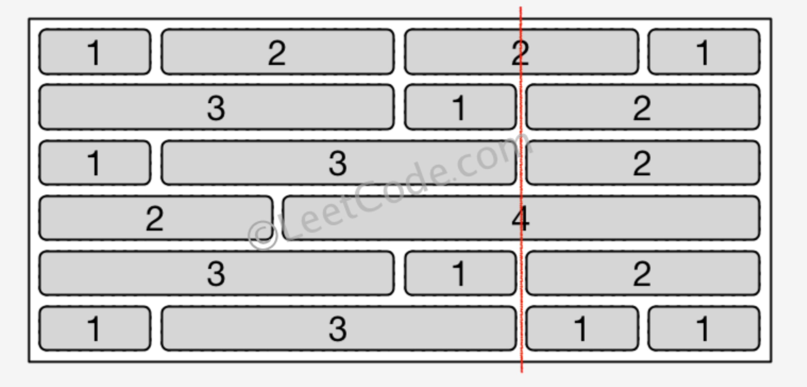

> 原文链接: https://leetcode-cn.com/problems/brick-wall


## 英文原文
<div><p>There is a rectangular brick wall in front of you with <code>n</code> rows of bricks. The <code>i<sup>th</sup></code> row has some number of bricks each of the same height (i.e., one unit) but they can be of different widths. The total width of each row is the same.</p>

<p>Draw a vertical line from the top to the bottom and cross the least bricks. If your line goes through the edge of a brick, then the brick is not considered as crossed. You cannot draw a line just along one of the two vertical edges of the wall, in which case the line will obviously cross no bricks.</p>

<p>Given the 2D array <code>wall</code> that contains the information about the wall, return <em>the minimum number of crossed bricks after drawing such a vertical line</em>.</p>

<p>&nbsp;</p>
<p><strong>Example 1:</strong></p>

<pre>
<strong>Input:</strong> wall = [[1,2,2,1],[3,1,2],[1,3,2],[2,4],[3,1,2],[1,3,1,1]]
<strong>Output:</strong> 2
</pre>

<p><strong>Example 2:</strong></p>

<pre>
<strong>Input:</strong> wall = [[1],[1],[1]]
<strong>Output:</strong> 3
</pre>

<p>&nbsp;</p>
<p><strong>Constraints:</strong></p>

<ul>
	<li><code>n == wall.length</code></li>
	<li><code>1 &lt;= n &lt;= 10<sup>4</sup></code></li>
	<li><code>1 &lt;= wall[i].length &lt;= 10<sup>4</sup></code></li>
	<li><code>1 &lt;= sum(wall[i].length) &lt;= 2 * 10<sup>4</sup></code></li>
	<li><code>sum(wall[i])</code> is the same for each row <code>i</code>.</li>
	<li><code>1 &lt;= wall[i][j] &lt;= 2<sup>31</sup> - 1</code></li>
</ul>
</div>

## 中文题目
<div><p>你的面前有一堵矩形的、由 <code>n</code> 行砖块组成的砖墙。这些砖块高度相同（也就是一个单位高）但是宽度不同。每一行砖块的宽度之和相等。</p>

<p>你现在要画一条 <strong>自顶向下 </strong>的、穿过 <strong>最少 </strong>砖块的垂线。如果你画的线只是从砖块的边缘经过，就不算穿过这块砖。<strong>你不能沿着墙的两个垂直边缘之一画线，这样显然是没有穿过一块砖的。</strong></p>

<p>给你一个二维数组 <code>wall</code> ，该数组包含这堵墙的相关信息。其中，<code>wall[i]</code> 是一个代表从左至右每块砖的宽度的数组。你需要找出怎样画才能使这条线 <strong>穿过的砖块数量最少</strong> ，并且返回 <strong>穿过的砖块数量</strong> 。</p>

<p> </p>

<p><strong>示例 1：</strong></p>

<pre>
<strong>输入：</strong>wall = [[1,2,2,1],[3,1,2],[1,3,2],[2,4],[3,1,2],[1,3,1,1]]
<strong>输出：</strong>2
</pre>

<p><strong>示例 2：</strong></p>

<pre>
<strong>输入：</strong>wall = [[1],[1],[1]]
<strong>输出：</strong>3
</pre>
 

<p><strong>提示：</strong></p>

<ul>
	<li><code>n == wall.length</code></li>
	<li><code>1 <= n <= 10<sup>4</sup></code></li>
	<li><code>1 <= wall[i].length <= 10<sup>4</sup></code></li>
	<li><code>1 <= sum(wall[i].length) <= 2 * 10<sup>4</sup></code></li>
	<li>对于每一行 <code>i</code> ，<code>sum(wall[i])</code> 是相同的</li>
	<li><code>1 <= wall[i][j] <= 2<sup>31</sup> - 1</code></li>
</ul>
</div>

## 通过代码
<RecoDemo>
</RecoDemo>


## 高赞题解
## 哈希表

题目要求穿过的砖块数量最少，等效于通过的间隙最多。

**我们可以使用「哈希表」记录每个间隙的出现次数，最终统计所有行中哪些间隙出现得最多，使用「总行数」减去「间隙出现的最多次数」即是答案。**

如何记录间隙呢？直接使用行前缀记录即可。

就用示例数据来举 🌰 ：



* 第 1 行的间隙有 `[1,3,5]`
* 第 2 行的间隙有 `[3,4]`
* 第 3 行的间隙有 `[1,4]`
* 第 4 行的间隙有 `[2]`
* 第 5 行的间隙有 `[3,4]`
* 第 6 行的间隙有 `[1,4,5]`

对间隙计数完成后，遍历「哈希表」找出出现次数最多间隙 `4`，根据同一个间隙编号只会在单行内被统计一次，用总行数减去出现次数，即得到「最少穿过的砖块数」。

**代码（感谢 [@nactran](/u/pleviumtan/) 同学提供的其他语言版本）：**
```Java []
class Solution {
    public int leastBricks(List<List<Integer>> wall) {
        int n = wall.size();
        Map<Integer, Integer> map = new HashMap<>();
        for (int i = 0, sum = 0; i < n; i++, sum = 0) {
            for (int cur : wall.get(i)) {
                sum += cur;
                map.put(sum, map.getOrDefault(sum, 0) + 1);
            }
            map.remove(sum); // 不能从两边穿过，需要 remove 掉最后一个
        }
        int ans = n;
        for (int u : map.keySet()) {
            int cnt = map.get(u);
            ans = Math.min(ans, n - cnt);
        }
        return ans;
    }
}
```
```C++ []
class Solution {
public:
    int leastBricks(vector<vector<int>>& wall) {
        int n = wall.size();
        unordered_map<int,int> map;
        for (int i = 0, sum = 0; i < n; i++, sum = 0) {
            for (int cur : wall[i]) {
                sum += cur;
                map[sum]++;
            }
            map.erase(sum); // 不能从两边穿过，需要 remove 掉最后一个
        }
        int ans = n;
        for (auto& [u,cnt] : map) {
            ans = min(ans, n - cnt);
        }
        return ans;
    }
};
```
* 时间复杂度：记所有砖块数量为 `n`，所有砖块都会被扫描。复杂度为 $O(n)$
* 空间复杂度：$O(n)$

***

## 关于是否需要考虑「溢出」的说明

类似的问题，在之前 [题解](https://leetcode-cn.com/problems/combination-sum-iv/solution/gong-shui-san-xie-yu-wan-quan-bei-bao-we-x0kn/) 也说过，这里再提一下 ~ 

**当 Java 发生溢出时，会直接转成负数来处理**。因此对于本题不会影响正确性（不重复溢出的话）。

可以通过以下例子来体会：

```Java []
{
    System.out.println(Integer.MIN_VALUE); // -2147483648
    
    int a = Integer.MAX_VALUE;
    System.out.println(a); // 2147483647
    a += 1;
    System.out.println(a); // -2147483648
    a -= 1;
    System.out.println(a); //2147483647
}
```

这意味着，如果我们在运算过程中如果只涉及「纯加减运算」，而不涉及「乘除」、「取最大值/最小值」和「数值大小判断」的话，Java 是不需要使用 `Long` 来确保正确性的，因为最终溢出会被转化回来。

按道理，CPP 本身对于 `int` 溢出的转化处理也是一样的。

**但在 LC 上的 CPP 发生溢出时，不会直接转成负数来处理，而是直接抛出异常**。因此同样的代码在 LC 上是无法被正常执行的：

```C++ []
{
    cout << INT_MIN << endl; //-2147483648

    int a = INT_MAX; 
    cout << a << endl; // 2147483647
    a += 1; // 溢出报错
    cout << a << endl;
    a -= 1;
    cout << a << endl;
}
```

**这是一般性的，对于 LC 上的同一道题，Java 不需要处理溢出，CPP 需要处理的原因。**

***
其实对应到本题，我这里不使用 long long，是因为猜想「题目」中的条件写错了：

```Java 
1 <= sum(wall[i]) <= 2 * 10^4

错写成了

1 <= sum(wall[i].length) <= 2 * 10^4
```

因为在给定下面两个条件的情况下：

```
1 <= n <= 10^4
1 <= wall[i].length <= 10^4
```

$1 <= sum(wall[i].length) <= 2 * 10^4$ 十分多余。

针对反例：
```Java
[
    [2147483647,2147483647,2147483647,2147483647,1,2], 
    [2,2147483647,2147483647,2147483647,2147483647,1]
]
```

我用官方提供的代码，跑的也是 0，所以如果是以官方的代码为评测标准的话，用 long long 反而是 WA 了 🤣


***

## 最后

**如果有帮助到你，请给题解点个赞和收藏，让更多的人看到 ~ ("▔□▔)/**

也欢迎你 [关注我](https://oscimg.oschina.net/oscnet/up-19688dc1af05cf8bdea43b2a863038ab9e5.png) 和 加入我们的[「组队打卡」](https://leetcode-cn.com/u/ac_oier/)小群 ，提供写「证明」&「思路」的高质量题解 


## 统计信息
| 通过次数 | 提交次数 | AC比率 |
| :------: | :------: | :------: |
|    46914    |    93132    |   50.4%   |

## 提交历史
| 提交时间 | 提交结果 | 执行时间 |  内存消耗  | 语言 |
| :------: | :------: | :------: | :--------: | :--------: |
