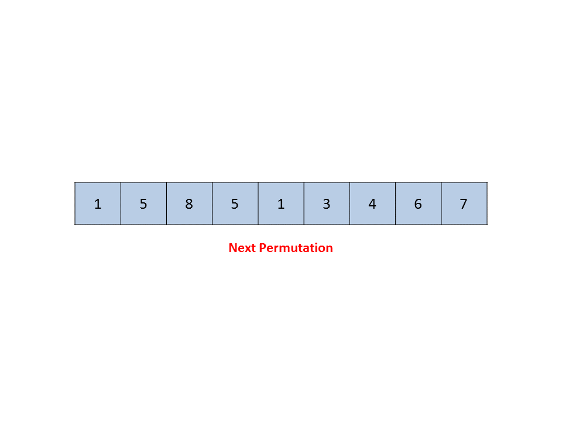

> 原文链接: https://leetcode-cn.com/problems/next-greater-element-iii


## 英文原文
<div><p>Given a positive integer <code>n</code>, find <em>the smallest integer which has exactly the same digits existing in the integer</em> <code>n</code> <em>and is greater in value than</em> <code>n</code>. If no such positive integer exists, return <code>-1</code>.</p>

<p><strong>Note</strong> that the returned integer should fit in <strong>32-bit integer</strong>, if there is a valid answer but it does not fit in <strong>32-bit integer</strong>, return <code>-1</code>.</p>

<p>&nbsp;</p>
<p><strong>Example 1:</strong></p>
<pre><strong>Input:</strong> n = 12
<strong>Output:</strong> 21
</pre><p><strong>Example 2:</strong></p>
<pre><strong>Input:</strong> n = 21
<strong>Output:</strong> -1
</pre>
<p>&nbsp;</p>
<p><strong>Constraints:</strong></p>

<ul>
	<li><code>1 &lt;= n &lt;= 2<sup>31</sup> - 1</code></li>
</ul>
</div>

## 中文题目
<div><p>给你一个正整数 <code>n</code> ，请你找出符合条件的最小整数，其由重新排列 <code>n</code><strong> </strong>中存在的每位数字组成，并且其值大于 <code>n</code> 。如果不存在这样的正整数，则返回 <code>-1</code> 。</p>

<p><strong>注意</strong> ，返回的整数应当是一个 <strong>32 位整数</strong> ，如果存在满足题意的答案，但不是 <strong>32 位整数</strong> ，同样返回 <code>-1</code> 。</p>

<p> </p>

<p><strong>示例 1：</strong></p>

<pre>
<strong>输入：</strong>n = 12
<strong>输出：</strong>21
</pre>

<p><strong>示例 2：</strong></p>

<pre>
<strong>输入：</strong>n = 21
<strong>输出：</strong>-1
</pre>

<p> </p>

<p><strong>提示：</strong></p>

<ul>
	<li><code>1 <= n <= 2<sup>31</sup> - 1</code></li>
</ul>
</div>

## 通过代码
<RecoDemo>
</RecoDemo>


## 官方题解
#### 方法 1：暴力 [Time Limit Exceeded]

为了解决给定的问题，我们将给定的数字当做字符串 $s$。在这种方法中，我们找出所有 $s$ 给定元素的排列，得到一个字符串列表 $list$，它包含了所有可能的排列。然后我们将 $list$ 排序并找到恰好大于当前字符串的字符串。但这个方法非常粗糙，因为我们需要找到所有可能的排列，这会消耗大量时间。

```java []
public class Solution {
    public String swap(String s, int i0, int i1) {
        if (i0 == i1)
            return s;
        String s1 = s.substring(0, i0);
        String s2 = s.substring(i0 + 1, i1);
        String s3 = s.substring(i1 + 1);
        return s1 + s.charAt(i1) + s2 + s.charAt(i0) + s3;
    }
    ArrayList < String > list = new ArrayList < > ();
    void permute(String a, int l, int r) {
        int i;
        if (l == r)
            list.add(a);
        else {
            for (i = l; i <= r; i++) {
                a = swap(a, l, i);
                permute(a, l + 1, r);
                a = swap(a, l, i);
            }
        }
    }
    public int nextGreaterElement(int n) {
        String s = "" + n;
        permute(s, 0, s.length() - 1);
        Collections.sort(list);
        int i;
        for (i = list.size() - 1; i >= 0; i--) {
            if (list.get(i).equals("" + n))
                break;
        }
        return i == list.size() - 1 ? -1 : Integer.parseInt(list.get(i + 1));
    }
}
```

**复杂度分析**

* 时间复杂度： $O(n!)$。一个 $n$ 位数字的可能排列总共有 $n!$ 种。

* 空间复杂度： $O(n!)$。 $n$ 位字符串总共有 $n!$ 种可能的排列，每个排列有 $n$ 位。

#### 方法 2：线性解法 [Accepted]

**算法**

这种方法中，我们同样将给定数字 $n$ 当做字符串数组 $a$，首先我们观察到任意降序的序列，不会有更大的排列出现。

比方说，下面数列就没有下一排列：

 ```
 [9, 5, 4, 3, 1]
 ```

我们需要从右往左找到第一对连续的数字 $a[i]$ 和 $a[i-1]$ 满足 $a[i-1] < a[i]$。到当前位置位置位置，$a[i-1]$ 右边的数字没办法产生一个更大的排列，因为右边的数字是降序的。所以我们需要重新排布 $a[i-1]$ 到最右边的数字来得到下一个排列。

那么怎样排布能得到下一个更大的数字呢？我们想得到恰好大于当前数字的下一个排列，所以我们需要用恰好大于 $a[i-1]$ 的数字去替换掉 $a[i-1]$，比方说我们让这个数字为 $a[j]$。

我们将 $a[i-1]$ 和 $a[j]$ 交换，我们现在在下标为 $i-1$ 的地方得到了正确的数字，但当前的结果还不是一个正确的排列。我们需要用从 $i-1$ 开始到最右边数字剩下来的数字升序排列，来得到它们中的最小排列。

我们注意到在从右往左找到第一对 $a[i-1] < a[i]$ 的连续数字前， $a[i-1]$ 右边的数字都是降序排列的，所以交换 $a[i-1]$ 和 $a[j]$ 不会改变下标从 $i$ 开始到最后的顺序。所以我们在交换了 $a[i-1]$ 和 $a[j]$ 以后，只需要反转下标从 $i$ 开始到最后的数字，就可以得到下一个字典序最小的排列。

下面的动画更形象地解释了这一过程：

<,,,,,,,,,,,,>

```java []

public class Solution {
    public int nextGreaterElement(int n) {
        char[] a = ("" + n).toCharArray();
        int i = a.length - 2;
        while (i >= 0 && a[i + 1] <= a[i]) {
            i--;
        }
        if (i < 0)
            return -1;
        int j = a.length - 1;
        while (j >= 0 && a[j] <= a[i]) {
            j--;
        }
        swap(a, i, j);
        reverse(a, i + 1);
        try {
            return Integer.parseInt(new String(a));
        } catch (Exception e) {
            return -1;
        }
    }
    private void reverse(char[] a, int start) {
        int i = start, j = a.length - 1;
        while (i < j) {
            swap(a, i, j);
            i++;
            j--;
        }
    }
    private void swap(char[] a, int i, int j) {
        char temp = a[i];
        a[i] = a[j];
        a[j] = temp;
    }
}
```

**复杂度分析**

* 时间复杂度：$O(n)$。最坏情况下，只会扫描整个数组两遍，这里 $n$ 是给定数字的位数。

* 空间复杂度：$O(n)$。使用了大小为 $n$ 的数组 $a$ ，其中 $n$ 是给定数字的位数。


## 统计信息
| 通过次数 | 提交次数 | AC比率 |
| :------: | :------: | :------: |
|    15889    |    48327    |   32.9%   |

## 提交历史
| 提交时间 | 提交结果 | 执行时间 |  内存消耗  | 语言 |
| :------: | :------: | :------: | :--------: | :--------: |


## 相似题目
|                             题目                             | 难度 |
| :----------------------------------------------------------: | :---------: |
| [下一个更大元素 I](https://leetcode-cn.com/problems/next-greater-element-i/) | 简单|
| [下一个更大元素 II](https://leetcode-cn.com/problems/next-greater-element-ii/) | 中等|
