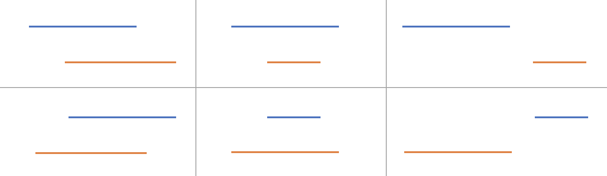

> 原文链接: https://leetcode-cn.com/problems/merge-intervals


## 英文原文
<div><p>Given an array&nbsp;of <code>intervals</code>&nbsp;where <code>intervals[i] = [start<sub>i</sub>, end<sub>i</sub>]</code>, merge all overlapping intervals, and return <em>an array of the non-overlapping intervals that cover all the intervals in the input</em>.</p>

<p>&nbsp;</p>
<p><strong>Example 1:</strong></p>

<pre>
<strong>Input:</strong> intervals = [[1,3],[2,6],[8,10],[15,18]]
<strong>Output:</strong> [[1,6],[8,10],[15,18]]
<strong>Explanation:</strong> Since intervals [1,3] and [2,6] overlaps, merge them into [1,6].
</pre>

<p><strong>Example 2:</strong></p>

<pre>
<strong>Input:</strong> intervals = [[1,4],[4,5]]
<strong>Output:</strong> [[1,5]]
<strong>Explanation:</strong> Intervals [1,4] and [4,5] are considered overlapping.
</pre>

<p>&nbsp;</p>
<p><strong>Constraints:</strong></p>

<ul>
	<li><code>1 &lt;= intervals.length &lt;= 10<sup>4</sup></code></li>
	<li><code>intervals[i].length == 2</code></li>
	<li><code>0 &lt;= start<sub>i</sub> &lt;= end<sub>i</sub> &lt;= 10<sup>4</sup></code></li>
</ul>
</div>

## 中文题目
<div><p>以数组 <code>intervals</code> 表示若干个区间的集合，其中单个区间为 <code>intervals[i] = [start<sub>i</sub>, end<sub>i</sub>]</code> 。请你合并所有重叠的区间，并返回一个不重叠的区间数组，该数组需恰好覆盖输入中的所有区间。</p>

<p> </p>

<p><strong>示例 1：</strong></p>

<pre>
<strong>输入：</strong>intervals = [[1,3],[2,6],[8,10],[15,18]]
<strong>输出：</strong>[[1,6],[8,10],[15,18]]
<strong>解释：</strong>区间 [1,3] 和 [2,6] 重叠, 将它们合并为 [1,6].
</pre>

<p><strong>示例 2：</strong></p>

<pre>
<strong>输入：</strong>intervals = [[1,4],[4,5]]
<strong>输出：</strong>[[1,5]]
<strong>解释：</strong>区间 [1,4] 和 [4,5] 可被视为重叠区间。</pre>

<p> </p>

<p><strong>提示：</strong></p>

<ul>
	<li><code>1 <= intervals.length <= 10<sup>4</sup></code></li>
	<li><code>intervals[i].length == 2</code></li>
	<li><code>0 <= start<sub>i</sub> <= end<sub>i</sub> <= 10<sup>4</sup></code></li>
</ul>
</div>

## 通过代码
<RecoDemo>
</RecoDemo>


## 高赞题解
# 前言：
今天的打卡题是「56. 合并区间」，以本题为依据，我把力扣上另外 3 道类似的区间题目整理在了一起，供大家查阅。
除了这 4 道题目之外，另外补充了 1 道区间相关的双指针/滑动窗口题目，及 1 道最长上升子序列的区间变种题目。
[🤷‍♀️必须秒懂力扣区间题目：重叠区间、合并区间、插入区间](https://mp.weixin.qq.com/s/ioUlNa4ZToCrun3qb4y4Ow)

### 一、合并 2 个区间
2 个区间的关系有以下 6 种，但是其实可以变成上面 3 种情况（只需要假设 **第一个区间的起始位置 $\leq$ 第二个区间的起始位置**，如果不满足这个假设，交换这两个区间）。这 3 种情况的合并的逻辑都很好写。




### 二、合并 n 个区间
先根据区间的起始位置排序，再进行  $n -1$ 次 **两两合并**。


代码：

```java
class Solution {
    public int[][] merge(int[][] intervals) {
        // 先按照区间起始位置排序
        Arrays.sort(intervals, (v1, v2) -> v1[0] - v2[0]);
        // 遍历区间
        int[][] res = new int[intervals.length][2];
        int idx = -1;
        for (int[] interval: intervals) {
            // 如果结果数组是空的，或者当前区间的起始位置 > 结果数组中最后区间的终止位置，
            // 则不合并，直接将当前区间加入结果数组。
            if (idx == -1 || interval[0] > res[idx][1]) {
                res[++idx] = interval;
            } else {
                // 反之将当前区间合并至结果数组的最后区间
                res[idx][1] = Math.max(res[idx][1], interval[1]);
            }
        }
        return Arrays.copyOf(res, idx + 1);
    }
}
```


### ❤️ 大佬们随手赏个「爱心赞」吧，如果能随手关注下我的公众号【[甜姨的奇妙冒险](../images/merge-intervals-1.jpeg)】和 知乎专栏【[甜姨的力扣题解](https://zhuanlan.zhihu.com/c_1224355183452614656)】就更好了啊 ▄█▔▉●

### 🔥昨天的打卡题「01 矩阵」，已在公众号和专栏更新，一文秒懂多源BFS，求戳！👆


## 统计信息
| 通过次数 | 提交次数 | AC比率 |
| :------: | :------: | :------: |
|    330357    |    698679    |   47.3%   |

## 提交历史
| 提交时间 | 提交结果 | 执行时间 |  内存消耗  | 语言 |
| :------: | :------: | :------: | :--------: | :--------: |


## 相似题目
|                             题目                             | 难度 |
| :----------------------------------------------------------: | :---------: |
| [插入区间](https://leetcode-cn.com/problems/insert-interval/) | 中等|
| [会议室](https://leetcode-cn.com/problems/meeting-rooms/) | 简单|
| [会议室 II](https://leetcode-cn.com/problems/meeting-rooms-ii/) | 中等|
| [提莫攻击](https://leetcode-cn.com/problems/teemo-attacking/) | 简单|
| [给字符串添加加粗标签](https://leetcode-cn.com/problems/add-bold-tag-in-string/) | 中等|
| [Range 模块](https://leetcode-cn.com/problems/range-module/) | 困难|
| [员工空闲时间](https://leetcode-cn.com/problems/employee-free-time/) | 困难|
| [划分字母区间](https://leetcode-cn.com/problems/partition-labels/) | 中等|
| [区间列表的交集](https://leetcode-cn.com/problems/interval-list-intersections/) | 中等|
