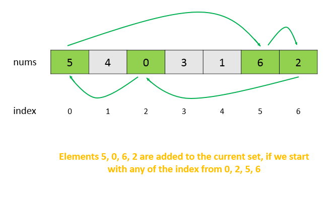

> 原文链接: https://leetcode-cn.com/problems/array-nesting


## 英文原文
<div><p>You are given an integer array <code>nums</code> of length <code>n</code> where <code>nums</code> is a permutation of the numbers in the range <code>[0, n - 1]</code>.</p>

<p>You should build a set <code>s[k] = {nums[k], nums[nums[k]], nums[nums[nums[k]]], ... }</code> subjected to the following rule:</p>

<ul>
	<li>The first element in <code>s[k]</code> starts with the selection of the element <code>nums[k]</code> of <code>index = k</code>.</li>
	<li>The next element in <code>s[k]</code> should be <code>nums[nums[k]]</code>, and then <code>nums[nums[nums[k]]]</code>, and so on.</li>
	<li>We stop adding right before a duplicate element occurs in <code>s[k]</code>.</li>
</ul>

<p>Return <em>the longest length of a set</em> <code>s[k]</code>.</p>

<p>&nbsp;</p>
<p><strong>Example 1:</strong></p>

<pre>
<strong>Input:</strong> nums = [5,4,0,3,1,6,2]
<strong>Output:</strong> 4
<strong>Explanation:</strong> 
nums[0] = 5, nums[1] = 4, nums[2] = 0, nums[3] = 3, nums[4] = 1, nums[5] = 6, nums[6] = 2.
One of the longest sets s[k]:
s[0] = {nums[0], nums[5], nums[6], nums[2]} = {5, 6, 2, 0}
</pre>

<p><strong>Example 2:</strong></p>

<pre>
<strong>Input:</strong> nums = [0,1,2]
<strong>Output:</strong> 1
</pre>

<p>&nbsp;</p>
<p><strong>Constraints:</strong></p>

<ul>
	<li><code>1 &lt;= nums.length &lt;= 10<sup>5</sup></code></li>
	<li><code>0 &lt;= nums[i] &lt; nums.length</code></li>
	<li>All the values of <code>nums</code> are <strong>unique</strong>.</li>
</ul>
</div>

## 中文题目
<div><p>索引从<code>0</code>开始长度为<code>N</code>的数组<code>A</code>，包含<code>0</code>到<code>N - 1</code>的所有整数。找到最大的集合<code>S</code>并返回其大小，其中 <code>S[i] = {A[i], A[A[i]], A[A[A[i]]], ... }</code>且遵守以下的规则。</p>

<p>假设选择索引为<code>i</code>的元素<code>A[i]</code>为<code>S</code>的第一个元素，<code>S</code>的下一个元素应该是<code>A[A[i]]</code>，之后是<code>A[A[A[i]]]...</code> 以此类推，不断添加直到<code>S</code>出现重复的元素。</p>

<p>&nbsp;</p>

<p><strong>示例&nbsp;1:</strong></p>

<pre><strong>输入:</strong> A = [5,4,0,3,1,6,2]
<strong>输出:</strong> 4
<strong>解释:</strong> 
A[0] = 5, A[1] = 4, A[2] = 0, A[3] = 3, A[4] = 1, A[5] = 6, A[6] = 2.

其中一种最长的 S[K]:
S[0] = {A[0], A[5], A[6], A[2]} = {5, 6, 2, 0}
</pre>

<p>&nbsp;</p>

<p><strong>提示：</strong></p>

<ol>
	<li><code>N</code>是<code>[1, 20,000]</code>之间的整数。</li>
	<li><code>A</code>中不含有重复的元素。</li>
	<li><code>A</code>中的元素大小在<code>[0, N-1]</code>之间。</li>
</ol>
</div>

## 通过代码
<RecoDemo>
</RecoDemo>


## 官方题解
## 题解

---
#### 方法一 暴力 [超过时间限制]

最简单的方法是迭代给定 $nums$ 数组的所有索引。对于选择的每个索引 $i$，我们找到元素 $nums[i]$ 并为当前索引 $i$ 添加的新元素增加 $count$。由于 $nums[i]$ 必须作为新索引来查找属于与索引 $i$ 对应的集合的下一个元素，因此新索引是 $j = nums [i]$。

我们持续这个索引更新过程，并保持增加 $count$，添加到对应于索引 $i$ 的集合中的新元素。现在，由于 $nums$ 中的所有元素都位于 $(0，...，N-1)$ 的范围内，因此生成的新索引永远不会超出数组大小限制。但是，我们总是遇到一种情况：当前元素等于我们开始嵌套时的元素 $nums[i]$。
因此，在此之后，所生成的新索引将仅仅是先前生成的索引的重复，因此不会导致当前集合的大小增加。因此，当前数字的这个条件等于起始数字作为特定索引的 $count$ 增量的终止条件。

我们对选择作为起始索引的每个索引执行相同的过程。最后，$count$ 的最大值给出了最大集合的大小。
```Java [java]
public class Solution {
    public int arrayNesting(int[] nums) {
        int res = 0;
        for (int i = 0; i < nums.length; i++) {
            int start = nums[i], count = 0;
            do {
                start = nums[start];
                count++;
            }
            while (start != nums[i]);
            res = Math.max(res, count);

        }
        return res;
    }
}
```
**复杂度分析**

* 时间复杂度：$O(n^2)$。在最坏的情况下，例如 - `[1,2,3,4,5,0]`，循环体将执行 $n ^ 2$ 次。

* 时间复杂度：$O(1)$。常数空间。

---
#### 方法二 采用访问过的数组记录信息 [通过]

**算法**

在上一种方法中，我们观察到在最坏的情况下，$nums$ 数组的所有元素都被添加到对应于所有起始索引的集合中。但是，所有这些集合仅对应于同一组元素，导致冗余计算。

我们考虑一个简单的例子，看看如何解决这个问题。从下图中，我们可以看到箭头所示的当前嵌套中的元素形成一个循环。因此，不管选择添加到这些标记元素的集合中的第一元素如何，相同的元素将被添加到当前集合。

{:width=500}
{:align=center}

因此，当我们向对应于任何索引的集合添加元素 $nums [j]$ 时，我们将其位置标记为在 $visited$ 数组中访问。这样做是为了在将来选择此索引作为起始索引时，我们不会进行冗余 $count$ 计算，因为我们已经考虑了与此索引链接的元素。


通过这样做，我们确保不会一次又一次地考虑重复集。

此外，我们还可以观察到索引 $i$ 和 $j$ 中的两个元素都不会导致跳转到相同的索引 $k$，因为它需要 $nums [i] = nums [j] = k$，这是不可能的，因为所有元素都是不同的。此外，由于相同的推理，任何循环外的元素都不会导致循环内的元素。因此，$visited$ 数组的使用正确。

```Java [solution-]
public class Solution {
    public int arrayNesting(int[] nums) {
        boolean[] visited = new boolean[nums.length];
        int res = 0;
        for (int i = 0; i < nums.length; i++) {
            if (!visited[i]) {
                int start = nums[i], count = 0;
                do {
                    start = nums[start];
                    count++;
                    visited[start] = true;
                }
                while (start != nums[i]);
                res = Math.max(res, count);
            }
        }
        return res;
    }
}
```
**复杂度分析**

* 时间复杂度：$O(n)$. $nums$ 数组的每个元素最多只考虑一次。
* 空间复杂度：$O(n)$. 使用的 $visited$ 是大小为 $n$ 的数组。

---
#### 方法三 不使用额外空间 [通过]

**算法**

在最后一种方法中，$visited$ 数组仅用于跟踪已经访问过的数组元素。我们可以在原始数组 $nums$ 本身中标记访问过的元素，而不是使用单独的数组来跟踪它们。因为元素的范围只能在 1 到 20,000 之间，所以我们可以在访问过的位置放置一个非常大的整数值 $text{Integer.MAX_VALUE}$。遍历的其余过程与上一种方法相同。

```Java [solution-]
public class Solution {
    public int arrayNesting(int[] nums) {
        int res = 0;
        for (int i = 0; i < nums.length; i++) {
            if (nums[i] != Integer.MAX_VALUE) {
                int start = nums[i], count = 0;
                while (nums[start] != Integer.MAX_VALUE) {
                    int temp = start;
                    start = nums[start];
                    count++;
                    nums[temp] = Integer.MAX_VALUE;
                }
                res = Math.max(res, count);
            }
        }
        return res;
    }
}
```

**空间复杂度**

* 时间复杂度：$O(n)$。$nums$ 数组的每个元素最多只考虑一次。

* 空间复杂度：$O(1)$。使用了常数级的额外空间

---

## 统计信息
| 通过次数 | 提交次数 | AC比率 |
| :------: | :------: | :------: |
|    15060    |    24754    |   60.8%   |

## 提交历史
| 提交时间 | 提交结果 | 执行时间 |  内存消耗  | 语言 |
| :------: | :------: | :------: | :--------: | :--------: |


## 相似题目
|                             题目                             | 难度 |
| :----------------------------------------------------------: | :---------: |
| [嵌套列表权重和](https://leetcode-cn.com/problems/nested-list-weight-sum/) | 中等|
| [扁平化嵌套列表迭代器](https://leetcode-cn.com/problems/flatten-nested-list-iterator/) | 中等|
| [加权嵌套序列和 II](https://leetcode-cn.com/problems/nested-list-weight-sum-ii/) | 中等|
