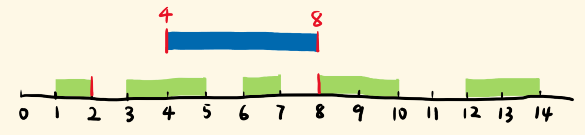
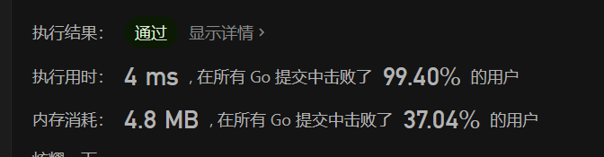

> 原文链接: https://leetcode-cn.com/problems/insert-interval


## 英文原文
<div><p>You are given an array of non-overlapping intervals <code>intervals</code> where <code>intervals[i] = [start<sub>i</sub>, end<sub>i</sub>]</code> represent the start and the end of the <code>i<sup>th</sup></code> interval and <code>intervals</code> is sorted in ascending order by <code>start<sub>i</sub></code>. You are also given an interval <code>newInterval = [start, end]</code> that represents the start and end of another interval.</p>

<p>Insert <code>newInterval</code> into <code>intervals</code> such that <code>intervals</code> is still sorted in ascending order by <code>start<sub>i</sub></code> and <code>intervals</code> still does not have any overlapping intervals (merge overlapping intervals if necessary).</p>

<p>Return <code>intervals</code><em> after the insertion</em>.</p>

<p>&nbsp;</p>
<p><strong>Example 1:</strong></p>

<pre>
<strong>Input:</strong> intervals = [[1,3],[6,9]], newInterval = [2,5]
<strong>Output:</strong> [[1,5],[6,9]]
</pre>

<p><strong>Example 2:</strong></p>

<pre>
<strong>Input:</strong> intervals = [[1,2],[3,5],[6,7],[8,10],[12,16]], newInterval = [4,8]
<strong>Output:</strong> [[1,2],[3,10],[12,16]]
<strong>Explanation:</strong> Because the new interval <code>[4,8]</code> overlaps with <code>[3,5],[6,7],[8,10]</code>.</pre>

<p><strong>Example 3:</strong></p>

<pre>
<strong>Input:</strong> intervals = [], newInterval = [5,7]
<strong>Output:</strong> [[5,7]]
</pre>

<p><strong>Example 4:</strong></p>

<pre>
<strong>Input:</strong> intervals = [[1,5]], newInterval = [2,3]
<strong>Output:</strong> [[1,5]]
</pre>

<p><strong>Example 5:</strong></p>

<pre>
<strong>Input:</strong> intervals = [[1,5]], newInterval = [2,7]
<strong>Output:</strong> [[1,7]]
</pre>

<p>&nbsp;</p>
<p><strong>Constraints:</strong></p>

<ul>
	<li><code>0 &lt;= intervals.length &lt;= 10<sup>4</sup></code></li>
	<li><code>intervals[i].length == 2</code></li>
	<li><code>0 &lt;= start<sub>i</sub> &lt;= end<sub>i</sub> &lt;= 10<sup>5</sup></code></li>
	<li><code>intervals</code> is sorted by <code>start<sub>i</sub></code> in <strong>ascending</strong> order.</li>
	<li><code>newInterval.length == 2</code></li>
	<li><code>0 &lt;= start &lt;= end &lt;= 10<sup>5</sup></code></li>
</ul>
</div>

## 中文题目
<div><p>给你一个<strong> 无重叠的</strong><em> ，</em>按照区间起始端点排序的区间列表。</p>

<p>在列表中插入一个新的区间，你需要确保列表中的区间仍然有序且不重叠（如果有必要的话，可以合并区间）。</p>

<p> </p>

<p><strong>示例 1：</strong></p>

<pre>
<strong>输入：</strong>intervals = [[1,3],[6,9]], newInterval = [2,5]
<strong>输出：</strong>[[1,5],[6,9]]
</pre>

<p><strong>示例 2：</strong></p>

<pre>
<strong>输入：</strong>intervals = [[1,2],[3,5],[6,7],[8,10],[12,16]], newInterval = [4,8]
<strong>输出：</strong>[[1,2],[3,10],[12,16]]
<strong>解释：</strong>这是因为新的区间 <code>[4,8]</code> 与 <code>[3,5],[6,7],[8,10]</code> 重叠。</pre>

<p><strong>示例 3：</strong></p>

<pre>
<strong>输入：</strong>intervals = [], newInterval = [5,7]
<strong>输出：</strong>[[5,7]]
</pre>

<p><strong>示例 4：</strong></p>

<pre>
<strong>输入：</strong>intervals = [[1,5]], newInterval = [2,3]
<strong>输出：</strong>[[1,5]]
</pre>

<p><strong>示例 5：</strong></p>

<pre>
<strong>输入：</strong>intervals = [[1,5]], newInterval = [2,7]
<strong>输出：</strong>[[1,7]]
</pre>

<p> </p>

<p><strong>提示：</strong></p>

<ul>
	<li><code>0 <= intervals.length <= 10<sup>4</sup></code></li>
	<li><code>intervals[i].length == 2</code></li>
	<li><code>0 <= intervals[i][0] <= intervals[i][1] <= 10<sup>5</sup></code></li>
	<li><code>intervals</code> 根据 <code>intervals[i][0]</code> 按 <strong>升序</strong> 排列</li>
	<li><code>newInterval.length == 2</code></li>
	<li><code>0 <= newInterval[0] <= newInterval[1] <= 10<sup>5</sup></code></li>
</ul>
</div>

## 通过代码
<RecoDemo>
</RecoDemo>


## 高赞题解
11.3 川普要赢了吗？
#### 思路
用指针去扫 `intervals`，最多可能有三个阶段：
1. 不重叠的绿区间，在蓝区间的左边
2. 有重叠的绿区间
3. 不重叠的绿区间，在蓝区间的右边



#### 逐个分析

1. 不重叠，需满足：绿区间的右端，位于蓝区间的左端的左边，如`[1,2]`。
    - 则当前绿区间，推入 res 数组，指针 +1，考察下一个绿区间。
    - 循环结束时，当前绿区间的屁股，就没落在蓝区间之前，有重叠了，如`[3,5]`。

2. 现在看重叠的。我们反过来想，没重叠，就要满足：绿区间的左端，落在蓝区间的屁股的后面，反之就有重叠：绿区间的左端 <= 蓝区间的右端，极端的例子就是`[8,10]`。

    - 和蓝有重叠的区间，会合并成一个区间：左端取蓝绿左端的较小者，右端取蓝绿右端的较大者，不断更新给蓝区间。
    - 循环结束时，将蓝区间（它是合并后的新区间）推入 res 数组。

3. 剩下的，都在蓝区间右边，不重叠。不用额外判断，依次推入 res 数组。


#### 代码

```javascript []
function insert(intervals, newInterval) {
  const res = [];
  let i = 0;
  const len = intervals.length;

  while (i < len && intervals[i][1] < newInterval[0]) { // 当前遍历的是蓝左边的，不重叠的区间
    res.push(intervals[i]);
    i++;
  }

  while (i < len && intervals[i][0] <= newInterval[1]) { // 当前遍历是有重叠的区间
    newInterval[0] = Math.min(newInterval[0], intervals[i][0]); //左端取较小者，更新给兰区间的左端
    newInterval[1] = Math.max(newInterval[1], intervals[i][1]); //右端取较大者，更新给兰区间的右端
    i++;
  }
  res.push(newInterval); // 循环结束后，兰区间为合并后的区间，推入res

  while (i < len) {                 // 在蓝右边，没重叠的区间
    res.push(intervals[i]);
    i++;
  }
  
  return res;
}
```

```golang []
func min(a, b int) int {
	if a < b { return a }
	return b
}

func max(a, b int) int {
	if a > b { return a }
	return b
}

func insert(intervals [][]int, newInterval []int) [][]int {
	res := make([][]int, 0)
	l := len(intervals)
	i := 0
	for i < l && intervals[i][1] < newInterval[0] {
		res = append(res, intervals[i])
		i++
	}
	for i < l && intervals[i][0] <= newInterval[1] {
		newInterval[0] = min(newInterval[0], intervals[i][0])
		newInterval[1] = max(newInterval[1], intervals[i][1])
		i++
	}
	res = append(res, newInterval)
	for i < l {
		res = append(res, intervals[i])
		i++
	}
	return res
}
```



#### 复盘总结
考察每个区间，为三种形态的区间安排三次 while 循环，思考每个阶段所需满足的条件，并注意循环结束时的状态。
等号取不取，容易出错，画图看看怎么算有重叠。
合并区间时，新两端更新给蓝区间，无需引入新的变量。

#### 感谢阅读，点赞更棒。

## 统计信息
| 通过次数 | 提交次数 | AC比率 |
| :------: | :------: | :------: |
|    92023    |    223019    |   41.3%   |

## 提交历史
| 提交时间 | 提交结果 | 执行时间 |  内存消耗  | 语言 |
| :------: | :------: | :------: | :--------: | :--------: |


## 相似题目
|                             题目                             | 难度 |
| :----------------------------------------------------------: | :---------: |
| [合并区间](https://leetcode-cn.com/problems/merge-intervals/) | 中等|
| [Range 模块](https://leetcode-cn.com/problems/range-module/) | 困难|
