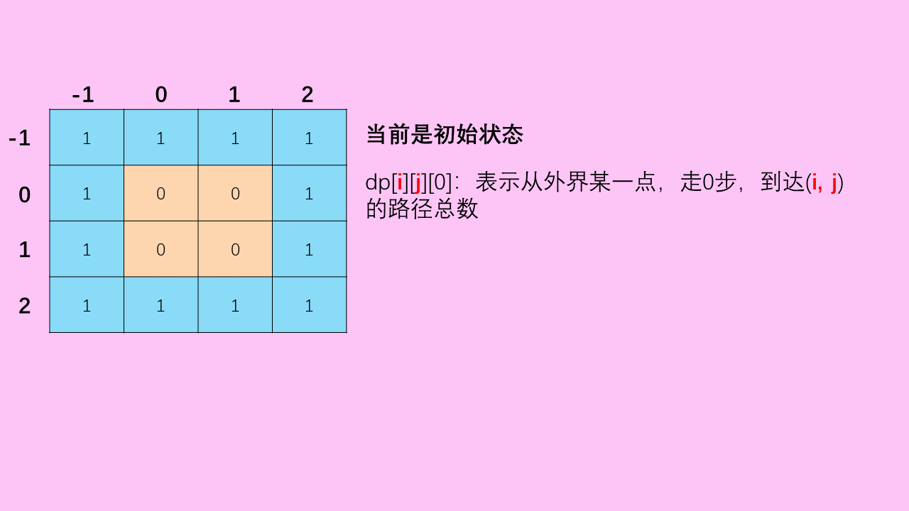
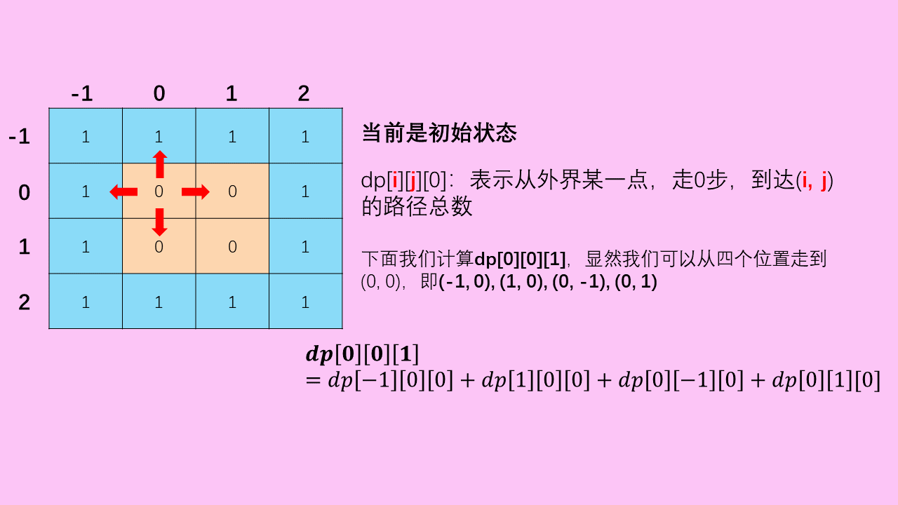
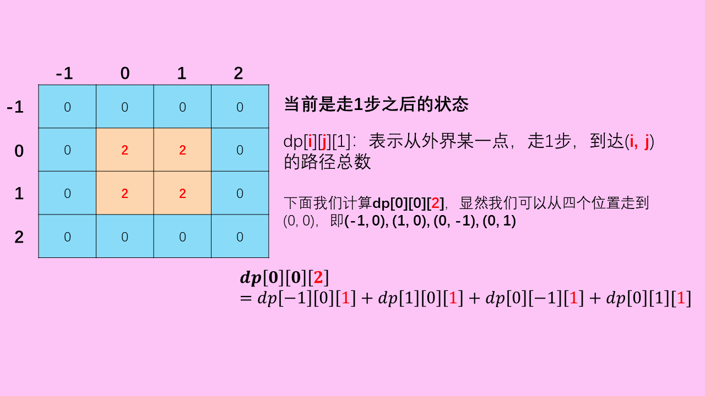
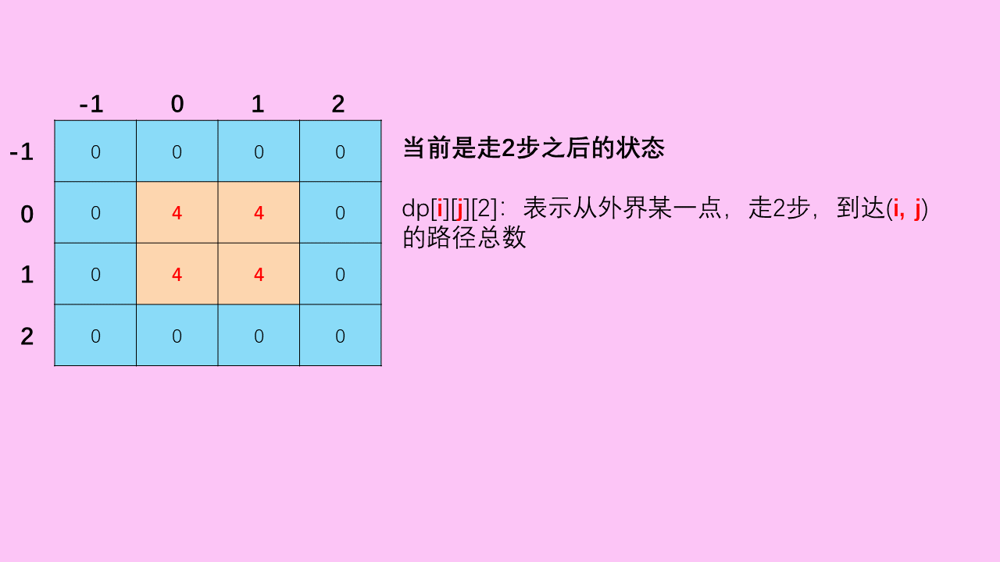
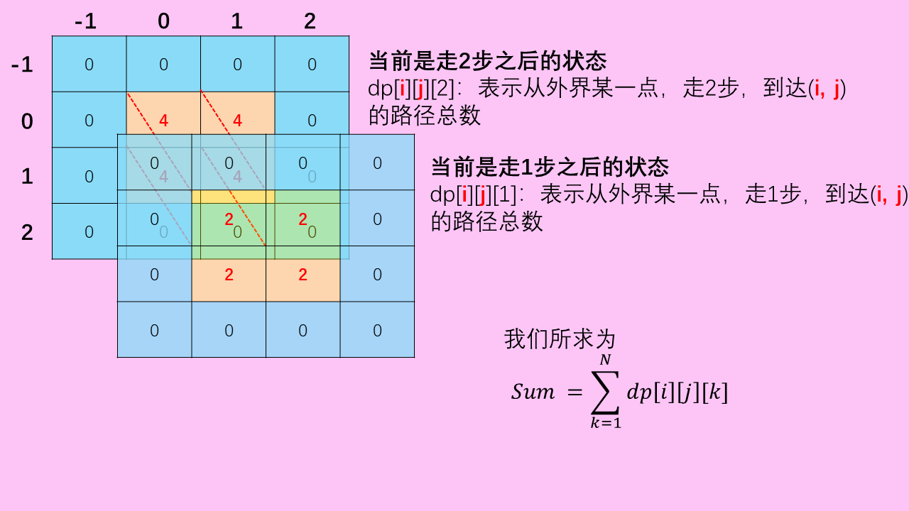

> 原文链接: https://leetcode-cn.com/problems/out-of-boundary-paths


## 英文原文
<div><p>There is an <code>m x n</code> grid with a ball. The ball is initially at the position <code>[startRow, startColumn]</code>. You are allowed to move the ball to one of the four adjacent cells in the grid (possibly out of the grid crossing the grid boundary). You can apply <strong>at most</strong> <code>maxMove</code> moves to the ball.</p>

<p>Given the five integers <code>m</code>, <code>n</code>, <code>maxMove</code>, <code>startRow</code>, <code>startColumn</code>, return the number of paths to move the ball out of the grid boundary. Since the answer can be very large, return it <strong>modulo</strong> <code>10<sup>9</sup> + 7</code>.</p>

<p>&nbsp;</p>
<p><strong>Example 1:</strong></p>

<pre>
<strong>Input:</strong> m = 2, n = 2, maxMove = 2, startRow = 0, startColumn = 0
<strong>Output:</strong> 6
</pre>

<p><strong>Example 2:</strong></p>

<pre>
<strong>Input:</strong> m = 1, n = 3, maxMove = 3, startRow = 0, startColumn = 1
<strong>Output:</strong> 12
</pre>

<p>&nbsp;</p>
<p><strong>Constraints:</strong></p>

<ul>
	<li><code>1 &lt;= m, n &lt;= 50</code></li>
	<li><code>0 &lt;= maxMove &lt;= 50</code></li>
	<li><code>0 &lt;= startRow &lt; m</code></li>
	<li><code>0 &lt;= startColumn &lt; n</code></li>
</ul>
</div>

## 中文题目
<div><p>给你一个大小为 <code>m x n</code> 的网格和一个球。球的起始坐标为 <code>[startRow, startColumn]</code> 。你可以将球移到在四个方向上相邻的单元格内（可以穿过网格边界到达网格之外）。你 <strong>最多</strong> 可以移动 <code>maxMove</code> 次球。</p>

<p>给你五个整数 <code>m</code>、<code>n</code>、<code>maxMove</code>、<code>startRow</code> 以及 <code>startColumn</code> ，找出并返回可以将球移出边界的路径数量。因为答案可能非常大，返回对 <code>10<sup>9</sup> + 7</code> <strong>取余</strong> 后的结果。</p>

<p>&nbsp;</p>

<p><strong>示例 1：</strong></p>

<pre>
<strong>输入：</strong>m = 2, n = 2, maxMove = 2, startRow = 0, startColumn = 0
<strong>输出：</strong>6
</pre>

<p><strong>示例 2：</strong></p>

<pre>
<strong>输入：</strong>m = 1, n = 3, maxMove = 3, startRow = 0, startColumn = 1
<strong>输出：</strong>12
</pre>

<p>&nbsp;</p>

<p><strong>提示：</strong></p>

<ul>
	<li><code>1 &lt;= m, n &lt;= 50</code></li>
	<li><code>0 &lt;= maxMove &lt;= 50</code></li>
	<li><code>0 &lt;= startRow &lt; m</code></li>
	<li><code>0 &lt;= startColumn &lt; n</code></li>
</ul>
</div>

## 通过代码
<RecoDemo>
</RecoDemo>


## 高赞题解
### 解题思路
【先赞后看，养成习惯】
这道题是标准的`动态规划`题目，属于写出**状态转移方程**，就可以直接**AC**的题目。

### 状态定义
`dp[i][j][k]`:表示从`(i,j)`出发第k步出界的路径总数，等价于从外界出发第k步走到`(i,j)`的路径总数
（可参考题解[LeetCode688 “马”在棋盘上的概率](https://leetcode-cn.com/problems/knight-probability-in-chessboard/solution/zhuang-tai-ji-de-zai-ci-ying-yong-by-christmas_wan/)）

### 状态转移
显然我们可以直接获得如下状态转移方程
$$
dp[i][j][k] = dp[i-1][j][k-1]+dp[i+1][j][k-1] + dp[i][j-1][k-1]+dp[i][j+1][k-1]
$$
初始化：我们需要注意外界的坐标的`初始状态`对应的值为1，即
$$
dp[i][j][0] \xlongequal[]{(i,j) Out of bounds}1
$$
类似的转移方程在其他题目中也有出现哟~
（参考相关题目）

### 如何求解
**有了每一个点的每一步对应的值，我们可以说是什么都不怕了**
题目求的是**最多移动N次，出界的路径数**，因此我们只需要讲每一步对应的值都加起来即可
$$
Sum = \sum_{k=1}^Ndp[i][j][k] 
$$
### 动图展示
<,,,,>


### 相关题目
[LeetCode688 “马”在棋盘上的概率](https://leetcode-cn.com/problems/knight-probability-in-chessboard/)
[LeetCode935 骑士拨号器](https://leetcode-cn.com/problems/knight-dialer/)
[LeetCode1220 统计元音字母序列的数目](https://leetcode-cn.com/problems/count-vowels-permutation/)

### 我的题解
[LeetCode1262 可被三整除的最大和](https://leetcode-cn.com/problems/greatest-sum-divisible-by-three/solution/dong-tai-gui-hua-yu-zhuang-tai-zhuan-yi-by-christm/)
[LeetCode688 “马”在棋盘上的概率](https://leetcode-cn.com/problems/knight-probability-in-chessboard/solution/zhuang-tai-ji-de-zai-ci-ying-yong-by-christmas_wan/)
[LeetCode967 连续差相同的数字](https://leetcode-cn.com/problems/numbers-with-same-consecutive-differences/solution/cun-chu-kong-jian-ke-bian-de-dpshu-zu-by-christmas/)
[LeetCode873 最长的斐波那契子序列的长度](https://leetcode-cn.com/problems/length-of-longest-fibonacci-subsequence/solution/zhuang-tai-ding-yi-hen-shi-zhong-yao-by-christmas_/)
[LeetCode1218 最长定差子序列](https://leetcode-cn.com/problems/longest-arithmetic-subsequence-of-given-difference/solution/yi-dao-jian-dan-de-dong-tai-gui-hua-de-you-hua-wen/)
[LeetCode523 连续子数组和](https://leetcode-cn.com/problems/continuous-subarray-sum/solution/qian-zhui-he-yu-intmapde-zai-ci-ying-yong-by-chris/)
### 代码

```cpp
class Solution {
public:
    int findPaths(int m, int n, int N, int i, int j) {
       int MOD = 1000000007;
	if (N == 0) { return 0; }

	vector<vector<vector<unsigned long long int>>> dp(m + 2, vector<vector<unsigned long long int>>(n + 2, vector<unsigned long long int>(N + 1, 0)));
	for (int i = 0; i <= m + 1; i++) {
		dp[i][0][0] = 1;
		dp[i][n + 1][0] = 1;
	}
	for (int i = 0; i <= n + 1; i++) {
		dp[0][i][0] = 1;
		dp[m + 1][i][0] = 1;
	}
	for (int k = 1; k <= N; k++) {
		for (int i = 1; i <= m; i++) {
			for (int j = 1; j <= n; j++) {
				dp[i][j][k] = (dp[i - 1][j][k - 1] + dp[i + 1][j][k - 1] + \
								dp[i][j - 1][k - 1] + dp[i][j + 1][k - 1]) % MOD;
			}
		}
	}
	int sum = 0;
	for (int k = 1; k <= N; k++) {
		sum = (sum + dp[i + 1][j + 1][k]) % MOD;
	}
	return sum;
    }
};
```

## 统计信息
| 通过次数 | 提交次数 | AC比率 |
| :------: | :------: | :------: |
|    26716    |    57055    |   46.8%   |

## 提交历史
| 提交时间 | 提交结果 | 执行时间 |  内存消耗  | 语言 |
| :------: | :------: | :------: | :--------: | :--------: |


## 相似题目
|                             题目                             | 难度 |
| :----------------------------------------------------------: | :---------: |
| [“马”在棋盘上的概率](https://leetcode-cn.com/problems/knight-probability-in-chessboard/) | 中等|
