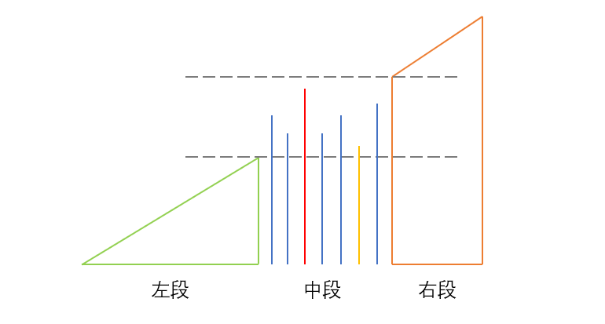

> 原文链接: https://leetcode-cn.com/problems/shortest-unsorted-continuous-subarray


## 英文原文
<div><p>Given an integer array <code>nums</code>, you need to find one <b>continuous subarray</b> that if you only sort this subarray in ascending order, then the whole array will be sorted in ascending order.</p>

<p>Return <em>the shortest such subarray and output its length</em>.</p>

<p>&nbsp;</p>
<p><strong>Example 1:</strong></p>

<pre>
<strong>Input:</strong> nums = [2,6,4,8,10,9,15]
<strong>Output:</strong> 5
<strong>Explanation:</strong> You need to sort [6, 4, 8, 10, 9] in ascending order to make the whole array sorted in ascending order.
</pre>

<p><strong>Example 2:</strong></p>

<pre>
<strong>Input:</strong> nums = [1,2,3,4]
<strong>Output:</strong> 0
</pre>

<p><strong>Example 3:</strong></p>

<pre>
<strong>Input:</strong> nums = [1]
<strong>Output:</strong> 0
</pre>

<p>&nbsp;</p>
<p><strong>Constraints:</strong></p>

<ul>
	<li><code>1 &lt;= nums.length &lt;= 10<sup>4</sup></code></li>
	<li><code>-10<sup>5</sup> &lt;= nums[i] &lt;= 10<sup>5</sup></code></li>
</ul>

<p>&nbsp;</p>
<strong>Follow up:</strong> Can you solve it in <code>O(n)</code> time complexity?</div>

## 中文题目
<div><p>给你一个整数数组 <code>nums</code> ，你需要找出一个 <strong>连续子数组</strong> ，如果对这个子数组进行升序排序，那么整个数组都会变为升序排序。</p>

<p>请你找出符合题意的 <strong>最短</strong> 子数组，并输出它的长度。</p>

<p> </p>

<div class="original__bRMd">
<div>
<p><strong>示例 1：</strong></p>

<pre>
<strong>输入：</strong>nums = [2,6,4,8,10,9,15]
<strong>输出：</strong>5
<strong>解释：</strong>你只需要对 [6, 4, 8, 10, 9] 进行升序排序，那么整个表都会变为升序排序。
</pre>

<p><strong>示例 2：</strong></p>

<pre>
<strong>输入：</strong>nums = [1,2,3,4]
<strong>输出：</strong>0
</pre>

<p><strong>示例 3：</strong></p>

<pre>
<strong>输入：</strong>nums = [1]
<strong>输出：</strong>0
</pre>

<p> </p>

<p><strong>提示：</strong></p>

<ul>
	<li><code>1 <= nums.length <= 10<sup>4</sup></code></li>
	<li><code>-10<sup>5</sup> <= nums[i] <= 10<sup>5</sup></code></li>
</ul>

<p> </p>

<p><strong>进阶：</strong>你可以设计一个时间复杂度为 <code>O(n)</code> 的解决方案吗？</p>
</div>
</div>
</div>

## 通过代码
<RecoDemo>
</RecoDemo>


## 高赞题解
**分析**

我们可以假设把这个数组分成三段，`左段`和`右段`是标准的升序数组，`中段`数组虽是无序的，但满足最小值大于`左段`的最大值，最大值小于`右段`的最小值。



那么我们目标就很明确了，找中段的左右边界，我们分别定义为`begin `和 `end`;
分两头开始遍历:
- 从左到右维护一个最大值`max,`在进入右段之前，那么遍历到的`nums[i]`都是小于`max`的，我们要求的`end`就是遍历中最后一个小于`max`元素的位置；
- 同理，从右到左维护一个最小值`min`，在进入左段之前，那么遍历到的nums[i]也都是大于`min`的，要求的`begin`也就是最后一个大于`min`元素的位置。

**代码**
```java []
class Solution {
    public int findUnsortedSubarray(int[] nums) {
        //初始化
        int len = nums.length;
        int min = nums[len-1];
        int max = nums[0];
        int begin = 0, end = -1;
        //遍历
        for(int i = 0; i < len; i++){
            if(nums[i] < max){      //从左到右维持最大值，寻找右边界end
                end = i;
            }else{
                max = nums[i];
            }
            
            if(nums[len-i-1] > min){    //从右到左维持最小值，寻找左边界begin
                begin = len-i-1;
            }else{
                min = nums[len-i-1];
            }            
        }
        return end-begin+1;
    }
}
```





## 统计信息
| 通过次数 | 提交次数 | AC比率 |
| :------: | :------: | :------: |
|    104254    |    257105    |   40.5%   |

## 提交历史
| 提交时间 | 提交结果 | 执行时间 |  内存消耗  | 语言 |
| :------: | :------: | :------: | :--------: | :--------: |
