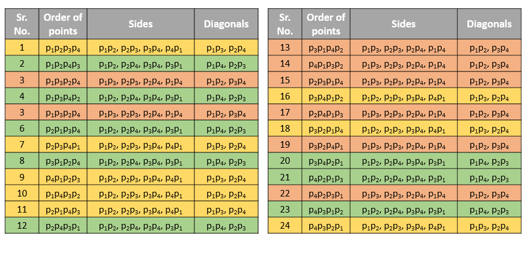

> 原文链接: https://leetcode-cn.com/problems/valid-square


## 英文原文
<div><p>Given the coordinates of four points in 2D space <code>p1</code>, <code>p2</code>, <code>p3</code> and <code>p4</code>, return <code>true</code> <em>if the four points construct a square</em>.</p>

<p>The coordinate of a point <code>p<sub>i</sub></code> is represented as <code>[x<sub>i</sub>, y<sub>i</sub>]</code>. The input is <strong>not</strong> given in any order.</p>

<p>A <strong>valid square</strong> has four equal sides with positive length and four equal angles (90-degree angles).</p>

<p>&nbsp;</p>
<p><strong>Example 1:</strong></p>

<pre>
<strong>Input:</strong> p1 = [0,0], p2 = [1,1], p3 = [1,0], p4 = [0,1]
<strong>Output:</strong> true
</pre>

<p><strong>Example 2:</strong></p>

<pre>
<strong>Input:</strong> p1 = [0,0], p2 = [1,1], p3 = [1,0], p4 = [0,12]
<strong>Output:</strong> false
</pre>

<p><strong>Example 3:</strong></p>

<pre>
<strong>Input:</strong> p1 = [1,0], p2 = [-1,0], p3 = [0,1], p4 = [0,-1]
<strong>Output:</strong> true
</pre>

<p>&nbsp;</p>
<p><strong>Constraints:</strong></p>

<ul>
	<li><code>p1.length == p2.length == p3.length == p4.length == 2</code></li>
	<li><code>-10<sup>4</sup> &lt;= x<sub>i</sub>, y<sub>i</sub> &lt;= 10<sup>4</sup></code></li>
</ul>
</div>

## 中文题目
<div><p>给定二维空间中四点的坐标，返回四点是否可以构造一个正方形。</p>

<p>一个点的坐标（x，y）由一个有两个整数的整数数组表示。</p>

<p><strong>示例:</strong></p>

<pre>
<strong>输入:</strong> p1 = [0,0], p2 = [1,1], p3 = [1,0], p4 = [0,1]
<strong>输出:</strong> True
</pre>

<p>&nbsp;</p>

<p><strong>注意:</strong></p>

<ol>
	<li>所有输入整数都在 [-10000，10000] 范围内。</li>
	<li>一个有效的正方形有四个等长的正长和四个等角（90度角）。</li>
	<li>输入点没有顺序。</li>
</ol>
</div>

## 通过代码
<RecoDemo>
</RecoDemo>


## 官方题解
#### 方法一：枚举

根据定义，一个四边形为正方形当且仅当它的四条边长度相等并且两条对角线的长度也相等。因此我们只需要枚举给定的 `4` 个点分别对应正方形的哪一个角，再计算长度并进行比较即可。`4` 个点对应了 `4! = 24` 种全排列，因此我们最多只需要枚举 `24` 次。

```Java [sol1]
public class Solution {
    public double dist(int[] p1, int[] p2) {
        return (p2[1] - p1[1]) * (p2[1] - p1[1]) + (p2[0] - p1[0]) * (p2[0] - p1[0]);
    }
    public boolean check(int[] p1, int[] p2, int[] p3, int[] p4) {
        return dist(p1,p2) > 0 && dist(p1, p2) == dist(p2, p3) && dist(p2, p3) == dist(p3, p4) && dist(p3, p4) == dist(p4, p1) && dist(p1, p3) == dist(p2, p4);
    }
    public boolean validSquare(int[] p1, int[] p2, int[] p3, int[] p4) {
        int[][] p = {p1,p2,p3,p4};
        return checkAllPermutations(p, 0);
    }
    boolean checkAllPermutations(int[][] p, int l) {
        if (l == 4) {
            return check(p[0], p[1], p[2], p[3]);
        } else {
            boolean res = false;
            for (int i = l; i < 4; i++) {
                swap(p, l, i);
                res |= checkAllPermutations(p, l + 1);
                swap(p, l, i);
            }
            return res;
        }
    }
    public void swap(int[][] p, int x, int y) {
        int[] temp = p[x];
        p[x] = p[y];
        p[y] = temp;
    }
}
```

**复杂度分析**

* 时间复杂度：$O(1)$。

* 空间复杂度：$O(1)$。

#### 方法二：排序

我们将这 `4` 个点按照 `x` 轴坐标第一关键字，`y` 轴坐标第二关键字进行升序排序。假设排完序之后的 `4` 个点依次为 `p0, p1, p2, p3`，那么我们可以发现正方形的四条边依次为 `p0p1`，`p1p3`，`p3p2` 和 `p2p0`，对角线为 `p0p3` 和 `p1p2`。下图给出了所有的 `3` 种排完序后的情形。


```Java [sol2]
public class Solution {
    public double dist(int[] p1, int[] p2) {
        return (p2[1] - p1[1]) * (p2[1] - p1[1]) + (p2[0] - p1[0]) * (p2[0] - p1[0]);
    }
    public boolean validSquare(int[] p1, int[] p2, int[] p3, int[] p4) {
        int[][] p={p1,p2,p3,p4};
        Arrays.sort(p, (l1, l2) -> l2[0] == l1[0] ? l1[1] - l2[1] : l1[0] - l2[0]);
        return dist(p[0], p[1]) != 0 && dist(p[0], p[1]) == dist(p[1], p[3]) && dist(p[1], p[3]) == dist(p[3], p[2]) && dist(p[3], p[2]) == dist(p[2], p[0])   && dist(p[0],p[3])==dist(p[1],p[2]);
    }
}
```

**复杂度分析**

* 时间复杂度：$O(1)$。

* 空间复杂度：$O(1)$。

#### 方法三：考虑本质不同的情况

在方法一中，我们枚举了所有的 `24` 种情形，我们把所有的情形写在下面的表中，可以发现一共只有 `3` 种本质不同的情形，这与方法二也是一致的。



其中同一种颜色表示本质相同的情形，因此我们只要枚举 `3` 种情形即可。

```Java [sol3]
public class Solution {
    public double dist(int[] p1, int[] p2) {
        return (p2[1] - p1[1]) * (p2[1] - p1[1]) + (p2[0] - p1[0]) * (p2[0] - p1[0]);
    }
    public boolean check(int[] p1, int[] p2, int[] p3, int[] p4) {
        return dist(p1,p2) > 0 && dist(p1, p2) == dist(p2, p3) && dist(p2, p3) == dist(p3, p4) && dist(p3, p4) == dist(p4, p1) && dist(p1, p3) == dist(p2, p4);
    }
    public boolean validSquare(int[] p1, int[] p2, int[] p3, int[] p4) {
        return check(p1, p2, p3, p4) || check(p1, p3, p2, p4) || check(p1, p2, p4, p3);
    }
}
```

**复杂度分析**

* 时间复杂度：$O(1)$。

* 空间复杂度：$O(1)$。

## 统计信息
| 通过次数 | 提交次数 | AC比率 |
| :------: | :------: | :------: |
|    8834    |    20031    |   44.1%   |

## 提交历史
| 提交时间 | 提交结果 | 执行时间 |  内存消耗  | 语言 |
| :------: | :------: | :------: | :--------: | :--------: |
