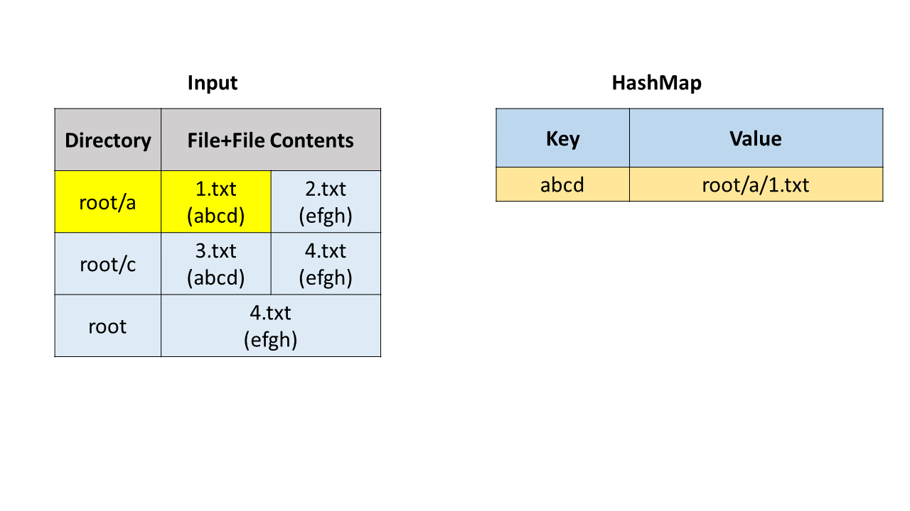
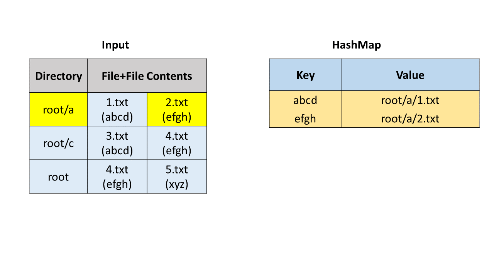
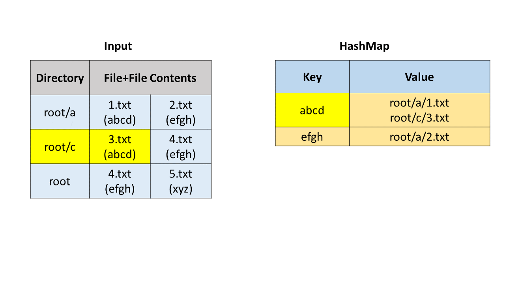
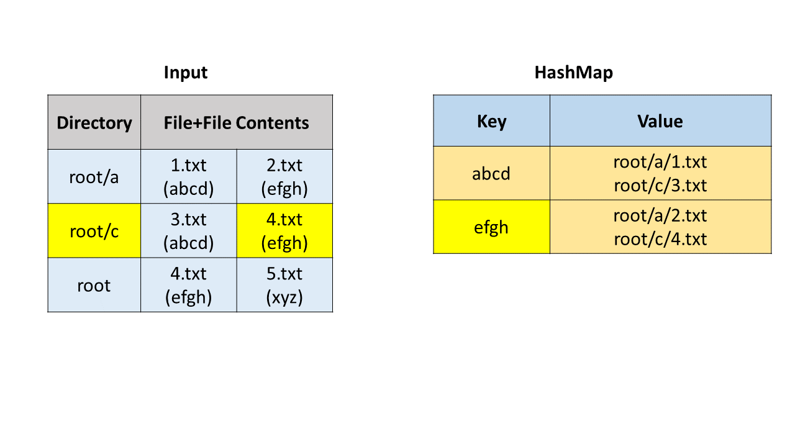
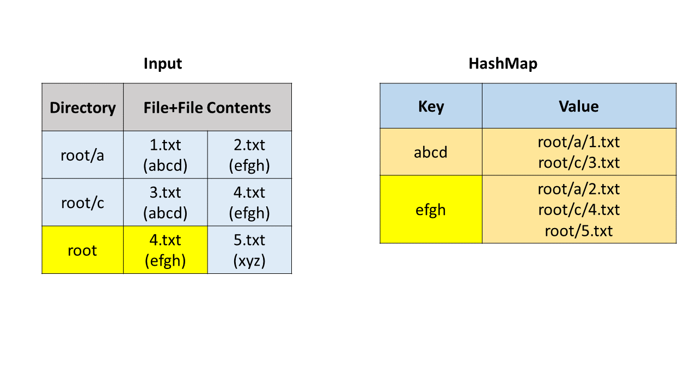
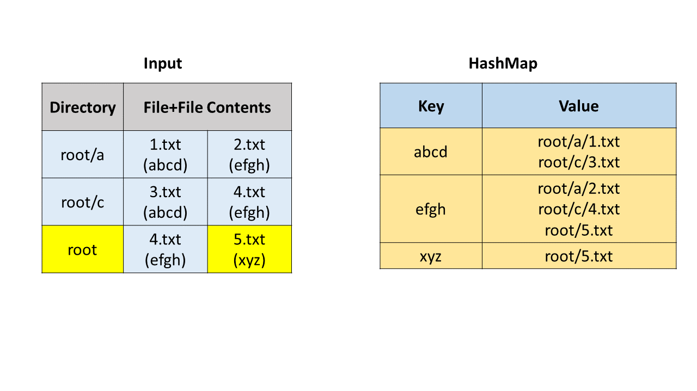
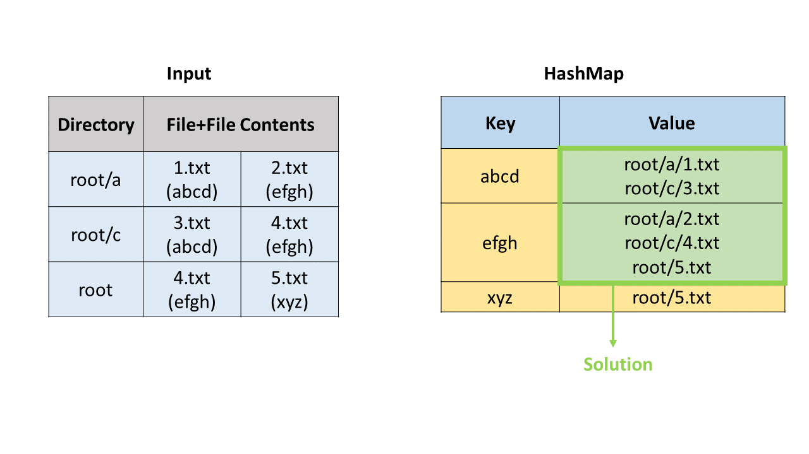

> 原文链接: https://leetcode-cn.com/problems/find-duplicate-file-in-system


## 英文原文
<div><p>Given a list <code>paths</code> of directory info, including the directory path, and all the files with contents in this directory, return <em>all the duplicate files in the file system in terms of their paths</em>. You may return the answer in <strong>any order</strong>.</p>

<p>A group of duplicate files consists of at least two files that have the same content.</p>

<p>A single directory info string in the input list has the following format:</p>

<ul>
	<li><code>&quot;root/d1/d2/.../dm f1.txt(f1_content) f2.txt(f2_content) ... fn.txt(fn_content)&quot;</code></li>
</ul>

<p>It means there are <code>n</code> files <code>(f1.txt, f2.txt ... fn.txt)</code> with content <code>(f1_content, f2_content ... fn_content)</code> respectively in the directory &quot;<code>root/d1/d2/.../dm&quot;</code>. Note that <code>n &gt;= 1</code> and <code>m &gt;= 0</code>. If <code>m = 0</code>, it means the directory is just the root directory.</p>

<p>The output is a list of groups of duplicate file paths. For each group, it contains all the file paths of the files that have the same content. A file path is a string that has the following format:</p>

<ul>
	<li><code>&quot;directory_path/file_name.txt&quot;</code></li>
</ul>

<p>&nbsp;</p>
<p><strong>Example 1:</strong></p>
<pre><strong>Input:</strong> paths = ["root/a 1.txt(abcd) 2.txt(efgh)","root/c 3.txt(abcd)","root/c/d 4.txt(efgh)","root 4.txt(efgh)"]
<strong>Output:</strong> [["root/a/2.txt","root/c/d/4.txt","root/4.txt"],["root/a/1.txt","root/c/3.txt"]]
</pre><p><strong>Example 2:</strong></p>
<pre><strong>Input:</strong> paths = ["root/a 1.txt(abcd) 2.txt(efgh)","root/c 3.txt(abcd)","root/c/d 4.txt(efgh)"]
<strong>Output:</strong> [["root/a/2.txt","root/c/d/4.txt"],["root/a/1.txt","root/c/3.txt"]]
</pre>
<p>&nbsp;</p>
<p><strong>Constraints:</strong></p>

<ul>
	<li><code>1 &lt;= paths.length &lt;= 2 * 10<sup>4</sup></code></li>
	<li><code>1 &lt;= paths[i].length &lt;= 3000</code></li>
	<li><code>1 &lt;= sum(paths[i].length) &lt;= 5 * 10<sup>5</sup></code></li>
	<li><code>paths[i]</code> consist of English letters, digits, <code>&#39;/&#39;</code>, <code>&#39;.&#39;</code>, <code>&#39;(&#39;</code>, <code>&#39;)&#39;</code>, and <code>&#39; &#39;</code>.</li>
	<li>You may assume no files or directories share the same name in the same directory.</li>
	<li>You may assume each given directory info represents a unique directory. A single blank space separates the directory path and file info.</li>
</ul>

<p>&nbsp;</p>
<p><strong>Follow up:</strong></p>

<ul>
	<li>Imagine you are given a real file system, how will you search files? DFS or BFS?</li>
	<li>If the file content is very large (GB level), how will you modify your solution?</li>
	<li>If you can only read the file by 1kb each time, how will you modify your solution?</li>
	<li>What is the time complexity of your modified solution? What is the most time-consuming part and memory-consuming part of it? How to optimize?</li>
	<li>How to make sure the duplicated files you find are not false positive?</li>
</ul>
</div>

## 中文题目
<div><p>给定一个目录信息列表，包括目录路径，以及该目录中的所有包含内容的文件，您需要找到文件系统中的所有重复文件组的路径。一组重复的文件至少包括<strong>二个</strong>具有完全相同内容的文件。</p>

<p><strong>输入</strong>列表中的单个目录信息字符串的格式如下：</p>

<p><code>&quot;root/d1/d2/.../dm f1.txt(f1_content) f2.txt(f2_content) ... fn.txt(fn_content)&quot;</code></p>

<p>这意味着有 n 个文件（<code>f1.txt</code>,&nbsp;<code>f2.txt</code>&nbsp;...&nbsp;<code>fn.txt</code> 的内容分别是 <code>f1_content</code>,&nbsp;<code>f2_content</code>&nbsp;...&nbsp;<code>fn_content</code>）在目录&nbsp;<code>root/d1/d2/.../dm</code>&nbsp;下。注意：n&gt;=1 且 m&gt;=0。如果 m=0，则表示该目录是根目录。</p>

<p>该<strong>输出</strong>是重复文件路径组的列表。对于每个组，它包含具有相同内容的文件的所有文件路径。文件路径是具有下列格式的字符串：</p>

<p><code>&quot;directory_path/file_name.txt&quot;</code></p>

<p><strong>示例 1：</strong></p>

<pre><strong>输入：</strong>
[&quot;root/a 1.txt(abcd) 2.txt(efgh)&quot;, &quot;root/c 3.txt(abcd)&quot;, &quot;root/c/d 4.txt(efgh)&quot;, &quot;root 4.txt(efgh)&quot;]
<strong>输出：</strong>  
[[&quot;root/a/2.txt&quot;,&quot;root/c/d/4.txt&quot;,&quot;root/4.txt&quot;],[&quot;root/a/1.txt&quot;,&quot;root/c/3.txt&quot;]]
</pre>

<p>&nbsp;</p>

<p><strong>注：</strong></p>

<ol>
	<li>最终输出不需要顺序。</li>
	<li>您可以假设目录名、文件名和文件内容只有字母和数字，并且文件内容的长度在 [1，50] 的范围内。</li>
	<li>给定的文件数量在 [1，20000] 个范围内。</li>
	<li>您可以假设在同一目录中没有任何文件或目录共享相同的名称。</li>
	<li>您可以假设每个给定的目录信息代表一个唯一的目录。目录路径和文件信息用一个空格分隔。</li>
</ol>

<p>&nbsp;</p>

<p><strong>超越竞赛的后续行动：</strong></p>

<ol>
	<li>假设您有一个真正的文件系统，您将如何搜索文件？广度搜索还是宽度搜索？</li>
	<li>如果文件内容非常大（GB级别），您将如何修改您的解决方案？</li>
	<li>如果每次只能读取 1 kb 的文件，您将如何修改解决方案？</li>
	<li>修改后的解决方案的时间复杂度是多少？其中最耗时的部分和消耗内存的部分是什么？如何优化？</li>
	<li>如何确保您发现的重复文件不是误报？</li>
</ol>
</div>

## 通过代码
<RecoDemo>
</RecoDemo>


## 官方题解
#### 方法一：哈希表

首先我们通过字符串操作获取目录路径、文件名和文件内容。我们使用哈希映射（HashMap）来寻找重复文件，哈希映射中的键（key）是文件内容，值（value）是存储路径和文件名的列表。

我们遍历每一个文件，并把它加入哈希映射中。在这之后，我们遍历哈希映射，如果一个键对应的值列表的长度大于 `1`，说明我们找到了重复文件，可以把这个列表加入到答案中。

<,,,,,,,>


```Java [sol1]
public class Solution {
    public List < List < String >> findDuplicate(String[] paths) {
        HashMap < String, List < String >> map = new HashMap < > ();
        for (String path: paths) {
            String[] values = path.split(" ");
            for (int i = 1; i < values.length; i++) {
                String[] name_cont = values[i].split("\\(");
                name_cont[1] = name_cont[1].replace(")", "");
                List < String > list = map.getOrDefault(name_cont[1], new ArrayList < String > ());
                list.add(values[0] + "/" + name_cont[0]);
                map.put(name_cont[1], list);
            }
        }
        List < List < String >> res = new ArrayList < > ();
        for (String key: map.keySet()) {
            if (map.get(key).size() > 1)
                res.add(map.get(key));
        }
        return res;
    }
}
```

**复杂度分析**

* 时间复杂度：$O(N)$，其中 $N$ 是文件的总数。这里认为每个文件名的长度是常数级别的。

* 空间复杂度：$O(N)$。

## 统计信息
| 通过次数 | 提交次数 | AC比率 |
| :------: | :------: | :------: |
|    6853    |    14127    |   48.5%   |

## 提交历史
| 提交时间 | 提交结果 | 执行时间 |  内存消耗  | 语言 |
| :------: | :------: | :------: | :--------: | :--------: |
