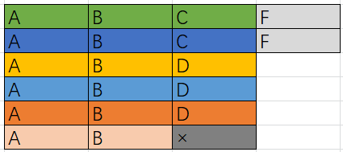

> 原文链接: https://leetcode-cn.com/problems/task-scheduler


## 英文原文
<div><p>Given a characters array <code>tasks</code>, representing the tasks a CPU needs to do, where each letter represents a different task. Tasks could be done in any order. Each task is done in one unit of time. For each unit of time, the CPU could complete either one task or just be idle.</p>

<p>However, there is a non-negative integer&nbsp;<code>n</code> that represents the cooldown period between&nbsp;two <b>same tasks</b>&nbsp;(the same letter in the array), that is that there must be at least <code>n</code> units of time between any two same tasks.</p>

<p>Return <em>the least number of units of times that the CPU will take to finish all the given tasks</em>.</p>

<p>&nbsp;</p>
<p><strong>Example 1:</strong></p>

<pre>
<strong>Input:</strong> tasks = [&quot;A&quot;,&quot;A&quot;,&quot;A&quot;,&quot;B&quot;,&quot;B&quot;,&quot;B&quot;], n = 2
<strong>Output:</strong> 8
<strong>Explanation:</strong> 
A -&gt; B -&gt; idle -&gt; A -&gt; B -&gt; idle -&gt; A -&gt; B
There is at least 2 units of time between any two same tasks.
</pre>

<p><strong>Example 2:</strong></p>

<pre>
<strong>Input:</strong> tasks = [&quot;A&quot;,&quot;A&quot;,&quot;A&quot;,&quot;B&quot;,&quot;B&quot;,&quot;B&quot;], n = 0
<strong>Output:</strong> 6
<strong>Explanation:</strong> On this case any permutation of size 6 would work since n = 0.
[&quot;A&quot;,&quot;A&quot;,&quot;A&quot;,&quot;B&quot;,&quot;B&quot;,&quot;B&quot;]
[&quot;A&quot;,&quot;B&quot;,&quot;A&quot;,&quot;B&quot;,&quot;A&quot;,&quot;B&quot;]
[&quot;B&quot;,&quot;B&quot;,&quot;B&quot;,&quot;A&quot;,&quot;A&quot;,&quot;A&quot;]
...
And so on.
</pre>

<p><strong>Example 3:</strong></p>

<pre>
<strong>Input:</strong> tasks = [&quot;A&quot;,&quot;A&quot;,&quot;A&quot;,&quot;A&quot;,&quot;A&quot;,&quot;A&quot;,&quot;B&quot;,&quot;C&quot;,&quot;D&quot;,&quot;E&quot;,&quot;F&quot;,&quot;G&quot;], n = 2
<strong>Output:</strong> 16
<strong>Explanation:</strong> 
One possible solution is
A -&gt; B -&gt; C -&gt; A -&gt; D -&gt; E -&gt; A -&gt; F -&gt; G -&gt; A -&gt; idle -&gt; idle -&gt; A -&gt; idle -&gt; idle -&gt; A
</pre>

<p>&nbsp;</p>
<p><strong>Constraints:</strong></p>

<ul>
	<li><code>1 &lt;= task.length &lt;= 10<sup>4</sup></code></li>
	<li><code>tasks[i]</code> is upper-case English letter.</li>
	<li>The integer <code>n</code> is in the range <code>[0, 100]</code>.</li>
</ul>
</div>

## 中文题目
<div><p>给你一个用字符数组 <code>tasks</code> 表示的 CPU 需要执行的任务列表。其中每个字母表示一种不同种类的任务。任务可以以任意顺序执行，并且每个任务都可以在 1 个单位时间内执行完。在任何一个单位时间，CPU 可以完成一个任务，或者处于待命状态。</p>

<p>然而，两个<strong> 相同种类</strong> 的任务之间必须有长度为整数<strong> </strong><code>n</code><strong> </strong>的冷却时间，因此至少有连续 <code>n</code> 个单位时间内 CPU 在执行不同的任务，或者在待命状态。</p>

<p>你需要计算完成所有任务所需要的<strong> 最短时间</strong> 。</p>

<p> </p>

<p><strong>示例 1：</strong></p>

<pre>
<strong>输入：</strong>tasks = ["A","A","A","B","B","B"], n = 2
<strong>输出：</strong>8
<strong>解释：</strong>A -> B -> (待命) -> A -> B -> (待命) -> A -> B
     在本示例中，两个相同类型任务之间必须间隔长度为 n = 2 的冷却时间，而执行一个任务只需要一个单位时间，所以中间出现了（待命）状态。 </pre>

<p><strong>示例 2：</strong></p>

<pre>
<strong>输入：</strong>tasks = ["A","A","A","B","B","B"], n = 0
<strong>输出：</strong>6
<strong>解释：</strong>在这种情况下，任何大小为 6 的排列都可以满足要求，因为 n = 0
["A","A","A","B","B","B"]
["A","B","A","B","A","B"]
["B","B","B","A","A","A"]
...
诸如此类
</pre>

<p><strong>示例 3：</strong></p>

<pre>
<strong>输入：</strong>tasks = ["A","A","A","A","A","A","B","C","D","E","F","G"], n = 2
<strong>输出：</strong>16
<strong>解释：</strong>一种可能的解决方案是：
     A -> B -> C -> A -> D -> E -> A -> F -> G -> A -> (待命) -> (待命) -> A -> (待命) -> (待命) -> A
</pre>

<p> </p>

<p><strong>提示：</strong></p>

<ul>
	<li><code>1 <= task.length <= 10<sup>4</sup></code></li>
	<li><code>tasks[i]</code> 是大写英文字母</li>
	<li><code>n</code> 的取值范围为 <code>[0, 100]</code></li>
</ul>
</div>

## 通过代码
<RecoDemo>
</RecoDemo>


## 高赞题解
参考[「桶思想」](https://leetcode-cn.com/problems/task-scheduler/solution/tong-si-xiang-jian-ji-gao-xiao-by-hzhu212/)，详细说明各种情况

建立大小为 `n+1` 的桶子，个数为任务数量最多的那个任务，比如下图，等待时间 `n=2`，A 任务个数 6 个，我们建立 6 桶子，每个容量为 3：

我们可以把一个桶子看作一轮任务


![6XC91X9Y3AV)2)9{Y\]2@QWS.png](../images/task-scheduler-0.png\)2\)9%7BY%5D2@QWS.png)


1. 先从最简单的情况看起，现在就算没有其他任务，我们完成任务 A 所需的时间应该是 `(6-1)*3+1=16`，因为最后一个桶子，不存在等待时间。


2R%7DZ\(3X%5BUA~IAUL.png)


2. 接下来我们添加些其他任务


可以看到 C 其实并没有对总体时间产生影响，因为它被安排在了其他任务的冷却期间；而 B 和 A 数量相同，这会导致最后一个桶子中，我们需要多执行一次 B 任务，现在我们需要的时间是 `(6-1)*3+2=17`


**前面两种情况，总结起来：总排队时间 = (桶个数 - 1) * (n + 1) + 最后一桶的任务数**


3. 当冷却时间短，任务种类很多时


比如上图，我们刚好排满了任务，此时所需时间还是 17，如果现在我还要执行两次任务 F，该怎么安排呢？





此时我们可以临时扩充某些桶子的大小，插进任务 F，对比一下插入前后的任务执行情况：

**插入前：ABC | ABC | ABD | ABD | ABD | AB

插入后：ABCF | ABCF | ABD | ABD | ABD | AB**

我们在第一个、第二个桶子里插入了任务F，不难发现无论再继续插入多少任务，我们都可以类似处理，而且新插入元素肯定满足冷却要求

继续思考一下，这种情况下其实每个任务之间都不存在空余时间，冷却时间已经被完全填满了。

**也就是说，我们执行任务所需的时间，就是任务的数量**


这样剩下就很好处理了，我们只需要算两个数：

1. 记录最大任务数量 N，看一下任务数量并列最多的任务有多少个，即最后一个桶子的任务数 X，计算 `NUM1=(N-1)*(n+1)+x`

2. `NUM2=tasks.size()`

输出其中较大值即可

因为存在空闲时间时肯定是 `NUM1` 大，不存在空闲时间时肯定是 `NUM2>=NUM1`


```

int leastInterval(vector<char>& tasks, int n) {

        int len=tasks.size();

        vector<int> vec(26);

        for(char c:tasks) ++vec[c-'A'];

        sort(vec.begin(),vec.end(),[](int& x,int&y){return x>y;});

        int cnt=1;

        while(cnt<vec.size()&&vec[cnt]==vec[0]) cnt++;

        return max(len,cnt+(n+1)*(vec[0]-1) );

    }

```

时间复杂度 O(nlogn)，空间复杂度 O(1)

## 统计信息
| 通过次数 | 提交次数 | AC比率 |
| :------: | :------: | :------: |
|    81983    |    143023    |   57.3%   |

## 提交历史
| 提交时间 | 提交结果 | 执行时间 |  内存消耗  | 语言 |
| :------: | :------: | :------: | :--------: | :--------: |


## 相似题目
|                             题目                             | 难度 |
| :----------------------------------------------------------: | :---------: |
| [K 距离间隔重排字符串](https://leetcode-cn.com/problems/rearrange-string-k-distance-apart/) | 困难|
| [重构字符串](https://leetcode-cn.com/problems/reorganize-string/) | 中等|
