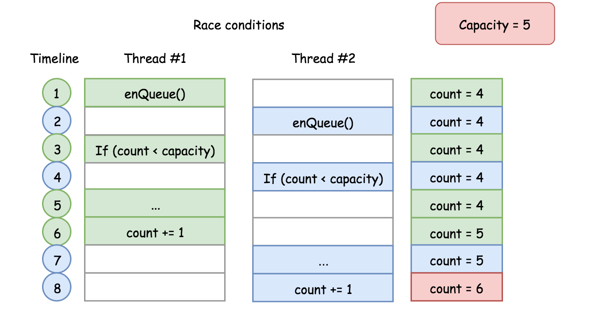
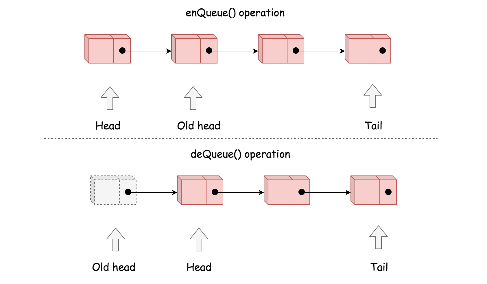

> 原文链接: https://leetcode-cn.com/problems/design-circular-queue


## 英文原文
<div><p>Design your implementation of the circular queue. The circular queue is a linear data structure in which the operations are performed based on FIFO (First In First Out) principle and the last position is connected back to the first position to make a circle. It is also called &quot;Ring Buffer&quot;.</p>

<p>One of the benefits of the circular queue is that we can make use of the spaces in front of the queue. In a normal queue, once the queue becomes full, we cannot insert the next element even if there is a space in front of the queue. But using the circular queue, we can use the space to store new values.</p>

<p>Implementation the <code>MyCircularQueue</code> class:</p>

<ul>
	<li><code>MyCircularQueue(k)</code> Initializes the object with the size of the queue to be <code>k</code>.</li>
	<li><code>int Front()</code> Gets the front item from the queue. If the queue is empty, return <code>-1</code>.</li>
	<li><code>int Rear()</code> Gets the last item from the queue. If the queue is empty, return <code>-1</code>.</li>
	<li><code>boolean enQueue(int value)</code> Inserts an element into the circular queue. Return <code>true</code> if the operation is successful.</li>
	<li><code>boolean deQueue()</code> Deletes an element from the circular queue. Return <code>true</code> if the operation is successful.</li>
	<li><code>boolean isEmpty()</code> Checks whether the circular queue is empty or not.</li>
	<li><code>boolean isFull()</code> Checks whether the circular queue is full or not.</li>
</ul>

<p>You must solve the problem without using the built-in queue data structure in your programming language.&nbsp;</p>

<p>&nbsp;</p>
<p><strong>Example 1:</strong></p>

<pre>
<strong>Input</strong>
[&quot;MyCircularQueue&quot;, &quot;enQueue&quot;, &quot;enQueue&quot;, &quot;enQueue&quot;, &quot;enQueue&quot;, &quot;Rear&quot;, &quot;isFull&quot;, &quot;deQueue&quot;, &quot;enQueue&quot;, &quot;Rear&quot;]
[[3], [1], [2], [3], [4], [], [], [], [4], []]
<strong>Output</strong>
[null, true, true, true, false, 3, true, true, true, 4]

<strong>Explanation</strong>
MyCircularQueue myCircularQueue = new MyCircularQueue(3);
myCircularQueue.enQueue(1); // return True
myCircularQueue.enQueue(2); // return True
myCircularQueue.enQueue(3); // return True
myCircularQueue.enQueue(4); // return False
myCircularQueue.Rear();     // return 3
myCircularQueue.isFull();   // return True
myCircularQueue.deQueue();  // return True
myCircularQueue.enQueue(4); // return True
myCircularQueue.Rear();     // return 4
</pre>

<p>&nbsp;</p>
<p><strong>Constraints:</strong></p>

<ul>
	<li><code>1 &lt;= k &lt;= 1000</code></li>
	<li><code>0 &lt;= value &lt;= 1000</code></li>
	<li>At most <code>3000</code> calls will be made to&nbsp;<code>enQueue</code>, <code>deQueue</code>,&nbsp;<code>Front</code>,&nbsp;<code>Rear</code>,&nbsp;<code>isEmpty</code>, and&nbsp;<code>isFull</code>.</li>
</ul>
</div>

## 中文题目
<div><p>设计你的循环队列实现。 循环队列是一种线性数据结构，其操作表现基于 FIFO（先进先出）原则并且队尾被连接在队首之后以形成一个循环。它也被称为&ldquo;环形缓冲器&rdquo;。</p>

<p>循环队列的一个好处是我们可以利用这个队列之前用过的空间。在一个普通队列里，一旦一个队列满了，我们就不能插入下一个元素，即使在队列前面仍有空间。但是使用循环队列，我们能使用这些空间去存储新的值。</p>

<p>你的实现应该支持如下操作：</p>

<ul>
	<li><code>MyCircularQueue(k)</code>: 构造器，设置队列长度为 k 。</li>
	<li><code>Front</code>: 从队首获取元素。如果队列为空，返回 -1 。</li>
	<li><code>Rear</code>: 获取队尾元素。如果队列为空，返回 -1 。</li>
	<li><code>enQueue(value)</code>: 向循环队列插入一个元素。如果成功插入则返回真。</li>
	<li><code>deQueue()</code>: 从循环队列中删除一个元素。如果成功删除则返回真。</li>
	<li><code>isEmpty()</code>: 检查循环队列是否为空。</li>
	<li><code>isFull()</code>: 检查循环队列是否已满。</li>
</ul>

<p>&nbsp;</p>

<p><strong>示例：</strong></p>

<pre>MyCircularQueue circularQueue = new MyCircularQueue(3); // 设置长度为 3
circularQueue.enQueue(1); &nbsp;// 返回 true
circularQueue.enQueue(2); &nbsp;// 返回 true
circularQueue.enQueue(3); &nbsp;// 返回 true
circularQueue.enQueue(4); &nbsp;// 返回 false，队列已满
circularQueue.Rear(); &nbsp;// 返回 3
circularQueue.isFull(); &nbsp;// 返回 true
circularQueue.deQueue(); &nbsp;// 返回 true
circularQueue.enQueue(4); &nbsp;// 返回 true
circularQueue.Rear(); &nbsp;// 返回 4</pre>

<p>&nbsp;</p>

<p><strong>提示：</strong></p>

<ul>
	<li>所有的值都在 0&nbsp;至 1000 的范围内；</li>
	<li>操作数将在 1 至 1000 的范围内；</li>
	<li>请不要使用内置的队列库。</li>
</ul>
</div>

## 通过代码
<RecoDemo>
</RecoDemo>


## 官方题解
#### 方法一：数组

**思路**

根据问题描述，该问题使用的数据结构应该是首尾相连的 ***环***。

任何数据结构中都不存在环形结构，但是可以使用一维 ***数组*** 模拟，通过操作数组的索引构建一个 ***虚拟*** 的环。很多复杂数据结构都可以通过数组实现。

对于一个固定大小的数组，任何位置都可以是队首，只要知道队列长度，就可以根据下面公式计算出队尾位置：

$$
\text{tailIndex} = (\text{headIndex} + \text{count} - 1) \mod \text{capacity}
$$

其中 `capacity` 是数组长度，`count` 是队列长度，`headIndex` 和 `tailIndex` 分别是队首 `head` 和队尾 `tail` 索引。下图展示了使用数组实现循环的队列的例子。

{:width=480}

**算法**

设计数据结构的关键是如何设计 *属性*，好的设计属性数量更少。

- 属性数量少说明属性之间冗余更低。

- 属性冗余度越低，操作逻辑越简单，发生错误的可能性更低。

- 属性数量少，使用的空间也少，操作性能更高。

*但是，也不建议使用最少的属性数量。*一定的冗余可以降低操作的时间复杂度，达到时间复杂度和空间复杂度的相对平衡。

根据以上原则，列举循环队列的每个属性，并解释其含义。

- `queue`：一个固定大小的数组，用于保存循环队列的元素。

- `headIndex`：一个整数，保存队首 `head` 的索引。

- `count`：循环队列当前的长度，即循环队列中的元素数量。使用 `hadIndex` 和 `count` 可以计算出队尾元素的索引，因此不需要队尾属性。

- `capacity`：循环队列的容量，即队列中最多可以容纳的元素数量。该属性不是必需的，因为队列容量可以通过数组属性得到，但是由于该属性经常使用，所以我们选择保留它。这样可以不用在 Python 中每次调用 `len(queue)` 中获取容量。但是在 Java 中通过 `queue.length` 获取容量更加高效。为了保持一致性，在两种方案中都保留该属性。

```python [solution1-Python]
class MyCircularQueue:

    def __init__(self, k: int):
        """
        Initialize your data structure here. Set the size of the queue to be k.
        """
        self.queue = [0]*k
        self.headIndex = 0
        self.count = 0
        self.capacity = k

    def enQueue(self, value: int) -> bool:
        """
        Insert an element into the circular queue. Return true if the operation is successful.
        """
        if self.count == self.capacity:
            return False
        self.queue[(self.headIndex + self.count) % self.capacity] = value
        self.count += 1
        return True

    def deQueue(self) -> bool:
        """
        Delete an element from the circular queue. Return true if the operation is successful.
        """
        if self.count == 0:
            return False
        self.headIndex = (self.headIndex + 1) % self.capacity
        self.count -= 1
        return True

    def Front(self) -> int:
        """
        Get the front item from the queue.
        """
        if self.count == 0:
            return -1
        return self.queue[self.headIndex]

    def Rear(self) -> int:
        """
        Get the last item from the queue.
        """
        # empty queue
        if self.count == 0:
            return -1
        return self.queue[(self.headIndex + self.count - 1) % self.capacity]

    def isEmpty(self) -> bool:
        """
        Checks whether the circular queue is empty or not.
        """
        return self.count == 0

    def isFull(self) -> bool:
        """
        Checks whether the circular queue is full or not.
        """
        return self.count == self.capacity
```

```java [solution1-Java]
class MyCircularQueue {

  private int[] queue;
  private int headIndex;
  private int count;
  private int capacity;

  /** Initialize your data structure here. Set the size of the queue to be k. */
  public MyCircularQueue(int k) {
    this.capacity = k;
    this.queue = new int[k];
    this.headIndex = 0;
    this.count = 0;
  }

  /** Insert an element into the circular queue. Return true if the operation is successful. */
  public boolean enQueue(int value) {
    if (this.count == this.capacity)
      return false;
    this.queue[(this.headIndex + this.count) % this.capacity] = value;
    this.count += 1;
    return true;
  }

  /** Delete an element from the circular queue. Return true if the operation is successful. */
  public boolean deQueue() {
    if (this.count == 0)
      return false;
    this.headIndex = (this.headIndex + 1) % this.capacity;
    this.count -= 1;
    return true;
  }

  /** Get the front item from the queue. */
  public int Front() {
    if (this.count == 0)
      return -1;
    return this.queue[this.headIndex];
  }

  /** Get the last item from the queue. */
  public int Rear() {
    if (this.count == 0)
      return -1;
    int tailIndex = (this.headIndex + this.count - 1) % this.capacity;
    return this.queue[tailIndex];
  }

  /** Checks whether the circular queue is empty or not. */
  public boolean isEmpty() {
    return (this.count == 0);
  }

  /** Checks whether the circular queue is full or not. */
  public boolean isFull() {
    return (this.count == this.capacity);
  }
}
```

**复杂度分析**

- 时间复杂度：$\mathcal{O}(1)$。该数据结构中，所有方法都具有恒定的时间复杂度。

- 空间复杂度：$\mathcal{O}(N)$，其中 $N$ 是队列的预分配容量。*循环队列的整个生命周期中，都持有该预分配的空间。*

**改进：线程安全**

上面实现满足所有的要求。

> 但是可能存在一些风险。

从并发性来看，该循环队列是线程不安全的。

例如：下图的执行序列超出了队列的设计容量，会覆盖队尾元素。

{:width=480}

这种情况称为竞态条件。更多并发性的问题可以在力扣的[多线程](https://leetcode-cn.com/problemset/concurrency/)模块练习。

并发安全的解决方案很多。以方法 `enQueue(int value)` 为例，说明该方法的并发安全实现。

```python [snippet1-Python]
from threading import Lock

class MyCircularQueue:

    def __init__(self, k: int):
        """
        Initialize your data structure here. Set the size of the queue to be k.
        """
        self.queue = [0]*k
        self.headIndex = 0
        self.count = 0
        self.capacity = k
        # the additional attribute to protect the access of our queue
        self.queueLock = Lock()

    def enQueue(self, value: int) -> bool:
        """
        Insert an element into the circular queue. Return true if the operation is successful.
        """
        # automatically acquire the lock when entering the block
        with self.queueLock:
            if self.count == self.capacity:
                return False
            self.queue[(self.headIndex + self.count) % self.capacity] = value
            self.count += 1
        # automatically release the lock when leaving the block
        return True
```

```java [snippet1-Java]
class MyCircularQueue {

  private Node head, tail;
  private int count;
  private int capacity;
  // Additional variable to secure the access of our queue
  private ReentrantLock queueLock = new ReentrantLock();

  /** Initialize your data structure here. Set the size of the queue to be k. */
  public MyCircularQueue(int k) {
    this.capacity = k;
  }

  /** Insert an element into the circular queue. Return true if the operation is successful. */
  public boolean enQueue(int value) {
    // ensure the exclusive access for the following block.
    queueLock.lock();
    try {
      if (this.count == this.capacity)
        return false;

      Node newNode = new Node(value);
      if (this.count == 0) {
        head = tail = newNode;
      } else {
        tail.nextNode = newNode;
        tail = newNode;
      }
      this.count += 1;

    } finally {
      queueLock.unlock();
    }
    return true;
  }
}
```

加锁后，就可以在并发下安全使用该循环队列。

为了实现并发安全，引入了额外的计算成本，但是上述改进没有改变原始数据结构的时间和空间复杂度。


#### 方法二：单链表

**思路**

*单链表* 和数组都是很常用的数据结构。

> 与固定大小的数组相比，单链表不会为未使用的容量预分配内存，因此它的内存效率更高。

单链表与数组实现方法的时间和空间复杂度相同，但是单链表的效率更高，因为这种方法不会预分配内存。

下图展示了单链表实现下的 `enQueue()` 和 `deQueue()` 操作。

{:width=480}

**算法**

列举循环队列中用到的所有属性，并解释其含义。

- `capacity`：循环队列可容纳的最大元素数量。

- `head`：队首元素索引。

- `count`：当前队列长度。该属性很重要，可以用来做边界检查。

- `tail`：队尾元素索引。与数组实现方式相比，如果不保存队尾索引，则需要花费 $\mathcal{O}(N)$ 时间找到队尾元素。

```python [solution2-Python]
class Node:
    def __init__(self, value, nextNode=None):
        self.value = value
        self.next = nextNode

class MyCircularQueue:

    def __init__(self, k: int):
        """
        Initialize your data structure here. Set the size of the queue to be k.
        """
        self.capacity = k
        self.head = None
        self.tail = None
        self.count = 0

    def enQueue(self, value: int) -> bool:
        """
        Insert an element into the circular queue. Return true if the operation is successful.
        """
        if self.count == self.capacity:
            return False
        
        if self.count == 0:
            self.head = Node(value)
            self.tail = self.head
        else:
            newNode = Node(value)
            self.tail.next = newNode
            self.tail = newNode
        self.count += 1
        return True


    def deQueue(self) -> bool:
        """
        Delete an element from the circular queue. Return true if the operation is successful.
        """
        if self.count == 0:
            return False
        self.head = self.head.next
        self.count -= 1
        return True


    def Front(self) -> int:
        """
        Get the front item from the queue.
        """
        if self.count == 0:
            return -1
        return self.head.value

    def Rear(self) -> int:
        """
        Get the last item from the queue.
        """
        # empty queue
        if self.count == 0:
            return -1
        return self.tail.value
    
    def isEmpty(self) -> bool:
        """
        Checks whether the circular queue is empty or not.
        """
        return self.count == 0

    def isFull(self) -> bool:
        """
        Checks whether the circular queue is full or not.
        """
        return self.count == self.capacity
```

```java [solution2-Java]
class Node {
  public int value;
  public Node nextNode;

  public Node(int value) {
    this.value = value;
    this.nextNode = null;
  }
}

class MyCircularQueue {

  private Node head, tail;
  private int count;
  private int capacity;

  /** Initialize your data structure here. Set the size of the queue to be k. */
  public MyCircularQueue(int k) {
    this.capacity = k;
  }

  /** Insert an element into the circular queue. Return true if the operation is successful. */
  public boolean enQueue(int value) {
    if (this.count == this.capacity)
      return false;

    Node newNode = new Node(value);
    if (this.count == 0) {
      head = tail = newNode;
    } else {
      tail.nextNode = newNode;
      tail = newNode;
    }
    this.count += 1;
    return true;
  }

  /** Delete an element from the circular queue. Return true if the operation is successful. */
  public boolean deQueue() {
    if (this.count == 0)
      return false;
    this.head = this.head.nextNode;
    this.count -= 1;
    return true;
  }

  /** Get the front item from the queue. */
  public int Front() {
    if (this.count == 0)
      return -1;
    else
      return this.head.value;
  }

  /** Get the last item from the queue. */
  public int Rear() {
    if (this.count == 0)
      return -1;
    else
      return this.tail.value;
  }

  /** Checks whether the circular queue is empty or not. */
  public boolean isEmpty() {
    return (this.count == 0);
  }

  /** Checks whether the circular queue is full or not. */
  public boolean isFull() {
    return (this.count == this.capacity);
  }
}
```

**复杂度分析**

- 时间复杂度：$\mathcal{O}(1)$，所有方法都具有恒定的时间复杂度。

- 空间复杂度：$\mathcal{O}(N)$，与数组实现相同。但是单链表实现f方式的内存效率更高。

## 统计信息
| 通过次数 | 提交次数 | AC比率 |
| :------: | :------: | :------: |
|    70420    |    160203    |   44.0%   |

## 提交历史
| 提交时间 | 提交结果 | 执行时间 |  内存消耗  | 语言 |
| :------: | :------: | :------: | :--------: | :--------: |


## 相似题目
|                             题目                             | 难度 |
| :----------------------------------------------------------: | :---------: |
| [设计循环双端队列](https://leetcode-cn.com/problems/design-circular-deque/) | 中等|
