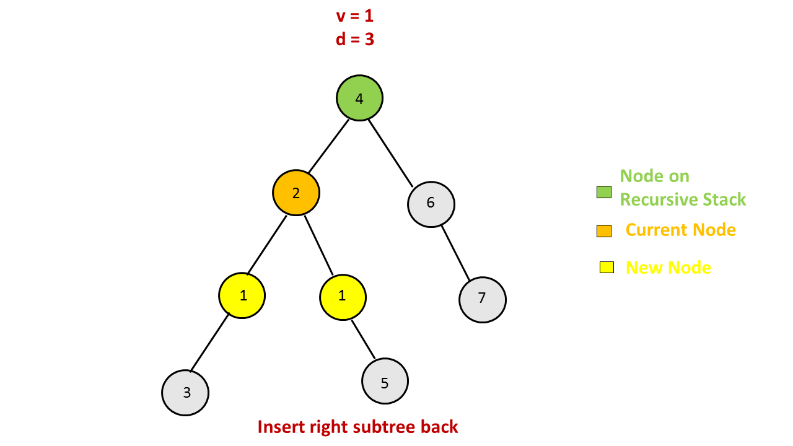
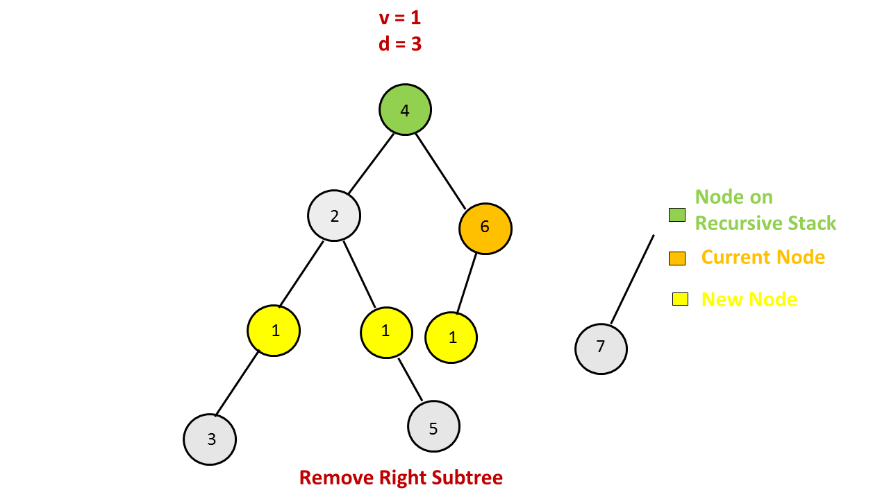

> 原文链接: https://leetcode-cn.com/problems/add-one-row-to-tree


## 英文原文
<div><p>Given the <code>root</code> of a binary tree and two integers <code>val</code> and <code>depth</code>, add a row of nodes with value <code>val</code> at the given depth <code>depth</code>.</p>

<p>Note that the <code>root</code> node is at depth <code>1</code>.</p>

<p>The adding rule is:</p>

<ul>
	<li>Given the integer <code>depth</code>, for each not null tree node <code>cur</code> at the depth <code>depth - 1</code>, create two tree nodes with value <code>val</code> as <code>cur</code>&#39;s left subtree root and right subtree root.</li>
	<li><code>cur</code>&#39;s original left subtree should be the left subtree of the new left subtree root.</li>
	<li><code>cur</code>&#39;s original right subtree should be the right subtree of the new right subtree root.</li>
	<li>If <code>depth == 1</code> that means there is no depth <code>depth - 1</code> at all, then create a tree node with value <code>val</code> as the new root of the whole original tree, and the original tree is the new root&#39;s left subtree.</li>
</ul>

<p>&nbsp;</p>
<p><strong>Example 1:</strong></p>

<pre>
<strong>Input:</strong> root = [4,2,6,3,1,5], val = 1, depth = 2
<strong>Output:</strong> [4,1,1,2,null,null,6,3,1,5]
</pre>

<p><strong>Example 2:</strong></p>

<pre>
<strong>Input:</strong> root = [4,2,null,3,1], val = 1, depth = 3
<strong>Output:</strong> [4,2,null,1,1,3,null,null,1]
</pre>

<p>&nbsp;</p>
<p><strong>Constraints:</strong></p>

<ul>
	<li>The number of nodes in the tree is in the range <code>[1, 10<sup>4</sup>]</code>.</li>
	<li>The depth of the tree is in the range <code>[1, 10<sup>4</sup>]</code>.</li>
	<li><code>-100 &lt;= Node.val &lt;= 100</code></li>
	<li><code>-10<sup>5</sup> &lt;= val &lt;= 10<sup>5</sup></code></li>
	<li><code>1 &lt;= depth &lt;= the depth of tree + 1</code></li>
</ul>
</div>

## 中文题目
<div><p>给定一个二叉树，根节点为第1层，深度为 1。在其第&nbsp;<code>d</code>&nbsp;层追加一行值为&nbsp;<code>v</code>&nbsp;的节点。</p>

<p>添加规则：给定一个深度值 <code>d</code> （正整数），针对深度为 <code>d-1</code> 层的每一<strong>非空</strong>节点 <code>N</code>，为 <code>N</code> 创建两个值为&nbsp;<code>v</code>&nbsp;的左子树和右子树。</p>

<p>将&nbsp;<code>N</code> 原先的左子树，连接为新节点&nbsp;<code>v</code> 的左子树；将&nbsp;<code>N</code> 原先的右子树，连接为新节点&nbsp;<code>v</code> 的右子树。</p>

<p>如果 <code>d</code> 的值为 1，深度 d - 1 不存在，则创建一个新的根节点 <code>v</code>，原先的整棵树将作为 <code>v</code> 的左子树。</p>

<p><strong>示例 1:</strong></p>

<pre>
<strong>输入:</strong> 
二叉树如下所示:
       4
     /   \
    2     6
   / \   / 
  3   1 5   

<strong>v = 1</strong>

<strong>d = 2</strong>

<strong>输出:</strong> 
       4
      / \
     1   1
    /     \
   2       6
  / \     / 
 3   1   5   

</pre>

<p><strong>示例 2:</strong></p>

<pre>
<strong>输入:</strong> 
二叉树如下所示:
      4
     /   
    2    
   / \   
  3   1    

<strong>v = 1</strong>

<strong>d = 3</strong>

<strong>输出:</strong> 
      4
     /   
    2
   / \    
  1   1
 /     \  
3       1
</pre>

<p><strong>注意:</strong></p>

<ol>
	<li>输入的深度值 d 的范围是：[1，二叉树最大深度 + 1]。</li>
	<li>输入的二叉树至少有一个节点。</li>
</ol>
</div>

## 通过代码
<RecoDemo>
</RecoDemo>


## 官方题解
#### 方法一：深度优先搜索（递归）

如果 `d` 的值为 `1`，我们就添加一个节点，并将整棵树作为新节点的左子树。否则我们可以使用深度优先搜索找出所有 `d` 层的节点并进行操作。在搜索时，我们需要记录当前节点的深度 `depth`，如果此时 `depth == d - 1`，那么我们需要在当前节点的左右孩子各增加一个节点。如果当前节点的左右孩子已经有节点，我们就将这些节点存储到临时变量中，在增加新节点后再把左右孩子作为新节点的左子树或右子树，并结束递归。如果 `depth != d - 1`，我们就需要对当前节点的子节点进行递归搜索。

<,,,,,,,,,,,,,,,>


```Java [sol1]
/**
 * Definition for a binary tree node.
 * public class TreeNode {
 *     int val;
 *     TreeNode left;
 *     TreeNode right;
 *     TreeNode(int x) { val = x; }
 * }
 */
public class Solution {
    public TreeNode addOneRow(TreeNode t, int v, int d) {
        if (d == 1) {
            TreeNode n = new TreeNode(v);
            n.left = t;
            return n;
        }
        insert(v, t, 1, d);
        return t;
    }

    public void insert(int val, TreeNode node, int depth, int n) {
        if (node == null)
            return;
        if (depth == n - 1) {
            TreeNode t = node.left;
            node.left = new TreeNode(val);
            node.left.left = t;
            t = node.right;
            node.right = new TreeNode(val);
            node.right.right = t;
        } else {
            insert(val, node.left, depth + 1, n);
            insert(val, node.right, depth + 1, n);
        }
    }
}
```

**复杂度分析**

* 时间复杂度：$O(N)$，其中 $N$ 是二叉树的节点个数。我们最多会遍历 $N$ 个节点。

* 空间复杂度：$O(N)$。在最坏情况下，需要递归 $N$ 层，用到 $O(N)$ 的栈空间。

#### 方法二：深度优先搜索（非递归）

我们可以直接用栈来模拟递归，实现深度优先搜索的非递归版本。

我们首先将根节点入栈，随后每次栈顶的元素即为当前搜索到的结点，我们取出这个节点，根据 `depth` 和 `d - 1` 的关系为当前节点增加新的子节点，或者将当前节点的子节点全部入栈，继续搜索。

<,,,,,,,,,,>

```Java [sol2]
/**
 * Definition for a binary tree node.
 * public class TreeNode {
 *     int val;
 *     TreeNode left;
 *     TreeNode right;
 *     TreeNode(int x) { val = x; }
 * }
 */
public class Solution {
    class Node{
        Node(TreeNode n,int d){
            node=n;
            depth=d;
        }
        TreeNode node;
        int depth;
    }
    public TreeNode addOneRow(TreeNode t, int v, int d) {
        if (d == 1) {
            TreeNode n = new TreeNode(v);
            n.left = t;
            return n;
        } 
        Stack<Node> stack=new Stack<>();
        stack.push(new Node(t,1));
        while(!stack.isEmpty())
        {
            Node n=stack.pop();
            if(n.node==null)
                continue;
            if (n.depth == d - 1 ) {
                TreeNode temp = n.node.left;
                n.node.left = new TreeNode(v);
                n.node.left.left = temp;
                temp = n.node.right;
                n.node.right = new TreeNode(v);
                n.node.right.right = temp;
                
            } else{
                stack.push(new Node(n.node.left, n.depth + 1));
                stack.push(new Node(n.node.right, n.depth + 1));
            }
        }
        return t;
    }
}
```

**复杂度分析**

* 时间复杂度：$O(N)$，其中 $N$ 是二叉树的节点个数。我们最多会遍历 $N$ 个节点。

* 空间复杂度：$O(N)$。

#### 方法三：广度优先搜索

我们同样可以使用广度优先搜索解决这个问题，并且广度优先搜索是最容易理解且最直观的一种方法。

我们将根节点放入队列 `queue`。在每一轮搜索中，如果 `queue` 中节点的深度为 `d - 1`（显然 `queue` 中所有的节点都在同一深度），我们就退出搜索，并为 `queue` 中所有节点添加新的子节点；否则我们将 `queue` 中所有节点的子节点放入新的队列 `temp` 中，再用 `temp` 替代 `queue`。

<,,,,,,,,,,,,>

```Java [sol3]
/**
 * Definition for a binary tree node.
 * public class TreeNode {
 *     int val;
 *     TreeNode left;
 *     TreeNode right;
 *     TreeNode(int x) { val = x; }
 * }
 */
public class Solution {
    public TreeNode addOneRow(TreeNode t, int v, int d) {
        if (d == 1) {
            TreeNode n = new TreeNode(v);
            n.left = t;
            return n;
        }
        Queue < TreeNode > queue = new LinkedList < > ();
        queue.add(t);
        int depth = 1;
        while (depth < d - 1) {
            Queue < TreeNode > temp = new LinkedList < > ();
            while (!queue.isEmpty()) {
                TreeNode node = queue.remove();
                if (node.left != null) temp.add(node.left);
                if (node.right != null) temp.add(node.right);
            }
            queue = temp;
            depth++;
        }
        while (!queue.isEmpty()) {
            TreeNode node = queue.remove();
            TreeNode temp = node.left;
            node.left = new TreeNode(v);
            node.left.left = temp;
            temp = node.right;
            node.right = new TreeNode(v);
            node.right.right = temp;
        }
        return t;
    }
}
```

**复杂度分析s**

* 时间复杂度：$O(N)$，其中 $N$ 是二叉树的节点个数。我们最多会遍历 $N$ 个节点。

* 空间复杂度：$O(N)$。

## 统计信息
| 通过次数 | 提交次数 | AC比率 |
| :------: | :------: | :------: |
|    11688    |    21420    |   54.6%   |

## 提交历史
| 提交时间 | 提交结果 | 执行时间 |  内存消耗  | 语言 |
| :------: | :------: | :------: | :--------: | :--------: |
