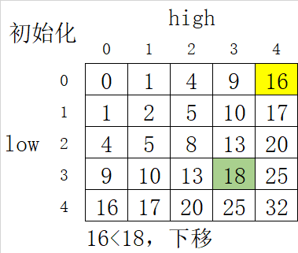
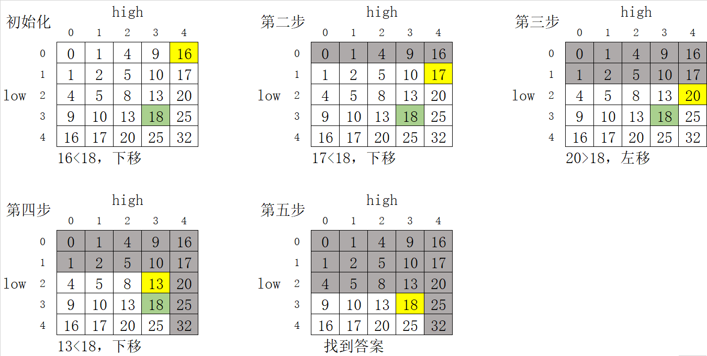

> 原文链接: https://leetcode-cn.com/problems/sum-of-square-numbers


## 英文原文
<div><p>Given a non-negative integer <code>c</code>, decide whether there&#39;re two integers <code>a</code> and <code>b</code> such that <code>a<sup>2</sup> + b<sup>2</sup> = c</code>.</p>

<p>&nbsp;</p>
<p><strong>Example 1:</strong></p>

<pre>
<strong>Input:</strong> c = 5
<strong>Output:</strong> true
<strong>Explanation:</strong> 1 * 1 + 2 * 2 = 5
</pre>

<p><strong>Example 2:</strong></p>

<pre>
<strong>Input:</strong> c = 3
<strong>Output:</strong> false
</pre>

<p><strong>Example 3:</strong></p>

<pre>
<strong>Input:</strong> c = 4
<strong>Output:</strong> true
</pre>

<p><strong>Example 4:</strong></p>

<pre>
<strong>Input:</strong> c = 2
<strong>Output:</strong> true
</pre>

<p><strong>Example 5:</strong></p>

<pre>
<strong>Input:</strong> c = 1
<strong>Output:</strong> true
</pre>

<p>&nbsp;</p>
<p><strong>Constraints:</strong></p>

<ul>
	<li><code>0 &lt;= c &lt;= 2<sup>31</sup> - 1</code></li>
</ul>
</div>

## 中文题目
<div><p>给定一个非负整数&nbsp;<code>c</code>&nbsp;，你要判断是否存在两个整数 <code>a</code> 和 <code>b</code>，使得&nbsp;<code>a<sup>2</sup> + b<sup>2</sup> = c</code> 。</p>

<p>&nbsp;</p>

<p><strong>示例 1：</strong></p>

<pre><strong>输入：</strong>c = 5
<strong>输出：</strong>true
<strong>解释：</strong>1 * 1 + 2 * 2 = 5
</pre>

<p><strong>示例 2：</strong></p>

<pre><strong>输入：</strong>c = 3
<strong>输出：</strong>false
</pre>

<p><strong>示例 3：</strong></p>

<pre><strong>输入：</strong>c = 4
<strong>输出：</strong>true
</pre>

<p><strong>示例 4：</strong></p>

<pre><strong>输入：</strong>c = 2
<strong>输出：</strong>true
</pre>

<p><strong>示例 5：</strong></p>

<pre><strong>输入：</strong>c = 1
<strong>输出：</strong>true</pre>

<p>&nbsp;</p>

<p><strong>提示：</strong></p>

<ul>
	<li><code>0 &lt;= c &lt;= 2<sup>31</sup> - 1</code></li>
</ul>
</div>

## 通过代码
<RecoDemo>
</RecoDemo>


## 高赞题解


### 解题思路：

看了官方题解的双指针算法，不免产生一个疑问，假设初始化时，左指针`low = 0`，右指针`high = sqrt(c)`。

为什么 $low^2+high^2<c$ 时，要让`low++`而不是`high++`呢？或者说为什么让`low++`可以保证不错过正确答案呢？

同理，为什么$low^2+high^2>c$ 时，要让`high--`而不是`low--`呢？或者说为什么让`high--`可以保证不错过正确答案呢？

其实我们可以把双指针的过程看成在一个矩阵中搜寻的过程。举个例子，`c = 18`，初始化`low = 0`，`high = 4`，那么看如下矩阵：





矩阵沿主对角线对称 $(low<=high)$，其中的元素表示 $low^2+high^2$ 的值，黄色格子表示当前的 $low^2+high^2$ ，绿色格子表示目标`c`，`low++`相当于让黄色格子下移，`high--`则相当于让黄色格子左移。这里矩阵的性质和搜索的过程其实和[240. 搜索二维矩阵 II](https://leetcode-cn.com/problems/search-a-2d-matrix-ii/)是一样的。每一列从上到下升序，每一行从左到右升序。

查找的过程具有如下性质：

1. 初始化时黄色格子必定在矩阵的右上角。

2. 每次比较 $low^2+high^2$ 和 $c$ 可以排除矩阵的一行或一列。	


如下图：												




由于以上性质，当前黄色格子的上方和右边的所有元素一定是已经被排除的，所以黄色格子在搜索过程中只有两种行为：

1. 小于 $c$ ：左边的元素都小于当前元素，只能下移，相当于`low++`。**此时排除的是黄色格子以及左边同行的元素，都小于 $c$ ，所以不会错过正确答案。**

2. 大于 $c$ ：下面的元素都大于当前元素，只能左移，相当于`high--`。**此时排除的是黄色格子以及下方同列的元素，都大于 $c$ ，所以不会错过正确答案。**


如此一来，双指针这个操作就十分自然了。


```python3 []

class Solution:

    def judgeSquareSum(self, c: int) -> bool:

        low, high = 0, int(c**0.5)

        while low<=high:

            sumOf = low*low+high*high

            if sumOf==c: return True

            elif sumOf<c: low += 1

            else: high -= 1

        return False

```

矩阵的行数和列数都是$\sqrt{c}$，所以时间复杂度为 $O(\sqrt{c})$。


# 推广到一般情况：双指针的本质


我们可以看到，二维矩阵实际上是枚举了所有可能的组合。本题中 $c=a^2+b^2$ ，可以简单推广到 $c=f(a,b)$ ，只要 $f(a,b)$ 满足随 $a, b$ 递增，且要搜索的是一个**有序**序列，就可以使用这种双指针法，只要把二维矩阵中的元素换成 $f(a,b)$ 就可以了。例如[15. 三数之和](https://leetcode-cn.com/problems/3sum/)。


但是有些双指针的题目并不好用二维矩阵来解释，比如[11. 盛最多水的容器](https://leetcode-cn.com/problems/container-with-most-water/)。二维矩阵中每个格子，代表的是两个指针的一种组合，从这里我们可以看到，双指针更一般的本质，其实就是在每次移动指针的时候，排除掉一部分**不包含正确答案的组合**，只要能证明这点，就可以使用双指针。


例如本题，如果 $low^2+high^2>c$ ，要进行`high--`，本质就是排除掉下标区间 $[low, high-1]$ 中每个元素，和当前`high`所指元素的组合，由于该区间中每个元素 $x$ 都大于等于 $low$，都满足 $x^2+high^2\ge low^2+high^2>c$， 所以可以证明排除掉的集合不包含正确答案。`low++`同理，也就证明了双指针的正确性。


所以用双指针要考虑两个问题：每次移动指针排除掉了哪些情况？这些情况中是否可能包含正确答案？

## 统计信息
| 通过次数 | 提交次数 | AC比率 |
| :------: | :------: | :------: |
|    97414    |    246033    |   39.6%   |

## 提交历史
| 提交时间 | 提交结果 | 执行时间 |  内存消耗  | 语言 |
| :------: | :------: | :------: | :--------: | :--------: |


## 相似题目
|                             题目                             | 难度 |
| :----------------------------------------------------------: | :---------: |
| [有效的完全平方数](https://leetcode-cn.com/problems/valid-perfect-square/) | 简单|
