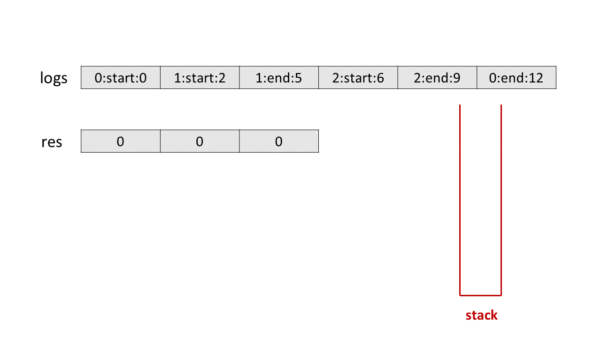
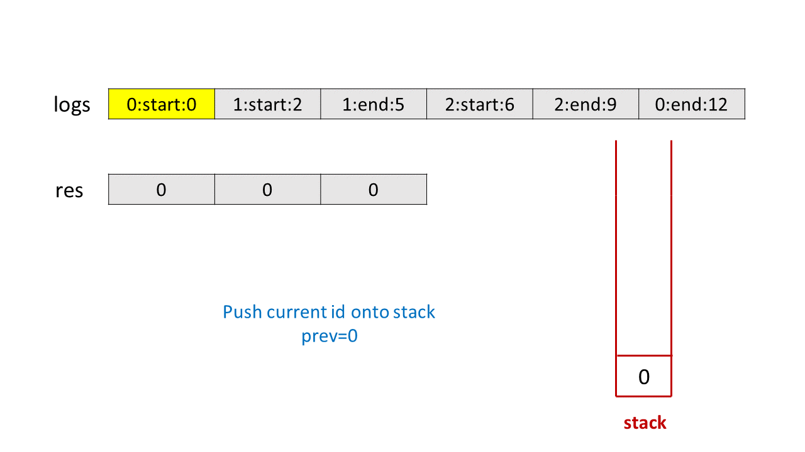
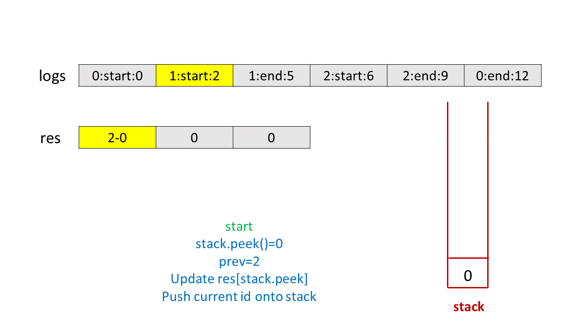
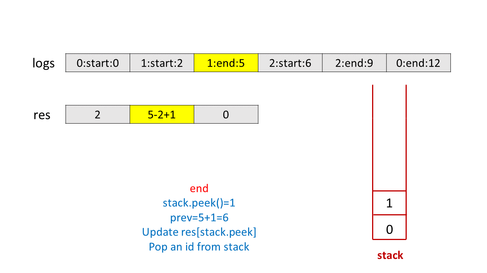
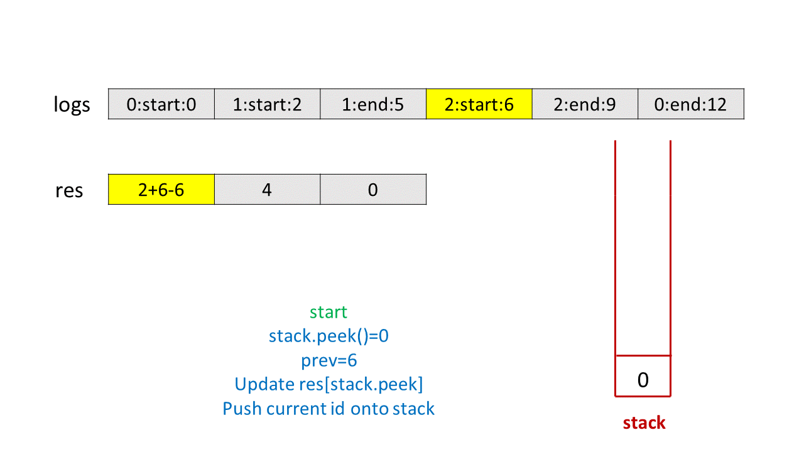
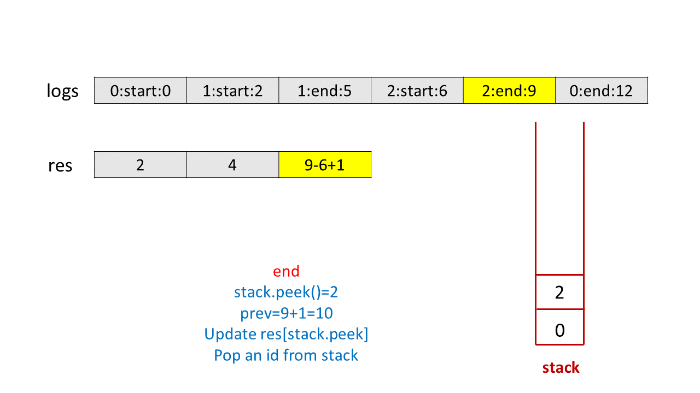
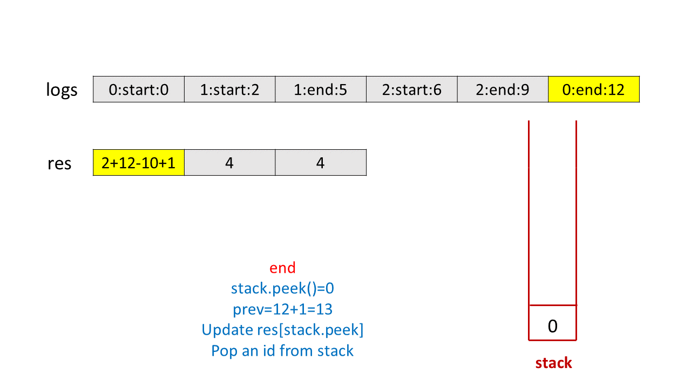
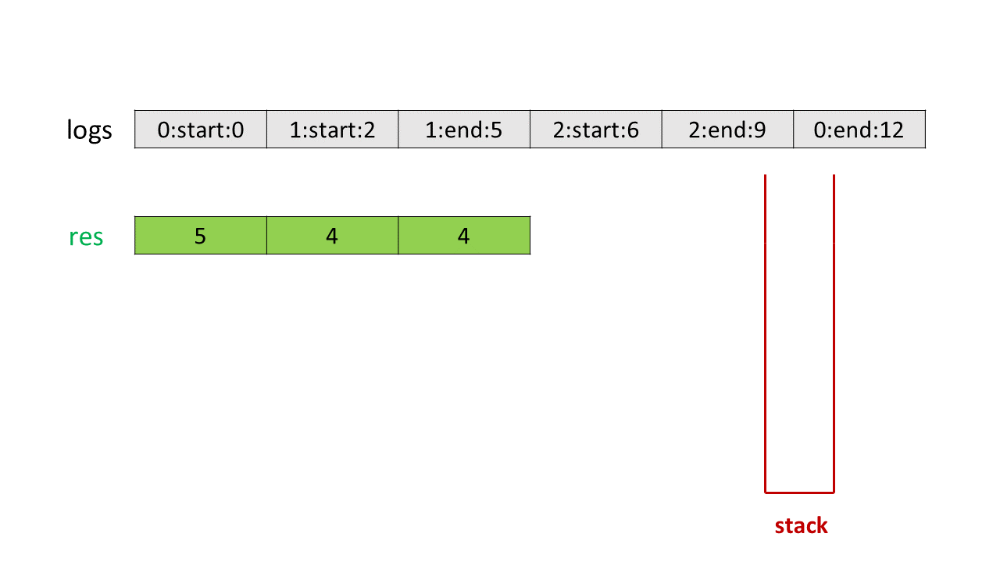

> 原文链接: https://leetcode-cn.com/problems/exclusive-time-of-functions


## 英文原文
<div><p>On a <strong>single-threaded</strong> CPU, we execute a program containing <code>n</code> functions. Each function has a unique ID between <code>0</code> and <code>n-1</code>.</p>

<p>Function calls are <strong>stored in a <a href="https://en.wikipedia.org/wiki/Call_stack">call stack</a></strong>: when a function call starts, its ID is pushed onto the stack, and when a function call ends, its ID is popped off the stack. The function whose ID is at the top of the stack is <strong>the current function being executed</strong>. Each time a function starts or ends, we write a log with the ID, whether it started or ended, and the timestamp.</p>

<p>You are given a list <code>logs</code>, where <code>logs[i]</code> represents the <code>i<sup>th</sup></code> log message formatted as a string <code>&quot;{function_id}:{&quot;start&quot; | &quot;end&quot;}:{timestamp}&quot;</code>. For example, <code>&quot;0:start:3&quot;</code> means a function call with function ID <code>0</code> <strong>started at the beginning</strong> of timestamp <code>3</code>, and <code>&quot;1:end:2&quot;</code> means a function call with function ID <code>1</code> <strong>ended at the end</strong> of timestamp <code>2</code>. Note that a function can be called <b>multiple times, possibly recursively</b>.</p>

<p>A function&#39;s <strong>exclusive time</strong> is the sum of execution times for all function calls in the program. For example, if a function is called twice, one call executing for <code>2</code> time units and another call executing for <code>1</code> time unit, the <strong>exclusive time</strong> is <code>2 + 1 = 3</code>.</p>

<p>Return <em>the <strong>exclusive time</strong> of each function in an array, where the value at the </em><code>i<sup>th</sup></code><em> index represents the exclusive time for the function with ID </em><code>i</code>.</p>

<p>&nbsp;</p>
<p><strong>Example 1:</strong></p>

<pre>
<strong>Input:</strong> n = 2, logs = [&quot;0:start:0&quot;,&quot;1:start:2&quot;,&quot;1:end:5&quot;,&quot;0:end:6&quot;]
<strong>Output:</strong> [3,4]
<strong>Explanation:</strong>
Function 0 starts at the beginning of time 0, then it executes 2 for units of time and reaches the end of time 1.
Function 1 starts at the beginning of time 2, executes for 4 units of time, and ends at the end of time 5.
Function 0 resumes execution at the beginning of time 6 and executes for 1 unit of time.
So function 0 spends 2 + 1 = 3 units of total time executing, and function 1 spends 4 units of total time executing.
</pre>

<p><strong>Example 2:</strong></p>

<pre>
<strong>Input:</strong> n = 1, logs = [&quot;0:start:0&quot;,&quot;0:start:2&quot;,&quot;0:end:5&quot;,&quot;0:start:6&quot;,&quot;0:end:6&quot;,&quot;0:end:7&quot;]
<strong>Output:</strong> [8]
<strong>Explanation:</strong>
Function 0 starts at the beginning of time 0, executes for 2 units of time, and recursively calls itself.
Function 0 (recursive call) starts at the beginning of time 2 and executes for 4 units of time.
Function 0 (initial call) resumes execution then immediately calls itself again.
Function 0 (2nd recursive call) starts at the beginning of time 6 and executes for 1 unit of time.
Function 0 (initial call) resumes execution at the beginning of time 7 and executes for 1 unit of time.
So function 0 spends 2 + 4 + 1 + 1 = 8 units of total time executing.
</pre>

<p><strong>Example 3:</strong></p>

<pre>
<strong>Input:</strong> n = 2, logs = [&quot;0:start:0&quot;,&quot;0:start:2&quot;,&quot;0:end:5&quot;,&quot;1:start:6&quot;,&quot;1:end:6&quot;,&quot;0:end:7&quot;]
<strong>Output:</strong> [7,1]
<strong>Explanation:</strong>
Function 0 starts at the beginning of time 0, executes for 2 units of time, and recursively calls itself.
Function 0 (recursive call) starts at the beginning of time 2 and executes for 4 units of time.
Function 0 (initial call) resumes execution then immediately calls function 1.
Function 1 starts at the beginning of time 6, executes 1 units of time, and ends at the end of time 6.
Function 0 resumes execution at the beginning of time 6 and executes for 2 units of time.
So function 0 spends 2 + 4 + 1 = 7 units of total time executing, and function 1 spends 1 unit of total time executing.
</pre>

<p><strong>Example 4:</strong></p>

<pre>
<strong>Input:</strong> n = 2, logs = [&quot;0:start:0&quot;,&quot;0:start:2&quot;,&quot;0:end:5&quot;,&quot;1:start:7&quot;,&quot;1:end:7&quot;,&quot;0:end:8&quot;]
<strong>Output:</strong> [8,1]
</pre>

<p><strong>Example 5:</strong></p>

<pre>
<strong>Input:</strong> n = 1, logs = [&quot;0:start:0&quot;,&quot;0:end:0&quot;]
<strong>Output:</strong> [1]
</pre>

<p>&nbsp;</p>
<p><strong>Constraints:</strong></p>

<ul>
	<li><code>1 &lt;= n &lt;= 100</code></li>
	<li><code>1 &lt;= logs.length &lt;= 500</code></li>
	<li><code>0 &lt;= function_id &lt; n</code></li>
	<li><code>0 &lt;= timestamp &lt;= 10<sup>9</sup></code></li>
	<li>No two start events will happen at the same timestamp.</li>
	<li>No two end events will happen at the same timestamp.</li>
	<li>Each function has an <code>&quot;end&quot;</code> log for each <code>&quot;start&quot;</code> log.</li>
</ul>
</div>

## 中文题目
<div><p>有一个 <strong>单线程</strong> CPU 正在运行一个含有 <code>n</code> 道函数的程序。每道函数都有一个位于  <code>0</code> 和 <code>n-1</code> 之间的唯一标识符。</p>

<p>函数调用 <strong>存储在一个 <a href="https://baike.baidu.com/item/%E8%B0%83%E7%94%A8%E6%A0%88/22718047?fr=aladdin" target="_blank">调用栈</a> 上</strong> ：当一个函数调用开始时，它的标识符将会推入栈中。而当一个函数调用结束时，它的标识符将会从栈中弹出。标识符位于栈顶的函数是 <strong>当前正在执行的函数</strong> 。每当一个函数开始或者结束时，将会记录一条日志，包括函数标识符、是开始还是结束、以及相应的时间戳。</p>

<p>给你一个由日志组成的列表 <code>logs</code> ，其中 <code>logs[i]</code> 表示第 <code>i</code> 条日志消息，该消息是一个按 <code>"{function_id}:{"start" | "end"}:{timestamp}"</code> 进行格式化的字符串。例如，<code>"0:start:3"</code> 意味着标识符为 <code>0</code> 的函数调用在时间戳 <code>3</code> 的 <strong>起始开始执行</strong> ；而 <code>"1:end:2"</code> 意味着标识符为 <code>1</code> 的函数调用在时间戳 <code>2</code> 的 <strong>末尾结束执行</strong>。注意，函数可以 <strong>调用多次，可能存在递归调用 </strong>。</p>

<p>函数的 <strong>独占时间</strong> 定义是在这个函数在程序所有函数调用中执行时间的总和，调用其他函数花费的时间不算该函数的独占时间。例如，如果一个函数被调用两次，一次调用执行 <code>2</code> 单位时间，另一次调用执行 <code>1</code> 单位时间，那么该函数的 <strong>独占时间</strong> 为 <code>2 + 1 = 3</code> 。</p>

<p>以数组形式返回每个函数的 <strong>独占时间</strong> ，其中第 <code>i</code> 个下标对应的值表示标识符 <code>i</code> 的函数的独占时间。</p>
 

<p><strong>示例 1：</strong></p>

<pre>
<strong>输入：</strong>n = 2, logs = ["0:start:0","1:start:2","1:end:5","0:end:6"]
<strong>输出：</strong>[3,4]
<strong>解释：</strong>
函数 0 在时间戳 0 的起始开始执行，执行 2 个单位时间，于时间戳 1 的末尾结束执行。 
函数 1 在时间戳 2 的起始开始执行，执行 4 个单位时间，于时间戳 5 的末尾结束执行。 
函数 0 在时间戳 6 的开始恢复执行，执行 1 个单位时间。 
所以函数 0 总共执行 2 + 1 = 3 个单位时间，函数 1 总共执行 4 个单位时间。 
</pre>

<p><strong>示例 2：</strong></p>

<pre>
<strong>输入：</strong>n = 1, logs = ["0:start:0","0:start:2","0:end:5","0:start:6","0:end:6","0:end:7"]
<strong>输出：</strong>[8]
<strong>解释：</strong>
函数 0 在时间戳 0 的起始开始执行，执行 2 个单位时间，并递归调用它自身。
函数 0（递归调用）在时间戳 2 的起始开始执行，执行 4 个单位时间。
函数 0（初始调用）恢复执行，并立刻再次调用它自身。
函数 0（第二次递归调用）在时间戳 6 的起始开始执行，执行 1 个单位时间。
函数 0（初始调用）在时间戳 7 的起始恢复执行，执行 1 个单位时间。
所以函数 0 总共执行 2 + 4 + 1 + 1 = 8 个单位时间。
</pre>

<p><strong>示例 3：</strong></p>

<pre>
<strong>输入：</strong>n = 2, logs = ["0:start:0","0:start:2","0:end:5","1:start:6","1:end:6","0:end:7"]
<strong>输出：</strong>[7,1]
<strong>解释：</strong>
函数 0 在时间戳 0 的起始开始执行，执行 2 个单位时间，并递归调用它自身。
函数 0（递归调用）在时间戳 2 的起始开始执行，执行 4 个单位时间。
函数 0（初始调用）恢复执行，并立刻调用函数 1 。
函数 1在时间戳 6 的起始开始执行，执行 1 个单位时间，于时间戳 6 的末尾结束执行。
函数 0（初始调用）在时间戳 7 的起始恢复执行，执行 1 个单位时间，于时间戳 7 的末尾结束执行。
所以函数 0 总共执行 2 + 4 + 1 = 7 个单位时间，函数 1 总共执行 1 个单位时间。 </pre>

<p><strong>示例 4：</strong></p>

<pre>
<strong>输入：</strong>n = 2, logs = ["0:start:0","0:start:2","0:end:5","1:start:7","1:end:7","0:end:8"]
<strong>输出：</strong>[8,1]
</pre>

<p><strong>示例 5：</strong></p>

<pre>
<strong>输入：</strong>n = 1, logs = ["0:start:0","0:end:0"]
<strong>输出：</strong>[1]
</pre>

<p> </p>

<p><strong>提示：</strong></p>

<ul>
	<li><code>1 <= n <= 100</code></li>
	<li><code>1 <= logs.length <= 500</code></li>
	<li><code>0 <= function_id < n</code></li>
	<li><code>0 <= timestamp <= 10<sup>9</sup></code></li>
	<li>两个开始事件不会在同一时间戳发生</li>
	<li>两个结束事件不会在同一时间戳发生</li>
	<li>每道函数都有一个对应 <code>"start"</code> 日志的 <code>"end"</code> 日志</li>
</ul>
</div>

## 通过代码
<RecoDemo>
</RecoDemo>


## 官方题解
#### 方法一：栈

我们可以使用栈来模拟函数的调用，即在遇到一条包含 `start` 的日志时，我们将对应的函数 `id` 入栈；在遇到一条包含 `end` 的日志时，我们将对应的函数 `id` 出栈。在每一个时刻，栈中的所有函数均为被调用的函数，而栈顶的函数为正在执行的函数。

在每条日志的时间戳后，栈顶的函数会独占执行，直到下一条日志的时间戳，因此我们可以根据相邻两条日志的时间戳差值，来计算函数的独占时间。我们依次遍历所有的日志，对于第 `i` 条日志，如果它包含 `start`，那么栈顶函数从其时间戳 `time[i]` 开始运行，即 `prev = time[i]`；如果它包含 `end`，那么栈顶函数从其时间戳 `time[i]` 的下一个时间开始运行，即 `prev = time[i] + 1`。对于第 `i + 1` 条日志，如果它包含 `start`，那么在时间戳 `time[i + 1]` 时，有新的函数被调用，因此原来的栈顶函数的独占时间为 `time[i + 1] - prev`；如果它包含 `end`，那么在时间戳 `time[i + 1]` 时，原来的栈顶函数执行结束，独占时间为 `time[i + 1] - prev + 1`。在这之后，我们更新 `prev` 并遍历第 `i + 2` 条日志。在遍历结束后，我们就可以得到所有函数的独占时间。

<,,,,,,,>


```Java [sol1]
public class Solution {
    public int[] exclusiveTime(int n, List < String > logs) {
        Stack < Integer > stack = new Stack < > ();
        int[] res = new int[n];
        String[] s = logs.get(0).split(":");
        stack.push(Integer.parseInt(s[0]));
        int i = 1, prev = Integer.parseInt(s[2]);
        while (i < logs.size()) {
            s = logs.get(i).split(":");
            if (s[1].equals("start")) {
                if (!stack.isEmpty())
                    res[stack.peek()] += Integer.parseInt(s[2]) - prev;
                stack.push(Integer.parseInt(s[0]));
                prev = Integer.parseInt(s[2]);
            } else {
                res[stack.peek()] += Integer.parseInt(s[2]) - prev + 1;
                stack.pop();
                prev = Integer.parseInt(s[2]) + 1;
            }
            i++;
        }
        return res;
    }
}
```

**复杂度分析**

* 时间复杂度：$O(N)$。我们需要遍历所有的日志，因为有 $N$ 个函数，因此日志的数量为 $2N$。

* 空间复杂度：$O(N)$，为栈占用的空间。

## 统计信息
| 通过次数 | 提交次数 | AC比率 |
| :------: | :------: | :------: |
|    10480    |    18832    |   55.6%   |

## 提交历史
| 提交时间 | 提交结果 | 执行时间 |  内存消耗  | 语言 |
| :------: | :------: | :------: | :--------: | :--------: |
