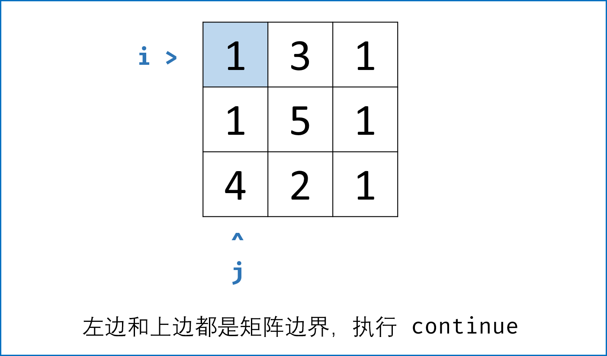
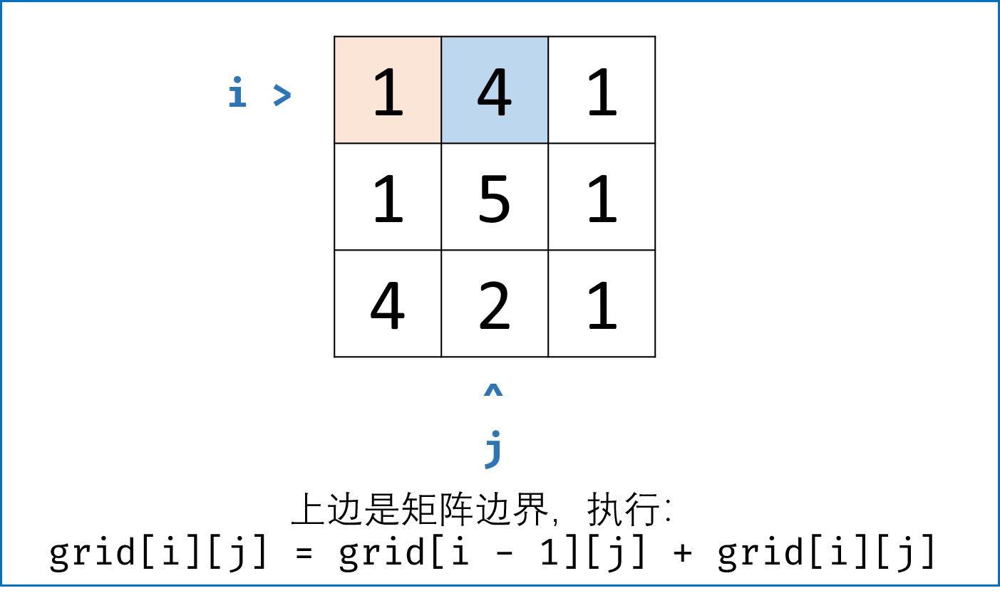
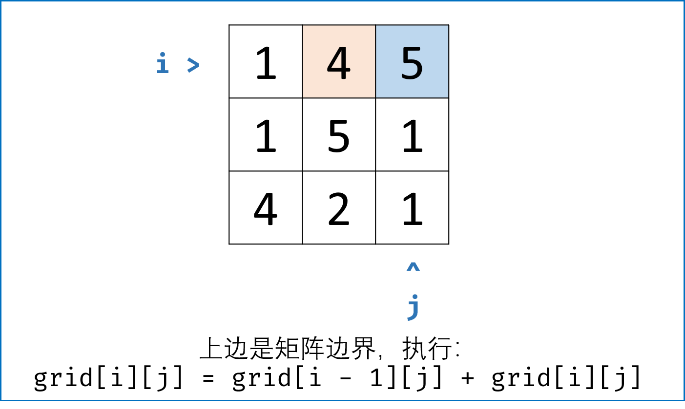
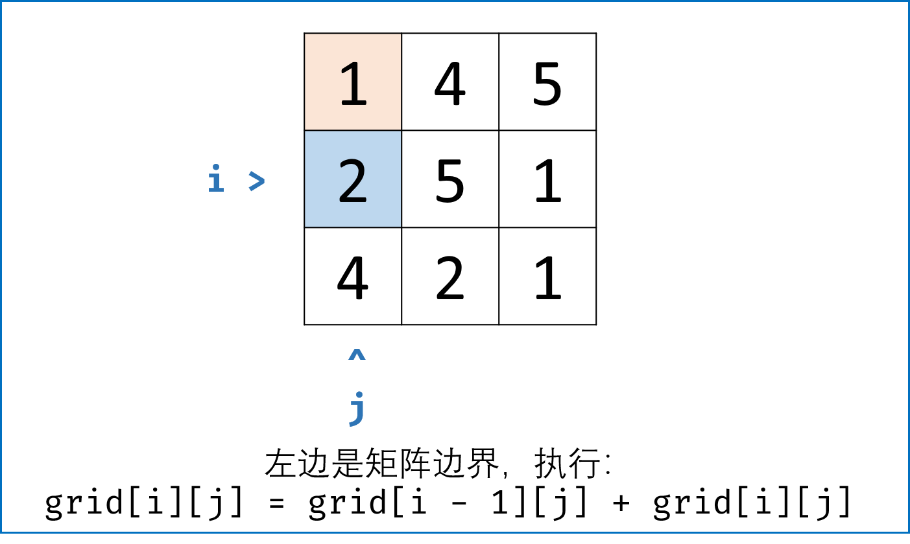
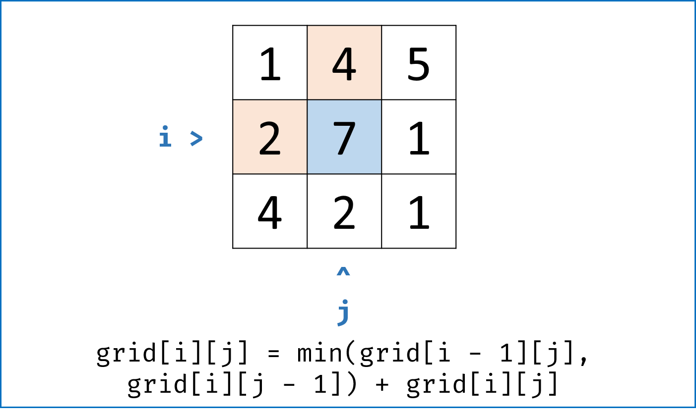
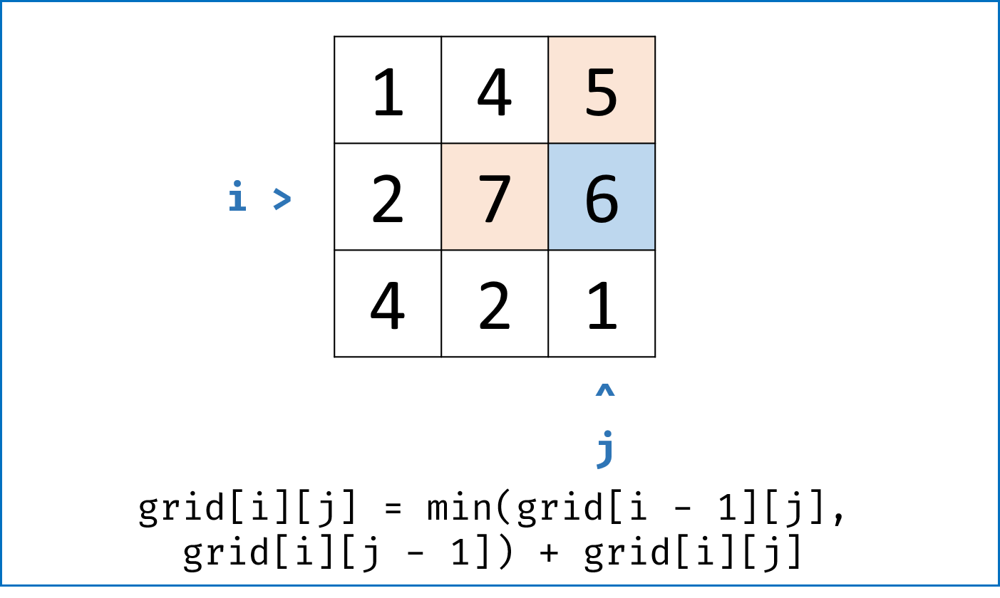
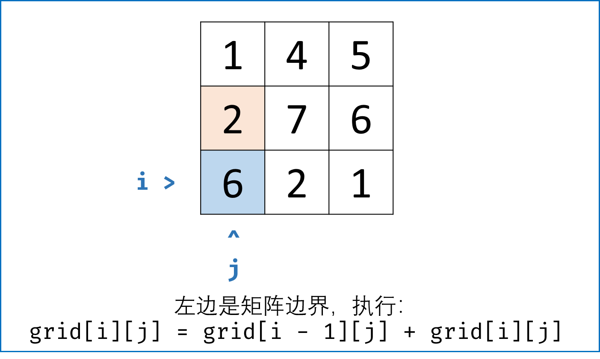
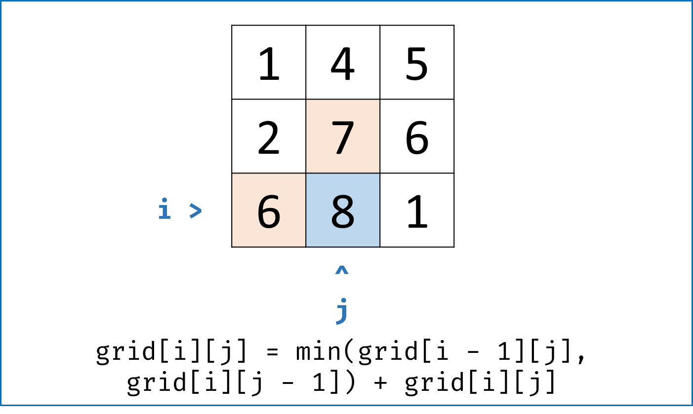
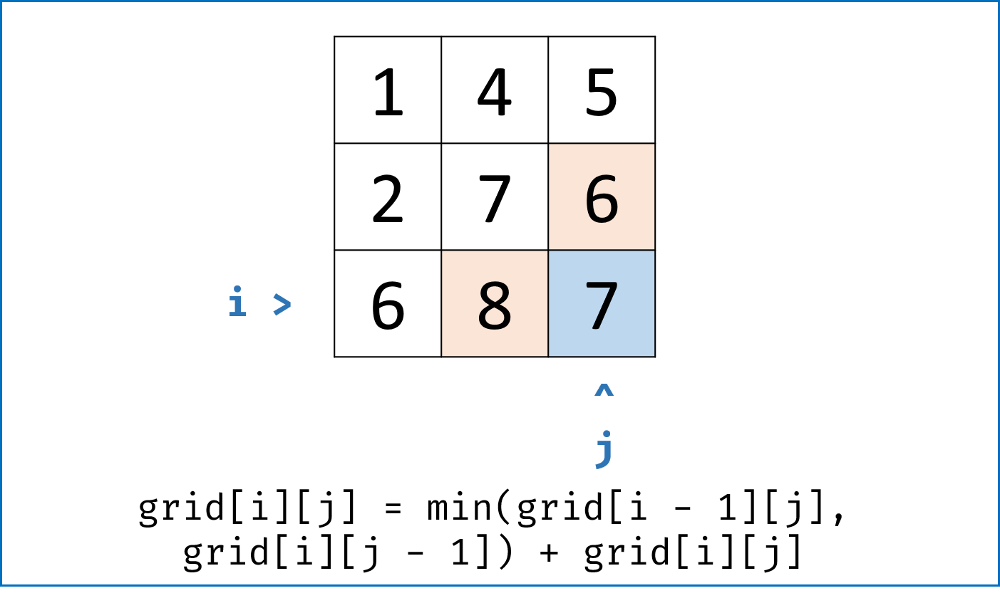
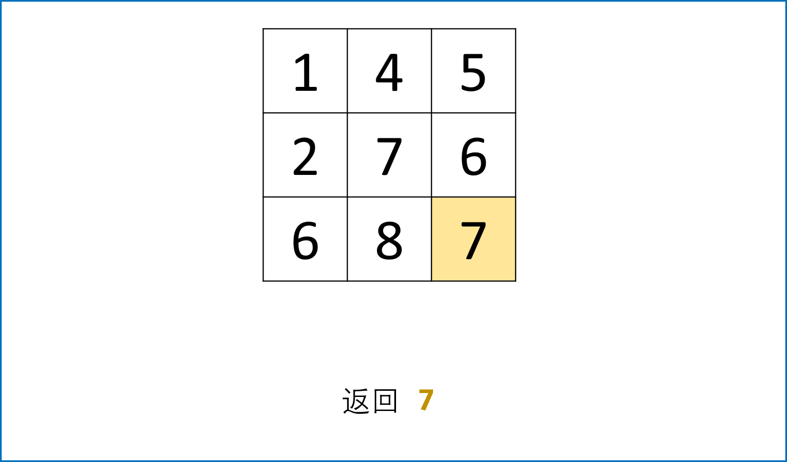

> 原文链接: https://leetcode-cn.com/problems/minimum-path-sum


## 英文原文
<div><p>Given a <code>m x n</code> <code>grid</code> filled with non-negative numbers, find a path from top left to bottom right, which minimizes the sum of all numbers along its path.</p>

<p><strong>Note:</strong> You can only move either down or right at any point in time.</p>

<p>&nbsp;</p>
<p><strong>Example 1:</strong></p>

<pre>
<strong>Input:</strong> grid = [[1,3,1],[1,5,1],[4,2,1]]
<strong>Output:</strong> 7
<strong>Explanation:</strong> Because the path 1 &rarr; 3 &rarr; 1 &rarr; 1 &rarr; 1 minimizes the sum.
</pre>

<p><strong>Example 2:</strong></p>

<pre>
<strong>Input:</strong> grid = [[1,2,3],[4,5,6]]
<strong>Output:</strong> 12
</pre>

<p>&nbsp;</p>
<p><strong>Constraints:</strong></p>

<ul>
	<li><code>m == grid.length</code></li>
	<li><code>n == grid[i].length</code></li>
	<li><code>1 &lt;= m, n &lt;= 200</code></li>
	<li><code>0 &lt;= grid[i][j] &lt;= 100</code></li>
</ul>
</div>

## 中文题目
<div><p>给定一个包含非负整数的 <code><em>m</em> x <em>n</em></code> 网格 <code>grid</code> ，请找出一条从左上角到右下角的路径，使得路径上的数字总和为最小。</p>

<p><strong>说明：</strong>每次只能向下或者向右移动一步。</p>

<p> </p>

<p><strong>示例 1：</strong></p>

<pre>
<strong>输入：</strong>grid = [[1,3,1],[1,5,1],[4,2,1]]
<strong>输出：</strong>7
<strong>解释：</strong>因为路径 1→3→1→1→1 的总和最小。
</pre>

<p><strong>示例 2：</strong></p>

<pre>
<strong>输入：</strong>grid = [[1,2,3],[4,5,6]]
<strong>输出：</strong>12
</pre>

<p> </p>

<p><strong>提示：</strong></p>

<ul>
	<li><code>m == grid.length</code></li>
	<li><code>n == grid[i].length</code></li>
	<li><code>1 <= m, n <= 200</code></li>
	<li><code>0 <= grid[i][j] <= 100</code></li>
</ul>
</div>

## 通过代码
<RecoDemo>
</RecoDemo>


## 高赞题解
#### 解题思路：


此题是典型的动态规划题目。


- **状态定义：**

    - 设 $dp$ 为大小 $m \times n$ 矩阵，其中 $dp[i][j]$ 的值代表直到走到 $(i,j)$ 的最小路径和。


- **转移方程：** 

    > 题目要求，只能向右或向下走，换句话说，当前单元格 $(i,j)$ 只能从左方单元格 $(i-1,j)$ 或上方单元格 $(i,j-1)$ 走到，因此只需要考虑矩阵左边界和上边界。

    - 走到当前单元格 $(i,j)$ 的最小路径和 $=$ “从左方单元格 $(i-1,j)$ 与 从上方单元格 $(i,j-1)$ 走来的 **两个最小路径和中较小的** ” $+$ 当前单元格值 $grid[i][j]$ 。具体分为以下 $4$ 种情况：

    1. **当左边和上边都不是矩阵边界时：** 即当$i \not= 0$, $j \not= 0$时，$dp[i][j] = min(dp[i - 1][j], dp[i][j - 1]) + grid[i][j]$ ；

    2. **当只有左边是矩阵边界时：** 只能从上面来，即当$i = 0, j \not= 0$时， $dp[i][j] = dp[i][j - 1] + grid[i][j]$ ；

    3. **当只有上边是矩阵边界时：** 只能从左面来，即当$i \not= 0, j = 0$时， $dp[i][j] = dp[i - 1][j] + grid[i][j]$ ；

    4. **当左边和上边都是矩阵边界时：** 即当$i = 0, j = 0$时，其实就是起点， $dp[i][j] = grid[i][j]$；


- **初始状态：**

    - $dp$ 初始化即可，不需要修改初始 $0$ 值。 


- **返回值：**

    - 返回 $dp$ 矩阵右下角值，即走到终点的最小路径和。


其实我们完全不需要建立 $dp$ 矩阵浪费额外空间，直接遍历 $grid[i][j]$ 修改即可。这是因为：`grid[i][j] = min(grid[i - 1][j], grid[i][j - 1]) + grid[i][j]` ；原 $grid$ 矩阵元素中被覆盖为 $dp$ 元素后（都处于当前遍历点的左上方），不会再被使用到。


#### 复杂度分析：


- **时间复杂度 $O(M \times N)$ ：** 遍历整个 $grid$ 矩阵元素。

- **空间复杂度 $O(1)$ ：** 直接修改原矩阵，不使用额外空间。


<,,,,,,,,,>


#### 代码：


```python []

class Solution:

    def minPathSum(self, grid: [[int]]) -> int:

        for i in range(len(grid)):

            for j in range(len(grid[0])):

                if i == j == 0: continue

                elif i == 0:  grid[i][j] = grid[i][j - 1] + grid[i][j]

                elif j == 0:  grid[i][j] = grid[i - 1][j] + grid[i][j]

                else: grid[i][j] = min(grid[i - 1][j], grid[i][j - 1]) + grid[i][j]

        return grid[-1][-1]

```


```java []

class Solution {

    public int minPathSum(int[][] grid) {

        for(int i = 0; i < grid.length; i++) {

            for(int j = 0; j < grid[0].length; j++) {

                if(i == 0 && j == 0) continue;

                else if(i == 0)  grid[i][j] = grid[i][j - 1] + grid[i][j];

                else if(j == 0)  grid[i][j] = grid[i - 1][j] + grid[i][j];

                else grid[i][j] = Math.min(grid[i - 1][j], grid[i][j - 1]) + grid[i][j];

            }

        }

        return grid[grid.length - 1][grid[0].length - 1];

    }

}

```

## 统计信息
| 通过次数 | 提交次数 | AC比率 |
| :------: | :------: | :------: |
|    289004    |    419275    |   68.9%   |

## 提交历史
| 提交时间 | 提交结果 | 执行时间 |  内存消耗  | 语言 |
| :------: | :------: | :------: | :--------: | :--------: |


## 相似题目
|                             题目                             | 难度 |
| :----------------------------------------------------------: | :---------: |
| [不同路径](https://leetcode-cn.com/problems/unique-paths/) | 中等|
| [地下城游戏](https://leetcode-cn.com/problems/dungeon-game/) | 困难|
| [摘樱桃](https://leetcode-cn.com/problems/cherry-pickup/) | 困难|
