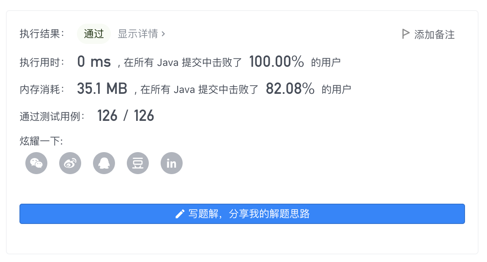
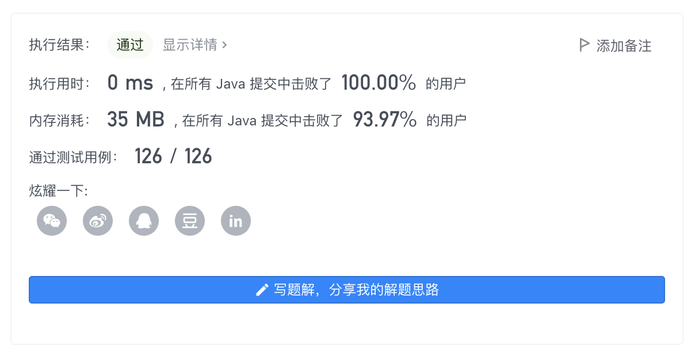

> 原文链接: https://leetcode-cn.com/problems/2-keys-keyboard


## 英文原文
<div><p>There is only one character <code>&#39;A&#39;</code> on the screen of a notepad. You can perform two operations on this notepad for each step:</p>

<ul>
	<li>Copy All: You can copy all the characters present on the screen (a partial copy is not allowed).</li>
	<li>Paste: You can paste the characters which are copied last time.</li>
</ul>

<p>Given an integer <code>n</code>, return <em>the minimum number of operations to get the character</em> <code>&#39;A&#39;</code> <em>exactly</em> <code>n</code> <em>times on the screen</em>.</p>

<p>&nbsp;</p>
<p><strong>Example 1:</strong></p>

<pre>
<strong>Input:</strong> n = 3
<strong>Output:</strong> 3
<strong>Explanation:</strong> Intitally, we have one character &#39;A&#39;.
In step 1, we use Copy All operation.
In step 2, we use Paste operation to get &#39;AA&#39;.
In step 3, we use Paste operation to get &#39;AAA&#39;.
</pre>

<p><strong>Example 2:</strong></p>

<pre>
<strong>Input:</strong> n = 1
<strong>Output:</strong> 0
</pre>

<p>&nbsp;</p>
<p><strong>Constraints:</strong></p>

<ul>
	<li><code>1 &lt;= n &lt;= 1000</code></li>
</ul>
</div>

## 中文题目
<div><p>最初记事本上只有一个字符 <code>'A'</code> 。你每次可以对这个记事本进行两种操作：</p>

<ul>
	<li><code>Copy All</code>（复制全部）：复制这个记事本中的所有字符（不允许仅复制部分字符）。</li>
	<li><code>Paste</code>（粘贴）：粘贴<strong> 上一次 </strong>复制的字符。</li>
</ul>

<p>给你一个数字&nbsp;<code>n</code> ，你需要使用最少的操作次数，在记事本上输出 <strong>恰好</strong>&nbsp;<code>n</code>&nbsp;个 <code>'A'</code> 。返回能够打印出&nbsp;<code>n</code>&nbsp;个 <code>'A'</code> 的最少操作次数。</p>

<p>&nbsp;</p>

<p><strong>示例 1：</strong></p>

<pre>
<strong>输入：</strong>3
<strong>输出：</strong>3
<strong>解释：</strong>
最初, 只有一个字符 'A'。
第 1 步, 使用 <strong>Copy All</strong> 操作。
第 2 步, 使用 <strong>Paste </strong>操作来获得 'AA'。
第 3 步, 使用 <strong>Paste</strong> 操作来获得 'AAA'。
</pre>

<p><strong>示例 2：</strong></p>

<pre>
<strong>输入：</strong>n = 1
<strong>输出：</strong>0
</pre>

<p>&nbsp;</p>

<p><strong>提示：</strong></p>

<ul>
	<li><code>1 &lt;= n &lt;= 1000</code></li>
</ul>
</div>

## 通过代码
<RecoDemo>
</RecoDemo>


## 高赞题解

## 动态规划

**定义 $f[i][j]$ 为经过最后一次操作后，当前记事本上有 $i$ 个字符，粘贴板上有 $j$ 个字符的最小操作次数。**

由于我们粘贴板的字符必然是经过 `Copy All` 操作而来，因此对于一个合法的 $f[i][j]$ 而言，必然有 $j <= i$。

不失一般性地考虑 $f[i][j]$ 该如何转移：

* 最后一次操作是 `Paste` 操作：此时粘贴板的字符数量不会发生变化，即有 $f[i][j] = f[i - j][j] + 1$；

* 最后一次操作是 `Copy All` 操作：那么此时的粘贴板的字符数与记事本上的字符数相等（满足 $i = j$），此时的 $f[i][j] = \min(f[i][x] + 1), 0 \leq x < i$。

我们发现最后一个合法的 $f[i][j]$（满足 $i = j$）依赖与前面 $f[i][j]$（满足 $j < i$）。

因此实现上，我们可以使用一个变量 $min$ 保存前面转移的最小值，用来更新最后的 $f[i][j]$。

再进一步，我们发现如果 $f[i][j]$ 的最后一次操作是由 `Paste` 而来，原来粘贴板的字符数不会超过 $i / 2$，因此在转移 $f[i][j]$（满足 $j < i$）时，其实只需要枚举 $[0, i/2]$ 即可。


代码：
```Java []
class Solution {
    int INF = 0x3f3f3f3f;
    public int minSteps(int n) {
        int[][] f = new int[n + 1][n + 1];
        for (int i = 0; i <= n; i++) {
            for (int j = 0; j <= n; j++) {
                f[i][j] = INF;
            }
        }
        f[1][0] = 0; f[1][1] = 1;
        for (int i = 2; i <= n; i++) {
            int min = INF;
            for (int j = 0; j <= i / 2; j++) {
                f[i][j] = f[i - j][j] + 1;
                min = Math.min(min, f[i][j]);
            }
            f[i][i] = min + 1;
        }
        int ans = INF;
        for (int i = 0; i <= n; i++) ans = Math.min(ans, f[n][i]);
        return ans;
    }
}
```
* 时间复杂度：$O(n^2)$
* 空间复杂度：$O(n^2)$

---

## 数学

如果我们将「$1$ 次 `Copy All` + $x$ 次 `Paste`」看做一次“动作”的话。

那么 **一次“动作”所产生的效果就是将原来的字符串变为原来的 $x + 1$ 倍**。

最终的最小操作次数方案可以等价以下操作流程：

1. 起始对长度为 $1$ 的记事本字符进行 $1$ 次 `Copy All` + $k_1 - 1$ 次 `Paste` 操作（消耗次数为 $k_1$，得到长度为 $k_1$ 的记事本长度）；
2. 对长度为为 $k_1$ 的记事本字符进行 $1$ 次 `Copy All` + $k_2 - 1$ 次 `Paste` 操作（消耗次数为 $k_1 + k_2$，得到长度为 $k_1 * k_2$ 的记事本长度）
...

最终经过 $k$ 次“动作”之后，得到长度为 $n$ 的记事本长度，即有：

$$
n = k_1 * k_2 * ... * k_x
$$

问题转化为：如何对 $n$ 进行拆分，可以使得 $k_1 + k_2 + ... + k_x$ 最小。

对于任意一个 $k_i$（合数）而言，根据定理 $a * b >= a + b$ 可知进一步的拆分必然不会导致结果变差。

因此，我们只需要使用「试除法」对 $n$ 执行分解质因数操作，累加所有的操作次数，即可得到答案。



代码：
```Java []
class Solution {
    public int minSteps(int n) {
        int ans = 0;
        for (int i = 2; i * i <= n; i++) {
            while (n % i == 0) {
                ans += i;
                n /= i;
            }
        }
        if (n != 1) ans += n;
        return ans;
    }
}
```
* 时间复杂度：$O(\sqrt{n})$
* 空间复杂度：$O(1)$

---

## 打表

我们发现，对于某个 $minSteps(i)$ 而言为定值，且数据范围只有 $1000$，因此考虑使用打表来做。



代码：
```Java []
class Solution {
    static int N = 1010;
    static int[] g = new int[N];
    static {
        for (int k = 2; k < N; k++) {
            int cnt = 0, n = k;
            for (int i = 2; i * i <= n; i++) {
                while (n % i == 0) {
                    cnt += i;
                    n /= i;
                }
            }
            if (n != 1) cnt += n;
            g[k] = cnt;
        }
        // System.out.println(Arrays.toString(g)); // 输出打表结果
    }
    public int minSteps(int n) {
        return g[n];
    }
}
```
```Java []
class Solution {
    static int[] g = new int[]{0, 0, 2, 3, 4, 5, 5, 7, 6, 6, 7, 11, 7, 13, 9, 8, 8, 17, 8, 19, 9, 10, 13, 23, 9, 10, 15, 9, 11, 29, 10, 31, 10, 14, 19, 12, 10, 37, 21, 16, 11, 41, 12, 43, 15, 11, 25, 47, 11, 14, 12, 20, 17, 53, 11, 16, 13, 22, 31, 59, 12, 61, 33, 13, 12, 18, 16, 67, 21, 26, 14, 71, 12, 73, 39, 13, 23, 18, 18, 79, 13, 12, 43, 83, 14, 22, 45, 32, 17, 89, 13, 20, 27, 34, 49, 24, 13, 97, 16, 17, 14, 101, 22, 103, 19, 15, 55, 107, 13, 109, 18, 40, 15, 113, 24, 28, 33, 19, 61, 24, 14, 22, 63, 44, 35, 15, 15, 127, 14, 46, 20, 131, 18, 26, 69, 14, 23, 137, 28, 139, 16, 50, 73, 24, 14, 34, 75, 17, 41, 149, 15, 151, 25, 23, 20, 36, 20, 157, 81, 56, 15, 30, 14, 163, 45, 19, 85, 167, 16, 26, 24, 25, 47, 173, 34, 17, 19, 62, 91, 179, 15, 181, 22, 64, 29, 42, 36, 28, 51, 16, 26, 191, 15, 193, 99, 21, 18, 197, 19, 199, 16, 70, 103, 36, 24, 46, 105, 29, 21, 30, 17, 211, 57, 74, 109, 48, 15, 38, 111, 76, 20, 30, 42, 223, 17, 16, 115, 227, 26, 229, 30, 21, 35, 233, 21, 52, 63, 82, 26, 239, 16, 241, 24, 15, 65, 19, 46, 32, 37, 86, 17, 251, 17, 34, 129, 25, 16, 257, 48, 44, 22, 35, 133, 263, 20, 58, 28, 92, 71, 269, 16, 271, 25, 23, 139, 21, 30, 277, 141, 37, 18, 281, 52, 283, 75, 27, 26, 48, 16, 34, 36, 100, 77, 293, 19, 64, 43, 20, 151, 36, 17, 50, 153, 104, 27, 66, 25, 307, 22, 106, 38, 311, 22, 313, 159, 18, 83, 317, 58, 40, 17, 110, 32, 36, 16, 23, 165, 112, 47, 54, 21, 331, 87, 43, 169, 72, 18, 337, 28, 116, 26, 42, 27, 21, 49, 31, 175, 347, 36, 349, 19, 22, 21, 353, 64, 76, 93, 27, 181, 359, 17, 38, 183, 25, 24, 78, 66, 367, 31, 47, 44, 60, 38, 373, 30, 18, 53, 42, 18, 379, 28, 130, 193, 383, 17, 23, 195, 49, 101, 389, 23, 40, 20, 134, 199, 84, 21, 397, 201, 29, 18, 401, 72, 44, 105, 17, 38, 48, 26, 409, 48, 140, 107, 66, 31, 88, 23, 142, 32, 419, 19, 421, 213, 53, 59, 27, 76, 68, 111, 27, 50, 431, 17, 433, 40, 37, 113, 42, 78, 439, 22, 20, 32, 443, 44, 94, 225, 152, 19, 449, 18, 52, 117, 154, 229, 25, 28, 457, 231, 26, 32, 461, 23, 463, 37, 39, 235, 467, 23, 74, 54, 160, 65, 54, 84, 29, 28, 59, 241, 479, 18, 50, 243, 33, 26, 102, 17, 487, 67, 166, 21, 491, 48, 46, 34, 22, 39, 78, 88, 499, 19, 170, 253, 503, 19, 106, 36, 29, 131, 509, 27, 80, 18, 28, 259, 108, 50, 58, 46, 176, 24, 521, 37, 523, 135, 20, 265, 48, 22, 46, 60, 65, 30, 54, 94, 112, 73, 182, 271, 25, 18, 541, 273, 184, 27, 114, 25, 547, 141, 67, 23, 48, 32, 86, 279, 45, 143, 557, 39, 56, 20, 31, 283, 563, 54, 118, 285, 19, 77, 569, 29, 571, 28, 194, 50, 33, 18, 577, 36, 196, 38, 90, 102, 64, 79, 24, 295, 587, 21, 50, 66, 200, 45, 593, 22, 29, 153, 202, 38, 599, 19, 601, 52, 73, 155, 27, 106, 607, 29, 39, 68, 60, 27, 613, 309, 49, 24, 617, 108, 619, 40, 32, 313, 96, 24, 20, 315, 33, 161, 54, 20, 631, 85, 214, 319, 132, 60, 27, 42, 77, 19, 641, 112, 643, 34, 51, 38, 647, 18, 70, 25, 41, 167, 653, 114, 136, 49, 79, 56, 659, 23, 661, 333, 33, 89, 31, 45, 52, 171, 226, 74, 72, 20, 673, 339, 19, 30, 677, 118, 104, 28, 230, 44, 683, 29, 142, 23, 232, 51, 66, 33, 691, 177, 24, 349, 144, 38, 58, 351, 236, 21, 701, 24, 56, 23, 55, 355, 108, 66, 709, 78, 85, 95, 54, 29, 29, 183, 242, 361, 719, 19, 110, 40, 244, 185, 39, 27, 727, 26, 18, 80, 60, 68, 733, 369, 22, 33, 78, 49, 739, 46, 35, 62, 743, 40, 154, 375, 89, 32, 114, 20, 751, 55, 254, 44, 156, 20, 757, 381, 37, 30, 761, 132, 116, 195, 28, 385, 72, 19, 769, 25, 260, 197, 773, 51, 41, 103, 47, 391, 60, 25, 82, 42, 38, 22, 162, 136, 787, 201, 266, 86, 120, 23, 74, 399, 61, 203, 797, 31, 64, 20, 95, 403, 84, 74, 35, 46, 272, 107, 809, 19, 811, 40, 274, 50, 168, 28, 62, 411, 26, 50, 821, 142, 823, 109, 24, 68, 827, 33, 829, 90, 280, 25, 31, 144, 172, 34, 40, 421, 839, 21, 58, 423, 284, 215, 31, 55, 29, 61, 286, 29, 60, 78, 853, 70, 30, 113, 857, 29, 859, 52, 51, 433, 863, 19, 178, 435, 37, 42, 90, 39, 80, 115, 103, 44, 22, 80, 877, 441, 296, 24, 881, 22, 883, 34, 67, 445, 887, 46, 134, 96, 23, 227, 66, 154, 184, 21, 39, 451, 60, 20, 70, 54, 53, 119, 186, 156, 907, 231, 107, 27, 911, 30, 94, 459, 69, 233, 138, 28, 919, 34, 310, 463, 84, 25, 47, 465, 109, 39, 929, 41, 33, 237, 314, 469, 33, 25, 937, 76, 316, 56, 941, 162, 64, 67, 21, 56, 947, 86, 86, 31, 320, 30, 953, 61, 196, 243, 43, 481, 144, 20, 62, 52, 113, 245, 198, 35, 967, 28, 39, 104, 971, 19, 146, 489, 26, 69, 977, 168, 100, 23, 115, 493, 983, 50, 202, 48, 57, 36, 66, 24, 991, 41, 334, 80, 204, 90, 997, 501, 46, 21, 31, 172, 76, 255, 75, 505, 72, 21, 1009};
    public int minSteps(int n) {
        return g[n];
    }
}
```
* 时间复杂度：将打表逻辑配合 `static` 交给 OJ 执行，复杂度为 $O(C * \sqrt{C})$，$C$ 为常数，固定为 $1010$；将打表逻辑放到本地执行，复杂度为 $O(1)$
* 空间复杂度：$O(C)$


---

## 最后

**如果有帮助到你，请给题解点个赞和收藏，让更多的人看到 ~ ("▔□▔)/**

也欢迎你 [关注我](https://oscimg.oschina.net/oscnet/up-19688dc1af05cf8bdea43b2a863038ab9e5.png)（公主号后台回复「送书」即可参与长期看题解学算法送实体书活动）或 加入[「组队打卡」](https://leetcode-cn.com/u/ac_oier/)小群 ，提供写「证明」&「思路」的高质量题解。

所有题解已经加入 [刷题指南](https://github.com/SharingSource/LogicStack-LeetCode/wiki)，欢迎 star 哦 ~ 

## 统计信息
| 通过次数 | 提交次数 | AC比率 |
| :------: | :------: | :------: |
|    50672    |    89285    |   56.8%   |

## 提交历史
| 提交时间 | 提交结果 | 执行时间 |  内存消耗  | 语言 |
| :------: | :------: | :------: | :--------: | :--------: |


## 相似题目
|                             题目                             | 难度 |
| :----------------------------------------------------------: | :---------: |
| [4键键盘](https://leetcode-cn.com/problems/4-keys-keyboard/) | 中等|
| [坏了的计算器](https://leetcode-cn.com/problems/broken-calculator/) | 中等|
