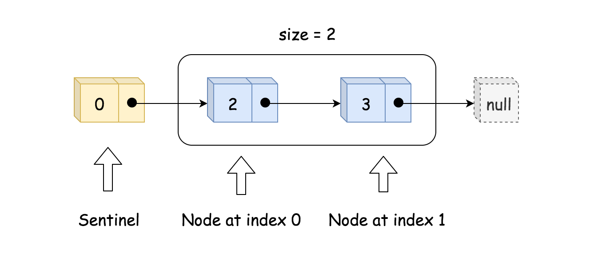
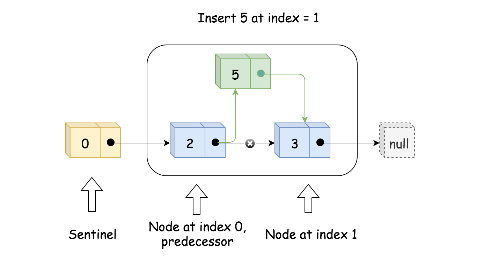
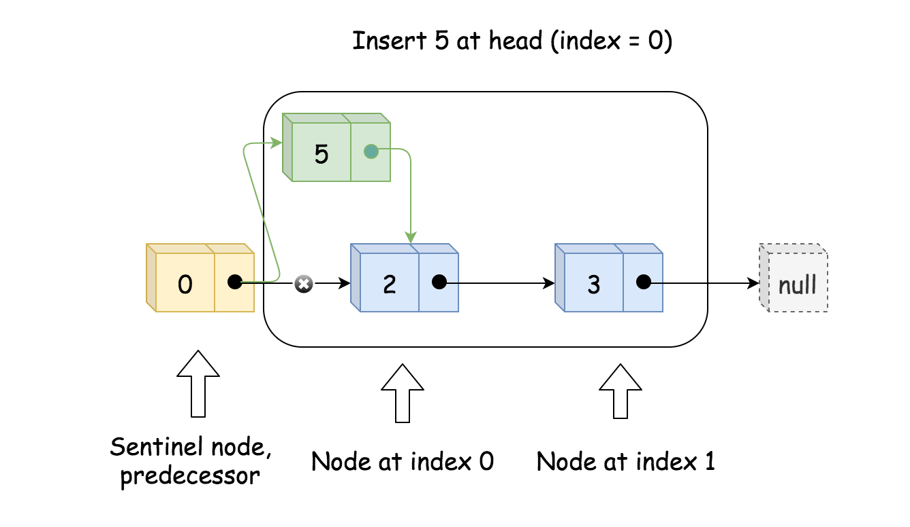
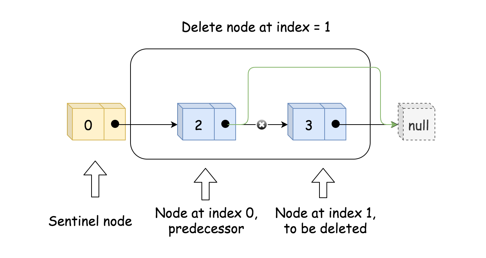
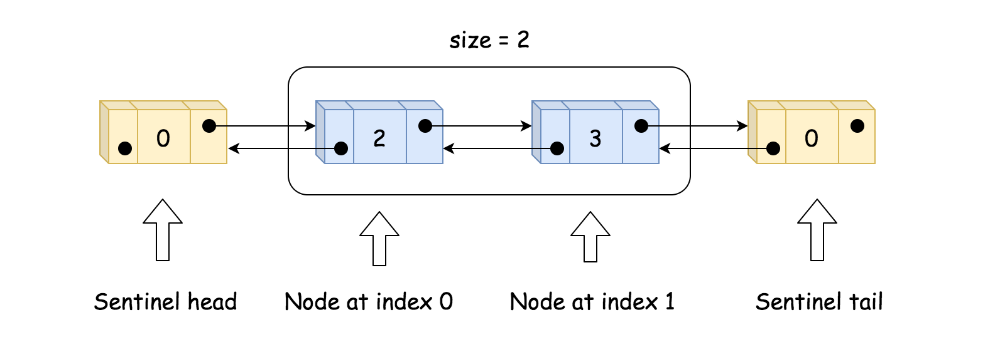
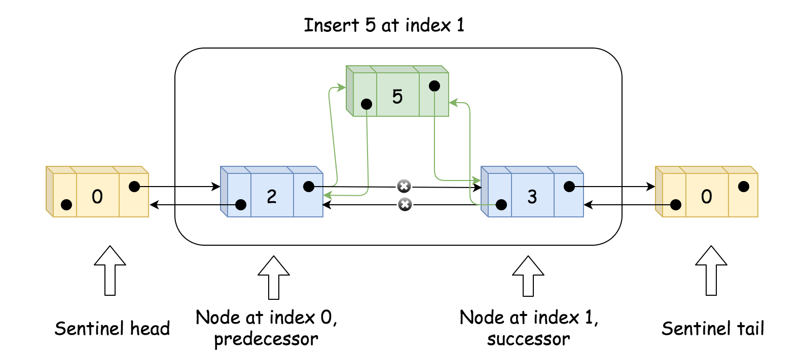

> 原文链接: https://leetcode-cn.com/problems/design-linked-list


## 英文原文
<div><p>Design your implementation of the linked list. You can choose to use a singly or doubly linked list.<br />
A node in a singly linked list should have two attributes: <code>val</code> and <code>next</code>. <code>val</code> is the value of the current node, and <code>next</code> is a pointer/reference to the next node.<br />
If you want to use the doubly linked list, you will need one more attribute <code>prev</code> to indicate the previous node in the linked list. Assume all nodes in the linked list are <strong>0-indexed</strong>.</p>

<p>Implement the <code>MyLinkedList</code> class:</p>

<ul>
	<li><code>MyLinkedList()</code> Initializes the <code>MyLinkedList</code> object.</li>
	<li><code>int get(int index)</code> Get the value of the <code>index<sup>th</sup></code> node in the linked list. If the index is invalid, return <code>-1</code>.</li>
	<li><code>void addAtHead(int val)</code> Add a node of value <code>val</code> before the first element of the linked list. After the insertion, the new node will be the first node of the linked list.</li>
	<li><code>void addAtTail(int val)</code> Append a node of value <code>val</code> as the last element of the linked list.</li>
	<li><code>void addAtIndex(int index, int val)</code> Add a node of value <code>val</code> before the <code>index<sup>th</sup></code> node in the linked list. If <code>index</code> equals the length of the linked list, the node will be appended to the end of the linked list. If <code>index</code> is greater than the length, the node <strong>will not be inserted</strong>.</li>
	<li><code>void deleteAtIndex(int index)</code> Delete the <code>index<sup>th</sup></code> node in the linked list, if the index is valid.</li>
</ul>

<p>&nbsp;</p>
<p><strong>Example 1:</strong></p>

<pre>
<strong>Input</strong>
[&quot;MyLinkedList&quot;, &quot;addAtHead&quot;, &quot;addAtTail&quot;, &quot;addAtIndex&quot;, &quot;get&quot;, &quot;deleteAtIndex&quot;, &quot;get&quot;]
[[], [1], [3], [1, 2], [1], [1], [1]]
<strong>Output</strong>
[null, null, null, null, 2, null, 3]

<strong>Explanation</strong>
MyLinkedList myLinkedList = new MyLinkedList();
myLinkedList.addAtHead(1);
myLinkedList.addAtTail(3);
myLinkedList.addAtIndex(1, 2);    // linked list becomes 1-&gt;2-&gt;3
myLinkedList.get(1);              // return 2
myLinkedList.deleteAtIndex(1);    // now the linked list is 1-&gt;3
myLinkedList.get(1);              // return 3
</pre>

<p>&nbsp;</p>
<p><strong>Constraints:</strong></p>

<ul>
	<li><code>0 &lt;= index, val &lt;= 1000</code></li>
	<li>Please do not use the built-in LinkedList library.</li>
	<li>At most <code>2000</code> calls will be made to <code>get</code>, <code>addAtHead</code>, <code>addAtTail</code>, <code>addAtIndex</code> and <code>deleteAtIndex</code>.</li>
</ul>
</div>

## 中文题目
<div><p>设计链表的实现。您可以选择使用单链表或双链表。单链表中的节点应该具有两个属性：<code>val</code>&nbsp;和&nbsp;<code>next</code>。<code>val</code>&nbsp;是当前节点的值，<code>next</code>&nbsp;是指向下一个节点的指针/引用。如果要使用双向链表，则还需要一个属性&nbsp;<code>prev</code>&nbsp;以指示链表中的上一个节点。假设链表中的所有节点都是 0-index 的。</p>

<p>在链表类中实现这些功能：</p>

<ul>
	<li>get(index)：获取链表中第&nbsp;<code>index</code>&nbsp;个节点的值。如果索引无效，则返回<code>-1</code>。</li>
	<li>addAtHead(val)：在链表的第一个元素之前添加一个值为&nbsp;<code>val</code>&nbsp;的节点。插入后，新节点将成为链表的第一个节点。</li>
	<li>addAtTail(val)：将值为&nbsp;<code>val</code> 的节点追加到链表的最后一个元素。</li>
	<li>addAtIndex(index,val)：在链表中的第&nbsp;<code>index</code>&nbsp;个节点之前添加值为&nbsp;<code>val</code>&nbsp; 的节点。如果&nbsp;<code>index</code>&nbsp;等于链表的长度，则该节点将附加到链表的末尾。如果 <code>index</code> 大于链表长度，则不会插入节点。如果<code>index</code>小于0，则在头部插入节点。</li>
	<li>deleteAtIndex(index)：如果索引&nbsp;<code>index</code> 有效，则删除链表中的第&nbsp;<code>index</code> 个节点。</li>
</ul>

<p>&nbsp;</p>

<p><strong>示例：</strong></p>

<pre>MyLinkedList linkedList = new MyLinkedList();
linkedList.addAtHead(1);
linkedList.addAtTail(3);
linkedList.addAtIndex(1,2);   //链表变为1-&gt; 2-&gt; 3
linkedList.get(1);            //返回2
linkedList.deleteAtIndex(1);  //现在链表是1-&gt; 3
linkedList.get(1);            //返回3
</pre>

<p>&nbsp;</p>

<p><strong>提示：</strong></p>

<ul>
	<li>所有<code>val</code>值都在&nbsp;<code>[1, 1000]</code>&nbsp;之内。</li>
	<li>操作次数将在&nbsp;&nbsp;<code>[1, 1000]</code>&nbsp;之内。</li>
	<li>请不要使用内置的 LinkedList 库。</li>
</ul>
</div>

## 通过代码
<RecoDemo>
</RecoDemo>


## 官方题解
####  面试要点
链表时一个包含零个或多个元素的数据结构。每个元素都包含一个值和到另一个元素的链接。根据链接数的不同，可以分为单链表，双链表和多重链表。

单链表是最简单的一种，它提供了在常数时间内的 `addAtHead` 操作和在线性时间内的 `addAtTail` 的操作。双链表是最常用的一种，因为它提供了在常数时间内的 `addAtHead` 和 `addAtTail` 操作，并且优化的插入和删除。

双链表在 Java 中的实现为 LinkedList，在 Python 中为 list。这些结构都比较常用，有两个要点：
- 哨兵节点：

哨兵节点在树和链表中被广泛用作伪头、伪尾等，通常不保存任何数据。

我们将使用伪头来简化我们简化插入和删除。在接下来的两种方法中应用此方法。

- 双链表的双向搜索：我们可以从头部或尾部进行搜索。


####  方法一：单链表
让我们从最简单的链表开始。

{:width=500}

```python [init1-Python]
class MyLinkedList:
    def __init__(self):
        self.size = 0
        self.head = ListNode(0)  # sentinel node as pseudo-head
```

```java [init1-Java]
class MyLinkedList {
  int size;
  ListNode head;  // sentinel node as pseudo-head
  public MyLinkedList() {
    size = 0;
    head = new ListNode(0);
  }
}
```

哨兵节点被用作伪头始终存在，这样结构中永远不为空，它将至少包含一个伪头。MyLinkedList 中所有节点均包含：值 + 链接到下一个元素的指针。

```python [ListNode1-Python]
class ListNode:
    def __init__(self, x):
        self.val = x
        self.next = None
```

```java [ListNode1-Java]
public class ListNode {
  int val;
  ListNode next;
  ListNode(int x) { val = x; }
}
```

`addAtIndex`，`addAtHead` 和 `addAtTail`：
我们首先讨论 `addAtIndex`，因为伪头的关系 `addAtHead` 和 `addAtTail` 可以使用 `addAtIndex` 来完成。

这个想法很简单：
- 找到要插入位置节点的前驱节点。如果要在头部插入，则它的前驱节点就是伪头。如果要在尾部插入节点，则前驱节点就是尾节点。
- 通过改变 `next` 来插入节点。

```python [add1-Python]
to_add.next = pred.next
pred.next = to_add
```

```java [add1-Java]
toAdd.next = pred.next;
pred.next = toAdd;
```

{:width=500}

{:width=500}

`deleteAtIndex`：
和插入同样的道理。
- 找到要删除节点的前驱节点。
- 通过改变 `next` 来删除节点。

```python [delete2-Python]
# delete pred.next 
pred.next = pred.next.next
```

```java [delete2-Java]
// delete pred.next 
pred.next = pred.next.next;
```

{:width=500}

`get`：
从伪头节点开始，向前走 `index+1` 步。

```python [get1-Python]
# index steps needed 
# to move from sentinel node to wanted index
for _ in range(index + 1):
    curr = curr.next
return curr.val
```

```java [get1-Java]
// index steps needed 
// to move from sentinel node to wanted index
for(int i = 0; i < index + 1; ++i) curr = curr.next;
return curr.val;
```

{:width=500}

**全部代码：**

```python [solution1-Python]
class ListNode:
    def __init__(self, x):
        self.val = x
        self.next = None

class MyLinkedList:
    def __init__(self):
        self.size = 0
        self.head = ListNode(0)  # sentinel node as pseudo-head
        

    def get(self, index: int) -> int:
        """
        Get the value of the index-th node in the linked list. If the index is invalid, return -1.
        """
        # if index is invalid
        if index < 0 or index >= self.size:
            return -1
        
        curr = self.head
        # index steps needed 
        # to move from sentinel node to wanted index
        for _ in range(index + 1):
            curr = curr.next
        return curr.val
            

    def addAtHead(self, val: int) -> None:
        """
        Add a node of value val before the first element of the linked list. After the insertion, the new node will be the first node of the linked list.
        """
        self.addAtIndex(0, val)
        

    def addAtTail(self, val: int) -> None:
        """
        Append a node of value val to the last element of the linked list.
        """
        self.addAtIndex(self.size, val)
        

    def addAtIndex(self, index: int, val: int) -> None:
        """
        Add a node of value val before the index-th node in the linked list. If index equals to the length of linked list, the node will be appended to the end of linked list. If index is greater than the length, the node will not be inserted.
        """
        # If index is greater than the length, 
        # the node will not be inserted.
        if index > self.size:
            return
        
        # [so weird] If index is negative, 
        # the node will be inserted at the head of the list.
        if index < 0:
            index = 0
        
        self.size += 1
        # find predecessor of the node to be added
        pred = self.head
        for _ in range(index):
            pred = pred.next
            
        # node to be added
        to_add = ListNode(val)
        # insertion itself
        to_add.next = pred.next
        pred.next = to_add
        

    def deleteAtIndex(self, index: int) -> None:
        """
        Delete the index-th node in the linked list, if the index is valid.
        """
        # if the index is invalid, do nothing
        if index < 0 or index >= self.size:
            return
        
        self.size -= 1
        # find predecessor of the node to be deleted
        pred = self.head
        for _ in range(index):
            pred = pred.next
            
        # delete pred.next 
        pred.next = pred.next.next
```

```java [solution1-Java]
public class ListNode {
  int val;
  ListNode next;
  ListNode(int x) { val = x; }
}

class MyLinkedList {
  int size;
  ListNode head;  // sentinel node as pseudo-head
  public MyLinkedList() {
    size = 0;
    head = new ListNode(0);
  }

  /** Get the value of the index-th node in the linked list. If the index is invalid, return -1. */
  public int get(int index) {
    // if index is invalid
    if (index < 0 || index >= size) return -1;

    ListNode curr = head;
    // index steps needed 
    // to move from sentinel node to wanted index
    for(int i = 0; i < index + 1; ++i) curr = curr.next;
    return curr.val;
  }

  /** Add a node of value val before the first element of the linked list. After the insertion, the new node will be the first node of the linked list. */
  public void addAtHead(int val) {
    addAtIndex(0, val);
  }

  /** Append a node of value val to the last element of the linked list. */
  public void addAtTail(int val) {
    addAtIndex(size, val);
  }

  /** Add a node of value val before the index-th node in the linked list. If index equals to the length of linked list, the node will be appended to the end of linked list. If index is greater than the length, the node will not be inserted. */
  public void addAtIndex(int index, int val) {
    // If index is greater than the length, 
    // the node will not be inserted.
    if (index > size) return;

    // [so weird] If index is negative, 
    // the node will be inserted at the head of the list.
    if (index < 0) index = 0;

    ++size;
    // find predecessor of the node to be added
    ListNode pred = head;
    for(int i = 0; i < index; ++i) pred = pred.next;

    // node to be added
    ListNode toAdd = new ListNode(val);
    // insertion itself
    toAdd.next = pred.next;
    pred.next = toAdd;
  }

  /** Delete the index-th node in the linked list, if the index is valid. */
  public void deleteAtIndex(int index) {
    // if the index is invalid, do nothing
    if (index < 0 || index >= size) return;

    size--;
    // find predecessor of the node to be deleted
    ListNode pred = head;
    for(int i = 0; i < index; ++i) pred = pred.next;

    // delete pred.next 
    pred.next = pred.next.next;
  }
}
```

**复杂度分析**

* 时间复杂度：
	* `addAtHead`： $\mathcal{O}(1)$
	* `addAtInder`，`get`，`deleteAtIndex`: $\mathcal{O}(k)$，其中 $k$ 指的是元素的索引。
	* `addAtTail`：$\mathcal{O}(N)$，其中 $N$ 指的是链表的元素个数。
* 空间复杂度：所有的操作都是 $O(1)$。


####  方法二：双链表
双链表比单链表快得多，测试用例花费的时间比单链表快了两倍。但是它更加复杂，它包含了 `size`，记录链表元素个数，和伪头伪尾。



```python [init2-Python]
class MyLinkedList:
    def __init__(self):
        self.size = 0
        # sentinel nodes as pseudo-head and pseudo-tail
        self.head, self.tail = ListNode(0), ListNode(0) 
        self.head.next = self.tail
        self.tail.prev = self.head
```

```java [init2-Java]
class MyLinkedList {
  int size;
  // sentinel nodes as pseudo-head and pseudo-tail
  ListNode head, tail;
  public MyLinkedList() {
    size = 0;
    head = new ListNode(0);
    tail = new ListNode(0);
    head.next = tail;
    tail.prev = head;
  }
}
```

伪头和伪尾总是存在，MyLinkedList 中所有节点都包含：值 + 指向前一个节点的指针 + 指向后一个节点的指针。

```python [ListNode2-Python]
class ListNode:
    def __init__(self, x):
        self.val = x
        self.next = None
        self.prev = None
```

```java [ListNode2-Java]
public class ListNode {
  int val;
  ListNode next;
  ListNode prev;
  ListNode(int x) { val = x; }
}
```

`addAtIndex`，`addAtHead` 和 `addAtTail`：
- 找到要插入节点的前驱节点和后继节点。如果要在头部插入节点，则它的前驱结点是伪头。如果要在尾部插入节点，则它的后继节点是伪尾。
- 通过改变前驱结点和后继节点的链接关系添加元素。

```python [add2-Python]
to_add.prev = pred
to_add.next = succ
pred.next = to_add
succ.prev = to_add
```

```java [add2-Java]
toAdd.prev = pred
toAdd.next = succ
pred.next = toAdd
succ.prev = toAdd
```



`deleteAtIndex`：
和插入同样的道理。
- 找到要删除节点的前驱结点和后继节点。
- 通过改变前驱结点和后继节点的链接关系删除元素。

```python [delete2-Python]
pred.next = succ
succ.prev = pred
```

```java [delete2-Java]
pred.next = succ
succ.prev = pred
```


`get`：
- 通过比较 `index` 和 `size - index` 的大小判断从头开始较快还是从尾巴开始较快。
- 从较快的方向开始。 

```python [get2-Python]
# choose the fastest way: to move from the head
# or to move from the tail
if index + 1 < self.size - index:
    curr = self.head
    for _ in range(index + 1):
        curr = curr.next
else:
    curr = self.tail
    for _ in range(self.size - index):
        curr = curr.prev
```

```java [get2-Java]
// choose the fastest way: to move from the head
// or to move from the tail
ListNode curr = head;
if (index + 1 < size - index)
  for(int i = 0; i < index + 1; ++i) curr = curr.next;
else {
  curr = tail;
  for(int i = 0; i < size - index; ++i) curr = curr.prev;
}
```


**全部代码：**

```python [solution2-Python]
class ListNode:
    def __init__(self, x):
        self.val = x
        self.next, self.prev = None, None

class MyLinkedList:
    def __init__(self):
        self.size = 0
        # sentinel nodes as pseudo-head and pseudo-tail
        self.head, self.tail = ListNode(0), ListNode(0) 
        self.head.next = self.tail
        self.tail.prev = self.head
        

    def get(self, index: int) -> int:
        """
        Get the value of the index-th node in the linked list. If the index is invalid, return -1.
        """
        # if index is invalid
        if index < 0 or index >= self.size:
            return -1
        
        # choose the fastest way: to move from the head
        # or to move from the tail
        if index + 1 < self.size - index:
            curr = self.head
            for _ in range(index + 1):
                curr = curr.next
        else:
            curr = self.tail
            for _ in range(self.size - index):
                curr = curr.prev
                
        return curr.val
            

    def addAtHead(self, val: int) -> None:
        """
        Add a node of value val before the first element of the linked list. After the insertion, the new node will be the first node of the linked list.
        """
        pred, succ = self.head, self.head.next
        
        self.size += 1
        to_add = ListNode(val)
        to_add.prev = pred
        to_add.next = succ
        pred.next = to_add
        succ.prev = to_add
        

    def addAtTail(self, val: int) -> None:
        """
        Append a node of value val to the last element of the linked list.
        """
        succ, pred = self.tail, self.tail.prev
        
        self.size += 1
        to_add = ListNode(val)
        to_add.prev = pred
        to_add.next = succ
        pred.next = to_add
        succ.prev = to_add
        

    def addAtIndex(self, index: int, val: int) -> None:
        """
        Add a node of value val before the index-th node in the linked list. If index equals to the length of linked list, the node will be appended to the end of linked list. If index is greater than the length, the node will not be inserted.
        """
        # If index is greater than the length, 
        # the node will not be inserted.
        if index > self.size:
            return
        
        # [so weird] If index is negative, 
        # the node will be inserted at the head of the list.
        if index < 0:
            index = 0
        
        # find predecessor and successor of the node to be added
        if index < self.size - index:
            pred = self.head
            for _ in range(index):
                pred = pred.next
            succ = pred.next
        else:
            succ = self.tail
            for _ in range(self.size - index):
                succ = succ.prev
            pred = succ.prev
        
        # insertion itself
        self.size += 1
        to_add = ListNode(val)
        to_add.prev = pred
        to_add.next = succ
        pred.next = to_add
        succ.prev = to_add
        

    def deleteAtIndex(self, index: int) -> None:
        """
        Delete the index-th node in the linked list, if the index is valid.
        """
        # if the index is invalid, do nothing
        if index < 0 or index >= self.size:
            return
        
        # find predecessor and successor of the node to be deleted
        if index < self.size - index:
            pred = self.head
            for _ in range(index):
                pred = pred.next
            succ = pred.next.next
        else:
            succ = self.tail
            for _ in range(self.size - index - 1):
                succ = succ.prev
            pred = succ.prev.prev
            
        # delete pred.next 
        self.size -= 1
        pred.next = succ
        succ.prev = pred
```

```java [solution2-Java]
public class ListNode {
  int val;
  ListNode next;
  ListNode prev;
  ListNode(int x) { val = x; }
}

class MyLinkedList {
  int size;
  // sentinel nodes as pseudo-head and pseudo-tail
  ListNode head, tail;
  public MyLinkedList() {
    size = 0;
    head = new ListNode(0);
    tail = new ListNode(0);
    head.next = tail;
    tail.prev = head;
  }

  /** Get the value of the index-th node in the linked list. If the index is invalid, return -1. */
  public int get(int index) {
    // if index is invalid
    if (index < 0 || index >= size) return -1;

    // choose the fastest way: to move from the head
    // or to move from the tail
    ListNode curr = head;
    if (index + 1 < size - index)
      for(int i = 0; i < index + 1; ++i) curr = curr.next;
    else {
      curr = tail;
      for(int i = 0; i < size - index; ++i) curr = curr.prev;
    }

    return curr.val;
  }

  /** Add a node of value val before the first element of the linked list. After the insertion, the new node will be the first node of the linked list. */
  public void addAtHead(int val) {
    ListNode pred = head, succ = head.next;

    ++size;
    ListNode toAdd = new ListNode(val);
    toAdd.prev = pred;
    toAdd.next = succ;
    pred.next = toAdd;
    succ.prev = toAdd;
  }

  /** Append a node of value val to the last element of the linked list. */
  public void addAtTail(int val) {
    ListNode succ = tail, pred = tail.prev;

    ++size;
    ListNode toAdd = new ListNode(val);
    toAdd.prev = pred;
    toAdd.next = succ;
    pred.next = toAdd;
    succ.prev = toAdd;
  }

  /** Add a node of value val before the index-th node in the linked list. If index equals to the length of linked list, the node will be appended to the end of linked list. If index is greater than the length, the node will not be inserted. */
  public void addAtIndex(int index, int val) {
    // If index is greater than the length, 
    // the node will not be inserted.
    if (index > size) return;

    // [so weird] If index is negative, 
    // the node will be inserted at the head of the list.
    if (index < 0) index = 0;

    // find predecessor and successor of the node to be added
    ListNode pred, succ;
    if (index < size - index) {
      pred = head;
      for(int i = 0; i < index; ++i) pred = pred.next;
      succ = pred.next;
    }
    else {
      succ = tail;
      for (int i = 0; i < size - index; ++i) succ = succ.prev;
      pred = succ.prev;
    }

    // insertion itself
    ++size;
    ListNode toAdd = new ListNode(val);
    toAdd.prev = pred;
    toAdd.next = succ;
    pred.next = toAdd;
    succ.prev = toAdd;
  }

  /** Delete the index-th node in the linked list, if the index is valid. */
  public void deleteAtIndex(int index) {
    // if the index is invalid, do nothing
    if (index < 0 || index >= size) return;

    // find predecessor and successor of the node to be deleted
    ListNode pred, succ;
    if (index < size - index) {
      pred = head;
      for(int i = 0; i < index; ++i) pred = pred.next;
      succ = pred.next.next;
    }
    else {
      succ = tail;
      for (int i = 0; i < size - index - 1; ++i) succ = succ.prev;
      pred = succ.prev.prev;
    }

    // delete pred.next 
    --size;
    pred.next = succ;
    succ.prev = pred;
  }
}
```

**复杂度分析**

* 时间复杂度：
	* `addAtHead`，`addAtTail`： $\mathcal{O}(1)$
	* `get`，`addAtIndex`，`delete`：$\mathcal{O}(\min(k, N - k))$，其中 $k$ 指的是元素的索引。
* 空间复杂度：所有的操作都是 $\mathcal{O}(1)$。

## 统计信息
| 通过次数 | 提交次数 | AC比率 |
| :------: | :------: | :------: |
|    72610    |    223878    |   32.4%   |

## 提交历史
| 提交时间 | 提交结果 | 执行时间 |  内存消耗  | 语言 |
| :------: | :------: | :------: | :--------: | :--------: |
