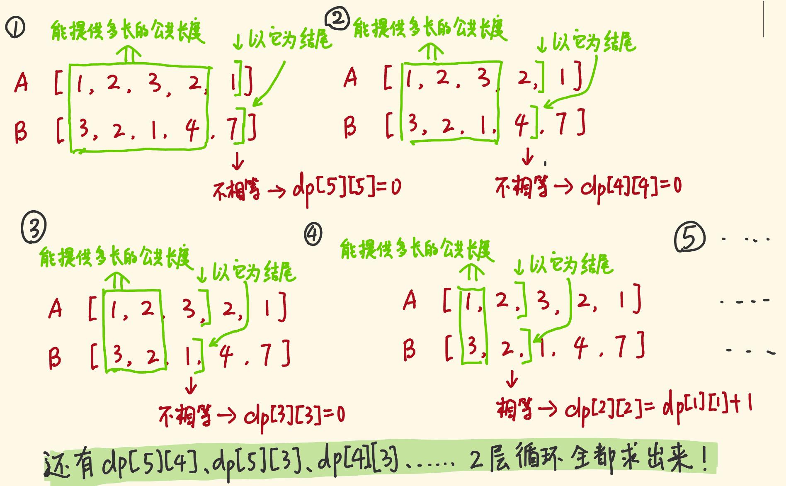
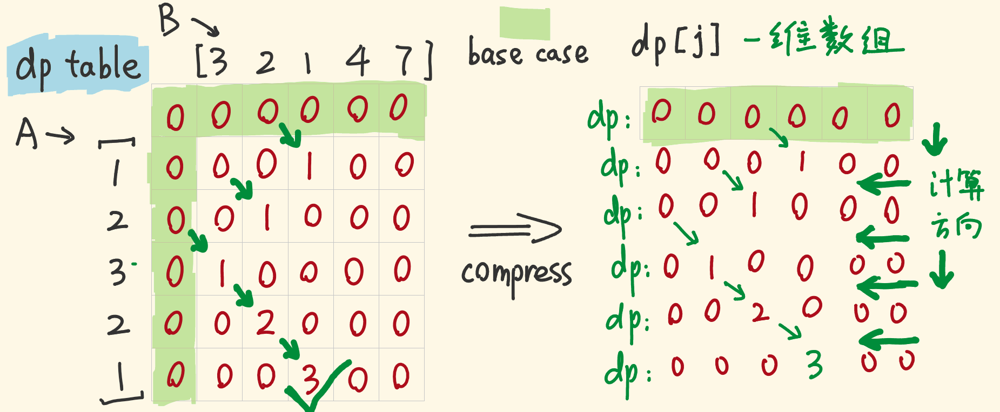

> 原文链接: https://leetcode-cn.com/problems/maximum-length-of-repeated-subarray


## 英文原文
<div><p>Given two integer arrays <code>nums1</code> and <code>nums2</code>, return <em>the maximum length of a subarray that appears in <strong>both</strong> arrays</em>.</p>

<p>&nbsp;</p>
<p><strong>Example 1:</strong></p>

<pre>
<strong>Input:</strong> nums1 = [1,2,3,2,1], nums2 = [3,2,1,4,7]
<strong>Output:</strong> 3
<strong>Explanation:</strong> The repeated subarray with maximum length is [3,2,1].
</pre>

<p><strong>Example 2:</strong></p>

<pre>
<strong>Input:</strong> nums1 = [0,0,0,0,0], nums2 = [0,0,0,0,0]
<strong>Output:</strong> 5
</pre>

<p>&nbsp;</p>
<p><strong>Constraints:</strong></p>

<ul>
	<li><code>1 &lt;= nums1.length, nums2.length &lt;= 1000</code></li>
	<li><code>0 &lt;= nums1[i], nums2[i] &lt;= 100</code></li>
</ul>
</div>

## 中文题目
<div><p>给两个整数数组&nbsp;<code>A</code>&nbsp;和&nbsp;<code>B</code>&nbsp;，返回两个数组中公共的、长度最长的子数组的长度。</p>

<p>&nbsp;</p>

<p><strong>示例：</strong></p>

<pre><strong>输入：</strong>
A: [1,2,3,2,1]
B: [3,2,1,4,7]
<strong>输出：</strong>3
<strong>解释：</strong>
长度最长的公共子数组是 [3, 2, 1] 。
</pre>

<p>&nbsp;</p>

<p><strong>提示：</strong></p>

<ul>
	<li><code>1 &lt;= len(A), len(B) &lt;= 1000</code></li>
	<li><code>0 &lt;= A[i], B[i] &lt; 100</code></li>
</ul>
</div>

## 通过代码
<RecoDemo>
</RecoDemo>


## 高赞题解
#### 暴力法（超时）时间复杂度 $O(n^3)$


```js []

const findLength = (A, B) => {

  const m = A.length;

  const n = B.length;

  let res = 0;

  for (let i = 0; i < m; i++) {

    for (let j = 0; j < n; j++) {

      if (A[i] == B[j]) { // 遇到相同项

        let subLen = 1;   // 公共子序列长度至少为1

        while (i + subLen < m && j + subLen < n && A[i + subLen] == B[j + subLen]) { //新的一项也相同

          subLen++; // 公共子序列长度每次增加 1，考察新的一项

        }

        res = Math.max(subLen, res);

      }

    }

  }

  return res;

};

```

```go []

func findLength(A []int, B []int) int {

  m, n := len(A), len(B)

  res := 0

  for i := 0; i < m; i++ {

    for j := 0; j < n; j++ {

      if A[i] == B[j] {

        subLen := 1

        for i+subLen < m && j+subLen < n && A[i+subLen] == B[j+subLen] {

          subLen++

        }

        if subLen > res {

          res = subLen

        }

      }

    }

  }

  return res

}

```


#### 动态规划：

- A 、B数组各抽出一个前缀数组，单看它们的末尾项，如果它们俩不一样，则公共子数组肯定不包括它们俩。

- 如果它们俩一样，则要考虑它们俩前面的子数组「**能为它们俩提供多大的公共长度**」。

  - 如果它们俩的前缀数组的「末尾项」不相同，由于子数组的连续性，前缀数组不能为它们俩提供公共长度

  - 如果它们俩的前缀数组的「末尾项」相同，则可以为它们俩提供公共长度：

      - 至于提供多长的公共长度？这又取决于前缀数组的末尾项是否相同……


#### 加上注释再讲一遍

- A 、B数组各抽出一个前缀子数组，单看它们的末尾项，如果它们俩不一样——以它们俩为末尾项形成的公共子数组的长度为0：`dp[i][j] = 0`

- 如果它们俩一样，以它们俩为末尾项的公共子数组，长度保底为1——`dp[i][j]`至少为 1，要考虑它们俩的前缀数组——`dp[i-1][j-1]`能为它们俩提供多大的公共长度

  - 如果它们俩的前缀数组的「末尾项」不相同，前缀数组提供的公共长度为 0——`dp[i-1][j-1] = 0`

    - 以它们俩为末尾项的公共子数组的长度——`dp[i][j] = 1`

  - 如果它们俩的前缀数组的「末尾项」相同

      - 前缀部分能提供的公共长度——`dp[i-1][j-1]`，它至少为 1

      - 以它们俩为末尾项的公共子数组的长度 `dp[i][j] = dp[i-1][j-1] + 1`

- 题目求：最长公共子数组的长度。不同的公共子数组的末尾项不一样。我们考察不同末尾项的公共子数组，找出最长的那个。（注意下图的最下方的一句话）

#### 




#### 状态转移方程

- `dp[i][j]` ：长度为`i`，末尾项为`A[i-1]`的子数组，与长度为`j`，末尾项为`B[j-1]`的子数组，二者的最大公共后缀子数组长度。

  - 如果 `A[i-1] !=  B[j-1]`，  有 `dp[i][j] = 0`

  - 如果 `A[i-1] ==   B[j-1]` ，  有 `dp[i][j] = dp[i-1][j-1] + 1`

- base case：如果`i==0||j==0`，则二者没有公共部分，`dp[i][j]=0`

- 最长公共子数组以哪一项为末尾项都有可能，求出每个 `dp[i][j]`，找出最大值。


#### 代码

- 时间复杂度 $O(n * m)$。 空间复杂度 $O(n * m)$。

- 降维后空间复杂度 $O(n)$，如果没有空间复杂度的要求，降不降都行。

```js []

const findLength = (A, B) => {

  const m = A.length;

  const n = B.length;

  const dp = new Array(m + 1);

  for (let i = 0; i <= m; i++) { // 初始化整个dp矩阵，每个值为0

    dp[i] = new Array(n + 1).fill(0);

  }                                

  let res = 0;

  // i=0或j=0的base case，初始化时已经包括

  for (let i = 1; i <= m; i++) {    // 从1开始遍历

    for (let j = 1; j <= n; j++) {  // 从1开始遍历

      if (A[i - 1] == B[j - 1]) {     

        dp[i][j] = dp[i - 1][j - 1] + 1;

      }                             // A[i-1]!=B[j-1]的情况，初始化时已包括了

      res = Math.max(dp[i][j], res);

    }

  }

  return res;

};

```

```go []

func findLength(A []int, B []int) int {

	m, n := len(A), len(B)

	res := 0

	dp := make([][]int, m+1)

	for i := 0; i <= m; i++ { 

		dp[i] = make([]int, n+1)

	}


	for i := 1; i <= m; i++ {

		for j := 1; j <= n; j++ {

			if A[i-1] == B[j-1] {

				dp[i][j] = dp[i-1][j-1] + 1

			}

			if dp[i][j] > res {

				res = dp[i][j]

			}

		}

	}

	return res

}

```


#### 降维优化

- `dp[i][j]` 只依赖上一行上一列的对角线的值，所以我们从右上角开始计算。

- 一维数组 dp ， dp[j] 是以 A[i-1], B[j-1] 为末尾项的最长公共子数组的长度





```js []

const findLength = (A, B) => {

  const m = A.length;

  const n = B.length;

  const dp = new Array(n + 1).fill(0);

  let res = 0;

  for (let i = 1; i <= m; i++) {

    for (let j = n; j >= 1; j--) {

      if (A[i - 1] == B[j - 1]) {

        dp[j] = dp[j - 1] + 1;

      } else {

        dp[j] = 0;

      }

      res = Math.max(dp[j], res);

    }

  }

  return res;

};

```

```go []

func findLength(A []int, B []int) int {

	m, n := len(A), len(B)

	res := 0

	dp := make([]int, n+1)


	for i := 1; i <= m; i++ {

		for j := n; j >= 1; j-- {

			if A[i-1] == B[j-1] {

				dp[j] = dp[j-1] + 1

			} else {

				dp[j] = 0

			}

			if dp[j] > res {

				res = dp[j]

			}

		}

	}

	return res

}

```


#### 如果有帮助，留个赞鼓励我继续写下去；如果没看懂就告诉我，一定是我写得不明白，我会修改。


## 统计信息
| 通过次数 | 提交次数 | AC比率 |
| :------: | :------: | :------: |
|    90451    |    160201    |   56.5%   |

## 提交历史
| 提交时间 | 提交结果 | 执行时间 |  内存消耗  | 语言 |
| :------: | :------: | :------: | :--------: | :--------: |


## 相似题目
|                             题目                             | 难度 |
| :----------------------------------------------------------: | :---------: |
| [长度最小的子数组](https://leetcode-cn.com/problems/minimum-size-subarray-sum/) | 中等|
