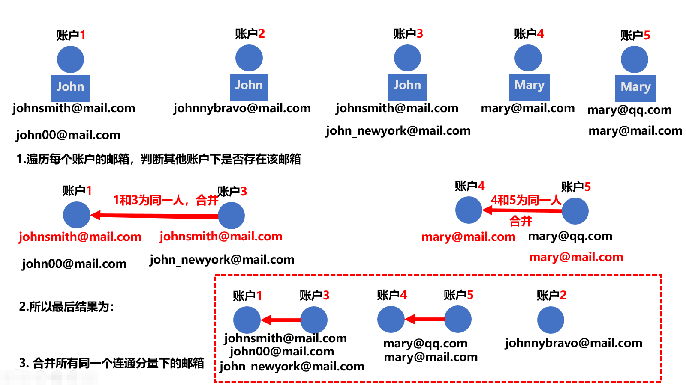

> 原文链接: https://leetcode-cn.com/problems/accounts-merge


## 英文原文
<div><p>Given a list of <code>accounts</code> where each element <code>accounts[i]</code> is a list of strings, where the first element <code>accounts[i][0]</code> is a name, and the rest of the elements are <strong>emails</strong> representing emails of the account.</p>

<p>Now, we would like to merge these accounts. Two accounts definitely belong to the same person if there is some common email to both accounts. Note that even if two accounts have the same name, they may belong to different people as people could have the same name. A person can have any number of accounts initially, but all of their accounts definitely have the same name.</p>

<p>After merging the accounts, return the accounts in the following format: the first element of each account is the name, and the rest of the elements are emails <strong>in sorted order</strong>. The accounts themselves can be returned in <strong>any order</strong>.</p>

<p>&nbsp;</p>
<p><strong>Example 1:</strong></p>

<pre>
<strong>Input:</strong> accounts = [[&quot;John&quot;,&quot;johnsmith@mail.com&quot;,&quot;john_newyork@mail.com&quot;],[&quot;John&quot;,&quot;johnsmith@mail.com&quot;,&quot;john00@mail.com&quot;],[&quot;Mary&quot;,&quot;mary@mail.com&quot;],[&quot;John&quot;,&quot;johnnybravo@mail.com&quot;]]
<strong>Output:</strong> [[&quot;John&quot;,&quot;john00@mail.com&quot;,&quot;john_newyork@mail.com&quot;,&quot;johnsmith@mail.com&quot;],[&quot;Mary&quot;,&quot;mary@mail.com&quot;],[&quot;John&quot;,&quot;johnnybravo@mail.com&quot;]]
<strong>Explanation:</strong>
The first and second John&#39;s are the same person as they have the common email &quot;johnsmith@mail.com&quot;.
The third John and Mary are different people as none of their email addresses are used by other accounts.
We could return these lists in any order, for example the answer [[&#39;Mary&#39;, &#39;mary@mail.com&#39;], [&#39;John&#39;, &#39;johnnybravo@mail.com&#39;], 
[&#39;John&#39;, &#39;john00@mail.com&#39;, &#39;john_newyork@mail.com&#39;, &#39;johnsmith@mail.com&#39;]] would still be accepted.
</pre>

<p><strong>Example 2:</strong></p>

<pre>
<strong>Input:</strong> accounts = [[&quot;Gabe&quot;,&quot;Gabe0@m.co&quot;,&quot;Gabe3@m.co&quot;,&quot;Gabe1@m.co&quot;],[&quot;Kevin&quot;,&quot;Kevin3@m.co&quot;,&quot;Kevin5@m.co&quot;,&quot;Kevin0@m.co&quot;],[&quot;Ethan&quot;,&quot;Ethan5@m.co&quot;,&quot;Ethan4@m.co&quot;,&quot;Ethan0@m.co&quot;],[&quot;Hanzo&quot;,&quot;Hanzo3@m.co&quot;,&quot;Hanzo1@m.co&quot;,&quot;Hanzo0@m.co&quot;],[&quot;Fern&quot;,&quot;Fern5@m.co&quot;,&quot;Fern1@m.co&quot;,&quot;Fern0@m.co&quot;]]
<strong>Output:</strong> [[&quot;Ethan&quot;,&quot;Ethan0@m.co&quot;,&quot;Ethan4@m.co&quot;,&quot;Ethan5@m.co&quot;],[&quot;Gabe&quot;,&quot;Gabe0@m.co&quot;,&quot;Gabe1@m.co&quot;,&quot;Gabe3@m.co&quot;],[&quot;Hanzo&quot;,&quot;Hanzo0@m.co&quot;,&quot;Hanzo1@m.co&quot;,&quot;Hanzo3@m.co&quot;],[&quot;Kevin&quot;,&quot;Kevin0@m.co&quot;,&quot;Kevin3@m.co&quot;,&quot;Kevin5@m.co&quot;],[&quot;Fern&quot;,&quot;Fern0@m.co&quot;,&quot;Fern1@m.co&quot;,&quot;Fern5@m.co&quot;]]
</pre>

<p>&nbsp;</p>
<p><strong>Constraints:</strong></p>

<ul>
	<li><code>1 &lt;= accounts.length &lt;= 1000</code></li>
	<li><code>2 &lt;= accounts[i].length &lt;= 10</code></li>
	<li><code>1 &lt;= accounts[i][j] &lt;= 30</code></li>
	<li><code>accounts[i][0]</code> consists of English letters.</li>
	<li><code>accounts[i][j] (for j &gt; 0)</code> is a valid email.</li>
</ul>
</div>

## 中文题目
<div><p>给定一个列表 <code>accounts</code>，每个元素 <code>accounts[i]</code>&nbsp;是一个字符串列表，其中第一个元素 <code>accounts[i][0]</code>&nbsp;是&nbsp;<em>名称 (name)</em>，其余元素是 <em><strong>emails</strong> </em>表示该账户的邮箱地址。</p>

<p>现在，我们想合并这些账户。如果两个账户都有一些共同的邮箱地址，则两个账户必定属于同一个人。请注意，即使两个账户具有相同的名称，它们也可能属于不同的人，因为人们可能具有相同的名称。一个人最初可以拥有任意数量的账户，但其所有账户都具有相同的名称。</p>

<p>合并账户后，按以下格式返回账户：每个账户的第一个元素是名称，其余元素是 <strong>按字符 ASCII 顺序排列</strong> 的邮箱地址。账户本身可以以 <strong>任意顺序</strong> 返回。</p>

<p>&nbsp;</p>

<p><strong>示例 1：</strong></p>

<pre>
<b>输入：</b>accounts = [["John", "johnsmith@mail.com", "john00@mail.com"], ["John", "johnnybravo@mail.com"], ["John", "johnsmith@mail.com", "john_newyork@mail.com"], ["Mary", "mary@mail.com"]]
<b>输出：</b>[["John", 'john00@mail.com', 'john_newyork@mail.com', 'johnsmith@mail.com'],  ["John", "johnnybravo@mail.com"], ["Mary", "mary@mail.com"]]
<b>解释：</b>
第一个和第三个 John 是同一个人，因为他们有共同的邮箱地址 "johnsmith@mail.com"。 
第二个 John 和 Mary 是不同的人，因为他们的邮箱地址没有被其他帐户使用。
可以以任何顺序返回这些列表，例如答案 [['Mary'，'mary@mail.com']，['John'，'johnnybravo@mail.com']，
['John'，'john00@mail.com'，'john_newyork@mail.com'，'johnsmith@mail.com']] 也是正确的。
</pre>

<p><strong>示例 2：</strong></p>

<pre>
<strong>输入：</strong>accounts = [["Gabe","Gabe0@m.co","Gabe3@m.co","Gabe1@m.co"],["Kevin","Kevin3@m.co","Kevin5@m.co","Kevin0@m.co"],["Ethan","Ethan5@m.co","Ethan4@m.co","Ethan0@m.co"],["Hanzo","Hanzo3@m.co","Hanzo1@m.co","Hanzo0@m.co"],["Fern","Fern5@m.co","Fern1@m.co","Fern0@m.co"]]
<strong>输出：</strong>[["Ethan","Ethan0@m.co","Ethan4@m.co","Ethan5@m.co"],["Gabe","Gabe0@m.co","Gabe1@m.co","Gabe3@m.co"],["Hanzo","Hanzo0@m.co","Hanzo1@m.co","Hanzo3@m.co"],["Kevin","Kevin0@m.co","Kevin3@m.co","Kevin5@m.co"],["Fern","Fern0@m.co","Fern1@m.co","Fern5@m.co"]]
</pre>

<p>&nbsp;</p>

<p><strong>提示：</strong></p>

<ul>
	<li><code>1 &lt;= accounts.length &lt;= 1000</code></li>
	<li><code>2 &lt;= accounts[i].length &lt;= 10</code></li>
	<li><code>1 &lt;= accounts[i][j].length &lt;= 30</code></li>
	<li><code>accounts[i][0]</code> 由英文字母组成</li>
	<li><code>accounts[i][j] (for j &gt; 0)</code> 是有效的邮箱地址</li>
</ul>
</div>

## 通过代码
<RecoDemo>
</RecoDemo>


## 高赞题解
## 方法一：并查集
### 1. 前言 
如果您对【并查集】相关知识还不是太了解，可以看看我之前的题解[【详解并查集】](https://leetcode-cn.com/problems/most-stones-removed-with-same-row-or-column/solution/tu-jie-bing-cha-ji-by-yexiso-nbcz/)

有问题欢迎留言交流！
### 2. 解题思路
本题的题意比较直观，思路也比较清晰，可以使用【并查集】来解决。

根据题意可知：

- **存在相同邮箱的账号一定属于同一个人**
- **名称相同的账户不一定属于同一个人**


### 3. 思路
由于名称相同无法判断为同`1`人，所以只能**使用邮箱是否相同来判断是否为同一人**。

这样建立并查集就比较简单了：

- 先初始化每个账户为`1`个连通分量
- 遍历每个账户下的邮箱，判断该邮箱是否在其他账户下出现
- 如果未出现，继续
- 如果`账户A、B`下出现了相同的邮箱`email`，那么将`账户A`和`账户B`两个连通分量进行合并
- 最后遍历并查集中每个连通分量，将所有连通分量内部账户的邮箱全部合并(相同的去重，不同的合并)
- 结束

针对具体的实现，大家可以看看代码
### 4. 举例


### 5. 代码

```cpp
class Djset {
public:
    vector<int> parent;  // 记录节点的根
    vector<int> rank;  // 记录根节点的深度（用于优化）
    Djset(int n): parent(vector<int>(n)), rank(vector<int>(n)) {
        for (int i = 0; i < n; i++) {
            parent[i] = i;
        }
    }

    int find(int x) {
        // 压缩方式：直接指向根节点
        if (x != parent[x]) {
            parent[x] = find(parent[x]);
        }
        return parent[x];
    }

    void merge(int x, int y) {
        int rootx = find(x);
        int rooty = find(y);
        if (rootx != rooty) {
            if (rank[rootx] < rank[rooty]) {
                swap(rootx, rooty);
            }
            parent[rooty] = rootx;
            if (rank[rootx] == rank[rooty]) rank[rootx] += 1;
        }
    }
};

class Solution {
public:
    vector<vector<string>> accountsMerge(vector<vector<string>>& acc) {
        vector<vector<string> > res;
        // 作用：存储每个邮箱属于哪个账户 ，同时 在遍历邮箱时，判断邮箱是否出现过
        // 格式：<邮箱，账户id>
        unordered_map<string, int> um;
        int n = acc.size();
        Djset ds(n);
        for (int i = 0; i < n; i++) {
            int m = acc[i].size();
            for (int j = 1; j < m; j++) {
                string s = acc[i][j];
                if (um.find(s) == um.end()) {
                    um[s] = i;
                } else {
                    ds.merge(i, um[s]);
                }
            }
        }
        // 作用： 存储每个账户下的邮箱
        // 格式： <账户id, 邮箱列表> >
        // 注意：这里的key必须是账户id，不能是账户名称，名称可能相同，会造成覆盖
        unordered_map<int, vector<string> > umv;
        for (auto& [k, v] : um) umv[ds.find(v)].emplace_back(k);
        for (auto& [k, v] : umv){
            sort(v.begin(), v.end());
            vector<string> tmp(1, acc[k][0]);
            tmp.insert(tmp.end(), v.begin(), v.end());
            res.emplace_back(tmp);
        } 


        return res;
    }
};
```

### 6. 总结


官方这个月强推【并查集】，不学会都不行！

一般针对可以使用并查集的题目，都可以直接使用并查集的**模板**或者稍微加以改造，并查集部分的代码不应该成为瓶颈。

**普通的模板代码比较简单，但是一般效率比较低！**

所以通常都会采用`【路径压缩】`和`【按秩合并】`两种优化方式，【模板代码】如下：

```
// 注意：使用该代码，并不能使得所有的元素都直接指向根节点，仍然存在间接指向
class Djset {
public:
    vector<int> parent;  // 记录节点的根
    vector<int> rank;    // 记录根节点的深度（用于优化）
    int count;           // 记录并查集的数量,某些情况下该成员非必要
    Djset(int n): parent(vector<int>(n)), rank(vector<int>(n)), count(n) {
        for (int i = 0; i < n; i++) {
            parent[i] = i;
        }
    }
    
    int find(int x) {
        // 压缩方式：直接指向根节点
        if (x != parent[x]) {
            parent[x] = find(parent[x]);
        }
        return parent[x];
    }
    
    void merge(int x, int y) {
        // 找到根节点
        int rootx = find(x);
        int rooty = find(y);
        if (rootx != rooty) {
            // 按秩合并
            if (rank[rootx] < rank[rooty]) {
                swap(rootx, rooty);
            }
            parent[rooty] = rootx;
            count--;
            // 如果秩相等，将父节点rootx秩 + 1
            if (rank[rootx] == rank[rooty]) rank[rootx] += 1;
        }
    }
};
```

> 并查集的一些使用tips:
> - 一般不会将并查集使用得太复杂，内部结构如果过于复杂，也难以维护
> - 只负责维护连通性
> - 存在区间合并的题干，应当考虑使用并查集
> - 如果题干是拆分连通分量，反向思维，考虑逆向使用并查集


## 方法二：深度优先搜索/DFS
### 1. 解题思路
先对问题进行抽象，题目要求虽然是对账户进行合并，但终归结底是对**账户下的所有邮箱进行合并**。


另外题目也说了，相同账户的名称一定相同，所以用**邮箱**构建节点不会对账户造成任何影响。

所以比较简单的抽象方式是 **将每个邮箱当作一个节点来构建图（重复的邮箱算作同一个节点，这样避免最后输出重复），然后每个连通图表示一个账户，非连通图表示的是不同账户，也就是说，一个连通图里的所有节点（邮箱）属于同一个账户**


### 2. 步骤
1. 对数据进行预处理，给邮箱编号；
2. 构建无向图，采用邻接表进行存储；
3. 由于最后的结果图是由若干个**连通图**组成的**非连通图**，所以依次遍历每个连通图，同时输出该连通图里的所有邮箱。


### 3. 例子


图构建完之后，最后进行dfs即可。
关于dfs的相关知识，这里不作过多赘述！具体请看代码：

### 4. 代码


这里感谢[@guoyuer](/u/guoyuer/)指出的问题，具体见代码！


```
class Solution {
public:
    vector<vector<string> > res; // 结果集
    // map: 保存邮箱与编号的对应关系
    // 格式： <邮箱，编号>
    unordered_map<string, int> um; 
    // vector: 保存编号与邮箱的对应关系
    // 格式： <编号，邮箱>
    vector<string> mails; 

    vector<vector<string>> accountsMerge(vector<vector<string>>& accounts) {
        int n = accounts.size();
        // 数据预处理：生成邮箱与编号的对应关系
        for (auto ac : accounts) {
            for (int i = 1; i < ac.size(); i++) {
                if (um.find(ac[i]) != um.end()) continue;
                mails.emplace_back(ac[i]);
                um[ac[i]] = mails.size() - 1;
            }
        }

        // 建图，邻接矩阵，存储相邻的邮箱编号
        int m = mails.size();
        vector<vector<int> > g(m);
        for (auto& ac : accounts) {
            for (int i = 1; i < ac.size(); i++) {
                for (int j = i + 1; j < ac.size(); j++) {
                    int idxI = um[ac[i]], idxJ = um[ac[j]];
                    g[idxI].push_back(idxJ);
                    g[idxJ].push_back(idxI);
                }
            }
        }

        // dfs
        vector<bool> visited(m);
        for (auto& ac : accounts) {
            vector<string> cur(1, ac[0]);
            if (ac.size() < 1) continue;
            if (!visited[um[ac[1]]]) {
                dfs(g, um[ac[1]], visited, cur);
                // 名称不参与排序，感谢 郭遇尔 指出！
                // sort(cur.begin(), cur.end());
                sort(cur.begin() + 1, cur.end());
                res.emplace_back(cur);
            }
        }
        return res;
    }

    void dfs(vector<vector<int> >& g, int idx, vector<bool>& visited, vector<string>& cur) {
        visited[idx] = true;
        cur.emplace_back(mails[idx]);
        for (auto& nei : g[idx]) {
            if (!visited[nei]) dfs(g, nei, visited, cur);
        }
    }
};
```


> 感谢您的观看，如有任何问题，欢迎留言交流！
> 若对您有帮助，希望不吝一赞 &#x1f44d;                         $\ \ \ \ \ \ \ \ \ \ \ \ \ \ \ \ \ \ \ \ \ \ \ \ \ \ \ \ \ \ \ \ \ \ \ \ \ \ \ \ \ \ \ \ \ - \  by \ \  \ yex➰$


## 统计信息
| 通过次数 | 提交次数 | AC比率 |
| :------: | :------: | :------: |
|    29973    |    63712    |   47.0%   |

## 提交历史
| 提交时间 | 提交结果 | 执行时间 |  内存消耗  | 语言 |
| :------: | :------: | :------: | :--------: | :--------: |


## 相似题目
|                             题目                             | 难度 |
| :----------------------------------------------------------: | :---------: |
| [冗余连接](https://leetcode-cn.com/problems/redundant-connection/) | 中等|
| [句子相似性](https://leetcode-cn.com/problems/sentence-similarity/) | 简单|
| [句子相似性 II](https://leetcode-cn.com/problems/sentence-similarity-ii/) | 中等|
