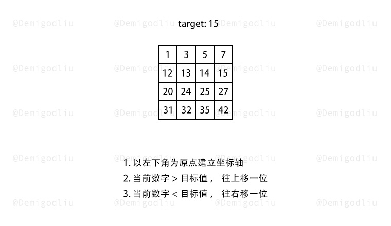
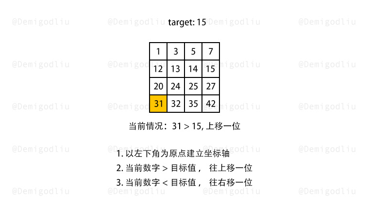
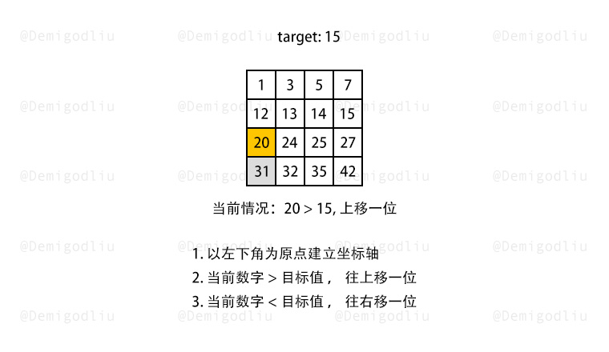
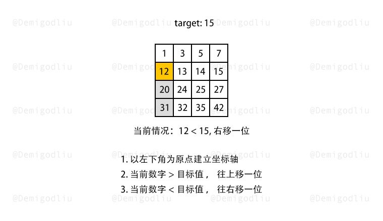
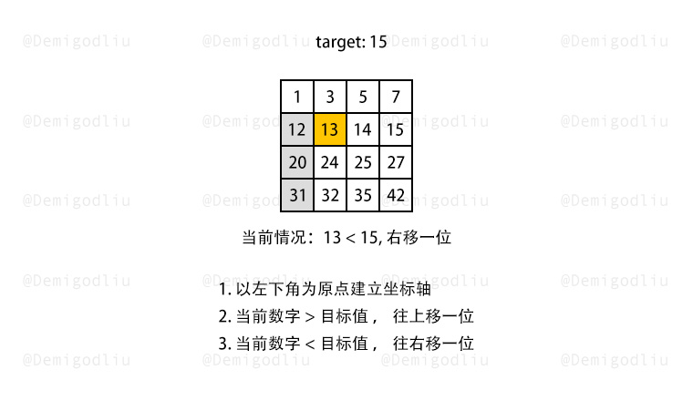
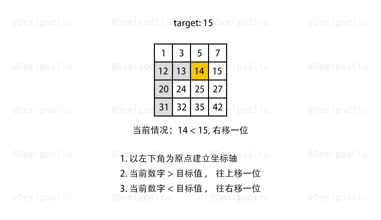
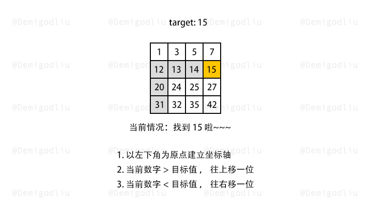

> 原文链接: https://leetcode-cn.com/problems/search-a-2d-matrix


## 英文原文
<div><p>Write an efficient algorithm that searches for a value in an <code>m x n</code> matrix. This matrix has the following properties:</p>

<ul>
	<li>Integers in each row are sorted from left to right.</li>
	<li>The first integer of each row is greater than the last integer of the previous row.</li>
</ul>

<p>&nbsp;</p>
<p><strong>Example 1:</strong></p>

<pre>
<strong>Input:</strong> matrix = [[1,3,5,7],[10,11,16,20],[23,30,34,60]], target = 3
<strong>Output:</strong> true
</pre>

<p><strong>Example 2:</strong></p>

<pre>
<strong>Input:</strong> matrix = [[1,3,5,7],[10,11,16,20],[23,30,34,60]], target = 13
<strong>Output:</strong> false
</pre>

<p>&nbsp;</p>
<p><strong>Constraints:</strong></p>

<ul>
	<li><code>m == matrix.length</code></li>
	<li><code>n == matrix[i].length</code></li>
	<li><code>1 &lt;= m, n &lt;= 100</code></li>
	<li><code>-10<sup>4</sup> &lt;= matrix[i][j], target &lt;= 10<sup>4</sup></code></li>
</ul>
</div>

## 中文题目
<div><p>编写一个高效的算法来判断 <code>m x n</code> 矩阵中，是否存在一个目标值。该矩阵具有如下特性：</p>

<ul>
	<li>每行中的整数从左到右按升序排列。</li>
	<li>每行的第一个整数大于前一行的最后一个整数。</li>
</ul>

<p> </p>

<p><strong>示例 1：</strong></p>

<pre>
<strong>输入：</strong>matrix = [[1,3,5,7],[10,11,16,20],[23,30,34,60]], target = 3
<strong>输出：</strong>true
</pre>

<p><strong>示例 2：</strong></p>

<pre>
<strong>输入：</strong>matrix = [[1,3,5,7],[10,11,16,20],[23,30,34,60]], target = 13
<strong>输出：</strong>false
</pre>

<p> </p>

<p><strong>提示：</strong></p>

<ul>
	<li><code>m == matrix.length</code></li>
	<li><code>n == matrix[i].length</code></li>
	<li><code>1 <= m, n <= 100</code></li>
	<li><code>-10<sup>4</sup> <= matrix[i][j], target <= 10<sup>4</sup></code></li>
</ul>
</div>

## 通过代码
<RecoDemo>
</RecoDemo>


## 高赞题解


---

### 🧠 解题思路

根据题意已知，二维数组从左往右递增，从上往下递增，所以得出以下结论：

1. 某列的某个数字，该数之上的数字，都比其小；
1. 某行的某个数字，该数右侧的数字，都比其大；

所以，解题流程如下所示：

1. 以二维数组左下角为原点，建立直角坐标轴。
2. 若当前数字大于了查找数，查找往上移一位。
3. 若当前数字小于了查找数，查找往右移一位。

---

### 🎨 图解演示

<,,,,,,>

---

### 🍭 示例代码

```Javascript []
var findNumberIn2DArray = function(matrix, target) {
    if(!matrix.length) return false;
    let x = matrix.length - 1, y = 0;
    while(x >= 0 && y < matrix[0].length){
        if(matrix[x][y] === target){
            return true;
        }else if(matrix[x][y] > target){
            x--;
        }else{
            y++;
        }
    }
    return false;
};
```
```Java []
class Solution {
    public boolean searchMatrix(int[][] matrix, int target) {
        int rows = matrix.length - 1, columns = 0;
        while (rows >= 0 && columns < matrix[0].length) {
            int num = matrix[rows][columns];
            if (num == target) {
                return true;
            } else if (num > target) {
                rows--;
            } else {
                columns++;
            }
        }
        return false;
    }
}
```

---

### 转身挥手

嘿，少年，做图不易，留下个赞或评论再走吧！谢啦~ 💐

差点忘了，祝你牛年大吉 🐮 ，AC 和 Offer 📑 多多益善~

⛲⛲⛲ 期待下次再见~ 

## 统计信息
| 通过次数 | 提交次数 | AC比率 |
| :------: | :------: | :------: |
|    184743    |    397636    |   46.5%   |

## 提交历史
| 提交时间 | 提交结果 | 执行时间 |  内存消耗  | 语言 |
| :------: | :------: | :------: | :--------: | :--------: |


## 相似题目
|                             题目                             | 难度 |
| :----------------------------------------------------------: | :---------: |
| [搜索二维矩阵 II](https://leetcode-cn.com/problems/search-a-2d-matrix-ii/) | 中等|
